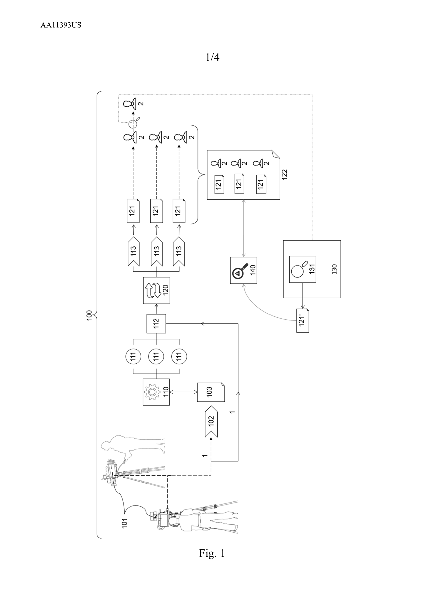
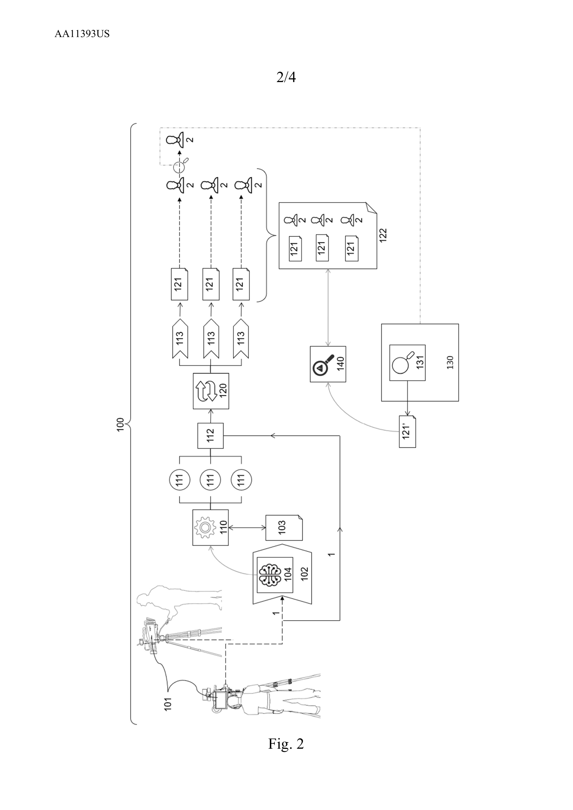
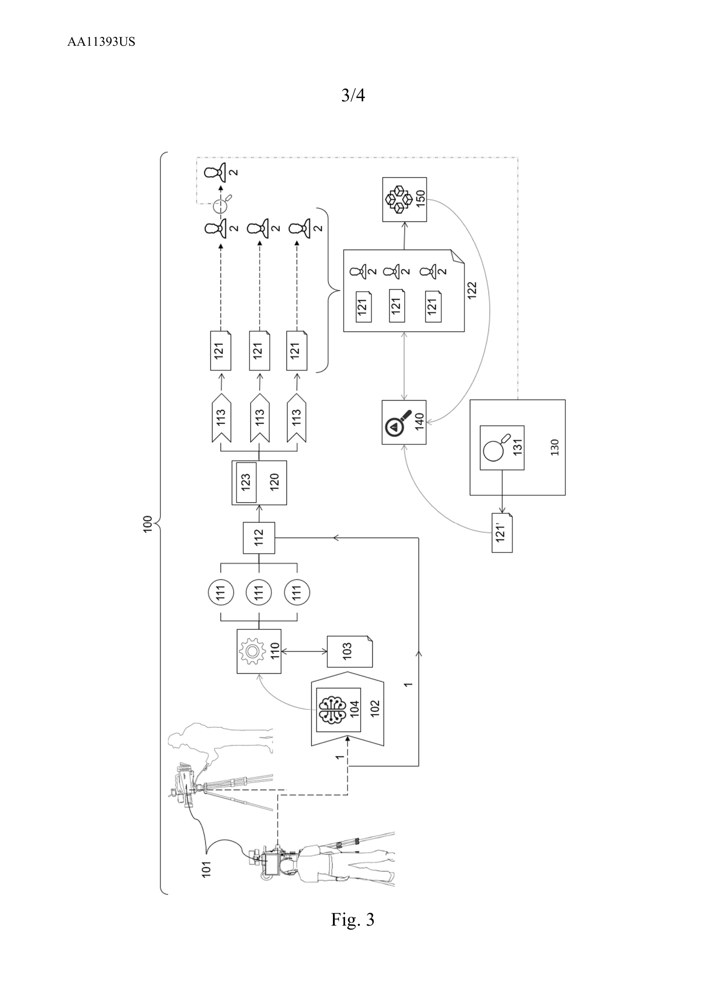
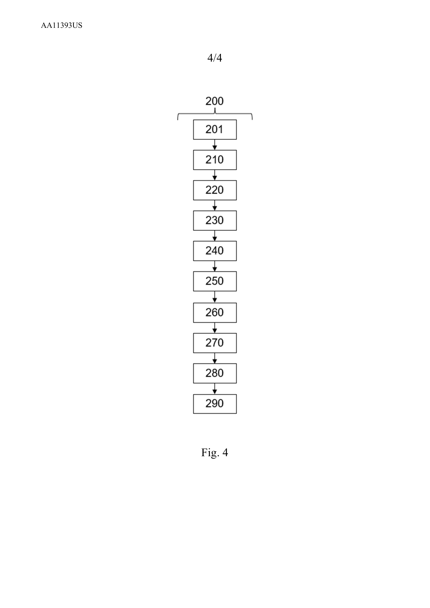

<!-- GENERATED REVIEW PROJECTION — source pct-as-filed-dossier; digest sha256/xc1/ssp-xd1:fea45714d5093a6988fdbc8f97eb8c44995f14f99ee81f2b9b39d6bfe3fb2bbf; source profile pdf-evidence-transcription-v1; projection profile gfm-v1/generated-v1; regenerate with `uv --no-cache --offline run --locked --no-sync python -m structured_source regenerate pct-as-filed-dossier`; edit the XML source, never this Markdown. -->
<a id="ssp-pct-as-filed-dossier-root"></a>

<a id="ssp-pct-as-filed-dossier-header-00001"></a>
# AA11393US-PCT — Rapporto di Deposito (PCT Filing Report)

<a id="ssp-pct-as-filed-dossier-blockquote-00002"></a>
> <a id="ssp-pct-as-filed-dossier-para-00003"></a>
> **High-fidelity Markdown transcription** of `AA11393US-PCT_RAPPORTO DEPOSITO.pdf` (60 pages).
> Source: born-digital PDF with a clean embedded text layer; body text extracted via `pdftotext -layout` and hand-structured. Drawing pages (57–60) rendered to PNG at 200 dpi and embedded.
>
> <a id="ssp-pct-as-filed-dossier-para-00004"></a>
> **Contents of the bundle**
>
> 1. <a id="ssp-pct-as-filed-dossier-orderedlist-00005"></a> <a id="ssp-pct-as-filed-dossier-list-item-00006"></a> <a id="ssp-pct-as-filed-dossier-plain-00007"></a> PRAXI Intellectual Property cover letter (p. 1)
> 2. <a id="ssp-pct-as-filed-dossier-list-item-00008"></a> <a id="ssp-pct-as-filed-dossier-plain-00009"></a> PCT Contracting States list (p. 2)
> 3. <a id="ssp-pct-as-filed-dossier-list-item-00010"></a> <a id="ssp-pct-as-filed-dossier-plain-00011"></a> WIPO Receipt of Electronic Submission (p. 3)
> 4. <a id="ssp-pct-as-filed-dossier-list-item-00012"></a> <a id="ssp-pct-as-filed-dossier-plain-00013"></a> Form PCT/RO/101 — PCT Request (pp. 4–7)
> 5. <a id="ssp-pct-as-filed-dossier-list-item-00014"></a> <a id="ssp-pct-as-filed-dossier-plain-00015"></a> International application text — *AI‑Driven System and Method for Content Differentiation and Piracy Traceability in Streaming Media* (Description, Claims, Abstract) (pp. 8–56)
> 6. <a id="ssp-pct-as-filed-dossier-list-item-00016"></a> <a id="ssp-pct-as-filed-dossier-plain-00017"></a> Drawings — Figures 1–4 (pp. 57–60)

<a id="ssp-pct-as-filed-dossier-horizontalrule-00018"></a>

---

<a id="ssp-pct-as-filed-dossier-header-00019"></a>
# 1. Cover Letter — PRAXI Intellectual Property S.p.A.

<a id="ssp-pct-as-filed-dossier-para-00020"></a>
**PRAXI INTELLECTUAL PROPERTY S.p.A.**
Fully paid-up capital 2.000.000 Euro
00187 ROME – Via Leonida Bissolati, 20 – T +39 06 397 499 85
[roma\@praxi-ip\.praxi](mailto:roma@praxi-ip.praxi) – [www\.praxi-ip\.praxi](http://www.praxi-ip.praxi)
*Industrial and Intellectual Property Consultancy*

<a id="ssp-pct-as-filed-dossier-table-00021"></a>
<a id="ssp-pct-as-filed-dossier-table-row-00022"></a>
<a id="ssp-pct-as-filed-dossier-table-row-00023"></a>
<a id="ssp-pct-as-filed-dossier-table-row-00026"></a>
<a id="ssp-pct-as-filed-dossier-table-row-00028"></a>

|  |  |
| --- | --- |
| <a id="ssp-pct-as-filed-dossier-plain-00024"></a> **NS. RIF.** PF/MA/AA11393US-PCT | <a id="ssp-pct-as-filed-dossier-plain-00025"></a> Egregio<br>**STEALTH COMPANY SRL**<br>**START UP INNOVATIVA**<br>Via Elio Vittorini, n. 103<br>00144 ROMA (RM) |
| <a id="ssp-pct-as-filed-dossier-plain-00027"></a> **VS. RIF.** |  |
| <a id="ssp-pct-as-filed-dossier-plain-00029"></a> **ROMA, 19.02.2025** | <a id="ssp-pct-as-filed-dossier-plain-00030"></a> <span style="color:red">**Solo via email**</span> |

<a id="ssp-pct-as-filed-dossier-para-00031"></a>
**Deposito domanda di brevetto Internazionale**
**Da domanda di provisional protection in USA n. 63/557,868 del 26.02.2024**
**per: "AI – DRIVEN SYSTEM AND METHOD FOR CONTENT DIFFERENTIATION AND PIRACY TRACEABILITY IN STREAMING MEDIA"**
**a nome: STEALTH COMPANY SRL START UP INNOVATIVA**
**Inventore: Antonio Rossi**

<a id="ssp-pct-as-filed-dossier-para-00032"></a>
A seguito del Vs. gradito ordine abbiamo provveduto al deposito della domanda di brevetto PCT e siamo lieti di comunicarVi che la domanda è stata presentata in data

<a id="ssp-pct-as-filed-dossier-blockquote-00033"></a>
> <a id="ssp-pct-as-filed-dossier-para-00034"></a>
> **19.02.2025 con il n. PCT/IB2025/051755**

<a id="ssp-pct-as-filed-dossier-para-00035"></a>
La priorità statunitense è stata rivendicata.
Gli stati ove è stata richiesta la protezione all'atto del deposito sono quelli che compaiono sull'elenco allegato.

<a id="ssp-pct-as-filed-dossier-para-00036"></a>
Allegata alla presente Vi inviamo la ricevuta di deposito, il verbale di deposito, il testo inglese presentato.

<a id="ssp-pct-as-filed-dossier-para-00037"></a>
Tra circa 4 mesi verrà comunicato l'esito della ricerca in base al quale sarà possibile stabilire lo stato della tecnica e quindi pagare la tassa d'esame preliminare per proseguire la discussione con l'esaminatore.

<a id="ssp-pct-as-filed-dossier-para-00038"></a>
La Vs. domanda verrà pubblicata e sarà ns. premura inviarVi una copia della pubblicazione.
Per il mantenimento in vigore degli stati menzionati all'atto del deposito vi saranno dei termini da rispettare e delle spese da sostenere e sarà ns. cura comunicarVi i termini in tempo utile affinché possiate decidere se mantenere tutti gli stati o meno.
Rimaniamo a Vs. disposizione per qualsiasi chiarimento e nel frattempo ci è gradita l'occasione per inviarVi i ns. distinti saluti.

<a id="ssp-pct-as-filed-dossier-para-00039"></a>
*(firma)* **Dott. P. FIAMMENGHI**

<a id="ssp-pct-as-filed-dossier-para-00040"></a>
**All.:** ricevuta ufficiale di deposito, verbale di deposito, testo inglese PCT.

<a id="ssp-pct-as-filed-dossier-para-00041"></a>
<sub>CIVITANOVA MARCHE · GENOVA · MILANO · PADOVA · ROMA · SAVONA · TORINO · TRENTO · VENEZIA MESTRE · VERONA — Sede Legale e Amministrativa: 10125 TORINO – Corso Vittorio Emanuele, 3 – T +39 011 669 60 30 – F +39 011 650 22 01 — Registro Imprese Torino, Codice Fiscale e Partita IVA IT 10197580011</sub>

<a id="ssp-pct-as-filed-dossier-horizontalrule-00042"></a>

---

<a id="ssp-pct-as-filed-dossier-header-00043"></a>
# 2. PCT Contracting States and Two-letter Codes (158 on 1 December 2024)

<a id="ssp-pct-as-filed-dossier-para-00044"></a>
*(A world map of contracting states appears on this page; the full code list follows.)*

<a id="ssp-pct-as-filed-dossier-table-00045"></a>
<a id="ssp-pct-as-filed-dossier-table-row-00046"></a>
<a id="ssp-pct-as-filed-dossier-table-row-00053"></a>
<a id="ssp-pct-as-filed-dossier-table-row-00060"></a>
<a id="ssp-pct-as-filed-dossier-table-row-00067"></a>
<a id="ssp-pct-as-filed-dossier-table-row-00074"></a>
<a id="ssp-pct-as-filed-dossier-table-row-00081"></a>
<a id="ssp-pct-as-filed-dossier-table-row-00088"></a>
<a id="ssp-pct-as-filed-dossier-table-row-00095"></a>
<a id="ssp-pct-as-filed-dossier-table-row-00102"></a>
<a id="ssp-pct-as-filed-dossier-table-row-00109"></a>
<a id="ssp-pct-as-filed-dossier-table-row-00116"></a>
<a id="ssp-pct-as-filed-dossier-table-row-00123"></a>
<a id="ssp-pct-as-filed-dossier-table-row-00130"></a>
<a id="ssp-pct-as-filed-dossier-table-row-00137"></a>
<a id="ssp-pct-as-filed-dossier-table-row-00144"></a>
<a id="ssp-pct-as-filed-dossier-table-row-00151"></a>
<a id="ssp-pct-as-filed-dossier-table-row-00158"></a>
<a id="ssp-pct-as-filed-dossier-table-row-00165"></a>
<a id="ssp-pct-as-filed-dossier-table-row-00172"></a>
<a id="ssp-pct-as-filed-dossier-table-row-00179"></a>
<a id="ssp-pct-as-filed-dossier-table-row-00186"></a>
<a id="ssp-pct-as-filed-dossier-table-row-00193"></a>
<a id="ssp-pct-as-filed-dossier-table-row-00200"></a>
<a id="ssp-pct-as-filed-dossier-table-row-00207"></a>
<a id="ssp-pct-as-filed-dossier-table-row-00214"></a>
<a id="ssp-pct-as-filed-dossier-table-row-00221"></a>
<a id="ssp-pct-as-filed-dossier-table-row-00228"></a>
<a id="ssp-pct-as-filed-dossier-table-row-00235"></a>
<a id="ssp-pct-as-filed-dossier-table-row-00242"></a>
<a id="ssp-pct-as-filed-dossier-table-row-00249"></a>
<a id="ssp-pct-as-filed-dossier-table-row-00256"></a>
<a id="ssp-pct-as-filed-dossier-table-row-00263"></a>
<a id="ssp-pct-as-filed-dossier-table-row-00270"></a>
<a id="ssp-pct-as-filed-dossier-table-row-00275"></a>
<a id="ssp-pct-as-filed-dossier-table-row-00280"></a>
<a id="ssp-pct-as-filed-dossier-table-row-00285"></a>
<a id="ssp-pct-as-filed-dossier-table-row-00290"></a>
<a id="ssp-pct-as-filed-dossier-table-row-00295"></a>
<a id="ssp-pct-as-filed-dossier-table-row-00300"></a>
<a id="ssp-pct-as-filed-dossier-table-row-00305"></a>
<a id="ssp-pct-as-filed-dossier-table-row-00310"></a>
<a id="ssp-pct-as-filed-dossier-table-row-00315"></a>
<a id="ssp-pct-as-filed-dossier-table-row-00320"></a>
<a id="ssp-pct-as-filed-dossier-table-row-00325"></a>
<a id="ssp-pct-as-filed-dossier-table-row-00330"></a>
<a id="ssp-pct-as-filed-dossier-table-row-00335"></a>
<a id="ssp-pct-as-filed-dossier-table-row-00340"></a>
<a id="ssp-pct-as-filed-dossier-table-row-00345"></a>
<a id="ssp-pct-as-filed-dossier-table-row-00350"></a>
<a id="ssp-pct-as-filed-dossier-table-row-00355"></a>
<a id="ssp-pct-as-filed-dossier-table-row-00360"></a>
<a id="ssp-pct-as-filed-dossier-table-row-00365"></a>
<a id="ssp-pct-as-filed-dossier-table-row-00370"></a>
<a id="ssp-pct-as-filed-dossier-table-row-00375"></a>
<a id="ssp-pct-as-filed-dossier-table-row-00380"></a>
<a id="ssp-pct-as-filed-dossier-table-row-00385"></a>
<a id="ssp-pct-as-filed-dossier-table-row-00390"></a>
<a id="ssp-pct-as-filed-dossier-table-row-00395"></a>
<a id="ssp-pct-as-filed-dossier-table-row-00400"></a>
<a id="ssp-pct-as-filed-dossier-table-row-00405"></a>
<a id="ssp-pct-as-filed-dossier-table-row-00410"></a>
<a id="ssp-pct-as-filed-dossier-table-row-00415"></a>
<a id="ssp-pct-as-filed-dossier-table-row-00420"></a>
<a id="ssp-pct-as-filed-dossier-table-row-00425"></a>
<a id="ssp-pct-as-filed-dossier-table-row-00428"></a>
<a id="ssp-pct-as-filed-dossier-table-row-00431"></a>

| <a id="ssp-pct-as-filed-dossier-plain-00047"></a> Code | <a id="ssp-pct-as-filed-dossier-plain-00048"></a> State | <a id="ssp-pct-as-filed-dossier-plain-00049"></a> Code | <a id="ssp-pct-as-filed-dossier-plain-00050"></a> State | <a id="ssp-pct-as-filed-dossier-plain-00051"></a> Code | <a id="ssp-pct-as-filed-dossier-plain-00052"></a> State |
| --- | --- | --- | --- | --- | --- |
| <a id="ssp-pct-as-filed-dossier-plain-00054"></a> AE | <a id="ssp-pct-as-filed-dossier-plain-00055"></a> United Arab Emirates | <a id="ssp-pct-as-filed-dossier-plain-00056"></a> IR | <a id="ssp-pct-as-filed-dossier-plain-00057"></a> Iran (Islamic Republic of) | <a id="ssp-pct-as-filed-dossier-plain-00058"></a> ML | <a id="ssp-pct-as-filed-dossier-plain-00059"></a> Mali (OA)² |
| <a id="ssp-pct-as-filed-dossier-plain-00061"></a> AG | <a id="ssp-pct-as-filed-dossier-plain-00062"></a> Antigua and Barbuda | <a id="ssp-pct-as-filed-dossier-plain-00063"></a> IS | <a id="ssp-pct-as-filed-dossier-plain-00064"></a> Iceland (EP) | <a id="ssp-pct-as-filed-dossier-plain-00065"></a> MN | <a id="ssp-pct-as-filed-dossier-plain-00066"></a> Mongolia |
| <a id="ssp-pct-as-filed-dossier-plain-00068"></a> AL | <a id="ssp-pct-as-filed-dossier-plain-00069"></a> Albania (EP) | <a id="ssp-pct-as-filed-dossier-plain-00070"></a> IT | <a id="ssp-pct-as-filed-dossier-plain-00071"></a> Italy (EP)³ | <a id="ssp-pct-as-filed-dossier-plain-00072"></a> MR | <a id="ssp-pct-as-filed-dossier-plain-00073"></a> Mauritania (OA)² |
| <a id="ssp-pct-as-filed-dossier-plain-00075"></a> AM | <a id="ssp-pct-as-filed-dossier-plain-00076"></a> Armenia (EA) | <a id="ssp-pct-as-filed-dossier-plain-00077"></a> JM | <a id="ssp-pct-as-filed-dossier-plain-00078"></a> Jamaica | <a id="ssp-pct-as-filed-dossier-plain-00079"></a> MT | <a id="ssp-pct-as-filed-dossier-plain-00080"></a> Malta (EP)² |
| <a id="ssp-pct-as-filed-dossier-plain-00082"></a> AO | <a id="ssp-pct-as-filed-dossier-plain-00083"></a> Angola | <a id="ssp-pct-as-filed-dossier-plain-00084"></a> JO | <a id="ssp-pct-as-filed-dossier-plain-00085"></a> Jordan | <a id="ssp-pct-as-filed-dossier-plain-00086"></a> MU | <a id="ssp-pct-as-filed-dossier-plain-00087"></a> Mauritius |
| <a id="ssp-pct-as-filed-dossier-plain-00089"></a> AT | <a id="ssp-pct-as-filed-dossier-plain-00090"></a> Austria (EP) | <a id="ssp-pct-as-filed-dossier-plain-00091"></a> JP | <a id="ssp-pct-as-filed-dossier-plain-00092"></a> Japan | <a id="ssp-pct-as-filed-dossier-plain-00093"></a> MW | <a id="ssp-pct-as-filed-dossier-plain-00094"></a> Malawi (AP) |
| <a id="ssp-pct-as-filed-dossier-plain-00096"></a> AU | <a id="ssp-pct-as-filed-dossier-plain-00097"></a> Australia | <a id="ssp-pct-as-filed-dossier-plain-00098"></a> KE | <a id="ssp-pct-as-filed-dossier-plain-00099"></a> Kenya (AP) | <a id="ssp-pct-as-filed-dossier-plain-00100"></a> MX | <a id="ssp-pct-as-filed-dossier-plain-00101"></a> Mexico |
| <a id="ssp-pct-as-filed-dossier-plain-00103"></a> AZ | <a id="ssp-pct-as-filed-dossier-plain-00104"></a> Azerbaijan (EA) | <a id="ssp-pct-as-filed-dossier-plain-00105"></a> KG | <a id="ssp-pct-as-filed-dossier-plain-00106"></a> Kyrgyzstan (EA) | <a id="ssp-pct-as-filed-dossier-plain-00107"></a> MY | <a id="ssp-pct-as-filed-dossier-plain-00108"></a> Malaysia |
| <a id="ssp-pct-as-filed-dossier-plain-00110"></a> BA | <a id="ssp-pct-as-filed-dossier-plain-00111"></a> Bosnia and Herzegovina¹ | <a id="ssp-pct-as-filed-dossier-plain-00112"></a> KH | <a id="ssp-pct-as-filed-dossier-plain-00113"></a> Cambodia⁴ | <a id="ssp-pct-as-filed-dossier-plain-00114"></a> MZ | <a id="ssp-pct-as-filed-dossier-plain-00115"></a> Mozambique (AP) |
| <a id="ssp-pct-as-filed-dossier-plain-00117"></a> BB | <a id="ssp-pct-as-filed-dossier-plain-00118"></a> Barbados | <a id="ssp-pct-as-filed-dossier-plain-00119"></a> KM | <a id="ssp-pct-as-filed-dossier-plain-00120"></a> Comoros (OA)² | <a id="ssp-pct-as-filed-dossier-plain-00121"></a> NA | <a id="ssp-pct-as-filed-dossier-plain-00122"></a> Namibia (AP) |
| <a id="ssp-pct-as-filed-dossier-plain-00124"></a> BE | <a id="ssp-pct-as-filed-dossier-plain-00125"></a> Belgium (EP)² | <a id="ssp-pct-as-filed-dossier-plain-00126"></a> KN | <a id="ssp-pct-as-filed-dossier-plain-00127"></a> Saint Kitts and Nevis | <a id="ssp-pct-as-filed-dossier-plain-00128"></a> NE | <a id="ssp-pct-as-filed-dossier-plain-00129"></a> Niger (OA)² |
| <a id="ssp-pct-as-filed-dossier-plain-00131"></a> BF | <a id="ssp-pct-as-filed-dossier-plain-00132"></a> Burkina Faso (OA)² | <a id="ssp-pct-as-filed-dossier-plain-00133"></a> KP | <a id="ssp-pct-as-filed-dossier-plain-00134"></a> Democratic People's Republic of Korea | <a id="ssp-pct-as-filed-dossier-plain-00135"></a> NG | <a id="ssp-pct-as-filed-dossier-plain-00136"></a> Nigeria |
| <a id="ssp-pct-as-filed-dossier-plain-00138"></a> BG | <a id="ssp-pct-as-filed-dossier-plain-00139"></a> Bulgaria (EP) | <a id="ssp-pct-as-filed-dossier-plain-00140"></a> KR | <a id="ssp-pct-as-filed-dossier-plain-00141"></a> Republic of Korea | <a id="ssp-pct-as-filed-dossier-plain-00142"></a> NI | <a id="ssp-pct-as-filed-dossier-plain-00143"></a> Nicaragua |
| <a id="ssp-pct-as-filed-dossier-plain-00145"></a> BH | <a id="ssp-pct-as-filed-dossier-plain-00146"></a> Bahrain | <a id="ssp-pct-as-filed-dossier-plain-00147"></a> KW | <a id="ssp-pct-as-filed-dossier-plain-00148"></a> Kuwait | <a id="ssp-pct-as-filed-dossier-plain-00149"></a> NL | <a id="ssp-pct-as-filed-dossier-plain-00150"></a> Netherlands (EP)² |
| <a id="ssp-pct-as-filed-dossier-plain-00152"></a> BJ | <a id="ssp-pct-as-filed-dossier-plain-00153"></a> Benin (OA)² | <a id="ssp-pct-as-filed-dossier-plain-00154"></a> KZ | <a id="ssp-pct-as-filed-dossier-plain-00155"></a> Kazakhstan (EA) | <a id="ssp-pct-as-filed-dossier-plain-00156"></a> NO | <a id="ssp-pct-as-filed-dossier-plain-00157"></a> Norway (EP) |
| <a id="ssp-pct-as-filed-dossier-plain-00159"></a> BN | <a id="ssp-pct-as-filed-dossier-plain-00160"></a> Brunei Darussalam | <a id="ssp-pct-as-filed-dossier-plain-00161"></a> LA | <a id="ssp-pct-as-filed-dossier-plain-00162"></a> Lao People's Democratic Republic | <a id="ssp-pct-as-filed-dossier-plain-00163"></a> NZ | <a id="ssp-pct-as-filed-dossier-plain-00164"></a> New Zealand |
| <a id="ssp-pct-as-filed-dossier-plain-00166"></a> BR | <a id="ssp-pct-as-filed-dossier-plain-00167"></a> Brazil | <a id="ssp-pct-as-filed-dossier-plain-00168"></a> LC | <a id="ssp-pct-as-filed-dossier-plain-00169"></a> Saint Lucia | <a id="ssp-pct-as-filed-dossier-plain-00170"></a> OM | <a id="ssp-pct-as-filed-dossier-plain-00171"></a> Oman |
| <a id="ssp-pct-as-filed-dossier-plain-00173"></a> BW | <a id="ssp-pct-as-filed-dossier-plain-00174"></a> Botswana (AP) | <a id="ssp-pct-as-filed-dossier-plain-00175"></a> LI | <a id="ssp-pct-as-filed-dossier-plain-00176"></a> Liechtenstein (EP) | <a id="ssp-pct-as-filed-dossier-plain-00177"></a> PA | <a id="ssp-pct-as-filed-dossier-plain-00178"></a> Panama |
| <a id="ssp-pct-as-filed-dossier-plain-00180"></a> BY | <a id="ssp-pct-as-filed-dossier-plain-00181"></a> Belarus (EA) | <a id="ssp-pct-as-filed-dossier-plain-00182"></a> LK | <a id="ssp-pct-as-filed-dossier-plain-00183"></a> Sri Lanka | <a id="ssp-pct-as-filed-dossier-plain-00184"></a> PE | <a id="ssp-pct-as-filed-dossier-plain-00185"></a> Peru |
| <a id="ssp-pct-as-filed-dossier-plain-00187"></a> BZ | <a id="ssp-pct-as-filed-dossier-plain-00188"></a> Belize | <a id="ssp-pct-as-filed-dossier-plain-00189"></a> LR | <a id="ssp-pct-as-filed-dossier-plain-00190"></a> Liberia (AP) | <a id="ssp-pct-as-filed-dossier-plain-00191"></a> PG | <a id="ssp-pct-as-filed-dossier-plain-00192"></a> Papua New Guinea |
| <a id="ssp-pct-as-filed-dossier-plain-00194"></a> CA | <a id="ssp-pct-as-filed-dossier-plain-00195"></a> Canada | <a id="ssp-pct-as-filed-dossier-plain-00196"></a> LS | <a id="ssp-pct-as-filed-dossier-plain-00197"></a> Lesotho (AP) | <a id="ssp-pct-as-filed-dossier-plain-00198"></a> PH | <a id="ssp-pct-as-filed-dossier-plain-00199"></a> Philippines |
| <a id="ssp-pct-as-filed-dossier-plain-00201"></a> CF | <a id="ssp-pct-as-filed-dossier-plain-00202"></a> Central African Republic (OA)² | <a id="ssp-pct-as-filed-dossier-plain-00203"></a> LT | <a id="ssp-pct-as-filed-dossier-plain-00204"></a> Lithuania (EP)² | <a id="ssp-pct-as-filed-dossier-plain-00205"></a> PL | <a id="ssp-pct-as-filed-dossier-plain-00206"></a> Poland (EP) |
| <a id="ssp-pct-as-filed-dossier-plain-00208"></a> CG | <a id="ssp-pct-as-filed-dossier-plain-00209"></a> Congo (OA)² | <a id="ssp-pct-as-filed-dossier-plain-00210"></a> LU | <a id="ssp-pct-as-filed-dossier-plain-00211"></a> Luxembourg (EP) | <a id="ssp-pct-as-filed-dossier-plain-00212"></a> PT | <a id="ssp-pct-as-filed-dossier-plain-00213"></a> Portugal (EP) |
| <a id="ssp-pct-as-filed-dossier-plain-00215"></a> CH | <a id="ssp-pct-as-filed-dossier-plain-00216"></a> Switzerland (EP) | <a id="ssp-pct-as-filed-dossier-plain-00217"></a> LV | <a id="ssp-pct-as-filed-dossier-plain-00218"></a> Latvia (EP)² | <a id="ssp-pct-as-filed-dossier-plain-00219"></a> QA | <a id="ssp-pct-as-filed-dossier-plain-00220"></a> Qatar |
| <a id="ssp-pct-as-filed-dossier-plain-00222"></a> CI | <a id="ssp-pct-as-filed-dossier-plain-00223"></a> Côte d'Ivoire (OA)² | <a id="ssp-pct-as-filed-dossier-plain-00224"></a> LY | <a id="ssp-pct-as-filed-dossier-plain-00225"></a> Libya | <a id="ssp-pct-as-filed-dossier-plain-00226"></a> RO | <a id="ssp-pct-as-filed-dossier-plain-00227"></a> Romania (EP) |
| <a id="ssp-pct-as-filed-dossier-plain-00229"></a> CL | <a id="ssp-pct-as-filed-dossier-plain-00230"></a> Chile | <a id="ssp-pct-as-filed-dossier-plain-00231"></a> MA | <a id="ssp-pct-as-filed-dossier-plain-00232"></a> Morocco⁴ | <a id="ssp-pct-as-filed-dossier-plain-00233"></a> RS | <a id="ssp-pct-as-filed-dossier-plain-00234"></a> Serbia (EP) |
| <a id="ssp-pct-as-filed-dossier-plain-00236"></a> CM | <a id="ssp-pct-as-filed-dossier-plain-00237"></a> Cameroon (OA)² | <a id="ssp-pct-as-filed-dossier-plain-00238"></a> MC | <a id="ssp-pct-as-filed-dossier-plain-00239"></a> Monaco (EP)² | <a id="ssp-pct-as-filed-dossier-plain-00240"></a> RU | <a id="ssp-pct-as-filed-dossier-plain-00241"></a> Russian Federation (EA) |
| <a id="ssp-pct-as-filed-dossier-plain-00243"></a> CN | <a id="ssp-pct-as-filed-dossier-plain-00244"></a> China | <a id="ssp-pct-as-filed-dossier-plain-00245"></a> MD | <a id="ssp-pct-as-filed-dossier-plain-00246"></a> Republic of Moldova⁴ | <a id="ssp-pct-as-filed-dossier-plain-00247"></a> RW | <a id="ssp-pct-as-filed-dossier-plain-00248"></a> Rwanda (AP) |
| <a id="ssp-pct-as-filed-dossier-plain-00250"></a> CO | <a id="ssp-pct-as-filed-dossier-plain-00251"></a> Colombia | <a id="ssp-pct-as-filed-dossier-plain-00252"></a> ME | <a id="ssp-pct-as-filed-dossier-plain-00253"></a> Montenegro (EP)²,⁵ | <a id="ssp-pct-as-filed-dossier-plain-00254"></a> SA | <a id="ssp-pct-as-filed-dossier-plain-00255"></a> Saudi Arabia |
| <a id="ssp-pct-as-filed-dossier-plain-00257"></a> CR | <a id="ssp-pct-as-filed-dossier-plain-00258"></a> Costa Rica | <a id="ssp-pct-as-filed-dossier-plain-00259"></a> MG | <a id="ssp-pct-as-filed-dossier-plain-00260"></a> Madagascar | <a id="ssp-pct-as-filed-dossier-plain-00261"></a> SC | <a id="ssp-pct-as-filed-dossier-plain-00262"></a> Seychelles (AP) |
| <a id="ssp-pct-as-filed-dossier-plain-00264"></a> CU | <a id="ssp-pct-as-filed-dossier-plain-00265"></a> Cuba | <a id="ssp-pct-as-filed-dossier-plain-00266"></a> MK | <a id="ssp-pct-as-filed-dossier-plain-00267"></a> North Macedonia (EP) | <a id="ssp-pct-as-filed-dossier-plain-00268"></a> SD | <a id="ssp-pct-as-filed-dossier-plain-00269"></a> Sudan (AP) |
| <a id="ssp-pct-as-filed-dossier-plain-00271"></a> CV | <a id="ssp-pct-as-filed-dossier-plain-00272"></a> Cabo Verde (AP) |  |  | <a id="ssp-pct-as-filed-dossier-plain-00273"></a> SE | <a id="ssp-pct-as-filed-dossier-plain-00274"></a> Sweden (EP) |
| <a id="ssp-pct-as-filed-dossier-plain-00276"></a> CY | <a id="ssp-pct-as-filed-dossier-plain-00277"></a> Cyprus (EP)² |  |  | <a id="ssp-pct-as-filed-dossier-plain-00278"></a> SG | <a id="ssp-pct-as-filed-dossier-plain-00279"></a> Singapore |
| <a id="ssp-pct-as-filed-dossier-plain-00281"></a> CZ | <a id="ssp-pct-as-filed-dossier-plain-00282"></a> Czechia (EP) |  |  | <a id="ssp-pct-as-filed-dossier-plain-00283"></a> SI | <a id="ssp-pct-as-filed-dossier-plain-00284"></a> Slovenia (EP)² |
| <a id="ssp-pct-as-filed-dossier-plain-00286"></a> DE | <a id="ssp-pct-as-filed-dossier-plain-00287"></a> Germany (EP) |  |  | <a id="ssp-pct-as-filed-dossier-plain-00288"></a> SK | <a id="ssp-pct-as-filed-dossier-plain-00289"></a> Slovakia (EP) |
| <a id="ssp-pct-as-filed-dossier-plain-00291"></a> DJ | <a id="ssp-pct-as-filed-dossier-plain-00292"></a> Djibouti |  |  | <a id="ssp-pct-as-filed-dossier-plain-00293"></a> SL | <a id="ssp-pct-as-filed-dossier-plain-00294"></a> Sierra Leone (AP) |
| <a id="ssp-pct-as-filed-dossier-plain-00296"></a> DK | <a id="ssp-pct-as-filed-dossier-plain-00297"></a> Denmark (EP) |  |  | <a id="ssp-pct-as-filed-dossier-plain-00298"></a> SM | <a id="ssp-pct-as-filed-dossier-plain-00299"></a> San Marino (EP)² |
| <a id="ssp-pct-as-filed-dossier-plain-00301"></a> DM | <a id="ssp-pct-as-filed-dossier-plain-00302"></a> Dominica |  |  | <a id="ssp-pct-as-filed-dossier-plain-00303"></a> SN | <a id="ssp-pct-as-filed-dossier-plain-00304"></a> Senegal (OA)² |
| <a id="ssp-pct-as-filed-dossier-plain-00306"></a> DO | <a id="ssp-pct-as-filed-dossier-plain-00307"></a> Dominican Republic |  |  | <a id="ssp-pct-as-filed-dossier-plain-00308"></a> ST | <a id="ssp-pct-as-filed-dossier-plain-00309"></a> Sao Tome and Principe (AP) |
| <a id="ssp-pct-as-filed-dossier-plain-00311"></a> DZ | <a id="ssp-pct-as-filed-dossier-plain-00312"></a> Algeria |  |  | <a id="ssp-pct-as-filed-dossier-plain-00313"></a> SV | <a id="ssp-pct-as-filed-dossier-plain-00314"></a> El Salvador |
| <a id="ssp-pct-as-filed-dossier-plain-00316"></a> EC | <a id="ssp-pct-as-filed-dossier-plain-00317"></a> Ecuador |  |  | <a id="ssp-pct-as-filed-dossier-plain-00318"></a> SY | <a id="ssp-pct-as-filed-dossier-plain-00319"></a> Syrian Arab Republic |
| <a id="ssp-pct-as-filed-dossier-plain-00321"></a> EE | <a id="ssp-pct-as-filed-dossier-plain-00322"></a> Estonia (EP) |  |  | <a id="ssp-pct-as-filed-dossier-plain-00323"></a> SZ | <a id="ssp-pct-as-filed-dossier-plain-00324"></a> Eswatini (AP)² |
| <a id="ssp-pct-as-filed-dossier-plain-00326"></a> EG | <a id="ssp-pct-as-filed-dossier-plain-00327"></a> Egypt |  |  | <a id="ssp-pct-as-filed-dossier-plain-00328"></a> TD | <a id="ssp-pct-as-filed-dossier-plain-00329"></a> Chad (OA)² |
| <a id="ssp-pct-as-filed-dossier-plain-00331"></a> ES | <a id="ssp-pct-as-filed-dossier-plain-00332"></a> Spain (EP) |  |  | <a id="ssp-pct-as-filed-dossier-plain-00333"></a> TG | <a id="ssp-pct-as-filed-dossier-plain-00334"></a> Togo (OA)² |
| <a id="ssp-pct-as-filed-dossier-plain-00336"></a> FI | <a id="ssp-pct-as-filed-dossier-plain-00337"></a> Finland (EP) |  |  | <a id="ssp-pct-as-filed-dossier-plain-00338"></a> TH | <a id="ssp-pct-as-filed-dossier-plain-00339"></a> Thailand |
| <a id="ssp-pct-as-filed-dossier-plain-00341"></a> FR | <a id="ssp-pct-as-filed-dossier-plain-00342"></a> France (EP)² |  |  | <a id="ssp-pct-as-filed-dossier-plain-00343"></a> TJ | <a id="ssp-pct-as-filed-dossier-plain-00344"></a> Tajikistan (EA) |
| <a id="ssp-pct-as-filed-dossier-plain-00346"></a> GA | <a id="ssp-pct-as-filed-dossier-plain-00347"></a> Gabon (OA)² |  |  | <a id="ssp-pct-as-filed-dossier-plain-00348"></a> TM | <a id="ssp-pct-as-filed-dossier-plain-00349"></a> Turkmenistan (EA) |
| <a id="ssp-pct-as-filed-dossier-plain-00351"></a> GB | <a id="ssp-pct-as-filed-dossier-plain-00352"></a> United Kingdom (EP) |  |  | <a id="ssp-pct-as-filed-dossier-plain-00353"></a> TN | <a id="ssp-pct-as-filed-dossier-plain-00354"></a> Tunisia⁴ |
| <a id="ssp-pct-as-filed-dossier-plain-00356"></a> GD | <a id="ssp-pct-as-filed-dossier-plain-00357"></a> Grenada |  |  | <a id="ssp-pct-as-filed-dossier-plain-00358"></a> TR | <a id="ssp-pct-as-filed-dossier-plain-00359"></a> Türkiye (EP) |
| <a id="ssp-pct-as-filed-dossier-plain-00361"></a> GE | <a id="ssp-pct-as-filed-dossier-plain-00362"></a> Georgia⁴ |  |  | <a id="ssp-pct-as-filed-dossier-plain-00363"></a> TT | <a id="ssp-pct-as-filed-dossier-plain-00364"></a> Trinidad and Tobago |
| <a id="ssp-pct-as-filed-dossier-plain-00366"></a> GH | <a id="ssp-pct-as-filed-dossier-plain-00367"></a> Ghana (AP) |  |  | <a id="ssp-pct-as-filed-dossier-plain-00368"></a> TZ | <a id="ssp-pct-as-filed-dossier-plain-00369"></a> United Republic of Tanzania (AP) |
| <a id="ssp-pct-as-filed-dossier-plain-00371"></a> GM | <a id="ssp-pct-as-filed-dossier-plain-00372"></a> Gambia (AP) |  |  | <a id="ssp-pct-as-filed-dossier-plain-00373"></a> UA | <a id="ssp-pct-as-filed-dossier-plain-00374"></a> Ukraine |
| <a id="ssp-pct-as-filed-dossier-plain-00376"></a> GN | <a id="ssp-pct-as-filed-dossier-plain-00377"></a> Guinea (OA)² |  |  | <a id="ssp-pct-as-filed-dossier-plain-00378"></a> UG | <a id="ssp-pct-as-filed-dossier-plain-00379"></a> Uganda (AP) |
| <a id="ssp-pct-as-filed-dossier-plain-00381"></a> GQ | <a id="ssp-pct-as-filed-dossier-plain-00382"></a> Equatorial Guinea (OA)² |  |  | <a id="ssp-pct-as-filed-dossier-plain-00383"></a> US | <a id="ssp-pct-as-filed-dossier-plain-00384"></a> United States of America |
| <a id="ssp-pct-as-filed-dossier-plain-00386"></a> GR | <a id="ssp-pct-as-filed-dossier-plain-00387"></a> Greece (EP)² |  |  | <a id="ssp-pct-as-filed-dossier-plain-00388"></a> ***UY*** | <a id="ssp-pct-as-filed-dossier-plain-00389"></a> ***Uruguay (from 7 January 2025)*** |
| <a id="ssp-pct-as-filed-dossier-plain-00391"></a> GT | <a id="ssp-pct-as-filed-dossier-plain-00392"></a> Guatemala |  |  | <a id="ssp-pct-as-filed-dossier-plain-00393"></a> UZ | <a id="ssp-pct-as-filed-dossier-plain-00394"></a> Uzbekistan |
| <a id="ssp-pct-as-filed-dossier-plain-00396"></a> GW | <a id="ssp-pct-as-filed-dossier-plain-00397"></a> Guinea-Bissau (OA)² |  |  | <a id="ssp-pct-as-filed-dossier-plain-00398"></a> VC | <a id="ssp-pct-as-filed-dossier-plain-00399"></a> Saint Vincent and the Grenadines |
| <a id="ssp-pct-as-filed-dossier-plain-00401"></a> HN | <a id="ssp-pct-as-filed-dossier-plain-00402"></a> Honduras |  |  | <a id="ssp-pct-as-filed-dossier-plain-00403"></a> VN | <a id="ssp-pct-as-filed-dossier-plain-00404"></a> Viet Nam |
| <a id="ssp-pct-as-filed-dossier-plain-00406"></a> HR | <a id="ssp-pct-as-filed-dossier-plain-00407"></a> Croatia (EP) |  |  | <a id="ssp-pct-as-filed-dossier-plain-00408"></a> WS | <a id="ssp-pct-as-filed-dossier-plain-00409"></a> Samoa |
| <a id="ssp-pct-as-filed-dossier-plain-00411"></a> HU | <a id="ssp-pct-as-filed-dossier-plain-00412"></a> Hungary (EP) |  |  | <a id="ssp-pct-as-filed-dossier-plain-00413"></a> ZA | <a id="ssp-pct-as-filed-dossier-plain-00414"></a> South Africa |
| <a id="ssp-pct-as-filed-dossier-plain-00416"></a> ID | <a id="ssp-pct-as-filed-dossier-plain-00417"></a> Indonesia |  |  | <a id="ssp-pct-as-filed-dossier-plain-00418"></a> ZM | <a id="ssp-pct-as-filed-dossier-plain-00419"></a> Zambia (AP) |
| <a id="ssp-pct-as-filed-dossier-plain-00421"></a> IE | <a id="ssp-pct-as-filed-dossier-plain-00422"></a> Ireland (EP)² |  |  | <a id="ssp-pct-as-filed-dossier-plain-00423"></a> ZW | <a id="ssp-pct-as-filed-dossier-plain-00424"></a> Zimbabwe (AP) |
| <a id="ssp-pct-as-filed-dossier-plain-00426"></a> IL | <a id="ssp-pct-as-filed-dossier-plain-00427"></a> Israel |  |  |  |  |
| <a id="ssp-pct-as-filed-dossier-plain-00429"></a> IN | <a id="ssp-pct-as-filed-dossier-plain-00430"></a> India |  |  |  |  |
| <a id="ssp-pct-as-filed-dossier-plain-00432"></a> IQ | <a id="ssp-pct-as-filed-dossier-plain-00433"></a> Iraq |  |  |  |  |

<a id="ssp-pct-as-filed-dossier-para-00434"></a>
**Footnotes**

1. <a id="ssp-pct-as-filed-dossier-orderedlist-00435"></a> <a id="ssp-pct-as-filed-dossier-list-item-00436"></a> <a id="ssp-pct-as-filed-dossier-plain-00437"></a> Extension of European patent possible.
2. <a id="ssp-pct-as-filed-dossier-list-item-00438"></a> <a id="ssp-pct-as-filed-dossier-plain-00439"></a> May only be designated for a regional patent (the "national route" via the PCT has been closed).
3. <a id="ssp-pct-as-filed-dossier-list-item-00440"></a> <a id="ssp-pct-as-filed-dossier-plain-00441"></a> Italy may be designated for a national patent only in international applications filed on or after 1 July 2020.
4. <a id="ssp-pct-as-filed-dossier-list-item-00442"></a> <a id="ssp-pct-as-filed-dossier-plain-00443"></a> Validation of European patent possible.
5. <a id="ssp-pct-as-filed-dossier-list-item-00444"></a> <a id="ssp-pct-as-filed-dossier-plain-00445"></a> For international applications filed before 1 October 2022, only an extension of a European patent is possible (there is no national phase before the Intellectual Property Office of Montenegro). International applications filed on or after 1 October 2022 will include the designation of Montenegro for a European Patent.

<a id="ssp-pct-as-filed-dossier-para-00446"></a>
Where a State can be designated for a regional patent, the two-letter code for the regional patent concerned is indicated in parentheses (AP = ARIPO patent, EA = Eurasian patent, EP = European patent, OA = OAPI patent).

<a id="ssp-pct-as-filed-dossier-para-00447"></a>
**Important:** This list includes all States that have adhered to the PCT by the date shown in the heading. Any State indicated in ***bold italics*** has adhered to the PCT but will only become bound by the PCT on the date shown in parentheses; it will not be considered to have been designated in international applications filed before that date.

<a id="ssp-pct-as-filed-dossier-para-00448"></a>
Note that even though the filing of a request constitutes under PCT Rule 4.9(a) the designation of all Contracting States bound by the PCT on the international filing date, for the grant of every kind of protection available and, where applicable, for the grant of both regional and national patents, applicants should always use the latest version of the e-filing software used to generate the request form, or the latest versions of the request form (PCT/RO/101) and demand form (PCT/IPEA/401) (the latest versions are dated 1 July 2022). The request and demand forms can be printed from the website, in editable PDF format, at: [https://www\.wipo\.int/pct/en/forms/](https://www.wipo.int/pct/en/forms/), or obtained from receiving Offices or the International Bureau, or, in the case of the demand form, also from International Preliminary Examining Authorities. Where possible, applicants are encouraged to use ePCT-Filing in order to benefit from the most up-to-date PCT data.

<a id="ssp-pct-as-filed-dossier-horizontalrule-00449"></a>

---

<a id="ssp-pct-as-filed-dossier-header-00450"></a>
# 3. WIPO — Receipt of Electronic Submission

<a id="ssp-pct-as-filed-dossier-para-00451"></a>
**WIPO · PCT — The International Patent System**
*WORLD INTELLECTUAL PROPERTY ORGANIZATION*

<a id="ssp-pct-as-filed-dossier-para-00452"></a>
The Receiving Office (RO/IB) acknowledges the receipt of a PCT International Application filed using ePCT-Filing. An Application Number and Date of Receipt have been automatically assigned. *(Administrative Instructions, Part 7)*

<a id="ssp-pct-as-filed-dossier-table-00453"></a>
<a id="ssp-pct-as-filed-dossier-table-row-00454"></a>
<a id="ssp-pct-as-filed-dossier-table-row-00457"></a>
<a id="ssp-pct-as-filed-dossier-table-row-00460"></a>
<a id="ssp-pct-as-filed-dossier-table-row-00463"></a>
<a id="ssp-pct-as-filed-dossier-table-row-00466"></a>
<a id="ssp-pct-as-filed-dossier-table-row-00469"></a>
<a id="ssp-pct-as-filed-dossier-table-row-00472"></a>
<a id="ssp-pct-as-filed-dossier-table-row-00475"></a>
<a id="ssp-pct-as-filed-dossier-table-row-00478"></a>

| <a id="ssp-pct-as-filed-dossier-plain-00455"></a> Field | <a id="ssp-pct-as-filed-dossier-plain-00456"></a> Value |
| --- | --- |
| <a id="ssp-pct-as-filed-dossier-plain-00458"></a> **Submission Number** | <a id="ssp-pct-as-filed-dossier-plain-00459"></a> 051755 |
| <a id="ssp-pct-as-filed-dossier-plain-00461"></a> **Application Number** | <a id="ssp-pct-as-filed-dossier-plain-00462"></a> PCT/IB2025/051755 |
| <a id="ssp-pct-as-filed-dossier-plain-00464"></a> **Date of Receipt** | <a id="ssp-pct-as-filed-dossier-plain-00465"></a> 19 February 2025 |
| <a id="ssp-pct-as-filed-dossier-plain-00467"></a> **Receiving Office** | <a id="ssp-pct-as-filed-dossier-plain-00468"></a> International Bureau of WIPO |
| <a id="ssp-pct-as-filed-dossier-plain-00470"></a> **Your Reference** | <a id="ssp-pct-as-filed-dossier-plain-00471"></a> PF-MA-AA11393US-PCT |
| <a id="ssp-pct-as-filed-dossier-plain-00473"></a> **Applicant** | <a id="ssp-pct-as-filed-dossier-plain-00474"></a> STEALTH COMPANY SRL START UP INNOVATIVA |
| <a id="ssp-pct-as-filed-dossier-plain-00476"></a> **Number of Applicants** | <a id="ssp-pct-as-filed-dossier-plain-00477"></a> 1 |
| <a id="ssp-pct-as-filed-dossier-plain-00479"></a> **Title** | <a id="ssp-pct-as-filed-dossier-plain-00480"></a> AI – DRIVEN SYSTEM AND METHOD FOR CONTENT DIFFERENTIATION AND PIRACY TRACEABILITY IN STREAMING MEDIA |

<a id="ssp-pct-as-filed-dossier-para-00481"></a>
**Documents Submitted**

<a id="ssp-pct-as-filed-dossier-table-00482"></a>
<a id="ssp-pct-as-filed-dossier-table-row-00483"></a>
<a id="ssp-pct-as-filed-dossier-table-row-00486"></a>
<a id="ssp-pct-as-filed-dossier-table-row-00489"></a>
<a id="ssp-pct-as-filed-dossier-table-row-00492"></a>
<a id="ssp-pct-as-filed-dossier-table-row-00495"></a>
<a id="ssp-pct-as-filed-dossier-table-row-00498"></a>
<a id="ssp-pct-as-filed-dossier-table-row-00501"></a>

| <a id="ssp-pct-as-filed-dossier-plain-00484"></a> File | <a id="ssp-pct-as-filed-dossier-plain-00485"></a> Size (bytes) |
| --- | --- |
| <a id="ssp-pct-as-filed-dossier-plain-00487"></a> PFMAAA11393USPCT-appb-000004.pdf *(AA11393US-PCT\_SPECIFICATION AND DRAWINGS.pdf)* | <a id="ssp-pct-as-filed-dossier-plain-00488"></a> 1100834 |
| <a id="ssp-pct-as-filed-dossier-plain-00490"></a> PFMAAA11393USPCT-appb.xml | <a id="ssp-pct-as-filed-dossier-plain-00491"></a> 994 |
| <a id="ssp-pct-as-filed-dossier-plain-00493"></a> PFMAAA11393USPCT-fees.xml | <a id="ssp-pct-as-filed-dossier-plain-00494"></a> 2586 |
| <a id="ssp-pct-as-filed-dossier-plain-00496"></a> PFMAAA11393USPCT-poat-000001.pdf *(AA11393PCT\_POA PCT. firmata PDFA.pdf)* | <a id="ssp-pct-as-filed-dossier-plain-00497"></a> 92386 |
| <a id="ssp-pct-as-filed-dossier-plain-00499"></a> PFMAAA11393USPCT-requ.xml | <a id="ssp-pct-as-filed-dossier-plain-00500"></a> 5482 |
| <a id="ssp-pct-as-filed-dossier-plain-00502"></a> PFMAAA11393USPCT-vlog.xml | <a id="ssp-pct-as-filed-dossier-plain-00503"></a> 3371 |

<a id="ssp-pct-as-filed-dossier-table-00504"></a>
<a id="ssp-pct-as-filed-dossier-table-row-00505"></a>
<a id="ssp-pct-as-filed-dossier-table-row-00508"></a>
<a id="ssp-pct-as-filed-dossier-table-row-00511"></a>
<a id="ssp-pct-as-filed-dossier-table-row-00514"></a>

| <a id="ssp-pct-as-filed-dossier-plain-00506"></a> Field | <a id="ssp-pct-as-filed-dossier-plain-00507"></a> Value |
| --- | --- |
| <a id="ssp-pct-as-filed-dossier-plain-00509"></a> **Submitted by** | <a id="ssp-pct-as-filed-dossier-plain-00510"></a> EVA FIAMMENGHI (Customer ID: user\_IT\_FIAMMENGHI\_EVA\_4544) |
| <a id="ssp-pct-as-filed-dossier-plain-00512"></a> **Timestamp of Receipt** | <a id="ssp-pct-as-filed-dossier-plain-00513"></a> 19 February 2025 11:20 UTC+1 (CET) |
| <a id="ssp-pct-as-filed-dossier-plain-00515"></a> **Official Digest of Submission** | <a id="ssp-pct-as-filed-dossier-plain-00516"></a> 72:23:29:ED:F3:D1:33:01:AE:EA:6D:22:12:10:78:62:AB:64:3C:30 |

<a id="ssp-pct-as-filed-dossier-para-00517"></a>
*/Geneva, RO/IB/*

<a id="ssp-pct-as-filed-dossier-para-00518"></a>
<sub>Preview generated on 19 February 2025 at 11:15 CET</sub>

<a id="ssp-pct-as-filed-dossier-horizontalrule-00519"></a>

---

<a id="ssp-pct-as-filed-dossier-header-00520"></a>
# 4. Form PCT/RO/101 — PCT REQUEST

<a id="ssp-pct-as-filed-dossier-para-00521"></a>
*File reference: PF-MA-AA11393US-PCT · (Original in Electronic Form)*

<a id="ssp-pct-as-filed-dossier-header-00522"></a>
## Sheet 1/4

<a id="ssp-pct-as-filed-dossier-table-00523"></a>
<a id="ssp-pct-as-filed-dossier-table-row-00524"></a>
<a id="ssp-pct-as-filed-dossier-table-row-00528"></a>
<a id="ssp-pct-as-filed-dossier-table-row-00531"></a>
<a id="ssp-pct-as-filed-dossier-table-row-00535"></a>
<a id="ssp-pct-as-filed-dossier-table-row-00539"></a>
<a id="ssp-pct-as-filed-dossier-table-row-00543"></a>
<a id="ssp-pct-as-filed-dossier-table-row-00546"></a>
<a id="ssp-pct-as-filed-dossier-table-row-00550"></a>
<a id="ssp-pct-as-filed-dossier-table-row-00554"></a>
<a id="ssp-pct-as-filed-dossier-table-row-00558"></a>
<a id="ssp-pct-as-filed-dossier-table-row-00562"></a>
<a id="ssp-pct-as-filed-dossier-table-row-00566"></a>
<a id="ssp-pct-as-filed-dossier-table-row-00569"></a>
<a id="ssp-pct-as-filed-dossier-table-row-00573"></a>
<a id="ssp-pct-as-filed-dossier-table-row-00577"></a>
<a id="ssp-pct-as-filed-dossier-table-row-00581"></a>
<a id="ssp-pct-as-filed-dossier-table-row-00585"></a>
<a id="ssp-pct-as-filed-dossier-table-row-00589"></a>
<a id="ssp-pct-as-filed-dossier-table-row-00593"></a>
<a id="ssp-pct-as-filed-dossier-table-row-00597"></a>
<a id="ssp-pct-as-filed-dossier-table-row-00601"></a>
<a id="ssp-pct-as-filed-dossier-table-row-00604"></a>
<a id="ssp-pct-as-filed-dossier-table-row-00608"></a>
<a id="ssp-pct-as-filed-dossier-table-row-00612"></a>
<a id="ssp-pct-as-filed-dossier-table-row-00616"></a>

| <a id="ssp-pct-as-filed-dossier-plain-00525"></a> \# | <a id="ssp-pct-as-filed-dossier-plain-00526"></a> Field | <a id="ssp-pct-as-filed-dossier-plain-00527"></a> Value |
| --- | --- | --- |
| <a id="ssp-pct-as-filed-dossier-plain-00529"></a> **0** | <a id="ssp-pct-as-filed-dossier-plain-00530"></a> **For receiving Office use only** |  |
| <a id="ssp-pct-as-filed-dossier-plain-00532"></a> 0-1 | <a id="ssp-pct-as-filed-dossier-plain-00533"></a> International Application No. | <a id="ssp-pct-as-filed-dossier-plain-00534"></a> *(blank)* |
| <a id="ssp-pct-as-filed-dossier-plain-00536"></a> 0-2 | <a id="ssp-pct-as-filed-dossier-plain-00537"></a> International Filing Date | <a id="ssp-pct-as-filed-dossier-plain-00538"></a> *(blank)* |
| <a id="ssp-pct-as-filed-dossier-plain-00540"></a> 0-3 | <a id="ssp-pct-as-filed-dossier-plain-00541"></a> Name of receiving Office and "PCT International Application" | <a id="ssp-pct-as-filed-dossier-plain-00542"></a> *(blank)* |
| <a id="ssp-pct-as-filed-dossier-plain-00544"></a> **0-4** | <a id="ssp-pct-as-filed-dossier-plain-00545"></a> **Form PCT/RO/101 PCT Request** |  |
| <a id="ssp-pct-as-filed-dossier-plain-00547"></a> 0-4-1 | <a id="ssp-pct-as-filed-dossier-plain-00548"></a> Prepared Using | <a id="ssp-pct-as-filed-dossier-plain-00549"></a> ePCT-Filing — Version 4.14.010 MT/FOP 20250202/2.8 |
| <a id="ssp-pct-as-filed-dossier-plain-00551"></a> **0-5** | <a id="ssp-pct-as-filed-dossier-plain-00552"></a> **Petition** | <a id="ssp-pct-as-filed-dossier-plain-00553"></a> The undersigned requests that the present international application be processed according to the Patent Cooperation Treaty |
| <a id="ssp-pct-as-filed-dossier-plain-00555"></a> 0-6 | <a id="ssp-pct-as-filed-dossier-plain-00556"></a> Receiving Office (specified by the applicant) | <a id="ssp-pct-as-filed-dossier-plain-00557"></a> International Bureau of WIPO (RO/IB) |
| <a id="ssp-pct-as-filed-dossier-plain-00559"></a> 0-7 | <a id="ssp-pct-as-filed-dossier-plain-00560"></a> Applicant's or agent's file reference | <a id="ssp-pct-as-filed-dossier-plain-00561"></a> PF-MA-AA11393US-PCT |
| <a id="ssp-pct-as-filed-dossier-plain-00563"></a> **I** | <a id="ssp-pct-as-filed-dossier-plain-00564"></a> **Title of Invention** | <a id="ssp-pct-as-filed-dossier-plain-00565"></a> AI – DRIVEN SYSTEM AND METHOD FOR CONTENT DIFFERENTIATION AND PIRACY TRACEABILITY IN STREAMING MEDIA |
| <a id="ssp-pct-as-filed-dossier-plain-00567"></a> **II** | <a id="ssp-pct-as-filed-dossier-plain-00568"></a> **Applicant** |  |
| <a id="ssp-pct-as-filed-dossier-plain-00570"></a> II-1 | <a id="ssp-pct-as-filed-dossier-plain-00571"></a> This person is | <a id="ssp-pct-as-filed-dossier-plain-00572"></a> Applicant only |
| <a id="ssp-pct-as-filed-dossier-plain-00574"></a> II-2 | <a id="ssp-pct-as-filed-dossier-plain-00575"></a> Applicant for | <a id="ssp-pct-as-filed-dossier-plain-00576"></a> All designated States |
| <a id="ssp-pct-as-filed-dossier-plain-00578"></a> II-4 | <a id="ssp-pct-as-filed-dossier-plain-00579"></a> Name | <a id="ssp-pct-as-filed-dossier-plain-00580"></a> STEALTH COMPANY SRL START UP INNOVATIVA |
| <a id="ssp-pct-as-filed-dossier-plain-00582"></a> II-5 | <a id="ssp-pct-as-filed-dossier-plain-00583"></a> Address | <a id="ssp-pct-as-filed-dossier-plain-00584"></a> Via Elio Vittorini, 103 · I-00144 Roma (RM) · Italy |
| <a id="ssp-pct-as-filed-dossier-plain-00586"></a> II-6 | <a id="ssp-pct-as-filed-dossier-plain-00587"></a> State of nationality | <a id="ssp-pct-as-filed-dossier-plain-00588"></a> IT |
| <a id="ssp-pct-as-filed-dossier-plain-00590"></a> II-7 | <a id="ssp-pct-as-filed-dossier-plain-00591"></a> State of residence | <a id="ssp-pct-as-filed-dossier-plain-00592"></a> IT |
| <a id="ssp-pct-as-filed-dossier-plain-00594"></a> II-10 | <a id="ssp-pct-as-filed-dossier-plain-00595"></a> e-mail | <a id="ssp-pct-as-filed-dossier-plain-00596"></a> [roma\@praxi-ip\.praxi](mailto:roma@praxi-ip.praxi) |
| <a id="ssp-pct-as-filed-dossier-plain-00598"></a> II-10(a) | <a id="ssp-pct-as-filed-dossier-plain-00599"></a> E-mail authorization | <a id="ssp-pct-as-filed-dossier-plain-00600"></a> exclusively in electronic form (no paper notifications will be sent) *— The receiving Office, the International Searching Authority, the International Bureau and the International Preliminary Examining Authority are authorized to use this e-mail address, if the Office or Authority so wishes, to send notifications issued in respect of this international application.* |
| <a id="ssp-pct-as-filed-dossier-plain-00602"></a> **III-1** | <a id="ssp-pct-as-filed-dossier-plain-00603"></a> **Applicant and/or inventor** |  |
| <a id="ssp-pct-as-filed-dossier-plain-00605"></a> III-1-1 | <a id="ssp-pct-as-filed-dossier-plain-00606"></a> This person is | <a id="ssp-pct-as-filed-dossier-plain-00607"></a> Inventor only |
| <a id="ssp-pct-as-filed-dossier-plain-00609"></a> III-1-3 | <a id="ssp-pct-as-filed-dossier-plain-00610"></a> Inventor for | <a id="ssp-pct-as-filed-dossier-plain-00611"></a> All designated States |
| <a id="ssp-pct-as-filed-dossier-plain-00613"></a> III-1-4 | <a id="ssp-pct-as-filed-dossier-plain-00614"></a> Name (LAST, First) | <a id="ssp-pct-as-filed-dossier-plain-00615"></a> ROSSI, Antonio |
| <a id="ssp-pct-as-filed-dossier-plain-00617"></a> III-1-5 | <a id="ssp-pct-as-filed-dossier-plain-00618"></a> Address | <a id="ssp-pct-as-filed-dossier-plain-00619"></a> C/O STEALTH COMPANY SRL START UP INNOVATIVA · Via Elio Vittorini, 103 · I-00144 Roma (RM) · Italy |

<a id="ssp-pct-as-filed-dossier-header-00620"></a>
## Sheet 2/4

<a id="ssp-pct-as-filed-dossier-table-00621"></a>
<a id="ssp-pct-as-filed-dossier-table-row-00622"></a>
<a id="ssp-pct-as-filed-dossier-table-row-00626"></a>
<a id="ssp-pct-as-filed-dossier-table-row-00630"></a>
<a id="ssp-pct-as-filed-dossier-table-row-00634"></a>
<a id="ssp-pct-as-filed-dossier-table-row-00638"></a>
<a id="ssp-pct-as-filed-dossier-table-row-00642"></a>
<a id="ssp-pct-as-filed-dossier-table-row-00646"></a>
<a id="ssp-pct-as-filed-dossier-table-row-00650"></a>
<a id="ssp-pct-as-filed-dossier-table-row-00654"></a>
<a id="ssp-pct-as-filed-dossier-table-row-00658"></a>
<a id="ssp-pct-as-filed-dossier-table-row-00662"></a>
<a id="ssp-pct-as-filed-dossier-table-row-00665"></a>
<a id="ssp-pct-as-filed-dossier-table-row-00668"></a>
<a id="ssp-pct-as-filed-dossier-table-row-00671"></a>
<a id="ssp-pct-as-filed-dossier-table-row-00675"></a>
<a id="ssp-pct-as-filed-dossier-table-row-00679"></a>
<a id="ssp-pct-as-filed-dossier-table-row-00683"></a>
<a id="ssp-pct-as-filed-dossier-table-row-00687"></a>

| <a id="ssp-pct-as-filed-dossier-plain-00623"></a> \# | <a id="ssp-pct-as-filed-dossier-plain-00624"></a> Field | <a id="ssp-pct-as-filed-dossier-plain-00625"></a> Value |
| --- | --- | --- |
| <a id="ssp-pct-as-filed-dossier-plain-00627"></a> **IV-1** | <a id="ssp-pct-as-filed-dossier-plain-00628"></a> **Agent or common representative; or address for correspondence** | <a id="ssp-pct-as-filed-dossier-plain-00629"></a> The person identified below is hereby / has been appointed to act on behalf of the applicant(s) before the competent International Authorities as: **Agent** |
| <a id="ssp-pct-as-filed-dossier-plain-00631"></a> IV-1-1 | <a id="ssp-pct-as-filed-dossier-plain-00632"></a> Name (LAST, First) | <a id="ssp-pct-as-filed-dossier-plain-00633"></a> FIAMMENGHI, Eva |
| <a id="ssp-pct-as-filed-dossier-plain-00635"></a> IV-1-2 | <a id="ssp-pct-as-filed-dossier-plain-00636"></a> Address | <a id="ssp-pct-as-filed-dossier-plain-00637"></a> c/o PRAXI Intellectual Property S.p.A. · Via Leonida Bissolati 20 · I-00187 ROMA · Italy |
| <a id="ssp-pct-as-filed-dossier-plain-00639"></a> IV-1-3 | <a id="ssp-pct-as-filed-dossier-plain-00640"></a> Telephone No. | <a id="ssp-pct-as-filed-dossier-plain-00641"></a> +39 064824094 |
| <a id="ssp-pct-as-filed-dossier-plain-00643"></a> IV-1-4 | <a id="ssp-pct-as-filed-dossier-plain-00644"></a> Facsimile No. | <a id="ssp-pct-as-filed-dossier-plain-00645"></a> +39 064746067 |
| <a id="ssp-pct-as-filed-dossier-plain-00647"></a> IV-1-5 | <a id="ssp-pct-as-filed-dossier-plain-00648"></a> e-mail | <a id="ssp-pct-as-filed-dossier-plain-00649"></a> [roma\@praxi-ip\.praxi](mailto:roma@praxi-ip.praxi) |
| <a id="ssp-pct-as-filed-dossier-plain-00651"></a> IV-1-5(a) | <a id="ssp-pct-as-filed-dossier-plain-00652"></a> E-mail authorization | <a id="ssp-pct-as-filed-dossier-plain-00653"></a> exclusively in electronic form (no paper notifications will be sent) *— The receiving Office, the International Searching Authority, the International Bureau and the International Preliminary Examining Authority are authorized to use this e-mail address, if the Office or Authority so wishes, to send notifications issued in respect of this international application.* |
| <a id="ssp-pct-as-filed-dossier-plain-00655"></a> IV-2 | <a id="ssp-pct-as-filed-dossier-plain-00656"></a> Additional agent(s) | <a id="ssp-pct-as-filed-dossier-plain-00657"></a> additional agent(s) with same address as first named agent |
| <a id="ssp-pct-as-filed-dossier-plain-00659"></a> IV-2-1 | <a id="ssp-pct-as-filed-dossier-plain-00660"></a> Name(s) | <a id="ssp-pct-as-filed-dossier-plain-00661"></a> FIAMMENGHI, Alessandro |
| <a id="ssp-pct-as-filed-dossier-plain-00663"></a> **V** | <a id="ssp-pct-as-filed-dossier-plain-00664"></a> **DESIGNATIONS** |  |
| <a id="ssp-pct-as-filed-dossier-plain-00666"></a> V-1 |  | <a id="ssp-pct-as-filed-dossier-plain-00667"></a> The filing of this request constitutes under Rule 4.9(a), the designation of all Contracting States bound by the PCT on the international filing date, for the grant of every kind of protection available and, where applicable, for the grant of both regional and national patents. |
| <a id="ssp-pct-as-filed-dossier-plain-00669"></a> **VI-1** | <a id="ssp-pct-as-filed-dossier-plain-00670"></a> **Priority claim of earlier national application** |  |
| <a id="ssp-pct-as-filed-dossier-plain-00672"></a> VI-1-1 | <a id="ssp-pct-as-filed-dossier-plain-00673"></a> Filing date | <a id="ssp-pct-as-filed-dossier-plain-00674"></a> 26 February 2024 (26.02.2024) |
| <a id="ssp-pct-as-filed-dossier-plain-00676"></a> VI-1-2 | <a id="ssp-pct-as-filed-dossier-plain-00677"></a> Number | <a id="ssp-pct-as-filed-dossier-plain-00678"></a> 63/557,868 |
| <a id="ssp-pct-as-filed-dossier-plain-00680"></a> VI-1-3 | <a id="ssp-pct-as-filed-dossier-plain-00681"></a> Country or Member of WTO | <a id="ssp-pct-as-filed-dossier-plain-00682"></a> US |
| <a id="ssp-pct-as-filed-dossier-plain-00684"></a> **VI-2** | <a id="ssp-pct-as-filed-dossier-plain-00685"></a> **Incorporation by reference** | <a id="ssp-pct-as-filed-dossier-plain-00686"></a> where an element of the international application referred to in Article 11(1)(iii)(d) or (e) or a part of the description, claims or drawings referred to in Rule 20.5(a), or an element or part of the description, claims or drawings referred to in Rule 20.5bis(a) is not otherwise contained in this international application but is completely contained in an earlier application whose priority is claimed on the date on which one or more elements referred to in Article 11(1)(iii) were first received by the receiving Office, that element or part is, subject to confirmation under Rule 20.6, incorporated by reference in this international application for the purposes of Rule 20.6. |
| <a id="ssp-pct-as-filed-dossier-plain-00688"></a> **VII-1** | <a id="ssp-pct-as-filed-dossier-plain-00689"></a> International Searching Authority Chosen | <a id="ssp-pct-as-filed-dossier-plain-00690"></a> European Patent Office (EPO) (ISA/EP) |

<a id="ssp-pct-as-filed-dossier-header-00691"></a>
## Sheet 3/4

<a id="ssp-pct-as-filed-dossier-table-00692"></a>
<a id="ssp-pct-as-filed-dossier-table-row-00693"></a>
<a id="ssp-pct-as-filed-dossier-table-row-00697"></a>
<a id="ssp-pct-as-filed-dossier-table-row-00701"></a>
<a id="ssp-pct-as-filed-dossier-table-row-00705"></a>
<a id="ssp-pct-as-filed-dossier-table-row-00709"></a>
<a id="ssp-pct-as-filed-dossier-table-row-00713"></a>
<a id="ssp-pct-as-filed-dossier-table-row-00717"></a>

| <a id="ssp-pct-as-filed-dossier-plain-00694"></a> \# | <a id="ssp-pct-as-filed-dossier-plain-00695"></a> Field | <a id="ssp-pct-as-filed-dossier-plain-00696"></a> Value |
| --- | --- | --- |
| <a id="ssp-pct-as-filed-dossier-plain-00698"></a> **VIII** | <a id="ssp-pct-as-filed-dossier-plain-00699"></a> **Declarations** | <a id="ssp-pct-as-filed-dossier-plain-00700"></a> *Number of declarations* |
| <a id="ssp-pct-as-filed-dossier-plain-00702"></a> VIII-1 | <a id="ssp-pct-as-filed-dossier-plain-00703"></a> Declaration as to the identity of the inventor | <a id="ssp-pct-as-filed-dossier-plain-00704"></a> – |
| <a id="ssp-pct-as-filed-dossier-plain-00706"></a> VIII-2 | <a id="ssp-pct-as-filed-dossier-plain-00707"></a> Declaration as to the applicant's entitlement, as at the international filing date, to apply for and be granted a patent | <a id="ssp-pct-as-filed-dossier-plain-00708"></a> – |
| <a id="ssp-pct-as-filed-dossier-plain-00710"></a> VIII-3 | <a id="ssp-pct-as-filed-dossier-plain-00711"></a> Declaration as to the applicant's entitlement, as at the international filing date, to claim the priority of the earlier application | <a id="ssp-pct-as-filed-dossier-plain-00712"></a> – |
| <a id="ssp-pct-as-filed-dossier-plain-00714"></a> VIII-4 | <a id="ssp-pct-as-filed-dossier-plain-00715"></a> Declaration of inventorship (only for the purposes of the designation of the United States of America) | <a id="ssp-pct-as-filed-dossier-plain-00716"></a> – |
| <a id="ssp-pct-as-filed-dossier-plain-00718"></a> VIII-5 | <a id="ssp-pct-as-filed-dossier-plain-00719"></a> Declaration as to non-prejudicial disclosures or exceptions to lack of novelty | <a id="ssp-pct-as-filed-dossier-plain-00720"></a> – |

<a id="ssp-pct-as-filed-dossier-para-00721"></a>
**IX — Check list**

<a id="ssp-pct-as-filed-dossier-table-00722"></a>
<a id="ssp-pct-as-filed-dossier-table-row-00723"></a>
<a id="ssp-pct-as-filed-dossier-table-row-00728"></a>
<a id="ssp-pct-as-filed-dossier-table-row-00733"></a>
<a id="ssp-pct-as-filed-dossier-table-row-00738"></a>
<a id="ssp-pct-as-filed-dossier-table-row-00743"></a>
<a id="ssp-pct-as-filed-dossier-table-row-00748"></a>
<a id="ssp-pct-as-filed-dossier-table-row-00753"></a>
<a id="ssp-pct-as-filed-dossier-table-row-00758"></a>

| <a id="ssp-pct-as-filed-dossier-plain-00724"></a> \# | <a id="ssp-pct-as-filed-dossier-plain-00725"></a> Item | <a id="ssp-pct-as-filed-dossier-plain-00726"></a> Number of sheets | <a id="ssp-pct-as-filed-dossier-plain-00727"></a> Electronic file(s) attached |
| --- | --- | :---: | :---: |
| <a id="ssp-pct-as-filed-dossier-plain-00729"></a> IX-1 | <a id="ssp-pct-as-filed-dossier-plain-00730"></a> Request (including declaration sheets) | <a id="ssp-pct-as-filed-dossier-plain-00731"></a> 4 | <a id="ssp-pct-as-filed-dossier-plain-00732"></a> ✓ |
| <a id="ssp-pct-as-filed-dossier-plain-00734"></a> IX-2 | <a id="ssp-pct-as-filed-dossier-plain-00735"></a> Description | <a id="ssp-pct-as-filed-dossier-plain-00736"></a> 42 | <a id="ssp-pct-as-filed-dossier-plain-00737"></a> ✓ |
| <a id="ssp-pct-as-filed-dossier-plain-00739"></a> IX-3 | <a id="ssp-pct-as-filed-dossier-plain-00740"></a> Claims | <a id="ssp-pct-as-filed-dossier-plain-00741"></a> 6 | <a id="ssp-pct-as-filed-dossier-plain-00742"></a> ✓ |
| <a id="ssp-pct-as-filed-dossier-plain-00744"></a> IX-4 | <a id="ssp-pct-as-filed-dossier-plain-00745"></a> Abstract | <a id="ssp-pct-as-filed-dossier-plain-00746"></a> 1 | <a id="ssp-pct-as-filed-dossier-plain-00747"></a> ✓ |
| <a id="ssp-pct-as-filed-dossier-plain-00749"></a> IX-5 | <a id="ssp-pct-as-filed-dossier-plain-00750"></a> Drawings | <a id="ssp-pct-as-filed-dossier-plain-00751"></a> 4 | <a id="ssp-pct-as-filed-dossier-plain-00752"></a> ✓ |
| <a id="ssp-pct-as-filed-dossier-plain-00754"></a> IX-6a | <a id="ssp-pct-as-filed-dossier-plain-00755"></a> Sequence listing part of the description | <a id="ssp-pct-as-filed-dossier-plain-00756"></a> – | <a id="ssp-pct-as-filed-dossier-plain-00757"></a> – |
| <a id="ssp-pct-as-filed-dossier-plain-00759"></a> IX-7 | <a id="ssp-pct-as-filed-dossier-plain-00760"></a> **TOTAL** | <a id="ssp-pct-as-filed-dossier-plain-00761"></a> **57** |  |

<a id="ssp-pct-as-filed-dossier-table-00762"></a>
<a id="ssp-pct-as-filed-dossier-table-row-00763"></a>
<a id="ssp-pct-as-filed-dossier-table-row-00768"></a>
<a id="ssp-pct-as-filed-dossier-table-row-00773"></a>

| <a id="ssp-pct-as-filed-dossier-plain-00764"></a> \# | <a id="ssp-pct-as-filed-dossier-plain-00765"></a> Accompanying Items | <a id="ssp-pct-as-filed-dossier-plain-00766"></a> Paper document(s) attached | <a id="ssp-pct-as-filed-dossier-plain-00767"></a> Electronic file(s) attached |
| --- | --- | :---: | :---: |
| <a id="ssp-pct-as-filed-dossier-plain-00769"></a> IX-8 | <a id="ssp-pct-as-filed-dossier-plain-00770"></a> Fee calculation sheet | <a id="ssp-pct-as-filed-dossier-plain-00771"></a> – | <a id="ssp-pct-as-filed-dossier-plain-00772"></a> ✓ |
| <a id="ssp-pct-as-filed-dossier-plain-00774"></a> IX-9 | <a id="ssp-pct-as-filed-dossier-plain-00775"></a> Original separate power of attorney | <a id="ssp-pct-as-filed-dossier-plain-00776"></a> – | <a id="ssp-pct-as-filed-dossier-plain-00777"></a> ✓ |

<a id="ssp-pct-as-filed-dossier-table-00778"></a>
<a id="ssp-pct-as-filed-dossier-table-row-00779"></a>
<a id="ssp-pct-as-filed-dossier-table-row-00783"></a>
<a id="ssp-pct-as-filed-dossier-table-row-00787"></a>
<a id="ssp-pct-as-filed-dossier-table-row-00791"></a>
<a id="ssp-pct-as-filed-dossier-table-row-00795"></a>
<a id="ssp-pct-as-filed-dossier-table-row-00799"></a>

| <a id="ssp-pct-as-filed-dossier-plain-00780"></a> \# | <a id="ssp-pct-as-filed-dossier-plain-00781"></a> Field | <a id="ssp-pct-as-filed-dossier-plain-00782"></a> Value |
| --- | --- | --- |
| <a id="ssp-pct-as-filed-dossier-plain-00784"></a> IX-20 | <a id="ssp-pct-as-filed-dossier-plain-00785"></a> Figure of the drawings which should accompany the abstract | <a id="ssp-pct-as-filed-dossier-plain-00786"></a> 1 |
| <a id="ssp-pct-as-filed-dossier-plain-00788"></a> IX-21 | <a id="ssp-pct-as-filed-dossier-plain-00789"></a> Language of filing of the international application | <a id="ssp-pct-as-filed-dossier-plain-00790"></a> English |
| <a id="ssp-pct-as-filed-dossier-plain-00792"></a> **X-1** | <a id="ssp-pct-as-filed-dossier-plain-00793"></a> Signature of applicant, agent or common representative | <a id="ssp-pct-as-filed-dossier-plain-00794"></a> /Eva FIAMMENGHI/ |
| <a id="ssp-pct-as-filed-dossier-plain-00796"></a> X-1-1 | <a id="ssp-pct-as-filed-dossier-plain-00797"></a> Name (LAST, First) | <a id="ssp-pct-as-filed-dossier-plain-00798"></a> FIAMMENGHI, Eva |
| <a id="ssp-pct-as-filed-dossier-plain-00800"></a> X-1-3 | <a id="ssp-pct-as-filed-dossier-plain-00801"></a> Capacity (if such capacity is not obvious from reading the request) | <a id="ssp-pct-as-filed-dossier-plain-00802"></a> Agent |

<a id="ssp-pct-as-filed-dossier-header-00803"></a>
## Sheet 4/4 — FOR RECEIVING OFFICE USE ONLY

<a id="ssp-pct-as-filed-dossier-table-00804"></a>
<a id="ssp-pct-as-filed-dossier-table-row-00805"></a>
<a id="ssp-pct-as-filed-dossier-table-row-00809"></a>
<a id="ssp-pct-as-filed-dossier-table-row-00813"></a>
<a id="ssp-pct-as-filed-dossier-table-row-00816"></a>
<a id="ssp-pct-as-filed-dossier-table-row-00820"></a>
<a id="ssp-pct-as-filed-dossier-table-row-00824"></a>
<a id="ssp-pct-as-filed-dossier-table-row-00828"></a>
<a id="ssp-pct-as-filed-dossier-table-row-00832"></a>
<a id="ssp-pct-as-filed-dossier-table-row-00836"></a>

| <a id="ssp-pct-as-filed-dossier-plain-00806"></a> \# | <a id="ssp-pct-as-filed-dossier-plain-00807"></a> Field | <a id="ssp-pct-as-filed-dossier-plain-00808"></a> Value |
| --- | --- | --- |
| <a id="ssp-pct-as-filed-dossier-plain-00810"></a> 10-1 | <a id="ssp-pct-as-filed-dossier-plain-00811"></a> Date of actual receipt of the purported international application | <a id="ssp-pct-as-filed-dossier-plain-00812"></a> *(blank)* |
| <a id="ssp-pct-as-filed-dossier-plain-00814"></a> 10-2 | <a id="ssp-pct-as-filed-dossier-plain-00815"></a> Drawings: |  |
| <a id="ssp-pct-as-filed-dossier-plain-00817"></a> 10-2-1 | <a id="ssp-pct-as-filed-dossier-plain-00818"></a> Received | <a id="ssp-pct-as-filed-dossier-plain-00819"></a> *(blank)* |
| <a id="ssp-pct-as-filed-dossier-plain-00821"></a> 10-2-2 | <a id="ssp-pct-as-filed-dossier-plain-00822"></a> Not received | <a id="ssp-pct-as-filed-dossier-plain-00823"></a> *(blank)* |
| <a id="ssp-pct-as-filed-dossier-plain-00825"></a> 10-3 | <a id="ssp-pct-as-filed-dossier-plain-00826"></a> Corrected date of actual receipt due to later but timely received papers or drawings completing the purported international application | <a id="ssp-pct-as-filed-dossier-plain-00827"></a> *(blank)* |
| <a id="ssp-pct-as-filed-dossier-plain-00829"></a> 10-4 | <a id="ssp-pct-as-filed-dossier-plain-00830"></a> Date of timely receipt of the required corrections under PCT Article 11(2) | <a id="ssp-pct-as-filed-dossier-plain-00831"></a> *(blank)* |
| <a id="ssp-pct-as-filed-dossier-plain-00833"></a> 10-5 | <a id="ssp-pct-as-filed-dossier-plain-00834"></a> International Searching Authority | <a id="ssp-pct-as-filed-dossier-plain-00835"></a> ISA/EP |
| <a id="ssp-pct-as-filed-dossier-plain-00837"></a> 10-6 | <a id="ssp-pct-as-filed-dossier-plain-00838"></a> Transmittal of search copy delayed until search fee is paid | <a id="ssp-pct-as-filed-dossier-plain-00839"></a> *(blank)* |

<a id="ssp-pct-as-filed-dossier-para-00840"></a>
**FOR INTERNATIONAL BUREAU USE ONLY**

<a id="ssp-pct-as-filed-dossier-table-00841"></a>
<a id="ssp-pct-as-filed-dossier-table-row-00842"></a>
<a id="ssp-pct-as-filed-dossier-table-row-00846"></a>

| <a id="ssp-pct-as-filed-dossier-plain-00843"></a> \# | <a id="ssp-pct-as-filed-dossier-plain-00844"></a> Field | <a id="ssp-pct-as-filed-dossier-plain-00845"></a> Value |
| --- | --- | --- |
| <a id="ssp-pct-as-filed-dossier-plain-00847"></a> 11-1 | <a id="ssp-pct-as-filed-dossier-plain-00848"></a> Date of receipt of the record copy by the International Bureau | <a id="ssp-pct-as-filed-dossier-plain-00849"></a> *(blank)* |

<a id="ssp-pct-as-filed-dossier-horizontalrule-00850"></a>

---

<a id="ssp-pct-as-filed-dossier-header-00851"></a>
# 5. International Application Text

<a id="ssp-pct-as-filed-dossier-para-00852"></a>
**AI – DRIVEN SYSTEM AND METHOD FOR CONTENT DIFFERENTIATION AND PIRACY TRACEABILITY IN STREAMING MEDIA**

<a id="ssp-pct-as-filed-dossier-header-00853"></a>
## Description

<a id="ssp-pct-as-filed-dossier-header-00854"></a>
### Field of the invention

<a id="ssp-pct-as-filed-dossier-para-00855"></a>
The present invention relates to the domain of digital content management, with a specific emphasis on pioneering methods for safeguarding audio-video streaming content against unauthorized dissemination and piracy. This invention describes a system which identifies, manages, and secures both live and pre-recorded streaming content as it navigates through the complexities of contemporary digital distribution networks. Utilizing a holistic approach that spans the capture, processing, and distribution of audio-video content, the system integrates anti-piracy technologies directly into the production and distribution workflow.

<a id="ssp-pct-as-filed-dossier-header-00856"></a>
### Background of the Invention

<a id="ssp-pct-as-filed-dossier-para-00857"></a>
In the realm of events broadcasting, the journey from capturing the essence of an event to delivering it into the homes of viewers worldwide, live or recorded, encompasses a meticulously crafted workflow, deeply rooted in both tradition and technological advancement. This process begins in the planning stages, where producers and directors conceptualize the broadcast's coverage strategy, meticulously selecting camera placements to capture the dynamism and pivotal moments of the event. They also outline the integration of unique content elements that might enhance the viewing experience, such as player interviews or behind-the-scenes footage.

<a id="ssp-pct-as-filed-dossier-para-00858"></a>
Following the initial planning phase, the setup stage sees a team of skilled technicians deploying an array of cameras and audio equipment across the venue. This setup is designed to offer a multitude of perspectives, ranging from wide-angle shots that capture the event's scale to close-ups that bring viewers into the heart of the action. This strategic placement is crucial for creating an immersive viewing experience that mirrors the excitement of being present at the event.

<a id="ssp-pct-as-filed-dossier-para-00859"></a>
Once the event is underway, camera operators spring into action, recording live footage that is immediately relayed back to the production team. This raw footage forms the backbone of the live broadcast, with the director playing a pivotal role in deciding which camera feeds are broadcast at any given moment. These real-time decisions are crucial for storytelling, allowing the director to highlight key moments, reactions, and nuances of the event as they unfold.

<a id="ssp-pct-as-filed-dossier-para-00860"></a>
The processing phase adds another layer of complexity to the workflow. Initial edits are made, and additional elements such as graphics, commentary, and instant replays are woven into the broadcast. For events of significant complexity, an Edit Decision List (EDL) is drafted, serving as a blueprint for post-production editing. The EDL outlines the precise timing and sequence of camera cuts, ensuring that the final product is both coherent and captivating.

<a id="ssp-pct-as-filed-dossier-para-00861"></a>
Finally, the distribution phase sees the content being prepared for consumption by a global audience. This involves transcoding the content to ensure compatibility with various platforms, segmenting it for efficient streaming, and distributing it through a content delivery network (CDN). The use of manifest files is critical here, as they guide the streaming player to deliver the best possible viewing experience based on the viewer's device capabilities and internet connection. This adaptive streaming ensures that viewers, regardless of their geographical location or the device they are using, receive a seamless and uninterrupted viewing experience.

<a id="ssp-pct-as-filed-dossier-para-00862"></a>
Contemporary anti-piracy techniques play a vital role throughout this workflow. Watermarking and fingerprinting technologies embed invisible identifiers within the content, enabling rights holders to trace any instance of piracy back to its source.

<a id="ssp-pct-as-filed-dossier-para-00863"></a>
Examples of systems and methods using such technologies are given in patents WO2017017603A1, WO2010044102A2, CN202455480U, CN100583750C and others.

<a id="ssp-pct-as-filed-dossier-para-00864"></a>
Digital Rights Management (DRM) systems further protect content by controlling how it is accessed and used, preventing unauthorized sharing and viewing. Encryption and access control mechanisms safeguard the content behind secure barriers, ensuring that only authorized users can access it. Additionally, sophisticated monitoring tools and software are deployed to detect pirated content across the internet, facilitating the rapid issuance of takedown requests to remove unauthorized copies and mitigate piracy's impact.

<a id="ssp-pct-as-filed-dossier-para-00865"></a>
This comprehensive overview of the prior art, for example in live sports broadcasting, underscores the intricate balance between capturing the thrill of live events, enhancing viewer engagement through innovative production techniques, and safeguarding the content against unauthorized use. As technology evolves, so too does the landscape of content creation, distribution, and protection, highlighting the ongoing challenge of preserving the value of intellectual property in the digital age.

<a id="ssp-pct-as-filed-dossier-para-00866"></a>
In the intricate tapestry of live sports broadcasting and content distribution, the utilization of legacy watermarking and fingerprinting techniques stands out as both a cornerstone and a point of contention in the battle against digital piracy. These techniques, deeply ingrained in the industry's efforts to protect intellectual property, embed invisible markers or unique identifiers within the content. While they have been pivotal in tracing pirated content back to its source, several pitfalls and critical inefficiencies have surfaced, challenging their effectiveness in the modern digital landscape.

<a id="ssp-pct-as-filed-dossier-para-00867"></a>
One of the primary limitations of traditional watermarking techniques lies in their susceptibility to sophisticated removal methods. Pirates have increasingly employed advanced signal processing techniques, such as filtering, compression, and re-encoding, to obliterate or significantly alter these watermarks, rendering them ineffective as a deterrent. This vulnerability exposes a critical gap in the defence against piracy, as the removal or alteration of watermarks not only facilitates unauthorized distribution but also obscures the traceability back to the source of the leak.

<a id="ssp-pct-as-filed-dossier-para-00868"></a>
Fingerprinting technologies, designed to embed unique codes into individual copies of content, face similar challenges. The granularity and specificity of these fingerprints, intended to track the distribution of content to individual users, can be compromised through collusion attacks. In such scenarios, multiple users combine different segments of content, each with its own unique fingerprint, to create a composite version devoid of identifiable markers. This method effectively dilutes the fingerprint's distinctiveness, complicating efforts to pinpoint the origin of the pirated content.

<a id="ssp-pct-as-filed-dossier-para-00869"></a>
Moreover, both watermarking and fingerprinting techniques often struggle to withstand the rigorous conditions of internet broadcasting, including variable bitrates, resolution changes, and adaptive streaming protocols. These conditions can distort or erase the embedded markers, further impeding detection efforts. Additionally, the computational overhead associated with embedding and detecting these markers can introduce latency and degrade the quality of the streaming experience for legitimate users, presenting a trade-off between content protection and user satisfaction.

<a id="ssp-pct-as-filed-dossier-para-00870"></a>
The challenges extend beyond technical limitations, encompassing legal and privacy concerns as well. The implementation of these techniques must navigate the intricate landscape of global copyright laws, which vary significantly across jurisdictions. Furthermore, the collection and analysis of data inherent in fingerprinting technologies raise privacy concerns, necessitating a delicate balance between content protection and user rights.

<a id="ssp-pct-as-filed-dossier-para-00871"></a>
In summary, while legacy watermarking and fingerprinting techniques have provided a foundational layer of protection against content piracy, their efficacy is increasingly undermined by a combination of technological advancements in piracy methods, inherent technical limitations, and evolving legal and ethical considerations. These pitfalls highlight the need for innovative approaches that can adapt to the dynamic nature of digital content distribution and consumption, ensuring robust protection for copyright holders without compromising the viewing experience or privacy of legitimate users.

<a id="ssp-pct-as-filed-dossier-header-00872"></a>
### Summary of the invention

<a id="ssp-pct-as-filed-dossier-para-00873"></a>
The present invention relates to an anti-piracy system for identifying and protecting audio-video streaming content. The system of the present invention allows to capture an event from various viewpoints using a set of cameras, to process this content through an audio-video production pipeline, and to manage real-time directorial decisions to switch between camera angles.

<a id="ssp-pct-as-filed-dossier-header-00874"></a>
#### Technical Problem

<a id="ssp-pct-as-filed-dossier-para-00875"></a>
The primary technical problem solved by the invention relates to the limitations of legacy watermarking and fingerprinting techniques used in content protection. These traditional methods are increasingly becoming ineffective against sophisticated piracy methods due to their susceptibility to signal processing techniques such as filtering, compression, and re-encoding, which can obliterate or significantly alter watermarks, thus facilitating unauthorized distribution and obscuring traceability back to the source of the leak. Additionally, these techniques struggle to withstand the conditions of internet broadcasting like variable bitrates, resolution changes, and adaptive streaming protocols, which can distort or erase embedded markers.

<a id="ssp-pct-as-filed-dossier-para-00876"></a>
Besides currently well-known piracy techniques, it is foreseeable that generative AI could be used to alter or remove watermarks from video content for piracy purposes. Here's how this might unfold:

- <a id="ssp-pct-as-filed-dossier-bulletlist-00877"></a> <a id="ssp-pct-as-filed-dossier-list-item-00878"></a> <a id="ssp-pct-as-filed-dossier-plain-00879"></a> **Advanced Image and Video Manipulation:** Generative AI, particularly models trained on vast datasets of images and videos, can learn to mimic, alter, or completely remove watermarks. These models could be trained to recognize watermark patterns and then either overlay new content or subtly modify existing frames to make watermarks less noticeable or entirely invisible;
- <a id="ssp-pct-as-filed-dossier-list-item-00880"></a> <a id="ssp-pct-as-filed-dossier-plain-00881"></a> **Pattern Recognition and Removal:** AI could be designed and/or trained to specifically detect the patterns or signatures used by watermarking technologies. Once detected, these AI systems could then apply techniques to either mask these patterns or generate new frames where the watermark does not appear, effectively removing the watermark without significantly degrading the video quality;
- <a id="ssp-pct-as-filed-dossier-list-item-00882"></a> <a id="ssp-pct-as-filed-dossier-plain-00883"></a> **Real-Time Processing:** With advancements in computational power, AI could process videos in real-time, allowing for immediate watermark removal during streaming or playback. This would make piracy not only more sophisticated but also more efficient, reducing the lag or quality loss that might occur with traditional methods;
- <a id="ssp-pct-as-filed-dossier-list-item-00884"></a> <a id="ssp-pct-as-filed-dossier-plain-00885"></a> **Counter-Watermarking Techniques:** As watermarking technologies evolve to become more resilient, generative AI might evolve in parallel to develop counter-measures. For instance, AI could generate 'noise' or slight alterations that disrupt the watermark's detection while maintaining the integrity of the video content for human viewers.

<a id="ssp-pct-as-filed-dossier-para-00886"></a>
The present invention levels the playing field by leveraging AI technologies to prevent described illicit activities where AI technologies are used for piracy purposes.

<a id="ssp-pct-as-filed-dossier-para-00887"></a>
The present invention further solves the following technical problems:

- <a id="ssp-pct-as-filed-dossier-bulletlist-00888"></a> <a id="ssp-pct-as-filed-dossier-list-item-00889"></a> <a id="ssp-pct-as-filed-dossier-plain-00890"></a> fingerprinting technologies, while designed to embed unique codes into individual copies of content to track distribution, face challenges from collusion attacks where pirated content is combined from different sources, diluting the distinctiveness of fingerprints and complicating efforts to pinpoint the origin of pirates;
- <a id="ssp-pct-as-filed-dossier-list-item-00891"></a> <a id="ssp-pct-as-filed-dossier-plain-00892"></a> the computational overhead required for embedding and detecting markers can introduce latency and degrade the quality of streaming for legitimate users, highlighting a need for balancing content protection mechanisms with a seamless viewer experience.

<a id="ssp-pct-as-filed-dossier-para-00893"></a>
These problems encapsulate the technical and ethical landscape that the proposed invention aims to navigate, highlighting a pressing need for innovative solutions that can adapt to the dynamic nature of digital content distribution and consumption, protect copyright holders efficiently without compromising the viewing experience, and address privacy concerns of legitimate users.

<a id="ssp-pct-as-filed-dossier-header-00894"></a>
#### Solutions and Advantageous effects of the invention

<a id="ssp-pct-as-filed-dossier-para-00895"></a>
At the heart of this invention is the creation and application of distinctive content variations called "mates", produced through programmable modifications to camera cuts, and the meticulous management of these variations through an advanced content delivery framework. This framework encompasses an extensive array of components, from camera arrays capturing various angles of events, through sophisticated editing and transcoding operations, to dynamic content distribution methods that guarantee each content piece is uniquely identifiable and traceable to its origin. Additionally, the invention includes powerful detection and recovery systems designed to locate pirated content and trace it back to the initial distribution point, thereby facilitating effective enforcement of copyright protections.

<a id="ssp-pct-as-filed-dossier-para-00896"></a>
Intersecting with key areas within the expansive field of digital content management, such as digital rights management (DRM), content delivery networks (CDN), adaptive streaming technologies, and anti-piracy measures, the present invention focuses on combating digital piracy. The present invention presents a solution that not only bolsters the security of copyrighted material but also preserves the viewing quality for legitimate audiences. The versatility and adaptability of the present system render it suitable for a broad spectrum of content types and distribution channels, ranging from live sports events and music concerts to film releases and television shows, representing a critical advancement in the ongoing endeavour to protect intellectual property in the digital age.

<a id="ssp-pct-as-filed-dossier-para-00897"></a>
A unique aspect of this invention is the mate creation component within the pipeline, which programmatically applies variations to the time codes of camera cuts recorded in the file of the structured list of instructions describing audio video edits, generating one or more unique mates of the reference content. This process is complemented by a flexible set of additional pipeline components that overlay various audio-video elements onto the ensemble of the reference video and its mates, enhancing the content's uniqueness.

<a id="ssp-pct-as-filed-dossier-para-00898"></a>
In the foregoing description, some embodiments reference the generation of manifest files for adaptive streaming and the use of a Content Delivery Network (CDN) to distribute the reference version and its mates. It will be apparent to the person skilled in the art, however, that these specific streaming configurations are merely illustrative. The inventive system and method of creating multiple distinguishable versions by altering camera-switch timings (and subsequently detecting any unauthorized distribution based on those distinguishable features) remain applicable even if new or different streaming protocols replace traditional manifest-based architectures. For instance, emergent distribution frameworks that utilize advanced edge networks, peer-to-peer protocols, multicast adaptive bitrate streaming (Multicast ABR), or yet-to-be-developed transport layers can be readily adapted by one skilled in the art to incorporate the disclosed mate-creation and detection concepts. The core principle (namely, distributing slightly altered video versions to recipients and identifying illicit copies by comparing detectable edit patterns) does not depend upon any one CDN platform or any specific algorithm/apparatus for segmenting and delivering content. Consequently, future developments in streaming technology, including those that obviate manifest files or substantially alter how segments and metadata are managed, are to be considered within the scope of the present invention. The teachings herein provide a flexible foundation, enabling ready adaptation to evolving content-delivery paradigms without departing from the scope of the claimed invention.

<a id="ssp-pct-as-filed-dossier-para-00899"></a>
The system also features a set of transcoding components that segment the ensemble into optimized chunks for distribution through a content delivery network (CDN), creating different manifest files tailored to individual user devices and network conditions. These manifest files enable video players to deliver the most suitable sequence of chunks for an optimal viewing experience, while unique interleaved combinations of chunks ensure the content's security.

<a id="ssp-pct-as-filed-dossier-para-00900"></a>
An integral part of the system is a ledger that records the different manifest files and their distribution to spectators, facilitating the identification of specific users or groups based on the manifest file they received. A detection component monitors for pirated webcasting of the event, employing a scene change detection algorithm to identify the time codes of camera cuts in the pirated content. This allows for the reconstruction of the manifest file used in the piracy, enabling a retrieval component to search the ledger for matching spectators and identify the user account(s) involved in accessing the pirated content.

<a id="ssp-pct-as-filed-dossier-para-00901"></a>
The system enhances anti-piracy measures by applying single time code variations at director-commanded camera cuts, utilizing perceptual hash and fuzzy matching methods for content comparison, and distributing content via unicasting. Additionally, the introduction of novel elements during camera cuts not existent in the reference video further complicates unauthorized replication.

<a id="ssp-pct-as-filed-dossier-para-00902"></a>
Focusing on the aspects of live streaming sports events that leverage adaptive streaming technology, there are several key elements within the pipeline that directly contribute to the streaming experience. Adaptive streaming technology, often implemented through protocols like HLS (HTTP Live Streaming) or DASH (Dynamic Adaptive Streaming over HTTP), enables the delivery of live video content to viewers in a way that adjusts in real time to their internet bandwidth and device capabilities. This ensures an optimal viewing experience by minimizing buffering and playback issues.

<a id="ssp-pct-as-filed-dossier-para-00903"></a>
In the context of the present invention, which addresses the sophisticated management of audio-video production pipelines for live streaming of events, including sports events, a strategic approach to distribution between licensors (e.g., Italian Serie A) and licensees (e.g., DAZN, SKY) is delineated. The licensor, holding rights to the content, is responsible for the initial phases of the pipeline, including on-site communication, capture of high-quality video footage using advanced camera equipment, live event direction, and the generation of raw video feeds and audio signals. This stage may also involve the integration of live data, statistics, and the initial application of graphics and on-screen elements to enhance the broadcast. Furthermore, the licensor is tasked with creating said mates through the strategic manipulation of camera cuts as recorded in the structured list of instructions describing audio video edits.

<a id="ssp-pct-as-filed-dossier-para-00904"></a>
While it is common for major sporting events (or other large-scale events) to have their production handled by the licensor (often referred to as the "host broadcaster" in sports contexts) this is by no means the only model. Other configurations include:

- <a id="ssp-pct-as-filed-dossier-bulletlist-00905"></a> <a id="ssp-pct-as-filed-dossier-list-item-00906"></a> <a id="ssp-pct-as-filed-dossier-plain-00907"></a> **Licensee-Managed Production:** in some cases, the licensee (e.g., a major broadcaster or OTT platform) may assume primary responsibility for the production. This often happens if the licensee has substantial in-house production resources or if the licensor opts for a more hands-off approach. The licensee's production team would handle everything from camera operations to the integration of graphics and commentary;
- <a id="ssp-pct-as-filed-dossier-list-item-00908"></a> <a id="ssp-pct-as-filed-dossier-plain-00909"></a> **Third-Party or Independent Production:** there are instances where an independent production company (contracted by either the licensor, the licensee, or jointly) handles the entire production. This third-party is often chosen for its specialized technical expertise or its track record of producing large-scale broadcasts. The third-party model can help ensure a consistent production standard across multiple licensees;
- <a id="ssp-pct-as-filed-dossier-list-item-00910"></a> <a id="ssp-pct-as-filed-dossier-plain-00911"></a> **Shared / Hybrid Models:** in large international sporting events (e.g., Olympics, World Cups, etc.), the organizing body may have a "host broadcaster" that provides a baseline "world feed." Licensees can then further customize that feed (adding localized commentary, graphics, and other enhancements) to suit their audience. In these scenarios, production responsibilities are shared: the licensor or organizing body creates a core feed, and licensees' layer on additional elements;
- <a id="ssp-pct-as-filed-dossier-list-item-00912"></a> <a id="ssp-pct-as-filed-dossier-plain-00913"></a> **Local or Regional Network Production:** especially for region-specific events (e.g., local sports leagues, concerts, festivals), a regional network may handle the entire production itself. This typically occurs when the regional network holds exclusive local rights. The network's on-site crew will manage everything from camera setup to on-air talent coordination;
- <a id="ssp-pct-as-filed-dossier-list-item-00914"></a> <a id="ssp-pct-as-filed-dossier-plain-00915"></a> **Organizer-Managed Production for Niche Events:** for smaller or niche events (e.g., certain esports tournaments or smaller sporting leagues), the event organizer itself might manage the entire production pipeline, only selling streaming or broadcast rights to distribution partners. As event owners, they can coordinate all the moving parts internally or via a chosen partner, then deliver a feed to any licensee that buys the rights.

<a id="ssp-pct-as-filed-dossier-para-00916"></a>
In short, while having the licensor provide and manage the live feed is a widespread practice (especially for large, high-profile events) there are various other scenarios where the licensee, a third-party production team, or a hybrid approach can take the lead on production. Thus, for the scope of the present invention, the term "licensor" is used to encompass all the different scenarios just described.

<a id="ssp-pct-as-filed-dossier-para-00917"></a>
Upon completion of these preliminary stages, the licensor transmits one or more mates to the licensees. It is at this juncture that the licensees assume responsibility for the further processing and customization of the content. This includes transcoding and adaptive bitrate streaming, content packaging and encryption, digital rights management (DRM), and the final generation of variegated manifest files. Each licensee, leveraging the received mates, generates a multitude of manifest files, ensuring that each viewer or group of viewers is presented with a slightly different version of the event. This customization is critical for embedding traceable, unique identifiers within the content, thereby significantly enhancing the ability to detect and trace pirated versions. Moreover, the licensees manage the association of specific manifest files with individual users or groups of users. This process involves sophisticated data management and distribution mechanisms, necessitating the use of advanced database technologies or blockchain solutions where appropriate, to ensure immutability, security, and efficient retrieval of data for anti-piracy purposes. It is understood by those skilled in the art that the distribution of responsibilities between the licensor and licensees as described herein is designed to optimize the utilization of the core components of the invention across different entities. This distributed approach allows for the leveraging of specialized expertise and infrastructure of each party, facilitating a collaborative effort in the production, secure distribution, and management of live streaming content.

<a id="ssp-pct-as-filed-dossier-para-00918"></a>
This adaptation of the invention to scenarios involving multiple stakeholders provides a robust framework for ensuring content security and enhancing viewer experience, while also accommodating the complex dynamics of content licensing and distribution in the digital age.

<a id="ssp-pct-as-filed-dossier-header-00919"></a>
### Brief description of Drawings

<a id="ssp-pct-as-filed-dossier-para-00920"></a>
The invention will be described hereinafter in at least one preferred embodiment for explanatory and non-limiting purposes with the aid of the attached figures, in which:

- <a id="ssp-pct-as-filed-dossier-bulletlist-00921"></a> <a id="ssp-pct-as-filed-dossier-list-item-00922"></a> <a id="ssp-pct-as-filed-dossier-plain-00923"></a> **FIGURE 1** shows a general view of a system 100 according to the present invention
- <a id="ssp-pct-as-filed-dossier-list-item-00924"></a> <a id="ssp-pct-as-filed-dossier-plain-00925"></a> **FIGURE 2** shows a general view of a system 100 according to the present invention;
- <a id="ssp-pct-as-filed-dossier-list-item-00926"></a> <a id="ssp-pct-as-filed-dossier-plain-00927"></a> **FIGURE 3** shows a general view of a system 100 according to the present invention;
- <a id="ssp-pct-as-filed-dossier-list-item-00928"></a> <a id="ssp-pct-as-filed-dossier-plain-00929"></a> **FIGURE 4** shows a diagram representing a method 200 of identification and protection of audio-video streaming according to the present invention.

<a id="ssp-pct-as-filed-dossier-header-00930"></a>
### Detailed description of Preferred Embodiments

<a id="ssp-pct-as-filed-dossier-para-00931"></a>
The present invention innovative approach to combating Colluding Redistribution (CR) attacks does not (only) involve traditional watermarking but rather employs a sophisticated method of creating unique "mates" or variations of the streamed video content. This uniqueness is achieved by programmatically altering the timing of camera cuts within the video, as recorded in in a structured list 103 of instructions describing edits. Each spectator, therefore, receives a slightly different version of the event, with these differences being subtle enough not to detract from the viewing experience but significant enough to act as a unique identifier or "fingerprint" for each distributed stream.

<a id="ssp-pct-as-filed-dossier-para-00932"></a>
Described advantages will be even clearer in the light of the descriptions that follow. The following description illustrates non limiting examples and embodiments relating to the present invention.

<a id="ssp-pct-as-filed-dossier-para-00933"></a>
The present invention relates to an anti-piracy system 100 identifying unauthorized distributions of streaming audio-video content; said anti-piracy system 100 comprising:

- <a id="ssp-pct-as-filed-dossier-bulletlist-00934"></a> <a id="ssp-pct-as-filed-dossier-list-item-00935"></a> <a id="ssp-pct-as-filed-dossier-plain-00936"></a> a pipeline receiving live or pre-recorded video captured from one or more cameras 101; said pipeline creating a reference audio-video content 1; switches between said cameras 101 being called camera cuts;
- <a id="ssp-pct-as-filed-dossier-list-item-00937"></a> <a id="ssp-pct-as-filed-dossier-plain-00938"></a> a mate creation component 110 generating at least one modified version of the video by automatically altering at least one camera-cut timing relative to the reference audio-video content 1, thereby producing one or more unique mates 111 of the reference audio-video content 1; a mate 111 being a distinguishable version of the same underlying audio-video content 1; an ensemble 112 being a combination of both the reference audio-video content 1 and its mates 111;
- <a id="ssp-pct-as-filed-dossier-list-item-00939"></a> <a id="ssp-pct-as-filed-dossier-plain-00940"></a> a distribution apparatus delivering one or more of said distinguishable versions to at least one recipient. Where "recipient" is referred to a generic destination which can be the account of a user, a web page and/or other destinations;
- <a id="ssp-pct-as-filed-dossier-list-item-00941"></a> <a id="ssp-pct-as-filed-dossier-plain-00942"></a> a record of associations, made by said distribution apparatus, between said distinguishable versions and respective recipients;
- <a id="ssp-pct-as-filed-dossier-list-item-00943"></a> <a id="ssp-pct-as-filed-dossier-plain-00944"></a> a detection apparatus applying an artificial intelligence algorithm to analyze a suspected unauthorized distribution by detecting camera-switch timings therein and to identify which of said distinguishable versions matches the suspected unauthorized distribution; said detection apparatus searching said record for a recipient associated to a distinguishable version matching the suspected unauthorized distribution.

<a id="ssp-pct-as-filed-dossier-para-00945"></a>
In some embodiments of the present invention, said pipeline is an audio-video pipeline 102.

<a id="ssp-pct-as-filed-dossier-para-00946"></a>
In some embodiments of the present invention, said distribution apparatus comprises a set of transcoding components 120 generating a set of different manifest files 121.

<a id="ssp-pct-as-filed-dossier-para-00947"></a>
In some embodiments of the present invention, said record is a ledger 122.

<a id="ssp-pct-as-filed-dossier-para-00948"></a>
In some embodiments of the present invention said artificial intelligence algorithm is a camera cuts detection algorithm 131 which employs AI to determine timing of said camera cuts and said detection apparatus comprises: a detection component 130 running said detection algorithm 131, and a retrieval component 140 which searches said ledger 122.

<a id="ssp-pct-as-filed-dossier-para-00949"></a>
With reference to FIG. 1, a general view of a system 100 according to the present invention is shown. In FIG. 1 as in the description that follows, the best embodiment of the present invention to date is illustrated.

<a id="ssp-pct-as-filed-dossier-para-00950"></a>
The invention relates to an anti-piracy system 100 identifying audio video streaming content distributed. Said anti-piracy system 100 that alters camera cuts related to one or more reference audio-videos content 1 comprises:

- <a id="ssp-pct-as-filed-dossier-bulletlist-00951"></a> <a id="ssp-pct-as-filed-dossier-list-item-00952"></a> <a id="ssp-pct-as-filed-dossier-plain-00953"></a> said set of cameras 101 capturing a scene/event from diverse viewpoints;
- <a id="ssp-pct-as-filed-dossier-list-item-00954"></a> <a id="ssp-pct-as-filed-dossier-plain-00955"></a> said audio-video production pipeline 102 receiving, processing, and managing content from the cameras 101. A director uses said pipeline 102 to command real-time switching between said cameras 101 based on creative or strategic decision-making. Said real time switches are herein called "camera cuts". Said pipeline 102 records all camera cut timings and transitions by inserting corresponding time codes in a list 103 of instructions describing edits. A time code is a sequence of numeric codes that uniquely identify each frame of video or segment of audio within a stream. They are to synchronize, index, and access specific points in an audio-video production, enabling precise editing, playback, traceability, and content management. In the context of the present invention, time codes are embedded alongside camera cuts and transitions to compose a precise list for editing purposes, marking the exact moments when these edits occur within the content;
- <a id="ssp-pct-as-filed-dossier-list-item-00956"></a> <a id="ssp-pct-as-filed-dossier-plain-00957"></a> said mate creation component 110, inside said pipeline 102, which automatically applies variations to the time code of any camera cut recorded in said list 103 originating one or more unique mates 111 of the reference audio-video content 1. In the context of the present invention reference is made to an ensemble 112 which is a combination of both the reference audio-video content 1 and its mates 111. Each mate 111 is characterized by subtle differences in the sequence and timing of camera cuts, rendering each version uniquely distinguishable from others;
- <a id="ssp-pct-as-filed-dossier-list-item-00958"></a> <a id="ssp-pct-as-filed-dossier-plain-00959"></a> said set of transcoding components 120 which segment said ensemble 112 in chunks 113 for the distribution to end users 2 (also called in the following spectators 2 or users 2) as optimized chunks 113 through a Content Delivery Network - CDN enabling adaptive streaming fruition by the spectators. The transcoding components 120 generate a set of different manifest files 121 tailored to end user devices and network conditions. Manifest files 121 allow spectator's video players to use the most suitable sequence of chunks 113 for the spectator's fruition of the event. Said set of different manifest files 121 points to unique interleaved combinations of said chunks 113 of the ensemble 112;
- <a id="ssp-pct-as-filed-dossier-list-item-00960"></a> <a id="ssp-pct-as-filed-dossier-plain-00961"></a> said ledger 122 which contains records related to said set of different manifest files 121 and the end users/spectators 2 receiving one manifest file 121. Said ledger 122 identifies which end user 2 or group of end users 2 received a certain and/or a certain set of manifest files 121;
- <a id="ssp-pct-as-filed-dossier-list-item-00962"></a> <a id="ssp-pct-as-filed-dossier-plain-00963"></a> said detection component 130 detects a pirate (unauthorized) webcasting of the event. Said detection component 130 runs a camera cuts detection algorithm 131 which analyzes the timings of said camera cuts in the pirate webcasting and devises time codes. The detection algorithm 131 proceeds to build one or more reconstructed manifest files 121' from said devised time codes;
- <a id="ssp-pct-as-filed-dossier-list-item-00964"></a> <a id="ssp-pct-as-filed-dossier-plain-00965"></a> said retrieval component 140 which searches in the ledger 122 which spectator or group of spectators received one or more manifest files 121 that are equal to the reconstructed manifest files 121'. The retrieval component 140 identifies an end user 2 account, or a set of end user 2 accounts, used by the pirate for accessing the audio video content related to the event finding manifest files 121 that are equal to said reconstructed manifest files 121'.

<a id="ssp-pct-as-filed-dossier-para-00966"></a>
Said manifest file 121 is central to the adaptive streaming process. After the video is encoded into various quality levels and segmented, the manifest file 121 is generated to list these segments along with metadata such as bitrate, resolution, and segment duration. A streaming player uses the manifest file 121 to decide which segments to download based on the spectator's current network speed and device resolution. The player continuously requests segments as listed in the manifest file 121, ensuring that the spectator receives a continuous and optimized stream. This adaptive process is dynamic, allowing for real-time adjustments to the stream quality as network conditions change. In adaptive streaming the manifest files 121 for both the reference video content 1 and the video modified with mates 111 will indeed point to sets of chunks 113 of equal duration. The key difference arises in how these manifest files 121 reference specific chunks 113, especially for the parts of the video where edits or modifications have been made in the "mate version" to incorporate anti-piracy measures.

<a id="ssp-pct-as-filed-dossier-para-00967"></a>
The focus of the invention is its ability to trace a specific version of the content 1 distributed to and accessed by each spectator, facilitating an advanced mechanism for piracy detection. This is achieved by creating a multitude of mates 111, each with slight variations, which are then associated with different manifest files 121 distributed to the end users 2.

<a id="ssp-pct-as-filed-dossier-para-00968"></a>
The system 100 in preferred embodiments is used to generate multiple mates 111, each potentially leading to the multiplication of distinct manifest files 121. Such a diversified distribution of content 1 versions substantially enhances the system's 100 capacity to detect and trace the origins of pirated content, enabling the pinpointing of the specific spectator account or group of accounts utilized by pirates for sourcing and illegally replicating the content 1.

<a id="ssp-pct-as-filed-dossier-para-00969"></a>
Every time a new mate 111 is created from a camera cut, it not only creates a new version of the content 1 but also necessitates the generation of a new manifest file 121 for that version. Starting with a single version of the content 1 (the original), creating a mate 111 for a camera cut results in two distinct versions: the original and the mate version. For each of these versions, a unique manifest file 121 is needed to guide the playback of that specific version, thus doubling the total number of manifest files 121. The process of doubling doesn't stop at the first camera cut. Each subsequent camera cut for which a mate 111 is created repeats this doubling effect. For example, if a mate 111 is created for a second camera cut, the total number of content versions (and by extension, manifest files 121) doubles again. This is because each existing version can spawn a new mate 111, each requiring its own manifest file 121. This exponential increase in the number of unique manifest files 121 significantly enhances the content's 1 protection against piracy. By distributing these unique versions to different viewers or groups, the system can track and identify the source of any pirated content with remarkable precision. Each manifest file 121 serves as a unique identifier, linking pirated content back to its original source among the viewers, thus enabling targeted anti-piracy measures. The invention leverages the inherent complexity of video production and distribution, turning every camera cut into an opportunity to enhance content security through this exponential generation of unique manifest files 121, thereby offering a robust and scalable solution to combating digital piracy.

<a id="ssp-pct-as-filed-dossier-para-00970"></a>
In some embodiments of the present invention, the structured list 103 of instructions describing edits is an Edit Decision List (EDL). An EDL file contains a structured list of instructions describing edits to be performed on said reference audio-video content 1. The primary function of the EDL file is to guide the reconstruction of a sequence for editing or conforming purposes. Each entry in an EDL file comprises a source material reference which identifies the original media file (e.g., filename, reel name, tape number) and said time code. Said EDLs can be plain text files, with specific formatting and syntax depending on the standard being used (e.g., CMX3600, AAF, XML), or other format files.

<a id="ssp-pct-as-filed-dossier-para-00971"></a>
The EDL file meticulously records all camera cut timings and transitions that occur during the shooting of an event. This includes the specific points in time when the director, operating within the audio-video production pipeline, decides to switch between cameras based on creative or strategic decision-making. Within the framework of the invention, the EDL file functions as a comprehensive record, systematically documenting every camera cut timing and transition. This meticulous recording and standardization process ensures that each piece of content can be uniquely identified and managed, facilitating the creation of mates 111.

<a id="ssp-pct-as-filed-dossier-para-00972"></a>
In the context of live streaming events, the live production is typically switched live, meaning that the director is choosing the shots in real time and there is no recording to edit. However, once the event is over, a recording of the stream can be edited to create a highlights package or other derivative product. This is where an EDL file can be helpful. The editor can use the EDL file to quickly and easily make the edits that were specified by the director or producer. This can save a lot of time and effort, especially if the recording is long or complex.

<a id="ssp-pct-as-filed-dossier-para-00973"></a>
Said structured list 103 such as an EDL used for live event direction and production allows the implementation of automation systems that can use instructions based on timecode or external triggers to perform camera switching. These instructions can be considered similar to a simplified EDL format, focusing mainly on camera selection changes based on timing. This is particularly favorable when used in scenarios where repetitive or predictable switching patterns are required (e.g., following a speaker with pre-determined camera positions). The instructions can further dictate when to activate/deactivate graphics, transitions between them, and other visual elements helping synchronize effects with live camera cuts.

<a id="ssp-pct-as-filed-dossier-para-00974"></a>
While the similarity between the structured list 103 of instructions describing edits and an EDL file (or a true EDL file if present in the pipeline) is pivotal to the current invention, the system 100 is designed with a degree of flexibility to integrate alternative technologies that offer substantial functionalities akin to those provided by EDL files. These technologies include, in some embodiments of the present invention: advanced metadata frameworks, dynamic content management systems, and/or next generation editing protocols that facilitate the recording, standardization, and manipulation of video content in ways that support the creation of unique content variations for anti-piracy purposes.

<a id="ssp-pct-as-filed-dossier-para-00975"></a>
In some embodiments of the present invention, the system 100 is implemented within a computing environment that encompasses at least a processor, at least a memory, at least a storage hardware. Said computing environment is capable of executing instruction code.

<a id="ssp-pct-as-filed-dossier-para-00976"></a>
In other embodiments, the system 100 can be deployed across one or more server clusters, specifically engineered to manage scalable processing loads efficiently.

<a id="ssp-pct-as-filed-dossier-para-00977"></a>
The precise manner in which the components of the system 100 are implemented and integrated can vary significantly, contingent upon the specific equipment and infrastructural elements already in place within the facility. A person having ordinary skill in the art, equipped with the teachings provided herein, would be capable of devising the optimal implementation strategy for deploying the components of the system 100 such as the mate creation component 110 for the intended purpose within any particular embodiment. Therefore, such precise manners of implementation will not be described in detail.

<a id="ssp-pct-as-filed-dossier-para-00978"></a>
With a typical EDL file (a particular well-known implementation of the general concept of a structured list 103 of instructions describing audio and video edits) serving as a reference for illustrative purposes, the mate creation component 110 within the pipeline 102 programmatically applies variations to the time codes of any camera cut. A non-limiting example of the mate creation component 110 operational framework is provided in Example 1.

<a id="ssp-pct-as-filed-dossier-para-00979"></a>
Unlike conventional systems, where a singular video stream is prepared for distribution, this invention introduces a multi-layered strategy that integrates additional transcoding and mixing components to manage and distribute multiple variations (mates 111) of the original content alongside the reference video content 1.

<a id="ssp-pct-as-filed-dossier-para-00980"></a>
In some preferred embodiments of the present invention as the one shown in FIG. 3, the transcoding components 120 of the system 100 further comprise a mixing component 123. The mixing component 123 is seamlessly integrated within the digital content management pipeline, specifically following the transcoding phase. The mixing component 123 is architected for deployment in a computing environment that includes a processor, memory, and storage, all capable of executing instruction code, or across one or more server clusters tailored for efficiently managing scalable processing loads. Through this strategic implementation, the mixing component 123 significantly enhances content security and traceability by intelligently amalgamating reference and mate chunks 113 of video content and generating variegated manifest files 121 for content distribution. This not only fosters a novel approach to preventing piracy but also ensures a tailored viewing experience for each user 2, embedding unique identifiers within the content to facilitate the detection and tracing of pirated versions. The mixing component 123 performs two primary functions: the integration of chunks 113 from the reference video with those from one or more "mate streams", and the generation of unique manifest files 121, ensuring that each viewer is presented with a slightly different version of the event. Said mixing component 123 dynamically associates groups of users 2 with distinct manifest files 121, progressively assigning individualized manifest files 121 to each user 2 as the system 100 generates a sufficient variety of cuts. The operational mechanics of said mixing component 123, including the strategic interleaving of video chunks 113 to create unique viewer experiences and the subsequent generation of traceable content fingerprints, are elucidated through Example 4.

<a id="ssp-pct-as-filed-dossier-para-00981"></a>
The inclusion of said mixing component 123 into the content distribution pipeline significantly enhances the system's ability to combat piracy. By distributing variegated versions of the content 1, the system 100 creates a unique "fingerprint" for each spectator or group of spectators. This makes it possible to trace pirated content back to its original source, as the unique combination of chunks 113 can be matched to a specific manifest file 121 distributed to a particular spectator or group. The system 100 dynamically adjusts the content each spectator receives, complicating attempts by pirates to redistribute the content. Since each version is slightly different, matching pirated content with its source becomes a powerful tool in identifying and mitigating unauthorized distribution. The ledger 122 and detection components 130, in conjunction with the varied manifest files 121, enable precise tracking and identification of piracy sources. By reconstructing the manifest file 121 used in pirated webcasting, the system 100 can pinpoint the specific spectator account or group responsible for the unauthorized distribution. The invention's innovation lies not only in the generation of unique content variations through the list 103 (such as EDL file) but also in the strategic management and preservation of the resultant diverse manifest files 121, each corresponding to different content variations distributed to viewers.

<a id="ssp-pct-as-filed-dossier-para-00982"></a>
The process of storing and archiving these manifest files 121 is crucial for enabling the precise tracking and identification of the source of pirated content. By associating each unique manifest file 121 with specific spectators or group distributions, the system establishes a direct link between the content received by viewers and the potential unauthorized redistribution of that content.

<a id="ssp-pct-as-filed-dossier-para-00983"></a>
For the purposes of data persistence, the system 100 is designed to be agnostic with respect to the underlying database technology utilized for storing these critical data elements. Those skilled in the art will appreciate that any contemporary or future database management system (DBMS) could be employed to achieve the objectives of efficient data storage, retrieval, and management. Some preferred embodiments include relational databases, NoSQL databases, or even more advanced distributed database systems, each selected based on criteria such as scalability, performance, security, and the specific requirements of the content distribution and piracy detection framework.

<a id="ssp-pct-as-filed-dossier-para-00984"></a>
Furthermore, in scenarios where immutability and decentralization are paramount, particularly in the context of forensic analysis and the establishment of irrefutable evidence of piracy, blockchain technology presents a compelling solution.

<a id="ssp-pct-as-filed-dossier-para-00985"></a>
In preferred embodiments of the present invention as the one shown in FIG. 3, the system 100 further comprises a blockchain registration component 150. The immutable ledger characteristic of blockchain provides a secure, tamper-evident environment for recording transactions related to the distribution of manifest files 121 and their associated spectator identifications. This decentralized approach not only enhances the security and traceability of the distributed content but also introduces a level of transparency and accountability that is highly beneficial in legal contexts. Said blockchain registration component 150 reads said manifest files 121 and the respective end users 2 in said ledger 122. By leveraging said blockchain registration component 150 for the storage of manifest file 121 distributions and their subsequent retrieval during piracy accusations, the system 100 benefits from the blockchain's inherent properties of immutability, decentralization, and consensus-based verification. This ensures that every transaction related to content distribution is recorded in a manner that is both unalterable and verifiable, providing a strong foundation for legal proceedings against piracy.

<a id="ssp-pct-as-filed-dossier-para-00986"></a>
According to some preferred embodiments of the present invention as the one shown in FIG. 2, the production pipeline 102 further comprises an advanced analytics component 104. Said advanced analytics component 104 comprises machine learning algorithms predicting and preemptively counteracting potential piracy activities by adjusting the time code variations of camera cuts and the configuration of the unique content mates 111, based on historical data patterns and piracy attempt profiles. Said advanced analytics component 104 sends said time code variations and said mates 111 configuration to said mate creation component 110.

<a id="ssp-pct-as-filed-dossier-para-00987"></a>
Said advanced analytics component 104 is used for video comparison and operates within an advanced computing environment. This environment is provisioned with not only a processor, adequate GPU resources specifically tailored for running AI and machine learning tasks, memory, and storage necessary for executing complex instruction code, but also it is designed to be deployed on one or more server clusters. These clusters are adept at managing scalable processing loads, ensuring efficiency and responsiveness. Such a computing infrastructure is meticulously calibrated to handle the intensive computational demands that are characteristic of the video analytics processes, particularly those that involve advanced AI algorithms and machine learning techniques. The adaptability of the advanced analytics component 104 allows it to tackle a variety of workload requirements, making it an integral part of the invention's capability to identify and combat piracy across diverse digital content distribution scenarios.

<a id="ssp-pct-as-filed-dossier-para-00988"></a>
In some embodiments of the present invention, said advanced analytics component 104 uses a well-known automated video comparison process, pertaining to the realm of scene change detection algorithms. This process is specifically designed to compare a "mate streaming video" (basic content 1 which has been modified using mates 111) with a reference video content 1 to accurately identify the specific manifest file 121 or "fingerprint" derived from alterations in camera cuts. A preferred way in which said advanced analytics component 104 carries out said video comparison process is provided in Example 5.

<a id="ssp-pct-as-filed-dossier-para-00989"></a>
In a preferred embodiment of the present invention, a single time code variation is applied at each director-commanded camera cut to ensure each content mate remains unique and traceable.

<a id="ssp-pct-as-filed-dossier-para-00990"></a>
In a preferred embodiment of the present invention, the camera cuts detection algorithm 131 compares the reference audio-video content 1 with the pirate webcasting video using a perceptual hash method. In some preferred embodiment of the present invention, the camera cuts detection algorithm 131 compares the reference audio-video content 1 with the pirate webcasting video further using a fuzzy matching method.

<a id="ssp-pct-as-filed-dossier-para-00991"></a>
Some embodiments of the present inventions employ both the perceptual hash method and the fuzzy marching method as described in Example 5.

<a id="ssp-pct-as-filed-dossier-para-00992"></a>
Specifically, the scope of the invention extends to encompass machine learning algorithms for image and video recognition and advanced signal processing methods for feature extraction and comparison. Machine learning algorithms, especially those leveraging deep learning architectures, are adept at recognizing distinct features or patterns within video content. These algorithms offer powerful capabilities for matching and identifying discrepancies between reference videos and distributed content, even in the presence of alterations such as noise or overlays. Similarly, signal processing techniques can perform detailed analyses of video content, extracting unique features that persist across varied versions of the content, thus enabling precise comparisons.

<a id="ssp-pct-as-filed-dossier-para-00993"></a>
In some embodiments of the present invention, while digital watermarking is recognized as prior art and not the primary focus of this invention, digital watermarking is employed as a complementary technology within the anti-piracy framework. This synergy between the proposed methods and digital watermarking further enhances the robustness and effectiveness of the system in protecting digital content against unauthorized use. This inclusion ensures that the anti-piracy system 100 is not only comprehensive but also adaptable to future technological advancements and methodologies in content comparison and piracy detection. The invention, therefore, remains open to integrating a wide spectrum of technologies deemed appropriate by those skilled in the art for achieving its objectives, both currently and in the future.

<a id="ssp-pct-as-filed-dossier-para-00994"></a>
Two typical piracy attacks are the Naïve Redistribution (NR) and the Colluding Redistribution (CR). The present invention combats NR attacks through its unique mate creation component 110, which introduces slight variations at the time codes of camera cuts. Said variations, although minimal and visually insignificant to preserve quality, are enough to uniquely mark each distributed copy of the content. Should an attacker attempt to redistribute a received copy, even after applying common signal processing operations like scaling, Gaussian noising, or using a median filter, the embedded unique variations would always allow the identification and tracking of the pirated copy back to its source. This capability is further enhanced by the use of perceptual hash and fuzzy matching methods for content comparison, making the detection of altered content feasible. In the case of CR attacks, where several attackers collaborate to mix different copies to evade detection, the system's 100 approach is multifaceted. Firstly, the unique variations applied to each segment of the content (as facilitated by the mate creation component 110) ensure that even when colluders mix different copies, each segment can still be traced back to its original distribution. The ledger 122 and the detailed recording of each unique combination of chunks 113 distributed to end users 2 enable the identification of specific end user 2 accounts involved in the collusion. The system's strategy of distributing content via unicasting and employing adaptive streaming further complicates colluders' ability to mix and match content seamlessly. Each piece of content is tailored to specific end user 2 conditions and devices, making it harder for colluders to create a universally distributable pirated copy without leaving traces that can be detected by the system's monitoring components. While much of the present disclosure focuses on countering collusion attacks (where multiple pirates merge content segments from distinct versions to obscure embedded watermarks or fingerprints) the underlying principles of the invention are equally adaptable to a wide range of other existing or yet-to-emerge piracy tactics. For example, sophisticated signal-processing approaches, AI-based watermark removal, or even future attack vectors that exploit novel compression schemes can all be addressed by leveraging the core mate-creation and distribution mechanism described. By generating multiple subtly distinguishable versions of the same reference audio-video content 1 and systematically associating these versions with end users 2 accounts, the invention provides a versatile infrastructure for pinpointing the source of piracy, regardless of how the pirates attempt to disguise or remix the content 1. Consequently, the person skilled in the art will readily understand how to apply the same technique not only to mitigate collusion-based threats but also other known and unforeseen attacks, simply by adjusting the manner in which variations are introduced, tracked, and detected. These adaptations remain within the spirit and scope of the invention as claimed.

<a id="ssp-pct-as-filed-dossier-para-00995"></a>
According to some embodiments of the present invention, the system 100 further comprises a set of pipeline components in said production pipeline 102 overlaying additional audio and/or video elements to the combination of both the reference audio-video content 1 and its mates 111. In some embodiments of the present invention, said additional elements are nonexistent in the reference audio-video content 1.

<a id="ssp-pct-as-filed-dossier-para-00996"></a>
According to some embodiments of the present invention, said detection apparatus is using a probabilistic fingerprinting algorithm.

<a id="ssp-pct-as-filed-dossier-para-00997"></a>
According to some embodiments of the present invention, said detection component 130 is using a probabilistic fingerprinting algorithm. Preferably, said probabilistic fingerprinting algorithm is Tardos Fingerprinting algorithm \[Tardos, G.: "Optimal probabilistic fingerprint codes" In: Proceedings of the 35th Annual ACM Symposium on Theory of Computing (STOC), pp. 116–125 (2003)\].

<a id="ssp-pct-as-filed-dossier-para-00998"></a>
The Tardos fingerprinting algorithm, as well as its derivatives, plays a crucial role in the detection and accusation of piracy. This algorithm is renowned for its theoretical foundations in combating collusion attacks, where multiple users 2 combine their copies to create a pirated version that attempts to obscure the origin of the content. The original Tardos algorithm is a probabilistic fingerprinting algorithm designed to be collusion-secure, meaning it maintains the ability to trace back to the original users 2 even if a group of users 2 collude to create a composite pirated copy.

<a id="ssp-pct-as-filed-dossier-para-00999"></a>
According to some embodiments of the present invention, said probabilistic fingerprinting algorithm comprise **dynamic Tardos fingerprinting algorithms** which adapt the original Tardos algorithm to accommodate dynamic content distribution environments, such as streaming media, where content is not static and changes over time. Said dynamic Tardos fingerprinting algorithms ensure that the fingerprints embedded in the content are robust against collusion while minimizing the impact on content quality.

<a id="ssp-pct-as-filed-dossier-para-01000"></a>
According to some embodiments of the present invention, said probabilistic fingerprinting algorithm comprise a **binary Tardos fingerprinting algorithm** which simplifies the original Tardos algorithm to work with binary codes, making it more suitable for digital content. This approach maintains the collusion resistance of the original Tardos algorithm while simplifying implementation and reducing computational overhead.

<a id="ssp-pct-as-filed-dossier-para-01001"></a>
According to some embodiments of the present invention, said probabilistic fingerprinting algorithm comprise **segmented Tardos algorithms** which segment the content into parts and applying unique Tardos fingerprints to each segment. It enhances the granularity of tracking and identification, allowing for more precise localization of the pirated content segments and, consequently, the colluders.

<a id="ssp-pct-as-filed-dossier-para-01002"></a>
According to some embodiments of the present invention, said probabilistic fingerprinting algorithm comprise **compressed sensing Tardos fingerprinting algorithms** to reduce the size of the fingerprints without compromising the detection and accusation capabilities. Said compressed sensing Tardos fingerprinting algorithms are particularly useful for high-bandwidth content, such as HD video, where embedding large fingerprints could be challenging.

<a id="ssp-pct-as-filed-dossier-para-01003"></a>
According to some embodiments of the present invention, said probabilistic fingerprinting algorithm comprise **quantum Tardos fingerprinting algorithms** which apply the principles of quantum computing to Tardos fingerprinting, significantly enhancing security against collusion and making the scheme resilient against quantum computing attacks.

<a id="ssp-pct-as-filed-dossier-para-01004"></a>
According to some embodiments of the present invention, said probabilistic fingerprinting algorithm comprise **Machine Learning-Enhanced Tardos fingerprinting algorithms**. The employment of machine learning algorithms optimizes the generation and embedding of Tardos codes, improving resilience against sophisticated collusion attacks. By learning from past attacks, this approach dynamically adjusts the fingerprinting strategy to address the evolving piracy tactics.

<a id="ssp-pct-as-filed-dossier-para-01005"></a>
According to some embodiments of the present invention, said probabilistic fingerprinting algorithm comprise **Distributed Tardos fingerprinting algorithms** which are specifically designed for decentralized content distribution networks, such as peer-to-peer systems, where traditional centralized fingerprinting approaches are less effective. It allows for the robust tracking of content across distributed networks, enhancing the ability to detect and trace pirated content back to the source.

<a id="ssp-pct-as-filed-dossier-para-01006"></a>
Each of these algorithms derives from the original Tardos fingerprinting scheme, building upon its foundational strengths to address specific challenges in content protection. They highlight the adaptability and ongoing relevance of the Tardos algorithm in the ever-evolving domain of digital content piracy, offering a spectrum of tools for copyright holders to safeguard their intellectual property effectively.

<a id="ssp-pct-as-filed-dossier-para-01007"></a>
Advantageously, in the present invention, a comprehensive array of anti-piracy mechanisms, inclusive of all aforementioned derivatives and innovations based on the Tardos fingerprinting algorithms, can be employed. By integrating dynamic Tardos fingerprinting algorithms, binary Tardos fingerprinting, segmented Tardos codes, compressed sensing Tardos fingerprinting, quantum Tardos fingerprinting, machine learning-enhanced Tardos fingerprinting, and distributed Tardos fingerprinting within its framework, the invention offers a multi-layered defense against collusion and unauthorized distribution. This strategic amalgamation not only capitalizes on the strengths of each method to ensure superior protection of copyrighted material but also underscores the invention's adaptability to diverse digital distribution environments and its readiness to counter advanced piracy tactics. Furthermore, a person skilled in the art could readily adapt and incorporate any other existing methods and algorithms of a similar nature to enhance the identification and tracking capabilities offered by this invention.

<a id="ssp-pct-as-filed-dossier-para-01008"></a>
According to some embodiments of the present invention, the streamed content in the form of said chunks 113 is distributed using unicasting.

<a id="ssp-pct-as-filed-dossier-para-01009"></a>
In other embodiments of the present invention, the elaboration of the key elements pertinent to adaptive streaming, integrates Multicast Adaptive Bitrate Streaming (Multicast ABR) technology. This innovative approach complements the traditional Unicast Adaptive Streaming by enabling the efficient distribution of video content to multiple users 2 over a single network transmission. Multicast ABR works by sending a single stream from the server, which is then accessed by multiple clients or devices simultaneously, significantly reducing the bandwidth requirements compared to individual unicast streams for each viewer. This technology is particularly advantageous in scenarios where bandwidth conservation is crucial, such as in live event streaming or broadcasting over constrained networks. Multicast ABR seamlessly integrates with the existing infrastructure of Adaptive Bitrate Streaming by dynamically adjusting the quality of the video stream to match the varying network conditions and device capabilities of multiple viewers, thereby maintaining the principle of delivering the optimal viewing experience for each user 2.

<a id="ssp-pct-as-filed-dossier-para-01010"></a>
It is an inherent aspect of the present invention that once the source account, or group of source accounts in the case of collusion attacks, is identified through the detection component 130 and the retrieval component 140, the provider responsible for distributing the event possesses the capacity to take immediate remedial action. In some embodiments of the present invention, the provider can exercise the option to disable any accounts implicated as sources of the unauthorized redistribution. This decisive action not only serves as a deterrent against future piracy but also reinforces the integrity of the content distribution framework. The ability to swiftly pinpoint and neutralize the origin of pirated content is a crucial feature of the system, ensuring that the content provider retains full control over the distribution and maintains the exclusivity of the viewing experience for legitimate users 2. In some embodiments of the present invention, said disabling of accounts implicated as sources of unauthorized redistribution is automatically operated by the system 100 which comprises algorithms capable of automatically perform such operations when a confirmed unauthorized redistribution is given by said detection component 130 and the retrieval component 140.

<a id="ssp-pct-as-filed-dossier-para-01011"></a>
Thus, the invention not only detects and identifies the source of piracy with high precision but also provides the content provider with the necessary tools to enforce copyright policies and protect against revenue loss effectively.

<a id="ssp-pct-as-filed-dossier-para-01012"></a>
Enhanced by the system's ability to track pirated copies, pinpoint them utilizing scene change detection algorithms, and correlate them to their initial distribution, a comprehensive, multi-pronged defence against unauthorized content dissemination is established. This pioneering synthesis of dynamic content creation and distribution methodologies with compatibility for traditional protection mechanisms equips copyright owners with an extensive arsenal to deter piracy, all the while preserving the quality of the legitimate viewer's experience.

<a id="ssp-pct-as-filed-dossier-para-01013"></a>
As already mentioned, the present invention further relates to a method 200 of identification and protection of audio-video streaming content against unauthorized distribution and piracy. The method 200 uses the system 100 according to the following steps:

- <a id="ssp-pct-as-filed-dossier-bulletlist-01014"></a> <a id="ssp-pct-as-filed-dossier-list-item-01015"></a> <a id="ssp-pct-as-filed-dossier-plain-01016"></a> a **capturing step 201** in which said video is captured from diverse viewpoints using said set of cameras 101;
- <a id="ssp-pct-as-filed-dossier-list-item-01017"></a> <a id="ssp-pct-as-filed-dossier-plain-01018"></a> a **management step 210** in which the captured video is received and processed through said pipeline;
- <a id="ssp-pct-as-filed-dossier-list-item-01019"></a> <a id="ssp-pct-as-filed-dossier-plain-01020"></a> a **camera cut recording step 220** in which camera cut timings and transitions are recorded;
- <a id="ssp-pct-as-filed-dossier-list-item-01021"></a> <a id="ssp-pct-as-filed-dossier-plain-01022"></a> a **programming step 230**, in which said mate creation component 110 is programmed to automatically apply variations to the time codes of camera cuts recorded in said camera cut recording step 220 to generate said one or more unique mates 111 of the reference audio-video content 1;
- <a id="ssp-pct-as-filed-dossier-list-item-01023"></a> <a id="ssp-pct-as-filed-dossier-plain-01024"></a> a **distribution step 260**, in which said mates 111 are distributed to said recipients;
- <a id="ssp-pct-as-filed-dossier-list-item-01025"></a> <a id="ssp-pct-as-filed-dossier-plain-01026"></a> a **recording step 270** in which, the distribution of mates 111 to said recipients is recorded in said record;
- <a id="ssp-pct-as-filed-dossier-list-item-01027"></a> <a id="ssp-pct-as-filed-dossier-plain-01028"></a> a **monitoring step 280**, in which said detection apparatus monitors for pirate webcasting of the event detecting scene changes;
- <a id="ssp-pct-as-filed-dossier-list-item-01029"></a> <a id="ssp-pct-as-filed-dossier-plain-01030"></a> a **searching step 290** in which the record is searched employing said detection apparatus to identify one or more recipients associated with a manifest file 121 having said detected scene changes, thereby identifying the source of pirated content.

<a id="ssp-pct-as-filed-dossier-para-01031"></a>
FIG. 4 shows a diagram representing the steps of the preferred embodiment of said method 200. The method 200 uses the system 100 described and comprises the following steps:

- <a id="ssp-pct-as-filed-dossier-bulletlist-01032"></a> <a id="ssp-pct-as-filed-dossier-list-item-01033"></a> <a id="ssp-pct-as-filed-dossier-plain-01034"></a> said **capturing step 201**;
- <a id="ssp-pct-as-filed-dossier-list-item-01035"></a> <a id="ssp-pct-as-filed-dossier-plain-01036"></a> said **management step 210** in which the captured video (audio-video content) is received and processed through said audio-video production pipeline 102; said management step 210 comprising commanding real-time switching between camera views within the production pipeline 102 based on creative or strategic decision-making;
- <a id="ssp-pct-as-filed-dossier-list-item-01037"></a> <a id="ssp-pct-as-filed-dossier-plain-01038"></a> said **camera cut recording step 220** in which all camera cut timings and transitions are recorded in said structured list 103 of instructions describing edits;
- <a id="ssp-pct-as-filed-dossier-list-item-01039"></a> <a id="ssp-pct-as-filed-dossier-plain-01040"></a> a **programming step 230**, in which said mate creation component 110 is programmed to automatically apply variations to the time codes of camera cuts recorded in said structured list 103, during said camera cut recording step 220, to generate said one or more unique mates 111 of the reference audio-video content 1;
- <a id="ssp-pct-as-filed-dossier-list-item-01041"></a> <a id="ssp-pct-as-filed-dossier-plain-01042"></a> a **segmenting step 240** in which the ensemble 112 is segmented into optimized chunks 113 for distribution through said CDN to enable adaptive streaming for spectators, ensuring a seamless viewing experience across varying network conditions and device capabilities;
- <a id="ssp-pct-as-filed-dossier-list-item-01043"></a> <a id="ssp-pct-as-filed-dossier-plain-01044"></a> a **generation step 250** in which different manifest files 121, tailored to end user 2 devices and network conditions, are generated;
- <a id="ssp-pct-as-filed-dossier-list-item-01045"></a> <a id="ssp-pct-as-filed-dossier-plain-01046"></a> an **enabling step** in which video players are enabled to utilize the most suitable sequence of chunks 113 for optimal viewing experiences through the manifest files 121, which point to unique interleaved combinations of chunks 113;
- <a id="ssp-pct-as-filed-dossier-list-item-01047"></a> <a id="ssp-pct-as-filed-dossier-plain-01048"></a> said **distribution step 260**, in which streamed content is distributed to end users 2;
- <a id="ssp-pct-as-filed-dossier-list-item-01049"></a> <a id="ssp-pct-as-filed-dossier-plain-01050"></a> said **ledger recording step 270** in which, the distribution of different manifest files 121 to spectators is recorded in said ledger 122, facilitating the identification of recipients of particular manifest files 121;
- <a id="ssp-pct-as-filed-dossier-list-item-01051"></a> <a id="ssp-pct-as-filed-dossier-plain-01052"></a> said **monitoring step 280**, in which said detection component 130 monitors for pirate webcasting of the event detecting scene changes and devising time codes; said camera cuts detection algorithm 131 building one or more reconstructed manifest files 121' from said devised time codes;
- <a id="ssp-pct-as-filed-dossier-list-item-01053"></a> <a id="ssp-pct-as-filed-dossier-plain-01054"></a> said **searching step 290** in which the ledger 122 is searched employing said retrieval component 140 to identify an end user 2 account or accounts associated with the reconstructed manifest file 121', thereby identifying the source of pirated content.

<a id="ssp-pct-as-filed-dossier-para-01055"></a>
According to some embodiments of the present invention, in said programming step 230, additional audio-video elements are overlayed to said ensemble 112 of the reference audio-video content 1 and its mates 111, using said set of pipeline components.

<a id="ssp-pct-as-filed-dossier-para-01056"></a>
According to some embodiments of the present invention, in said programming step 230, said advanced analytics component 104 employs said machine learning algorithms to conduct real-time analysis and to dynamically adjust content variations to maintain effectiveness against piracy while ensuring high-quality content delivery to legitimate end users 2.

<a id="ssp-pct-as-filed-dossier-para-01057"></a>
According to some embodiments of the present invention, in said distribution step 260, streamed content is distributed using unicasting to provide each spectator with a unique content stream, further complicating unauthorized redistribution efforts.

<a id="ssp-pct-as-filed-dossier-para-01058"></a>
According to some embodiments of the present invention, in said monitoring step 280, said camera cuts detection algorithm 131 uses said perceptual hash method to compare the reference audio-video content 1 with pirated webcasting to identify visually similar frames despite minor discrepancies.

<a id="ssp-pct-as-filed-dossier-para-01059"></a>
According to some embodiments of the present invention, in said monitoring step 280, said camera cuts detection algorithm 131 uses said fuzzy matching method to compare content segments between the reference audio-video content 1 and pirated webcasting, allowing for the identification of matches despite temporal shifts or alterations.

<a id="ssp-pct-as-filed-dossier-para-01060"></a>
The object of the present invention further relates to a computer program which comprises instructions (such as the ones provided in the following examples) which, when the program is executed by a computer, cause the computer to carry out the following steps of the method 200: said management step 210, said camera cut recording step 220, said programming step 230, said segmenting step 240 and said generation step 250 (in the embodiments in which the method 200 comprises them), said distribution step 260, said ledger recording step 270, said monitoring step 280, said searching step 290.

<a id="ssp-pct-as-filed-dossier-para-01061"></a>
Lastly, it is clear that, modifications, additions or variations, which are obvious for a person having ordinary knowledge in the art, may be made to the invention described, without thereby departing from the scope of protection provided by the attached set of claims.

<a id="ssp-pct-as-filed-dossier-horizontalrule-01062"></a>

---

<a id="ssp-pct-as-filed-dossier-header-01063"></a>
## Examples

<a id="ssp-pct-as-filed-dossier-header-01064"></a>
### Example 1

<a id="ssp-pct-as-filed-dossier-para-01065"></a>
With a typical EDL file (a particular well-known implementation of the general concept of a structured list of instructions describing audio and video edits) serving as a reference for illustrative purposes, the mate creation component within the pipeline programmatically applies variations to the time codes of any camera cut. A metacode illustrating the mate creation component operativity is herein provided as a non-limiting example of an algorithm which adjusts the timing of camera cuts based on a real-time decision-making process, leveraging a function that generates variations based on certain criteria (e.g., time, event dynamics, or director inputs):

<a id="ssp-pct-as-filed-dossier-codeblock-01066"></a>
```
// Define the structure of a real-time camera cut event
struct CameraCutEvent {
    timestamp: TimeCode,
    cameraID: Integer,
    transitionType: String
}

// Function to simulate receiving real-time camera cut events
function receiveCameraCutEvent() -> CameraCutEvent {
    // Simulate receiving a new camera cut event
    CameraCutEvent newEvent = {...}; // Details populated in real-time
    return newEvent;
}

// Function to determine variation for the current camera cut
function determineVariation(currentEvent: CameraCutEvent) -> Integer {
    // Implement logic to determine variation based on the event
    // Example: Alternate between adding and subtracting time, or base on cameraID
    Integer variation = (currentEvent.cameraID % 2 == 0) ? 1 : -1;
    return variation;
}

// Function to apply variation to a camera cut event in real-time
function applyRealTimeVariation(event: CameraCutEvent) -> CameraCutEvent {
    Integer variation = determineVariation(event);
    event.timestamp += variation; // Apply the determined variation to the timestamp
    return event;
}

// Main loop for processing real-time camera cuts and applying variations
while (true) {
    CameraCutEvent currentEvent = receiveCameraCutEvent(); // Receive a new camera cut in real-time
    CameraCutEvent variedEvent = applyRealTimeVariation(currentEvent); // Apply variation to the event

    // Process the varied event (e.g., record in a live EDL, use for live streaming)
    processVariedCameraCutEvent(variedEvent);
}
```

<a id="ssp-pct-as-filed-dossier-header-01067"></a>
### Example 2

<a id="ssp-pct-as-filed-dossier-para-01068"></a>
A non-limiting example of a simplified Edit Decision List (EDL) for a reference audio-video content is here provided. The present example shows the subsequent implementation of a mate in the EDL consisting in the application of a delay of 10 frames to a particular camera cut. It is recognized that in practical applications, an EDL encompasses a broader spectrum of information; however, for the sake of clarity in this exposition, our focus will be confined to the core elements: the cut number, the source camera, the in-point (commencement time of the cut), and the out-point (conclusion time of the cut). This simplified representation aims to elucidate the fundamental principles underpinning the operation of the invention in the context of video content management and modification.

<a id="ssp-pct-as-filed-dossier-table-01069"></a>
<a id="ssp-pct-as-filed-dossier-table-row-01070"></a>
<a id="ssp-pct-as-filed-dossier-table-row-01075"></a>
<a id="ssp-pct-as-filed-dossier-table-row-01080"></a>
<a id="ssp-pct-as-filed-dossier-table-row-01085"></a>
<a id="ssp-pct-as-filed-dossier-table-row-01090"></a>
<a id="ssp-pct-as-filed-dossier-table-row-01095"></a>

| <a id="ssp-pct-as-filed-dossier-plain-01071"></a> Cut Number | <a id="ssp-pct-as-filed-dossier-plain-01072"></a> Source Camera | <a id="ssp-pct-as-filed-dossier-plain-01073"></a> In-Point (Timecode) | <a id="ssp-pct-as-filed-dossier-plain-01074"></a> Out-Point (Timecode) |
| :---: | :---: | :---: | :---: |
| <a id="ssp-pct-as-filed-dossier-plain-01076"></a> 1 | <a id="ssp-pct-as-filed-dossier-plain-01077"></a> Camera 1 | <a id="ssp-pct-as-filed-dossier-plain-01078"></a> 00:00:00:00 | <a id="ssp-pct-as-filed-dossier-plain-01079"></a> 00:00:10:00 |
| <a id="ssp-pct-as-filed-dossier-plain-01081"></a> 2 | <a id="ssp-pct-as-filed-dossier-plain-01082"></a> Camera 2 | <a id="ssp-pct-as-filed-dossier-plain-01083"></a> 00:00:10:01 | <a id="ssp-pct-as-filed-dossier-plain-01084"></a> 00:00:20:00 |
| <a id="ssp-pct-as-filed-dossier-plain-01086"></a> 3 | <a id="ssp-pct-as-filed-dossier-plain-01087"></a> Camera 3 | <a id="ssp-pct-as-filed-dossier-plain-01088"></a> 00:00:20:01 | <a id="ssp-pct-as-filed-dossier-plain-01089"></a> 00:00:30:00 |
| <a id="ssp-pct-as-filed-dossier-plain-01091"></a> 4 | <a id="ssp-pct-as-filed-dossier-plain-01092"></a> Camera 2 | <a id="ssp-pct-as-filed-dossier-plain-01093"></a> 00:00:30:01 | <a id="ssp-pct-as-filed-dossier-plain-01094"></a> 00:00:40:00 |
| <a id="ssp-pct-as-filed-dossier-plain-01096"></a> 5 | <a id="ssp-pct-as-filed-dossier-plain-01097"></a> Camera 1 | <a id="ssp-pct-as-filed-dossier-plain-01098"></a> 00:00:40:01 | <a id="ssp-pct-as-filed-dossier-plain-01099"></a> 00:00:50:00 |

<a id="ssp-pct-as-filed-dossier-para-01100"></a>
*Table 1. Reference video content 1 EDL file / reference EDL file*

<a id="ssp-pct-as-filed-dossier-para-01101"></a>
To implement said mate, the duration of Cut 2 is extended by 10 frames, thus delaying the start of Cut 3 by 10 frames. Cut 4 will start at the same time as in the reference to maintain synchronization from Cut 4 onwards.

<a id="ssp-pct-as-filed-dossier-table-01102"></a>
<a id="ssp-pct-as-filed-dossier-table-row-01103"></a>
<a id="ssp-pct-as-filed-dossier-table-row-01108"></a>
<a id="ssp-pct-as-filed-dossier-table-row-01113"></a>
<a id="ssp-pct-as-filed-dossier-table-row-01118"></a>
<a id="ssp-pct-as-filed-dossier-table-row-01123"></a>
<a id="ssp-pct-as-filed-dossier-table-row-01128"></a>

| <a id="ssp-pct-as-filed-dossier-plain-01104"></a> Cut Number | <a id="ssp-pct-as-filed-dossier-plain-01105"></a> Source Camera | <a id="ssp-pct-as-filed-dossier-plain-01106"></a> In-Point (Timecode) | <a id="ssp-pct-as-filed-dossier-plain-01107"></a> Out-Point (Timecode) |
| :---: | :---: | :---: | :--- |
| <a id="ssp-pct-as-filed-dossier-plain-01109"></a> 1 | <a id="ssp-pct-as-filed-dossier-plain-01110"></a> Camera 1 | <a id="ssp-pct-as-filed-dossier-plain-01111"></a> 00:00:00:00 | <a id="ssp-pct-as-filed-dossier-plain-01112"></a> 00:00:10:00 *// Unchanged* |
| <a id="ssp-pct-as-filed-dossier-plain-01114"></a> 2 | <a id="ssp-pct-as-filed-dossier-plain-01115"></a> Camera 2 | <a id="ssp-pct-as-filed-dossier-plain-01116"></a> 00:00:10:01 | <a id="ssp-pct-as-filed-dossier-plain-01117"></a> 00:00:20:10 *// Extended by 10 frames* |
| <a id="ssp-pct-as-filed-dossier-plain-01119"></a> 3 | <a id="ssp-pct-as-filed-dossier-plain-01120"></a> Camera 3 | <a id="ssp-pct-as-filed-dossier-plain-01121"></a> 00:00:20:11 | <a id="ssp-pct-as-filed-dossier-plain-01122"></a> 00:00:30:00 *// Delayed start by 10 frames, adjusted duration* |
| <a id="ssp-pct-as-filed-dossier-plain-01124"></a> 4 | <a id="ssp-pct-as-filed-dossier-plain-01125"></a> Camera 2 | <a id="ssp-pct-as-filed-dossier-plain-01126"></a> 00:00:30:01 | <a id="ssp-pct-as-filed-dossier-plain-01127"></a> 00:00:40:00 *// Adjusted to the reference* |
| <a id="ssp-pct-as-filed-dossier-plain-01129"></a> 5 | <a id="ssp-pct-as-filed-dossier-plain-01130"></a> Camera 1 | <a id="ssp-pct-as-filed-dossier-plain-01131"></a> 00:00:40:01 | <a id="ssp-pct-as-filed-dossier-plain-01132"></a> 00:00:50:00 |

<a id="ssp-pct-as-filed-dossier-para-01133"></a>
*Table 2. Modified video EDL file / mate EDL file*

<a id="ssp-pct-as-filed-dossier-para-01134"></a>
As shown in Table 2, in the mate EDL file, cut 2 is extended to last 10 frames longer than in the reference, thus ending at 00:00:20:10 instead of 00:00:20:00. Cut 3 begins 10 frames later than in the reference, starting at 00:00:20:11 to accommodate the extension of Cut 2. Cut 3 duration is adjusted to ensure Cut 4 can start at the intended time. To realign the mate EDL file with the reference EDL file, starting from Cut 4, the mate EDL file's Cut 4 begins at 00:00:30:01, just like in the reference EDL file, with no delay, implying that the mate's Cut 3 duration adjustment ensures alignment for Cut 4's start time.

<a id="ssp-pct-as-filed-dossier-para-01135"></a>
A different additional mate could be provided for this same event as follows:

<a id="ssp-pct-as-filed-dossier-table-01136"></a>
<a id="ssp-pct-as-filed-dossier-table-row-01137"></a>
<a id="ssp-pct-as-filed-dossier-table-row-01142"></a>
<a id="ssp-pct-as-filed-dossier-table-row-01147"></a>
<a id="ssp-pct-as-filed-dossier-table-row-01152"></a>
<a id="ssp-pct-as-filed-dossier-table-row-01157"></a>
<a id="ssp-pct-as-filed-dossier-table-row-01162"></a>

| <a id="ssp-pct-as-filed-dossier-plain-01138"></a> Cut Number | <a id="ssp-pct-as-filed-dossier-plain-01139"></a> Source Camera | <a id="ssp-pct-as-filed-dossier-plain-01140"></a> In-Point (Timecode) | <a id="ssp-pct-as-filed-dossier-plain-01141"></a> Out-Point (Timecode) |
| :---: | :---: | :---: | :--- |
| <a id="ssp-pct-as-filed-dossier-plain-01143"></a> 1 | <a id="ssp-pct-as-filed-dossier-plain-01144"></a> Camera 1 | <a id="ssp-pct-as-filed-dossier-plain-01145"></a> 00:00:00:00 | <a id="ssp-pct-as-filed-dossier-plain-01146"></a> 00:00:10:00 *// Unchanged* |
| <a id="ssp-pct-as-filed-dossier-plain-01148"></a> 2 | <a id="ssp-pct-as-filed-dossier-plain-01149"></a> Camera 2 | <a id="ssp-pct-as-filed-dossier-plain-01150"></a> 00:00:10:01 | <a id="ssp-pct-as-filed-dossier-plain-01151"></a> 00:00:20:05 *// Extended by 5 frames* |
| <a id="ssp-pct-as-filed-dossier-plain-01153"></a> 3 | <a id="ssp-pct-as-filed-dossier-plain-01154"></a> Camera 3 | <a id="ssp-pct-as-filed-dossier-plain-01155"></a> 00:00:20:06 | <a id="ssp-pct-as-filed-dossier-plain-01156"></a> 00:00:30:05 *// Delayed start by 5 frames, same number of frames of the reference video* |
| <a id="ssp-pct-as-filed-dossier-plain-01158"></a> 4 | <a id="ssp-pct-as-filed-dossier-plain-01159"></a> Camera 2 | <a id="ssp-pct-as-filed-dossier-plain-01160"></a> 00:00:30:06 | <a id="ssp-pct-as-filed-dossier-plain-01161"></a> 00:00:40:05 *// Delayed start by 5 frames, same number of frames of the reference video* |
| <a id="ssp-pct-as-filed-dossier-plain-01163"></a> 5 | <a id="ssp-pct-as-filed-dossier-plain-01164"></a> Camera 1 | <a id="ssp-pct-as-filed-dossier-plain-01165"></a> 00:00:40:06 | <a id="ssp-pct-as-filed-dossier-plain-01166"></a> 00:00:50:00 *// Adjusted to the reference* |

<a id="ssp-pct-as-filed-dossier-para-01167"></a>
*Table 3. Modified video EDL file / mate EDL file*

<a id="ssp-pct-as-filed-dossier-para-01168"></a>
With a single mate generation, the number of different videos is doubled at every camera cut, that results in a power of 2 being applied to said number of videos. Additional mates raise the value of said power applied to the number of different videos, for example, with two mates a power of 3 is applied. Thus, it is easy to calculate that, by using a couple of mates in addition to the reference video, the number of different videos would be 1 million after only 100 camera cuts (100 to the power of 3).

<a id="ssp-pct-as-filed-dossier-header-01169"></a>
### Example 3

<a id="ssp-pct-as-filed-dossier-para-01170"></a>
The example is intended to clarify how the manifest files would differ in the sections corresponding to the altered cuts, while maintaining consistency in chunk duration across both versions.

<a id="ssp-pct-as-filed-dossier-para-01171"></a>
Assuming each cut results in a set of chunks of equal duration (10 seconds each for simplicity), here is an example of how the reference video's manifest file looks:

<a id="ssp-pct-as-filed-dossier-codeblock-01172"></a>
```
# Manifest for Reference Video
# EXT-X-VERSION:3
#EXT-X-MEDIA-SEQUENCE:1
#EXTINF:10,
reference_segment1_000.ts
#EXTINF:10,
reference_segment2_000.ts
#EXTINF:10,
reference_segment3_000.ts
#EXTINF:10,
reference_segment4_000.ts
#EXTINF:10,
reference_segment5_000.ts
#EXT-X-ENDLIST
```

<a id="ssp-pct-as-filed-dossier-para-01173"></a>
For the manifest file relating to the video modified with mates (mate version), where modifications have been applied to the second and third cuts (for example, adding a delay to the start of the third cut), the manifest file would reference different chunks for those specific sections, indicating the variations:

<a id="ssp-pct-as-filed-dossier-codeblock-01174"></a>
```
# Manifest for Mate Video (With EDL Variations)
# EXT-X-VERSION:3
#EXT-X-MEDIA-SEQUENCE:1
#EXTINF:10,
mate_segment1_000.ts # Unchanged from reference
#EXTINF:10,
mate_segment2_000.ts # Might be the same as reference if the cut itself is unchanged but leads into the delayed third cut
# Here, for the third cut, assuming the delay alters how the cut is represented, a different chunk sequence is used
#EXTINF:10,
mate_segment3_001.ts # Different chunk for the third cut reflecting the delay or alteration
#EXTINF:10,
mate_segment4_000.ts # Resumes alignment with reference, assuming cut four follows seamlessly from the adjusted third cut
#EXTINF:10,
mate_segment5_000.ts # Unchanged from reference
#EXT-X-ENDLIST
```

<a id="ssp-pct-as-filed-dossier-para-01175"></a>
The `reference_segmentX_000.ts` and `mate_segmentX_000.ts` files represent chunks of video data. For the reference video, each segment is straightforwardly named to reflect its sequence in the original content. In the mate version, `mate_segment3_001.ts` indicates a different chunk than what's used in the corresponding place in the reference video. This chunk represents the altered third cut due to the applied delay or modification for anti-piracy purposes. The naming convention (001 vs. 000) signifies that this chunk is a variant specifically created to incorporate the EDL modification.

<a id="ssp-pct-as-filed-dossier-para-01176"></a>
The above approach shows that while both the reference and mate videos use chunks of equal duration, ensuring compatibility with adaptive streaming protocols, the specific chunks referenced for certain cuts are different in the mate version. These differences reflect the modifications made to the video content as part of the anti-piracy strategy, without altering the fundamental structure of the manifest files.

<a id="ssp-pct-as-filed-dossier-header-01177"></a>
### Example 4

<a id="ssp-pct-as-filed-dossier-para-01178"></a>
The present non-limiting example provides an insight on the mixing component framework. The present illustrative example and hypothetical programming scenario, employs the Python programming language for demonstration purposes. Said mixing component framework, in some preferred embodiments, can be described in the following five steps:

<a id="ssp-pct-as-filed-dossier-para-01179"></a>
**Step 1: Initialize Data Structures**

<a id="ssp-pct-as-filed-dossier-para-01180"></a>
User Group Mapping: A HashMap or Dictionary data structure can be used to map each group of end users (or individual end users) to their unique manifest file identifier. The key is the user or users group identifier, and the value would be the manifest file identifier.

<a id="ssp-pct-as-filed-dossier-codeblock-01181"></a>
```python
user_manifest_map = {} # Key: User/Group ID, Value: Manifest File ID
```

<a id="ssp-pct-as-filed-dossier-para-01182"></a>
Manifest File Variations: A List or Array to store the variations of the content created at each camera cut. Each element in the list represents a unique variation (mate) of the content.

<a id="ssp-pct-as-filed-dossier-codeblock-01183"></a>
```python
content_variations = [] # Stores each unique content variation
```

<a id="ssp-pct-as-filed-dossier-para-01184"></a>
Manifest File Generation: A List or Array to store the manifest files corresponding to each content variation. Each manifest file will have a unique combination of content chunks.

<a id="ssp-pct-as-filed-dossier-codeblock-01185"></a>
```python
manifest_files = [] # Stores the manifest files for each content variation
```

<a id="ssp-pct-as-filed-dossier-para-01186"></a>
**Step 2: Generate Content Variations**

<a id="ssp-pct-as-filed-dossier-para-01187"></a>
For each camera cut, the mixing component creates a new variation of the content (mate) and adds it to the content\_variations list. This involves applying variations to the camera cuts as specified in an EDL file.

<a id="ssp-pct-as-filed-dossier-codeblock-01188"></a>
```python
def create_content_variation(camera_cut_event):
    # Apply variation logic based on camera_cut_event details
    # Add the new variation to the content_variations list
    new_variation = "Variation_" + str(len(content_variations) + 1)
    content_variations.append(new_variation)
```

<a id="ssp-pct-as-filed-dossier-para-01189"></a>
**Step 3: Create Unique Manifest Files**

<a id="ssp-pct-as-filed-dossier-para-01190"></a>
The mixing component generates a unique manifest file for each content variation. The manifest file dictates the sequence of content chunks for playback. Each new variation leads to the generation of new manifest files, potentially doubling the number with each camera cut.

<a id="ssp-pct-as-filed-dossier-codeblock-01191"></a>
```python
def generate_manifest_files():
    for variation in content_variations:
        new_manifest = "Manifest_" + str(len(manifest_files) + 1)
        manifest_files.append(new_manifest)
```

<a id="ssp-pct-as-filed-dossier-para-01192"></a>
**Step 4: Map Users to Manifest Files**

<a id="ssp-pct-as-filed-dossier-para-01193"></a>
The mixing component distributes the manifest files among users or groups. Initially, groups of users might receive the same manifest file, but as more variations are generated, individual users are assigned with their unique manifest files.

<a id="ssp-pct-as-filed-dossier-codeblock-01194"></a>
```python
def distribute_manifest_files_to_users(users):
    # Distribute manifest files ensuring as much uniqueness as possible
    for user in users:
        assigned_manifest = manifest_files[user.id % len(manifest_files)]
        user_manifest_map[user.id] = assigned_manifest
```

<a id="ssp-pct-as-filed-dossier-para-01195"></a>
**Step 5: Dynamically Update User-Manifest Associations**

<a id="ssp-pct-as-filed-dossier-para-01196"></a>
As more content variations are created, the mixing component updates the user\_manifest\_map to point to newer, unique manifest files. This step ensures that over time, with a sufficient number of cuts, each user can be associated with a distinct manifest file.

<a id="ssp-pct-as-filed-dossier-codeblock-01197"></a>
```python
def update_user_manifest_associations():
    # Logic to update mappings as new content variations are generated
    # Ensuring each user gets a unique manifest file when possible
```

<a id="ssp-pct-as-filed-dossier-header-01198"></a>
### Example 5

<a id="ssp-pct-as-filed-dossier-para-01199"></a>
The process of video comparison carried out by said advanced analytics component begins by extracting the middle third of each frame from both the reference video (reference video content) and the mate streaming video (content modified with a mate). This is done to eliminate the top and bottom thirds of the frames, which often contain broadcaster-specific logos, icons, and overlay advertisements, ensuring that these elements do not interfere with the comparison. By focusing on the middle third, said advanced analytics component removes most external differences, allowing for a more accurate comparison of the content itself.

<a id="ssp-pct-as-filed-dossier-codeblock-01200"></a>
```python
from PIL import Image

def extract_middle_third(image_path):
    with Image.open(image_path) as im_pil:
        crop_x1 = 0
        crop_x2 = im_pil.width
        crop_y1 = int(im_pil.height * 0.333)
        crop_y2 = int(im_pil.height * 0.666)
        return im_pil.crop((crop_x1, crop_y1, crop_x2, crop_y2))
```

<a id="ssp-pct-as-filed-dossier-para-01201"></a>
As discussed, said perceptual hash method is adopted by said camera cuts detection algorithm. Said perceptual hash method employs advanced perceptual hashing algorithms that meticulously analyse the visual content of each frame, generating a hash value that encapsulates the essence of the visual information contained therein. Notably, this hash value exhibits a high degree of resilience to subtle alterations affecting the frame, such as resizing or minor distortions, thereby ensuring consistency in the hash value across visually similar frames despite these variations. Consequently, this facilitates the precise identification of frames that are visually akin to one another, effectively addressing the challenge of minor discrepancies between frames from different video sources. As discussed, a fuzzy matching method is further adopted by said camera cuts detection algorithm in some preferred embodiments of the present invention. The fuzzy matching method is implemented through the comparison of perceptual hashes of groups of frames using sliding windows. The fuzzy matching method enables the identification of content matches even in scenarios where commercials or other elements cause temporal shifts in the content.

<a id="ssp-pct-as-filed-dossier-codeblock-01202"></a>
```python
def fuzzy_matching(hashes1, hashes2, max_difference, min_match_percentage):
    num_matches = 0
    for hash1 in hashes1:
        for hash2 in hashes2:
            if abs(hash1 - hash2) <= max_difference:
                num_matches += 1
                break
    percentage_match = num_matches / len(hashes1)
    return percentage_match >= min_match_percentage
```

<a id="ssp-pct-as-filed-dossier-para-01203"></a>
This automated process, as delineated in the preferred embodiments of the present invention, facilitates the efficient comparison of the mate streaming video with the reference video, thereby pinpointing its specific manifest file. By scrutinizing the timing and characteristics of the altered cuts, this described process empowers the identification of pirated content and the tracing back to its origin, capitalizing on the distinctive features of the anti-piracy system. The deployment of these advanced techniques enables broadcasters and content providers to significantly streamline the detection of unauthorized usage of their content. This automation not only minimizes the necessity for manual intervention but also enhances the precision with which piracy is detected, marking a substantial improvement in the efforts to safeguard intellectual property rights in the digital media landscape.

<a id="ssp-pct-as-filed-dossier-para-01204"></a>
According to some embodiments of the present invention, in said monitoring step 280 the detection component 130 leverages said probabilistic fingerprinting algorithm for enhanced accuracy in identifying pirated content and tracing its source.

<a id="ssp-pct-as-filed-dossier-para-01205"></a>
In the context of enhancing the Automated Video Comparison Process detailed in the preferred embodiments of this invention, it is critical to acknowledge that the methodology is not confined solely to the use of perceptual hashing and fuzzy matching. While these approaches serve as foundational techniques for addressing the challenges of precise video comparison under variable conditions, the invention's framework is designed to be inclusive of a broad array of alternative and supplementary methods that can provide equivalent or superior functionalities for achieving the objectives of the invention.

<a id="ssp-pct-as-filed-dossier-horizontalrule-01206"></a>

---

<a id="ssp-pct-as-filed-dossier-header-01207"></a>
## Claims

<a id="ssp-pct-as-filed-dossier-para-01208"></a>
**1.** Anti-piracy system (100) identifying unauthorized distributions of streaming audio-video content; said anti-piracy system (100) comprising:

- <a id="ssp-pct-as-filed-dossier-bulletlist-01209"></a> <a id="ssp-pct-as-filed-dossier-list-item-01210"></a> <a id="ssp-pct-as-filed-dossier-plain-01211"></a> a pipeline receiving live or pre-recorded video captured from one or more cameras (101); said pipeline creating a reference audio-video content (1); switches between said cameras (101) being called camera cuts;
- <a id="ssp-pct-as-filed-dossier-list-item-01212"></a> <a id="ssp-pct-as-filed-dossier-plain-01213"></a> a mate creation component (110) generating at least one modified version of the video by automatically altering at least one camera-cut timing relative to the reference audio-video content (1), thereby producing one or more unique mates (111) of the reference audio-video content (1); a mate (111) being a distinguishable version of the same underlying audio-video content (1); an ensemble (112) being a combination of both the reference audio-video content (1) and its mates (111);
- <a id="ssp-pct-as-filed-dossier-list-item-01214"></a> <a id="ssp-pct-as-filed-dossier-plain-01215"></a> a distribution apparatus delivering one or more of said distinguishable versions to at least one recipient;
- <a id="ssp-pct-as-filed-dossier-list-item-01216"></a> <a id="ssp-pct-as-filed-dossier-plain-01217"></a> a record of associations, made by said distribution apparatus, between said distinguishable versions and respective recipients;
- <a id="ssp-pct-as-filed-dossier-list-item-01218"></a> <a id="ssp-pct-as-filed-dossier-plain-01219"></a> a detection apparatus applying an artificial intelligence algorithm to analyze a suspected unauthorized distribution by detecting camera-switch timings therein and to identify which of said distinguishable versions matches the suspected unauthorized distribution; said detection apparatus searching said record for a recipient associated to a distinguishable version matching the suspected unauthorized distribution.

<a id="ssp-pct-as-filed-dossier-para-01220"></a>
**2.** Anti-piracy system (100), according to the previous claim 1, where said artificial intelligence algorithm compares the reference audio-video content (1) with the pirate webcasting video using a perceptual hash method.

<a id="ssp-pct-as-filed-dossier-para-01221"></a>
**3.** Anti-piracy system (100), according to any of the previous claims 1 or 2, where the artificial intelligence algorithm compares the reference audio-video content (1) with the pirate webcasting video using a fuzzy matching method.

<a id="ssp-pct-as-filed-dossier-para-01222"></a>
**4.** Anti-piracy system (100), according to any of the previous claims, further comprising a set of pipeline components in said pipeline overlaying additional audio and/or video elements to the combination of both the reference audio-video content (1) and its mates (111).

<a id="ssp-pct-as-filed-dossier-para-01223"></a>
**5.** Anti-piracy system (100), according to any of the previous claims, where said detection apparatus is using a probabilistic fingerprinting algorithm.

<a id="ssp-pct-as-filed-dossier-para-01224"></a>
**6.** Anti-piracy system (100), according to any of the previous claims, where streamed content is distributed using unicasting.

<a id="ssp-pct-as-filed-dossier-para-01225"></a>
**7.** Anti-piracy system (100), according to any of the previous claims, wherein the pipeline further comprises an advanced analytics component (104); said advanced analytics component (104) comprising machine learning algorithms predicting and preemptively counteracting potential piracy activities by adjusting the time code variations of camera cuts and the configuration of the unique content mates (111), based on historical data patterns and piracy attempt profiles; said advanced analytics component (104) sending said time code variations and said mates (111) configuration to said mate creation component (110).

<a id="ssp-pct-as-filed-dossier-para-01226"></a>
**8.** Anti-piracy system (100), according to any of the previous claims, being implemented within a computing environment comprising at least a processor, at least a memory, at least a storage hardware; said computing environment being capable of executing instruction code.

<a id="ssp-pct-as-filed-dossier-para-01227"></a>
**9.** Anti-piracy system (100), according to any of the previous claims 1-7, being implemented within one or more server clusters.

<a id="ssp-pct-as-filed-dossier-para-01228"></a>
**10.** Anti-piracy system (100), according to any of the previous claims, where said pipeline is an audio-video production pipeline (102) receiving, processing, and managing content from the cameras (101); a director using said pipeline (102) to command real-time camera cuts; said pipeline (102) recording all camera cut timings and transitions by inserting corresponding time codes in a list (103) of instructions describing edits.

<a id="ssp-pct-as-filed-dossier-para-01229"></a>
**11.** Anti-piracy system (100), according to any of the previous claims, where said distribution apparatus comprises a set of transcoding components (120) segmenting said ensemble (112) in chunks (113) for distributing to end users (2) through a Content Delivery Network - CDN enabling adaptive streaming fruition by the spectators; the transcoding components (120) generating a set of different manifest files (121) tailored to end user devices and network conditions; said set of different manifest files (121) pointing to unique interleaved combinations of said chunks (113) of the ensemble (112).

<a id="ssp-pct-as-filed-dossier-para-01230"></a>
**12.** Anti-piracy system (100), according to the previous claim 11, wherein said transcoding components (120) further comprise a mixing component (123); said mixing component (123) integrating said chunks (113) of the reference audio-video content (1) with chunks (113) of content modified with mates (111); said mixing component (123) generating said manifest files (121); said mixing component (123) associating end users (2) with manifest files (121) as the system (100) progressively provides different camera cuts.

<a id="ssp-pct-as-filed-dossier-para-01231"></a>
**13.** Anti-piracy system (100), according to any of the previous claims 11 or 12, further comprising a blockchain registration component (150) registering the association of manifest files (121) and end users (2) in a blockchain; said blockchain registration component (150) reading said manifest files (121) and said end users (2) in said record.

<a id="ssp-pct-as-filed-dossier-para-01232"></a>
**14.** Anti-piracy system (100), according to any the previous claim 11-13, where said record is a ledger (122) containing records related to said set of different manifest files (121) and the end users/spectators (2) receiving one manifest file (121); said ledger (122) identifying which end user (2) or group of end users (2) received a certain manifest file (121).

<a id="ssp-pct-as-filed-dossier-para-01233"></a>
**15.** Anti-piracy system (100), according to the previous claim 14, where said artificial intelligence algorithm is a camera cuts detection algorithm (131) and where said detection apparatus comprises:

- <a id="ssp-pct-as-filed-dossier-bulletlist-01234"></a> <a id="ssp-pct-as-filed-dossier-list-item-01235"></a> <a id="ssp-pct-as-filed-dossier-plain-01236"></a> a detection component (130) detecting a pirate webcasting of the event; said detection component (130) running said detection algorithm (131); said detection algorithm (131) analyzing the timings of said camera cuts in the pirate webcasting and devising time codes; said camera cuts detection algorithm (131) building one or more reconstructed manifest files (121') from said devised time codes;
- <a id="ssp-pct-as-filed-dossier-list-item-01237"></a> <a id="ssp-pct-as-filed-dossier-plain-01238"></a> a retrieval component (140) searching in the ledger (122) which spectator or group of spectators received one or more manifest files (121) that are equal to the reconstructed manifest files (121'); said retrieval component (140) identifying an end user (2) account, or a set of end user (2) accounts, used by the pirate for accessing the audio video content related to the event.

<a id="ssp-pct-as-filed-dossier-para-01239"></a>
**16.** Method (200) of identification and protection of audio-video streaming content against unauthorized distribution and piracy; the method (200) exploiting the system (100), according to any of the previous claims, and comprising the following steps:

- <a id="ssp-pct-as-filed-dossier-bulletlist-01240"></a> <a id="ssp-pct-as-filed-dossier-list-item-01241"></a> <a id="ssp-pct-as-filed-dossier-plain-01242"></a> a capturing step (201) in which said video is captured from diverse viewpoints using said set of cameras (101);
- <a id="ssp-pct-as-filed-dossier-list-item-01243"></a> <a id="ssp-pct-as-filed-dossier-plain-01244"></a> a management step (210) in which the captured video is received and processed through said pipeline;
- <a id="ssp-pct-as-filed-dossier-list-item-01245"></a> <a id="ssp-pct-as-filed-dossier-plain-01246"></a> a camera cut recording step (220) in which camera cut timings and transitions are recorded;
- <a id="ssp-pct-as-filed-dossier-list-item-01247"></a> <a id="ssp-pct-as-filed-dossier-plain-01248"></a> a programming step (230), in which said mate creation component (110) is programmed to automatically apply variations to the time codes of camera cuts recorded in said camera cut recording step (220) to generate said one or more unique mates (111) of the reference audio-video content (1);
- <a id="ssp-pct-as-filed-dossier-list-item-01249"></a> <a id="ssp-pct-as-filed-dossier-plain-01250"></a> a distribution step (260), in which said mates (111) are distributed to said recipients;
- <a id="ssp-pct-as-filed-dossier-list-item-01251"></a> <a id="ssp-pct-as-filed-dossier-plain-01252"></a> a recording step (270) in which, the distribution of mates (111) to said recipients is recorded in said record;
- <a id="ssp-pct-as-filed-dossier-list-item-01253"></a> <a id="ssp-pct-as-filed-dossier-plain-01254"></a> a monitoring step (280), in which said detection apparatus monitors for pirate webcasting of the event detecting scene changes;
- <a id="ssp-pct-as-filed-dossier-list-item-01255"></a> <a id="ssp-pct-as-filed-dossier-plain-01256"></a> a searching step (290) in which the record is searched employing said detection apparatus to identify one or more recipients associated with a manifest file (121) having said detected scene changes, thereby identifying the source of pirated content.

<a id="ssp-pct-as-filed-dossier-para-01257"></a>
**17.** Method (200), according to the previous claim 16, exploiting the system (100), according to the previous claim 15, and comprising the following steps:

- <a id="ssp-pct-as-filed-dossier-bulletlist-01258"></a> <a id="ssp-pct-as-filed-dossier-list-item-01259"></a> <a id="ssp-pct-as-filed-dossier-plain-01260"></a> said capturing step (201);
- <a id="ssp-pct-as-filed-dossier-list-item-01261"></a> <a id="ssp-pct-as-filed-dossier-plain-01262"></a> said management step (210) in which the captured video is received and processed through said audio-video production pipeline (102); said management step (210) comprising commanding real-time switching between camera views within the production pipeline (102);
- <a id="ssp-pct-as-filed-dossier-list-item-01263"></a> <a id="ssp-pct-as-filed-dossier-plain-01264"></a> said camera cut recording step (220) in which all camera cut timings and transitions are recorded in said list (103) of instructions describing edits;
- <a id="ssp-pct-as-filed-dossier-list-item-01265"></a> <a id="ssp-pct-as-filed-dossier-plain-01266"></a> said programming step (230), in which said mate creation component (110) is programmed to automatically apply variations to the time codes of camera cuts recorded in said list (103), during said camera cut recording step (220), to generate said one or more unique mates (111) of the reference audio-video content (1);
- <a id="ssp-pct-as-filed-dossier-list-item-01267"></a> <a id="ssp-pct-as-filed-dossier-plain-01268"></a> a segmenting step (240) in which the ensemble (112) is segmented into chunks (113) for distribution through said CDN;
- <a id="ssp-pct-as-filed-dossier-list-item-01269"></a> <a id="ssp-pct-as-filed-dossier-plain-01270"></a> a generation step (250) in which different manifest files (121), tailored to end user devices and network conditions, are generated;
- <a id="ssp-pct-as-filed-dossier-list-item-01271"></a> <a id="ssp-pct-as-filed-dossier-plain-01272"></a> said distribution step (260), in which streamed content is distributed to end users (2);
- <a id="ssp-pct-as-filed-dossier-list-item-01273"></a> <a id="ssp-pct-as-filed-dossier-plain-01274"></a> said ledger recording step (270) in which, the distribution of different manifest files (121) to spectators is recorded in said ledger (122);
- <a id="ssp-pct-as-filed-dossier-list-item-01275"></a> <a id="ssp-pct-as-filed-dossier-plain-01276"></a> said monitoring step (280), in which said detection component (130) monitors for pirate webcasting of the event detecting scene changes and devising time codes; said camera cuts detection algorithm (131) building one or more reconstructed manifest files (121') from said devised time codes;
- <a id="ssp-pct-as-filed-dossier-list-item-01277"></a> <a id="ssp-pct-as-filed-dossier-plain-01278"></a> said searching step (290) in which the ledger (122) is searched employing said retrieval component (140) to identify an end user (2) account or accounts associated with the reconstructed manifest file (121'), thereby identifying the source of pirated content.

<a id="ssp-pct-as-filed-dossier-para-01279"></a>
**18.** Computer program, comprising instructions which, when the program is executed by a computer, cause the computer to carry out the following steps of the method (200), according to any one of previous claims 16 or 17: said management step (210), said camera cut recording step (220), said programming step (230), said segmenting step (240) when depending on claim 17, said generation step (250) when depending on claim 17, said distribution step (260), said ledger recording step (270), said monitoring step (280), said searching step (290).

<a id="ssp-pct-as-filed-dossier-horizontalrule-01280"></a>

---

<a id="ssp-pct-as-filed-dossier-header-01281"></a>
## Abstract

<a id="ssp-pct-as-filed-dossier-para-01282"></a>
**AI – DRIVEN SYSTEM AND METHOD FOR CONTENT DIFFERENTIATION AND PIRACY TRACEABILITY IN STREAMING MEDIA**

<a id="ssp-pct-as-filed-dossier-para-01283"></a>
The invention introduces an advanced AI-driven anti-piracy system that safeguards audio-video streaming content by generating unique content variations through programmable adjustments to camera cut time codes within a structured list of instructions describing edits of audio-video content. It employs a sophisticated production pipeline to create and distribute these variations ensuring tailored delivery to individual viewer conditions. A recorder meticulously records the distribution of manifest files, enabling the identification of potential sources of piracy. The system includes a detection component that utilizes advanced Artificial Intelligence algorithms to compare the original content with potentially pirated versions, allowing for the effective identification and tracking of unauthorized distributions. This approach represents a significant advancement in combating digital piracy, ensuring content security while maintaining high-quality viewing experiences.

<a id="ssp-pct-as-filed-dossier-para-01284"></a>
*(FIG. 1)*

<a id="ssp-pct-as-filed-dossier-horizontalrule-01285"></a>

---

<a id="ssp-pct-as-filed-dossier-header-01286"></a>
# 6. Drawings

<a id="ssp-pct-as-filed-dossier-blockquote-01287"></a>
> <a id="ssp-pct-as-filed-dossier-para-01288"></a>
> The four drawing sheets carry no text layer in the source PDF; they are reproduced below as rendered images (200 dpi). Reference numerals read from each figure are listed beneath it.

<a id="ssp-pct-as-filed-dossier-header-01289"></a>
## Figure 1 (Sheet 1/4)

<a id="ssp-pct-as-filed-dossier-para-01290"></a>


<a id="ssp-pct-as-filed-dossier-para-01291"></a>
**Reference numerals:** 100 (system) · 101 (set of cameras / capture) · 102 (audio-video production pipeline) · 103 (structured list of instructions / EDL) · 110 (mate creation component) · 111 (mates) · 112 (ensemble) · 113 (chunks) · 120 (transcoding components) · 121 (manifest files) · 121' (reconstructed manifest file) · 122 (ledger) · 130 (detection component) · 131 (camera cuts detection algorithm) · 140 (retrieval component) · 2 (end users / spectators).

<a id="ssp-pct-as-filed-dossier-header-01292"></a>
## Figure 2 (Sheet 2/4)

<a id="ssp-pct-as-filed-dossier-para-01293"></a>


<a id="ssp-pct-as-filed-dossier-para-01294"></a>
**Reference numerals:** as Figure 1, additionally showing **104** (advanced analytics component / machine learning) within the production pipeline 102.

<a id="ssp-pct-as-filed-dossier-header-01295"></a>
## Figure 3 (Sheet 3/4)

<a id="ssp-pct-as-filed-dossier-para-01296"></a>


<a id="ssp-pct-as-filed-dossier-para-01297"></a>
**Reference numerals:** as Figure 2, additionally showing **123** (mixing component, within transcoding components 120) and **150** (blockchain registration component).

<a id="ssp-pct-as-filed-dossier-header-01298"></a>
## Figure 4 (Sheet 4/4)

<a id="ssp-pct-as-filed-dossier-para-01299"></a>


<a id="ssp-pct-as-filed-dossier-para-01300"></a>
**Method 200 — sequential steps:** 201 (capturing) → 210 (management) → 220 (camera cut recording) → 230 (programming) → 240 (segmenting) → 250 (generation) → 260 (distribution) → 270 (ledger recording) → 280 (monitoring) → 290 (searching).

<a id="ssp-pct-as-filed-dossier-horizontalrule-01301"></a>

---

<a id="ssp-pct-as-filed-dossier-para-01302"></a>
<sub>Application: **PCT/IB2025/051755** · Filed 19 February 2025 · Priority US 63/557,868 (26.02.2024) · Applicant: STEALTH COMPANY SRL START UP INNOVATIVA · Inventor: Antonio Rossi · Agent: PRAXI Intellectual Property S.p.A. (ref. PF-MA-AA11393US-PCT).</sub>

<a id="ssp-review-metadata"></a>
## Structured-source metadata

| Field | Current value |
|---|---|
| Document ID | pct-as-filed-dossier |
| Artifact family | pct-filing-dossier |
| Jurisdiction | PCT |
| Scope | PCT |
| Status | evidence-record |
| Language | mul |
| Title | AA11393US-PCT — Rapporto di Deposito (PCT Filing Report) |
| Authority scheme | PDF evidence transcription |

<a id="ssp-review-dependencies"></a>
## Dependencies

| Kind | Subject | Exact semantic digest |
|---|---|---|
| asset | asset-fig-1-png | `sha256/raw:1c9cf63e1e8db8927cacd1234ddd08c829c85d04985c88751f27293eb77c3de0` |
| asset | asset-fig-2-png | `sha256/raw:9aab63149557260ab536c6827bea0d25d161c1ef6c549db53a9e075a028eb7c4` |
| asset | asset-fig-3-png | `sha256/raw:32fcbb114af15d704c164e4792b515751fa06254335e1343fd1d9b8c7dd6ee19` |
| asset | asset-fig-4-png | `sha256/raw:5c9daeb9e2af4388f69a0daa1f72cdc379e51e1cd15d7160c16306b3e4478c4b` |

<a id="ssp-review-provenance"></a>
## Provenance

| Fragment | Stored source | Page | Region | Uncertainty |
|---|---|---:|---|---|
| [pct-as-filed-dossier-blockquote-00002](#ssp-pct-as-filed-dossier-blockquote-00002) | PCT/AA11393US-PCT\_RAPPORTO DEPOSITO.pdf | 1 | structured-transcription fragment | precise PDF page requires identified-human confirmation |
| [pct-as-filed-dossier-blockquote-00033](#ssp-pct-as-filed-dossier-blockquote-00033) | PCT/AA11393US-PCT\_RAPPORTO DEPOSITO.pdf | 1 | structured-transcription fragment | precise PDF page requires identified-human confirmation |
| [pct-as-filed-dossier-blockquote-01287](#ssp-pct-as-filed-dossier-blockquote-01287) | PCT/AA11393US-PCT\_RAPPORTO DEPOSITO.pdf | 1 | structured-transcription fragment | precise PDF page requires identified-human confirmation |
| [pct-as-filed-dossier-bulletlist-00877](#ssp-pct-as-filed-dossier-bulletlist-00877) | PCT/AA11393US-PCT\_RAPPORTO DEPOSITO.pdf | 1 | structured-transcription fragment | precise PDF page requires identified-human confirmation |
| [pct-as-filed-dossier-bulletlist-00888](#ssp-pct-as-filed-dossier-bulletlist-00888) | PCT/AA11393US-PCT\_RAPPORTO DEPOSITO.pdf | 1 | structured-transcription fragment | precise PDF page requires identified-human confirmation |
| [pct-as-filed-dossier-bulletlist-00905](#ssp-pct-as-filed-dossier-bulletlist-00905) | PCT/AA11393US-PCT\_RAPPORTO DEPOSITO.pdf | 1 | structured-transcription fragment | precise PDF page requires identified-human confirmation |
| [pct-as-filed-dossier-bulletlist-00921](#ssp-pct-as-filed-dossier-bulletlist-00921) | PCT/AA11393US-PCT\_RAPPORTO DEPOSITO.pdf | 1 | structured-transcription fragment | precise PDF page requires identified-human confirmation |
| [pct-as-filed-dossier-bulletlist-00934](#ssp-pct-as-filed-dossier-bulletlist-00934) | PCT/AA11393US-PCT\_RAPPORTO DEPOSITO.pdf | 1 | structured-transcription fragment | precise PDF page requires identified-human confirmation |
| [pct-as-filed-dossier-bulletlist-00951](#ssp-pct-as-filed-dossier-bulletlist-00951) | PCT/AA11393US-PCT\_RAPPORTO DEPOSITO.pdf | 1 | structured-transcription fragment | precise PDF page requires identified-human confirmation |
| [pct-as-filed-dossier-bulletlist-01014](#ssp-pct-as-filed-dossier-bulletlist-01014) | PCT/AA11393US-PCT\_RAPPORTO DEPOSITO.pdf | 1 | structured-transcription fragment | precise PDF page requires identified-human confirmation |
| [pct-as-filed-dossier-bulletlist-01032](#ssp-pct-as-filed-dossier-bulletlist-01032) | PCT/AA11393US-PCT\_RAPPORTO DEPOSITO.pdf | 1 | structured-transcription fragment | precise PDF page requires identified-human confirmation |
| [pct-as-filed-dossier-bulletlist-01209](#ssp-pct-as-filed-dossier-bulletlist-01209) | PCT/AA11393US-PCT\_RAPPORTO DEPOSITO.pdf | 1 | structured-transcription fragment | precise PDF page requires identified-human confirmation |
| [pct-as-filed-dossier-bulletlist-01234](#ssp-pct-as-filed-dossier-bulletlist-01234) | PCT/AA11393US-PCT\_RAPPORTO DEPOSITO.pdf | 1 | structured-transcription fragment | precise PDF page requires identified-human confirmation |
| [pct-as-filed-dossier-bulletlist-01240](#ssp-pct-as-filed-dossier-bulletlist-01240) | PCT/AA11393US-PCT\_RAPPORTO DEPOSITO.pdf | 1 | structured-transcription fragment | precise PDF page requires identified-human confirmation |
| [pct-as-filed-dossier-bulletlist-01258](#ssp-pct-as-filed-dossier-bulletlist-01258) | PCT/AA11393US-PCT\_RAPPORTO DEPOSITO.pdf | 1 | structured-transcription fragment | precise PDF page requires identified-human confirmation |
| [pct-as-filed-dossier-codeblock-01066](#ssp-pct-as-filed-dossier-codeblock-01066) | PCT/AA11393US-PCT\_RAPPORTO DEPOSITO.pdf | 1 | structured-transcription fragment | precise PDF page requires identified-human confirmation |
| [pct-as-filed-dossier-codeblock-01172](#ssp-pct-as-filed-dossier-codeblock-01172) | PCT/AA11393US-PCT\_RAPPORTO DEPOSITO.pdf | 1 | structured-transcription fragment | precise PDF page requires identified-human confirmation |
| [pct-as-filed-dossier-codeblock-01174](#ssp-pct-as-filed-dossier-codeblock-01174) | PCT/AA11393US-PCT\_RAPPORTO DEPOSITO.pdf | 1 | structured-transcription fragment | precise PDF page requires identified-human confirmation |
| [pct-as-filed-dossier-codeblock-01181](#ssp-pct-as-filed-dossier-codeblock-01181) | PCT/AA11393US-PCT\_RAPPORTO DEPOSITO.pdf | 1 | structured-transcription fragment | precise PDF page requires identified-human confirmation |
| [pct-as-filed-dossier-codeblock-01183](#ssp-pct-as-filed-dossier-codeblock-01183) | PCT/AA11393US-PCT\_RAPPORTO DEPOSITO.pdf | 1 | structured-transcription fragment | precise PDF page requires identified-human confirmation |
| [pct-as-filed-dossier-codeblock-01185](#ssp-pct-as-filed-dossier-codeblock-01185) | PCT/AA11393US-PCT\_RAPPORTO DEPOSITO.pdf | 1 | structured-transcription fragment | precise PDF page requires identified-human confirmation |
| [pct-as-filed-dossier-codeblock-01188](#ssp-pct-as-filed-dossier-codeblock-01188) | PCT/AA11393US-PCT\_RAPPORTO DEPOSITO.pdf | 1 | structured-transcription fragment | precise PDF page requires identified-human confirmation |
| [pct-as-filed-dossier-codeblock-01191](#ssp-pct-as-filed-dossier-codeblock-01191) | PCT/AA11393US-PCT\_RAPPORTO DEPOSITO.pdf | 1 | structured-transcription fragment | precise PDF page requires identified-human confirmation |
| [pct-as-filed-dossier-codeblock-01194](#ssp-pct-as-filed-dossier-codeblock-01194) | PCT/AA11393US-PCT\_RAPPORTO DEPOSITO.pdf | 1 | structured-transcription fragment | precise PDF page requires identified-human confirmation |
| [pct-as-filed-dossier-codeblock-01197](#ssp-pct-as-filed-dossier-codeblock-01197) | PCT/AA11393US-PCT\_RAPPORTO DEPOSITO.pdf | 1 | structured-transcription fragment | precise PDF page requires identified-human confirmation |
| [pct-as-filed-dossier-codeblock-01200](#ssp-pct-as-filed-dossier-codeblock-01200) | PCT/AA11393US-PCT\_RAPPORTO DEPOSITO.pdf | 1 | structured-transcription fragment | precise PDF page requires identified-human confirmation |
| [pct-as-filed-dossier-codeblock-01202](#ssp-pct-as-filed-dossier-codeblock-01202) | PCT/AA11393US-PCT\_RAPPORTO DEPOSITO.pdf | 1 | structured-transcription fragment | precise PDF page requires identified-human confirmation |
| [pct-as-filed-dossier-header-00001](#ssp-pct-as-filed-dossier-header-00001) | PCT/AA11393US-PCT\_RAPPORTO DEPOSITO.pdf | 1 | structured-transcription fragment | precise PDF page requires identified-human confirmation |
| [pct-as-filed-dossier-header-00019](#ssp-pct-as-filed-dossier-header-00019) | PCT/AA11393US-PCT\_RAPPORTO DEPOSITO.pdf | 1 | structured-transcription fragment | precise PDF page requires identified-human confirmation |
| [pct-as-filed-dossier-header-00043](#ssp-pct-as-filed-dossier-header-00043) | PCT/AA11393US-PCT\_RAPPORTO DEPOSITO.pdf | 1 | structured-transcription fragment | precise PDF page requires identified-human confirmation |
| [pct-as-filed-dossier-header-00450](#ssp-pct-as-filed-dossier-header-00450) | PCT/AA11393US-PCT\_RAPPORTO DEPOSITO.pdf | 1 | structured-transcription fragment | precise PDF page requires identified-human confirmation |
| [pct-as-filed-dossier-header-00520](#ssp-pct-as-filed-dossier-header-00520) | PCT/AA11393US-PCT\_RAPPORTO DEPOSITO.pdf | 1 | structured-transcription fragment | precise PDF page requires identified-human confirmation |
| [pct-as-filed-dossier-header-00522](#ssp-pct-as-filed-dossier-header-00522) | PCT/AA11393US-PCT\_RAPPORTO DEPOSITO.pdf | 1 | structured-transcription fragment | precise PDF page requires identified-human confirmation |
| [pct-as-filed-dossier-header-00620](#ssp-pct-as-filed-dossier-header-00620) | PCT/AA11393US-PCT\_RAPPORTO DEPOSITO.pdf | 1 | structured-transcription fragment | precise PDF page requires identified-human confirmation |
| [pct-as-filed-dossier-header-00691](#ssp-pct-as-filed-dossier-header-00691) | PCT/AA11393US-PCT\_RAPPORTO DEPOSITO.pdf | 1 | structured-transcription fragment | precise PDF page requires identified-human confirmation |
| [pct-as-filed-dossier-header-00803](#ssp-pct-as-filed-dossier-header-00803) | PCT/AA11393US-PCT\_RAPPORTO DEPOSITO.pdf | 1 | structured-transcription fragment | precise PDF page requires identified-human confirmation |
| [pct-as-filed-dossier-header-00851](#ssp-pct-as-filed-dossier-header-00851) | PCT/AA11393US-PCT\_RAPPORTO DEPOSITO.pdf | 1 | structured-transcription fragment | precise PDF page requires identified-human confirmation |
| [pct-as-filed-dossier-header-00853](#ssp-pct-as-filed-dossier-header-00853) | PCT/AA11393US-PCT\_RAPPORTO DEPOSITO.pdf | 1 | structured-transcription fragment | precise PDF page requires identified-human confirmation |
| [pct-as-filed-dossier-header-00854](#ssp-pct-as-filed-dossier-header-00854) | PCT/AA11393US-PCT\_RAPPORTO DEPOSITO.pdf | 1 | structured-transcription fragment | precise PDF page requires identified-human confirmation |
| [pct-as-filed-dossier-header-00856](#ssp-pct-as-filed-dossier-header-00856) | PCT/AA11393US-PCT\_RAPPORTO DEPOSITO.pdf | 1 | structured-transcription fragment | precise PDF page requires identified-human confirmation |
| [pct-as-filed-dossier-header-00872](#ssp-pct-as-filed-dossier-header-00872) | PCT/AA11393US-PCT\_RAPPORTO DEPOSITO.pdf | 1 | structured-transcription fragment | precise PDF page requires identified-human confirmation |
| [pct-as-filed-dossier-header-00874](#ssp-pct-as-filed-dossier-header-00874) | PCT/AA11393US-PCT\_RAPPORTO DEPOSITO.pdf | 1 | structured-transcription fragment | precise PDF page requires identified-human confirmation |
| [pct-as-filed-dossier-header-00894](#ssp-pct-as-filed-dossier-header-00894) | PCT/AA11393US-PCT\_RAPPORTO DEPOSITO.pdf | 1 | structured-transcription fragment | precise PDF page requires identified-human confirmation |
| [pct-as-filed-dossier-header-00919](#ssp-pct-as-filed-dossier-header-00919) | PCT/AA11393US-PCT\_RAPPORTO DEPOSITO.pdf | 1 | structured-transcription fragment | precise PDF page requires identified-human confirmation |
| [pct-as-filed-dossier-header-00930](#ssp-pct-as-filed-dossier-header-00930) | PCT/AA11393US-PCT\_RAPPORTO DEPOSITO.pdf | 1 | structured-transcription fragment | precise PDF page requires identified-human confirmation |
| [pct-as-filed-dossier-header-01063](#ssp-pct-as-filed-dossier-header-01063) | PCT/AA11393US-PCT\_RAPPORTO DEPOSITO.pdf | 1 | structured-transcription fragment | precise PDF page requires identified-human confirmation |
| [pct-as-filed-dossier-header-01064](#ssp-pct-as-filed-dossier-header-01064) | PCT/AA11393US-PCT\_RAPPORTO DEPOSITO.pdf | 1 | structured-transcription fragment | precise PDF page requires identified-human confirmation |
| [pct-as-filed-dossier-header-01067](#ssp-pct-as-filed-dossier-header-01067) | PCT/AA11393US-PCT\_RAPPORTO DEPOSITO.pdf | 1 | structured-transcription fragment | precise PDF page requires identified-human confirmation |
| [pct-as-filed-dossier-header-01169](#ssp-pct-as-filed-dossier-header-01169) | PCT/AA11393US-PCT\_RAPPORTO DEPOSITO.pdf | 1 | structured-transcription fragment | precise PDF page requires identified-human confirmation |
| [pct-as-filed-dossier-header-01177](#ssp-pct-as-filed-dossier-header-01177) | PCT/AA11393US-PCT\_RAPPORTO DEPOSITO.pdf | 1 | structured-transcription fragment | precise PDF page requires identified-human confirmation |
| [pct-as-filed-dossier-header-01198](#ssp-pct-as-filed-dossier-header-01198) | PCT/AA11393US-PCT\_RAPPORTO DEPOSITO.pdf | 1 | structured-transcription fragment | precise PDF page requires identified-human confirmation |
| [pct-as-filed-dossier-header-01207](#ssp-pct-as-filed-dossier-header-01207) | PCT/AA11393US-PCT\_RAPPORTO DEPOSITO.pdf | 1 | structured-transcription fragment | precise PDF page requires identified-human confirmation |
| [pct-as-filed-dossier-header-01281](#ssp-pct-as-filed-dossier-header-01281) | PCT/AA11393US-PCT\_RAPPORTO DEPOSITO.pdf | 1 | structured-transcription fragment | precise PDF page requires identified-human confirmation |
| [pct-as-filed-dossier-header-01286](#ssp-pct-as-filed-dossier-header-01286) | PCT/AA11393US-PCT\_RAPPORTO DEPOSITO.pdf | 1 | structured-transcription fragment | precise PDF page requires identified-human confirmation |
| [pct-as-filed-dossier-header-01289](#ssp-pct-as-filed-dossier-header-01289) | PCT/AA11393US-PCT\_RAPPORTO DEPOSITO.pdf | 1 | structured-transcription fragment | precise PDF page requires identified-human confirmation |
| [pct-as-filed-dossier-header-01292](#ssp-pct-as-filed-dossier-header-01292) | PCT/AA11393US-PCT\_RAPPORTO DEPOSITO.pdf | 1 | structured-transcription fragment | precise PDF page requires identified-human confirmation |
| [pct-as-filed-dossier-header-01295](#ssp-pct-as-filed-dossier-header-01295) | PCT/AA11393US-PCT\_RAPPORTO DEPOSITO.pdf | 1 | structured-transcription fragment | precise PDF page requires identified-human confirmation |
| [pct-as-filed-dossier-header-01298](#ssp-pct-as-filed-dossier-header-01298) | PCT/AA11393US-PCT\_RAPPORTO DEPOSITO.pdf | 1 | structured-transcription fragment | precise PDF page requires identified-human confirmation |
| [pct-as-filed-dossier-horizontalrule-00018](#ssp-pct-as-filed-dossier-horizontalrule-00018) | PCT/AA11393US-PCT\_RAPPORTO DEPOSITO.pdf | 1 | structured-transcription fragment | precise PDF page requires identified-human confirmation |
| [pct-as-filed-dossier-horizontalrule-00042](#ssp-pct-as-filed-dossier-horizontalrule-00042) | PCT/AA11393US-PCT\_RAPPORTO DEPOSITO.pdf | 1 | structured-transcription fragment | precise PDF page requires identified-human confirmation |
| [pct-as-filed-dossier-horizontalrule-00449](#ssp-pct-as-filed-dossier-horizontalrule-00449) | PCT/AA11393US-PCT\_RAPPORTO DEPOSITO.pdf | 1 | structured-transcription fragment | precise PDF page requires identified-human confirmation |
| [pct-as-filed-dossier-horizontalrule-00519](#ssp-pct-as-filed-dossier-horizontalrule-00519) | PCT/AA11393US-PCT\_RAPPORTO DEPOSITO.pdf | 1 | structured-transcription fragment | precise PDF page requires identified-human confirmation |
| [pct-as-filed-dossier-horizontalrule-00850](#ssp-pct-as-filed-dossier-horizontalrule-00850) | PCT/AA11393US-PCT\_RAPPORTO DEPOSITO.pdf | 1 | structured-transcription fragment | precise PDF page requires identified-human confirmation |
| [pct-as-filed-dossier-horizontalrule-01062](#ssp-pct-as-filed-dossier-horizontalrule-01062) | PCT/AA11393US-PCT\_RAPPORTO DEPOSITO.pdf | 1 | structured-transcription fragment | precise PDF page requires identified-human confirmation |
| [pct-as-filed-dossier-horizontalrule-01206](#ssp-pct-as-filed-dossier-horizontalrule-01206) | PCT/AA11393US-PCT\_RAPPORTO DEPOSITO.pdf | 1 | structured-transcription fragment | precise PDF page requires identified-human confirmation |
| [pct-as-filed-dossier-horizontalrule-01280](#ssp-pct-as-filed-dossier-horizontalrule-01280) | PCT/AA11393US-PCT\_RAPPORTO DEPOSITO.pdf | 1 | structured-transcription fragment | precise PDF page requires identified-human confirmation |
| [pct-as-filed-dossier-horizontalrule-01285](#ssp-pct-as-filed-dossier-horizontalrule-01285) | PCT/AA11393US-PCT\_RAPPORTO DEPOSITO.pdf | 1 | structured-transcription fragment | precise PDF page requires identified-human confirmation |
| [pct-as-filed-dossier-horizontalrule-01301](#ssp-pct-as-filed-dossier-horizontalrule-01301) | PCT/AA11393US-PCT\_RAPPORTO DEPOSITO.pdf | 1 | structured-transcription fragment | precise PDF page requires identified-human confirmation |
| [pct-as-filed-dossier-list-item-00006](#ssp-pct-as-filed-dossier-list-item-00006) | PCT/AA11393US-PCT\_RAPPORTO DEPOSITO.pdf | 1 | structured-transcription fragment | precise PDF page requires identified-human confirmation |
| [pct-as-filed-dossier-list-item-00008](#ssp-pct-as-filed-dossier-list-item-00008) | PCT/AA11393US-PCT\_RAPPORTO DEPOSITO.pdf | 1 | structured-transcription fragment | precise PDF page requires identified-human confirmation |
| [pct-as-filed-dossier-list-item-00010](#ssp-pct-as-filed-dossier-list-item-00010) | PCT/AA11393US-PCT\_RAPPORTO DEPOSITO.pdf | 1 | structured-transcription fragment | precise PDF page requires identified-human confirmation |
| [pct-as-filed-dossier-list-item-00012](#ssp-pct-as-filed-dossier-list-item-00012) | PCT/AA11393US-PCT\_RAPPORTO DEPOSITO.pdf | 1 | structured-transcription fragment | precise PDF page requires identified-human confirmation |
| [pct-as-filed-dossier-list-item-00014](#ssp-pct-as-filed-dossier-list-item-00014) | PCT/AA11393US-PCT\_RAPPORTO DEPOSITO.pdf | 1 | structured-transcription fragment | precise PDF page requires identified-human confirmation |
| [pct-as-filed-dossier-list-item-00016](#ssp-pct-as-filed-dossier-list-item-00016) | PCT/AA11393US-PCT\_RAPPORTO DEPOSITO.pdf | 1 | structured-transcription fragment | precise PDF page requires identified-human confirmation |
| [pct-as-filed-dossier-list-item-00436](#ssp-pct-as-filed-dossier-list-item-00436) | PCT/AA11393US-PCT\_RAPPORTO DEPOSITO.pdf | 1 | structured-transcription fragment | precise PDF page requires identified-human confirmation |
| [pct-as-filed-dossier-list-item-00438](#ssp-pct-as-filed-dossier-list-item-00438) | PCT/AA11393US-PCT\_RAPPORTO DEPOSITO.pdf | 1 | structured-transcription fragment | precise PDF page requires identified-human confirmation |
| [pct-as-filed-dossier-list-item-00440](#ssp-pct-as-filed-dossier-list-item-00440) | PCT/AA11393US-PCT\_RAPPORTO DEPOSITO.pdf | 1 | structured-transcription fragment | precise PDF page requires identified-human confirmation |
| [pct-as-filed-dossier-list-item-00442](#ssp-pct-as-filed-dossier-list-item-00442) | PCT/AA11393US-PCT\_RAPPORTO DEPOSITO.pdf | 1 | structured-transcription fragment | precise PDF page requires identified-human confirmation |
| [pct-as-filed-dossier-list-item-00444](#ssp-pct-as-filed-dossier-list-item-00444) | PCT/AA11393US-PCT\_RAPPORTO DEPOSITO.pdf | 1 | structured-transcription fragment | precise PDF page requires identified-human confirmation |
| [pct-as-filed-dossier-list-item-00878](#ssp-pct-as-filed-dossier-list-item-00878) | PCT/AA11393US-PCT\_RAPPORTO DEPOSITO.pdf | 1 | structured-transcription fragment | precise PDF page requires identified-human confirmation |
| [pct-as-filed-dossier-list-item-00880](#ssp-pct-as-filed-dossier-list-item-00880) | PCT/AA11393US-PCT\_RAPPORTO DEPOSITO.pdf | 1 | structured-transcription fragment | precise PDF page requires identified-human confirmation |
| [pct-as-filed-dossier-list-item-00882](#ssp-pct-as-filed-dossier-list-item-00882) | PCT/AA11393US-PCT\_RAPPORTO DEPOSITO.pdf | 1 | structured-transcription fragment | precise PDF page requires identified-human confirmation |
| [pct-as-filed-dossier-list-item-00884](#ssp-pct-as-filed-dossier-list-item-00884) | PCT/AA11393US-PCT\_RAPPORTO DEPOSITO.pdf | 1 | structured-transcription fragment | precise PDF page requires identified-human confirmation |
| [pct-as-filed-dossier-list-item-00889](#ssp-pct-as-filed-dossier-list-item-00889) | PCT/AA11393US-PCT\_RAPPORTO DEPOSITO.pdf | 1 | structured-transcription fragment | precise PDF page requires identified-human confirmation |
| [pct-as-filed-dossier-list-item-00891](#ssp-pct-as-filed-dossier-list-item-00891) | PCT/AA11393US-PCT\_RAPPORTO DEPOSITO.pdf | 1 | structured-transcription fragment | precise PDF page requires identified-human confirmation |
| [pct-as-filed-dossier-list-item-00906](#ssp-pct-as-filed-dossier-list-item-00906) | PCT/AA11393US-PCT\_RAPPORTO DEPOSITO.pdf | 1 | structured-transcription fragment | precise PDF page requires identified-human confirmation |
| [pct-as-filed-dossier-list-item-00908](#ssp-pct-as-filed-dossier-list-item-00908) | PCT/AA11393US-PCT\_RAPPORTO DEPOSITO.pdf | 1 | structured-transcription fragment | precise PDF page requires identified-human confirmation |
| [pct-as-filed-dossier-list-item-00910](#ssp-pct-as-filed-dossier-list-item-00910) | PCT/AA11393US-PCT\_RAPPORTO DEPOSITO.pdf | 1 | structured-transcription fragment | precise PDF page requires identified-human confirmation |
| [pct-as-filed-dossier-list-item-00912](#ssp-pct-as-filed-dossier-list-item-00912) | PCT/AA11393US-PCT\_RAPPORTO DEPOSITO.pdf | 1 | structured-transcription fragment | precise PDF page requires identified-human confirmation |
| [pct-as-filed-dossier-list-item-00914](#ssp-pct-as-filed-dossier-list-item-00914) | PCT/AA11393US-PCT\_RAPPORTO DEPOSITO.pdf | 1 | structured-transcription fragment | precise PDF page requires identified-human confirmation |
| [pct-as-filed-dossier-list-item-00922](#ssp-pct-as-filed-dossier-list-item-00922) | PCT/AA11393US-PCT\_RAPPORTO DEPOSITO.pdf | 1 | structured-transcription fragment | precise PDF page requires identified-human confirmation |
| [pct-as-filed-dossier-list-item-00924](#ssp-pct-as-filed-dossier-list-item-00924) | PCT/AA11393US-PCT\_RAPPORTO DEPOSITO.pdf | 1 | structured-transcription fragment | precise PDF page requires identified-human confirmation |
| [pct-as-filed-dossier-list-item-00926](#ssp-pct-as-filed-dossier-list-item-00926) | PCT/AA11393US-PCT\_RAPPORTO DEPOSITO.pdf | 1 | structured-transcription fragment | precise PDF page requires identified-human confirmation |
| [pct-as-filed-dossier-list-item-00928](#ssp-pct-as-filed-dossier-list-item-00928) | PCT/AA11393US-PCT\_RAPPORTO DEPOSITO.pdf | 1 | structured-transcription fragment | precise PDF page requires identified-human confirmation |
| [pct-as-filed-dossier-list-item-00935](#ssp-pct-as-filed-dossier-list-item-00935) | PCT/AA11393US-PCT\_RAPPORTO DEPOSITO.pdf | 1 | structured-transcription fragment | precise PDF page requires identified-human confirmation |
| [pct-as-filed-dossier-list-item-00937](#ssp-pct-as-filed-dossier-list-item-00937) | PCT/AA11393US-PCT\_RAPPORTO DEPOSITO.pdf | 1 | structured-transcription fragment | precise PDF page requires identified-human confirmation |
| [pct-as-filed-dossier-list-item-00939](#ssp-pct-as-filed-dossier-list-item-00939) | PCT/AA11393US-PCT\_RAPPORTO DEPOSITO.pdf | 1 | structured-transcription fragment | precise PDF page requires identified-human confirmation |
| [pct-as-filed-dossier-list-item-00941](#ssp-pct-as-filed-dossier-list-item-00941) | PCT/AA11393US-PCT\_RAPPORTO DEPOSITO.pdf | 1 | structured-transcription fragment | precise PDF page requires identified-human confirmation |
| [pct-as-filed-dossier-list-item-00943](#ssp-pct-as-filed-dossier-list-item-00943) | PCT/AA11393US-PCT\_RAPPORTO DEPOSITO.pdf | 1 | structured-transcription fragment | precise PDF page requires identified-human confirmation |
| [pct-as-filed-dossier-list-item-00952](#ssp-pct-as-filed-dossier-list-item-00952) | PCT/AA11393US-PCT\_RAPPORTO DEPOSITO.pdf | 1 | structured-transcription fragment | precise PDF page requires identified-human confirmation |
| [pct-as-filed-dossier-list-item-00954](#ssp-pct-as-filed-dossier-list-item-00954) | PCT/AA11393US-PCT\_RAPPORTO DEPOSITO.pdf | 1 | structured-transcription fragment | precise PDF page requires identified-human confirmation |
| [pct-as-filed-dossier-list-item-00956](#ssp-pct-as-filed-dossier-list-item-00956) | PCT/AA11393US-PCT\_RAPPORTO DEPOSITO.pdf | 1 | structured-transcription fragment | precise PDF page requires identified-human confirmation |
| [pct-as-filed-dossier-list-item-00958](#ssp-pct-as-filed-dossier-list-item-00958) | PCT/AA11393US-PCT\_RAPPORTO DEPOSITO.pdf | 1 | structured-transcription fragment | precise PDF page requires identified-human confirmation |
| [pct-as-filed-dossier-list-item-00960](#ssp-pct-as-filed-dossier-list-item-00960) | PCT/AA11393US-PCT\_RAPPORTO DEPOSITO.pdf | 1 | structured-transcription fragment | precise PDF page requires identified-human confirmation |
| [pct-as-filed-dossier-list-item-00962](#ssp-pct-as-filed-dossier-list-item-00962) | PCT/AA11393US-PCT\_RAPPORTO DEPOSITO.pdf | 1 | structured-transcription fragment | precise PDF page requires identified-human confirmation |
| [pct-as-filed-dossier-list-item-00964](#ssp-pct-as-filed-dossier-list-item-00964) | PCT/AA11393US-PCT\_RAPPORTO DEPOSITO.pdf | 1 | structured-transcription fragment | precise PDF page requires identified-human confirmation |
| [pct-as-filed-dossier-list-item-01015](#ssp-pct-as-filed-dossier-list-item-01015) | PCT/AA11393US-PCT\_RAPPORTO DEPOSITO.pdf | 1 | structured-transcription fragment | precise PDF page requires identified-human confirmation |
| [pct-as-filed-dossier-list-item-01017](#ssp-pct-as-filed-dossier-list-item-01017) | PCT/AA11393US-PCT\_RAPPORTO DEPOSITO.pdf | 1 | structured-transcription fragment | precise PDF page requires identified-human confirmation |
| [pct-as-filed-dossier-list-item-01019](#ssp-pct-as-filed-dossier-list-item-01019) | PCT/AA11393US-PCT\_RAPPORTO DEPOSITO.pdf | 1 | structured-transcription fragment | precise PDF page requires identified-human confirmation |
| [pct-as-filed-dossier-list-item-01021](#ssp-pct-as-filed-dossier-list-item-01021) | PCT/AA11393US-PCT\_RAPPORTO DEPOSITO.pdf | 1 | structured-transcription fragment | precise PDF page requires identified-human confirmation |
| [pct-as-filed-dossier-list-item-01023](#ssp-pct-as-filed-dossier-list-item-01023) | PCT/AA11393US-PCT\_RAPPORTO DEPOSITO.pdf | 1 | structured-transcription fragment | precise PDF page requires identified-human confirmation |
| [pct-as-filed-dossier-list-item-01025](#ssp-pct-as-filed-dossier-list-item-01025) | PCT/AA11393US-PCT\_RAPPORTO DEPOSITO.pdf | 1 | structured-transcription fragment | precise PDF page requires identified-human confirmation |
| [pct-as-filed-dossier-list-item-01027](#ssp-pct-as-filed-dossier-list-item-01027) | PCT/AA11393US-PCT\_RAPPORTO DEPOSITO.pdf | 1 | structured-transcription fragment | precise PDF page requires identified-human confirmation |
| [pct-as-filed-dossier-list-item-01029](#ssp-pct-as-filed-dossier-list-item-01029) | PCT/AA11393US-PCT\_RAPPORTO DEPOSITO.pdf | 1 | structured-transcription fragment | precise PDF page requires identified-human confirmation |
| [pct-as-filed-dossier-list-item-01033](#ssp-pct-as-filed-dossier-list-item-01033) | PCT/AA11393US-PCT\_RAPPORTO DEPOSITO.pdf | 1 | structured-transcription fragment | precise PDF page requires identified-human confirmation |
| [pct-as-filed-dossier-list-item-01035](#ssp-pct-as-filed-dossier-list-item-01035) | PCT/AA11393US-PCT\_RAPPORTO DEPOSITO.pdf | 1 | structured-transcription fragment | precise PDF page requires identified-human confirmation |
| [pct-as-filed-dossier-list-item-01037](#ssp-pct-as-filed-dossier-list-item-01037) | PCT/AA11393US-PCT\_RAPPORTO DEPOSITO.pdf | 1 | structured-transcription fragment | precise PDF page requires identified-human confirmation |
| [pct-as-filed-dossier-list-item-01039](#ssp-pct-as-filed-dossier-list-item-01039) | PCT/AA11393US-PCT\_RAPPORTO DEPOSITO.pdf | 1 | structured-transcription fragment | precise PDF page requires identified-human confirmation |
| [pct-as-filed-dossier-list-item-01041](#ssp-pct-as-filed-dossier-list-item-01041) | PCT/AA11393US-PCT\_RAPPORTO DEPOSITO.pdf | 1 | structured-transcription fragment | precise PDF page requires identified-human confirmation |
| [pct-as-filed-dossier-list-item-01043](#ssp-pct-as-filed-dossier-list-item-01043) | PCT/AA11393US-PCT\_RAPPORTO DEPOSITO.pdf | 1 | structured-transcription fragment | precise PDF page requires identified-human confirmation |
| [pct-as-filed-dossier-list-item-01045](#ssp-pct-as-filed-dossier-list-item-01045) | PCT/AA11393US-PCT\_RAPPORTO DEPOSITO.pdf | 1 | structured-transcription fragment | precise PDF page requires identified-human confirmation |
| [pct-as-filed-dossier-list-item-01047](#ssp-pct-as-filed-dossier-list-item-01047) | PCT/AA11393US-PCT\_RAPPORTO DEPOSITO.pdf | 1 | structured-transcription fragment | precise PDF page requires identified-human confirmation |
| [pct-as-filed-dossier-list-item-01049](#ssp-pct-as-filed-dossier-list-item-01049) | PCT/AA11393US-PCT\_RAPPORTO DEPOSITO.pdf | 1 | structured-transcription fragment | precise PDF page requires identified-human confirmation |
| [pct-as-filed-dossier-list-item-01051](#ssp-pct-as-filed-dossier-list-item-01051) | PCT/AA11393US-PCT\_RAPPORTO DEPOSITO.pdf | 1 | structured-transcription fragment | precise PDF page requires identified-human confirmation |
| [pct-as-filed-dossier-list-item-01053](#ssp-pct-as-filed-dossier-list-item-01053) | PCT/AA11393US-PCT\_RAPPORTO DEPOSITO.pdf | 1 | structured-transcription fragment | precise PDF page requires identified-human confirmation |
| [pct-as-filed-dossier-list-item-01210](#ssp-pct-as-filed-dossier-list-item-01210) | PCT/AA11393US-PCT\_RAPPORTO DEPOSITO.pdf | 1 | structured-transcription fragment | precise PDF page requires identified-human confirmation |
| [pct-as-filed-dossier-list-item-01212](#ssp-pct-as-filed-dossier-list-item-01212) | PCT/AA11393US-PCT\_RAPPORTO DEPOSITO.pdf | 1 | structured-transcription fragment | precise PDF page requires identified-human confirmation |
| [pct-as-filed-dossier-list-item-01214](#ssp-pct-as-filed-dossier-list-item-01214) | PCT/AA11393US-PCT\_RAPPORTO DEPOSITO.pdf | 1 | structured-transcription fragment | precise PDF page requires identified-human confirmation |
| [pct-as-filed-dossier-list-item-01216](#ssp-pct-as-filed-dossier-list-item-01216) | PCT/AA11393US-PCT\_RAPPORTO DEPOSITO.pdf | 1 | structured-transcription fragment | precise PDF page requires identified-human confirmation |
| [pct-as-filed-dossier-list-item-01218](#ssp-pct-as-filed-dossier-list-item-01218) | PCT/AA11393US-PCT\_RAPPORTO DEPOSITO.pdf | 1 | structured-transcription fragment | precise PDF page requires identified-human confirmation |
| [pct-as-filed-dossier-list-item-01235](#ssp-pct-as-filed-dossier-list-item-01235) | PCT/AA11393US-PCT\_RAPPORTO DEPOSITO.pdf | 1 | structured-transcription fragment | precise PDF page requires identified-human confirmation |
| [pct-as-filed-dossier-list-item-01237](#ssp-pct-as-filed-dossier-list-item-01237) | PCT/AA11393US-PCT\_RAPPORTO DEPOSITO.pdf | 1 | structured-transcription fragment | precise PDF page requires identified-human confirmation |
| [pct-as-filed-dossier-list-item-01241](#ssp-pct-as-filed-dossier-list-item-01241) | PCT/AA11393US-PCT\_RAPPORTO DEPOSITO.pdf | 1 | structured-transcription fragment | precise PDF page requires identified-human confirmation |
| [pct-as-filed-dossier-list-item-01243](#ssp-pct-as-filed-dossier-list-item-01243) | PCT/AA11393US-PCT\_RAPPORTO DEPOSITO.pdf | 1 | structured-transcription fragment | precise PDF page requires identified-human confirmation |
| [pct-as-filed-dossier-list-item-01245](#ssp-pct-as-filed-dossier-list-item-01245) | PCT/AA11393US-PCT\_RAPPORTO DEPOSITO.pdf | 1 | structured-transcription fragment | precise PDF page requires identified-human confirmation |
| [pct-as-filed-dossier-list-item-01247](#ssp-pct-as-filed-dossier-list-item-01247) | PCT/AA11393US-PCT\_RAPPORTO DEPOSITO.pdf | 1 | structured-transcription fragment | precise PDF page requires identified-human confirmation |
| [pct-as-filed-dossier-list-item-01249](#ssp-pct-as-filed-dossier-list-item-01249) | PCT/AA11393US-PCT\_RAPPORTO DEPOSITO.pdf | 1 | structured-transcription fragment | precise PDF page requires identified-human confirmation |
| [pct-as-filed-dossier-list-item-01251](#ssp-pct-as-filed-dossier-list-item-01251) | PCT/AA11393US-PCT\_RAPPORTO DEPOSITO.pdf | 1 | structured-transcription fragment | precise PDF page requires identified-human confirmation |
| [pct-as-filed-dossier-list-item-01253](#ssp-pct-as-filed-dossier-list-item-01253) | PCT/AA11393US-PCT\_RAPPORTO DEPOSITO.pdf | 1 | structured-transcription fragment | precise PDF page requires identified-human confirmation |
| [pct-as-filed-dossier-list-item-01255](#ssp-pct-as-filed-dossier-list-item-01255) | PCT/AA11393US-PCT\_RAPPORTO DEPOSITO.pdf | 1 | structured-transcription fragment | precise PDF page requires identified-human confirmation |
| [pct-as-filed-dossier-list-item-01259](#ssp-pct-as-filed-dossier-list-item-01259) | PCT/AA11393US-PCT\_RAPPORTO DEPOSITO.pdf | 1 | structured-transcription fragment | precise PDF page requires identified-human confirmation |
| [pct-as-filed-dossier-list-item-01261](#ssp-pct-as-filed-dossier-list-item-01261) | PCT/AA11393US-PCT\_RAPPORTO DEPOSITO.pdf | 1 | structured-transcription fragment | precise PDF page requires identified-human confirmation |
| [pct-as-filed-dossier-list-item-01263](#ssp-pct-as-filed-dossier-list-item-01263) | PCT/AA11393US-PCT\_RAPPORTO DEPOSITO.pdf | 1 | structured-transcription fragment | precise PDF page requires identified-human confirmation |
| [pct-as-filed-dossier-list-item-01265](#ssp-pct-as-filed-dossier-list-item-01265) | PCT/AA11393US-PCT\_RAPPORTO DEPOSITO.pdf | 1 | structured-transcription fragment | precise PDF page requires identified-human confirmation |
| [pct-as-filed-dossier-list-item-01267](#ssp-pct-as-filed-dossier-list-item-01267) | PCT/AA11393US-PCT\_RAPPORTO DEPOSITO.pdf | 1 | structured-transcription fragment | precise PDF page requires identified-human confirmation |
| [pct-as-filed-dossier-list-item-01269](#ssp-pct-as-filed-dossier-list-item-01269) | PCT/AA11393US-PCT\_RAPPORTO DEPOSITO.pdf | 1 | structured-transcription fragment | precise PDF page requires identified-human confirmation |
| [pct-as-filed-dossier-list-item-01271](#ssp-pct-as-filed-dossier-list-item-01271) | PCT/AA11393US-PCT\_RAPPORTO DEPOSITO.pdf | 1 | structured-transcription fragment | precise PDF page requires identified-human confirmation |
| [pct-as-filed-dossier-list-item-01273](#ssp-pct-as-filed-dossier-list-item-01273) | PCT/AA11393US-PCT\_RAPPORTO DEPOSITO.pdf | 1 | structured-transcription fragment | precise PDF page requires identified-human confirmation |
| [pct-as-filed-dossier-list-item-01275](#ssp-pct-as-filed-dossier-list-item-01275) | PCT/AA11393US-PCT\_RAPPORTO DEPOSITO.pdf | 1 | structured-transcription fragment | precise PDF page requires identified-human confirmation |
| [pct-as-filed-dossier-list-item-01277](#ssp-pct-as-filed-dossier-list-item-01277) | PCT/AA11393US-PCT\_RAPPORTO DEPOSITO.pdf | 1 | structured-transcription fragment | precise PDF page requires identified-human confirmation |
| [pct-as-filed-dossier-orderedlist-00005](#ssp-pct-as-filed-dossier-orderedlist-00005) | PCT/AA11393US-PCT\_RAPPORTO DEPOSITO.pdf | 1 | structured-transcription fragment | precise PDF page requires identified-human confirmation |
| [pct-as-filed-dossier-orderedlist-00435](#ssp-pct-as-filed-dossier-orderedlist-00435) | PCT/AA11393US-PCT\_RAPPORTO DEPOSITO.pdf | 1 | structured-transcription fragment | precise PDF page requires identified-human confirmation |
| [pct-as-filed-dossier-para-00003](#ssp-pct-as-filed-dossier-para-00003) | PCT/AA11393US-PCT\_RAPPORTO DEPOSITO.pdf | 1 | structured-transcription fragment | precise PDF page requires identified-human confirmation |
| [pct-as-filed-dossier-para-00004](#ssp-pct-as-filed-dossier-para-00004) | PCT/AA11393US-PCT\_RAPPORTO DEPOSITO.pdf | 1 | structured-transcription fragment | precise PDF page requires identified-human confirmation |
| [pct-as-filed-dossier-para-00020](#ssp-pct-as-filed-dossier-para-00020) | PCT/AA11393US-PCT\_RAPPORTO DEPOSITO.pdf | 1 | structured-transcription fragment | precise PDF page requires identified-human confirmation |
| [pct-as-filed-dossier-para-00031](#ssp-pct-as-filed-dossier-para-00031) | PCT/AA11393US-PCT\_RAPPORTO DEPOSITO.pdf | 1 | structured-transcription fragment | precise PDF page requires identified-human confirmation |
| [pct-as-filed-dossier-para-00032](#ssp-pct-as-filed-dossier-para-00032) | PCT/AA11393US-PCT\_RAPPORTO DEPOSITO.pdf | 1 | structured-transcription fragment | precise PDF page requires identified-human confirmation |
| [pct-as-filed-dossier-para-00034](#ssp-pct-as-filed-dossier-para-00034) | PCT/AA11393US-PCT\_RAPPORTO DEPOSITO.pdf | 1 | structured-transcription fragment | precise PDF page requires identified-human confirmation |
| [pct-as-filed-dossier-para-00035](#ssp-pct-as-filed-dossier-para-00035) | PCT/AA11393US-PCT\_RAPPORTO DEPOSITO.pdf | 1 | structured-transcription fragment | precise PDF page requires identified-human confirmation |
| [pct-as-filed-dossier-para-00036](#ssp-pct-as-filed-dossier-para-00036) | PCT/AA11393US-PCT\_RAPPORTO DEPOSITO.pdf | 1 | structured-transcription fragment | precise PDF page requires identified-human confirmation |
| [pct-as-filed-dossier-para-00037](#ssp-pct-as-filed-dossier-para-00037) | PCT/AA11393US-PCT\_RAPPORTO DEPOSITO.pdf | 1 | structured-transcription fragment | precise PDF page requires identified-human confirmation |
| [pct-as-filed-dossier-para-00038](#ssp-pct-as-filed-dossier-para-00038) | PCT/AA11393US-PCT\_RAPPORTO DEPOSITO.pdf | 1 | structured-transcription fragment | precise PDF page requires identified-human confirmation |
| [pct-as-filed-dossier-para-00039](#ssp-pct-as-filed-dossier-para-00039) | PCT/AA11393US-PCT\_RAPPORTO DEPOSITO.pdf | 1 | structured-transcription fragment | precise PDF page requires identified-human confirmation |
| [pct-as-filed-dossier-para-00040](#ssp-pct-as-filed-dossier-para-00040) | PCT/AA11393US-PCT\_RAPPORTO DEPOSITO.pdf | 1 | structured-transcription fragment | precise PDF page requires identified-human confirmation |
| [pct-as-filed-dossier-para-00041](#ssp-pct-as-filed-dossier-para-00041) | PCT/AA11393US-PCT\_RAPPORTO DEPOSITO.pdf | 1 | structured-transcription fragment | precise PDF page requires identified-human confirmation |
| [pct-as-filed-dossier-para-00044](#ssp-pct-as-filed-dossier-para-00044) | PCT/AA11393US-PCT\_RAPPORTO DEPOSITO.pdf | 1 | structured-transcription fragment | precise PDF page requires identified-human confirmation |
| [pct-as-filed-dossier-para-00434](#ssp-pct-as-filed-dossier-para-00434) | PCT/AA11393US-PCT\_RAPPORTO DEPOSITO.pdf | 1 | structured-transcription fragment | precise PDF page requires identified-human confirmation |
| [pct-as-filed-dossier-para-00446](#ssp-pct-as-filed-dossier-para-00446) | PCT/AA11393US-PCT\_RAPPORTO DEPOSITO.pdf | 1 | structured-transcription fragment | precise PDF page requires identified-human confirmation |
| [pct-as-filed-dossier-para-00447](#ssp-pct-as-filed-dossier-para-00447) | PCT/AA11393US-PCT\_RAPPORTO DEPOSITO.pdf | 1 | structured-transcription fragment | precise PDF page requires identified-human confirmation |
| [pct-as-filed-dossier-para-00448](#ssp-pct-as-filed-dossier-para-00448) | PCT/AA11393US-PCT\_RAPPORTO DEPOSITO.pdf | 1 | structured-transcription fragment | precise PDF page requires identified-human confirmation |
| [pct-as-filed-dossier-para-00451](#ssp-pct-as-filed-dossier-para-00451) | PCT/AA11393US-PCT\_RAPPORTO DEPOSITO.pdf | 1 | structured-transcription fragment | precise PDF page requires identified-human confirmation |
| [pct-as-filed-dossier-para-00452](#ssp-pct-as-filed-dossier-para-00452) | PCT/AA11393US-PCT\_RAPPORTO DEPOSITO.pdf | 1 | structured-transcription fragment | precise PDF page requires identified-human confirmation |
| [pct-as-filed-dossier-para-00481](#ssp-pct-as-filed-dossier-para-00481) | PCT/AA11393US-PCT\_RAPPORTO DEPOSITO.pdf | 1 | structured-transcription fragment | precise PDF page requires identified-human confirmation |
| [pct-as-filed-dossier-para-00517](#ssp-pct-as-filed-dossier-para-00517) | PCT/AA11393US-PCT\_RAPPORTO DEPOSITO.pdf | 1 | structured-transcription fragment | precise PDF page requires identified-human confirmation |
| [pct-as-filed-dossier-para-00518](#ssp-pct-as-filed-dossier-para-00518) | PCT/AA11393US-PCT\_RAPPORTO DEPOSITO.pdf | 1 | structured-transcription fragment | precise PDF page requires identified-human confirmation |
| [pct-as-filed-dossier-para-00521](#ssp-pct-as-filed-dossier-para-00521) | PCT/AA11393US-PCT\_RAPPORTO DEPOSITO.pdf | 1 | structured-transcription fragment | precise PDF page requires identified-human confirmation |
| [pct-as-filed-dossier-para-00721](#ssp-pct-as-filed-dossier-para-00721) | PCT/AA11393US-PCT\_RAPPORTO DEPOSITO.pdf | 1 | structured-transcription fragment | precise PDF page requires identified-human confirmation |
| [pct-as-filed-dossier-para-00840](#ssp-pct-as-filed-dossier-para-00840) | PCT/AA11393US-PCT\_RAPPORTO DEPOSITO.pdf | 1 | structured-transcription fragment | precise PDF page requires identified-human confirmation |
| [pct-as-filed-dossier-para-00852](#ssp-pct-as-filed-dossier-para-00852) | PCT/AA11393US-PCT\_RAPPORTO DEPOSITO.pdf | 1 | structured-transcription fragment | precise PDF page requires identified-human confirmation |
| [pct-as-filed-dossier-para-00855](#ssp-pct-as-filed-dossier-para-00855) | PCT/AA11393US-PCT\_RAPPORTO DEPOSITO.pdf | 1 | structured-transcription fragment | precise PDF page requires identified-human confirmation |
| [pct-as-filed-dossier-para-00857](#ssp-pct-as-filed-dossier-para-00857) | PCT/AA11393US-PCT\_RAPPORTO DEPOSITO.pdf | 1 | structured-transcription fragment | precise PDF page requires identified-human confirmation |
| [pct-as-filed-dossier-para-00858](#ssp-pct-as-filed-dossier-para-00858) | PCT/AA11393US-PCT\_RAPPORTO DEPOSITO.pdf | 1 | structured-transcription fragment | precise PDF page requires identified-human confirmation |
| [pct-as-filed-dossier-para-00859](#ssp-pct-as-filed-dossier-para-00859) | PCT/AA11393US-PCT\_RAPPORTO DEPOSITO.pdf | 1 | structured-transcription fragment | precise PDF page requires identified-human confirmation |
| [pct-as-filed-dossier-para-00860](#ssp-pct-as-filed-dossier-para-00860) | PCT/AA11393US-PCT\_RAPPORTO DEPOSITO.pdf | 1 | structured-transcription fragment | precise PDF page requires identified-human confirmation |
| [pct-as-filed-dossier-para-00861](#ssp-pct-as-filed-dossier-para-00861) | PCT/AA11393US-PCT\_RAPPORTO DEPOSITO.pdf | 1 | structured-transcription fragment | precise PDF page requires identified-human confirmation |
| [pct-as-filed-dossier-para-00862](#ssp-pct-as-filed-dossier-para-00862) | PCT/AA11393US-PCT\_RAPPORTO DEPOSITO.pdf | 1 | structured-transcription fragment | precise PDF page requires identified-human confirmation |
| [pct-as-filed-dossier-para-00863](#ssp-pct-as-filed-dossier-para-00863) | PCT/AA11393US-PCT\_RAPPORTO DEPOSITO.pdf | 1 | structured-transcription fragment | precise PDF page requires identified-human confirmation |
| [pct-as-filed-dossier-para-00864](#ssp-pct-as-filed-dossier-para-00864) | PCT/AA11393US-PCT\_RAPPORTO DEPOSITO.pdf | 1 | structured-transcription fragment | precise PDF page requires identified-human confirmation |
| [pct-as-filed-dossier-para-00865](#ssp-pct-as-filed-dossier-para-00865) | PCT/AA11393US-PCT\_RAPPORTO DEPOSITO.pdf | 1 | structured-transcription fragment | precise PDF page requires identified-human confirmation |
| [pct-as-filed-dossier-para-00866](#ssp-pct-as-filed-dossier-para-00866) | PCT/AA11393US-PCT\_RAPPORTO DEPOSITO.pdf | 1 | structured-transcription fragment | precise PDF page requires identified-human confirmation |
| [pct-as-filed-dossier-para-00867](#ssp-pct-as-filed-dossier-para-00867) | PCT/AA11393US-PCT\_RAPPORTO DEPOSITO.pdf | 1 | structured-transcription fragment | precise PDF page requires identified-human confirmation |
| [pct-as-filed-dossier-para-00868](#ssp-pct-as-filed-dossier-para-00868) | PCT/AA11393US-PCT\_RAPPORTO DEPOSITO.pdf | 1 | structured-transcription fragment | precise PDF page requires identified-human confirmation |
| [pct-as-filed-dossier-para-00869](#ssp-pct-as-filed-dossier-para-00869) | PCT/AA11393US-PCT\_RAPPORTO DEPOSITO.pdf | 1 | structured-transcription fragment | precise PDF page requires identified-human confirmation |
| [pct-as-filed-dossier-para-00870](#ssp-pct-as-filed-dossier-para-00870) | PCT/AA11393US-PCT\_RAPPORTO DEPOSITO.pdf | 1 | structured-transcription fragment | precise PDF page requires identified-human confirmation |
| [pct-as-filed-dossier-para-00871](#ssp-pct-as-filed-dossier-para-00871) | PCT/AA11393US-PCT\_RAPPORTO DEPOSITO.pdf | 1 | structured-transcription fragment | precise PDF page requires identified-human confirmation |
| [pct-as-filed-dossier-para-00873](#ssp-pct-as-filed-dossier-para-00873) | PCT/AA11393US-PCT\_RAPPORTO DEPOSITO.pdf | 1 | structured-transcription fragment | precise PDF page requires identified-human confirmation |
| [pct-as-filed-dossier-para-00875](#ssp-pct-as-filed-dossier-para-00875) | PCT/AA11393US-PCT\_RAPPORTO DEPOSITO.pdf | 1 | structured-transcription fragment | precise PDF page requires identified-human confirmation |
| [pct-as-filed-dossier-para-00876](#ssp-pct-as-filed-dossier-para-00876) | PCT/AA11393US-PCT\_RAPPORTO DEPOSITO.pdf | 1 | structured-transcription fragment | precise PDF page requires identified-human confirmation |
| [pct-as-filed-dossier-para-00886](#ssp-pct-as-filed-dossier-para-00886) | PCT/AA11393US-PCT\_RAPPORTO DEPOSITO.pdf | 1 | structured-transcription fragment | precise PDF page requires identified-human confirmation |
| [pct-as-filed-dossier-para-00887](#ssp-pct-as-filed-dossier-para-00887) | PCT/AA11393US-PCT\_RAPPORTO DEPOSITO.pdf | 1 | structured-transcription fragment | precise PDF page requires identified-human confirmation |
| [pct-as-filed-dossier-para-00893](#ssp-pct-as-filed-dossier-para-00893) | PCT/AA11393US-PCT\_RAPPORTO DEPOSITO.pdf | 1 | structured-transcription fragment | precise PDF page requires identified-human confirmation |
| [pct-as-filed-dossier-para-00895](#ssp-pct-as-filed-dossier-para-00895) | PCT/AA11393US-PCT\_RAPPORTO DEPOSITO.pdf | 1 | structured-transcription fragment | precise PDF page requires identified-human confirmation |
| [pct-as-filed-dossier-para-00896](#ssp-pct-as-filed-dossier-para-00896) | PCT/AA11393US-PCT\_RAPPORTO DEPOSITO.pdf | 1 | structured-transcription fragment | precise PDF page requires identified-human confirmation |
| [pct-as-filed-dossier-para-00897](#ssp-pct-as-filed-dossier-para-00897) | PCT/AA11393US-PCT\_RAPPORTO DEPOSITO.pdf | 1 | structured-transcription fragment | precise PDF page requires identified-human confirmation |
| [pct-as-filed-dossier-para-00898](#ssp-pct-as-filed-dossier-para-00898) | PCT/AA11393US-PCT\_RAPPORTO DEPOSITO.pdf | 1 | structured-transcription fragment | precise PDF page requires identified-human confirmation |
| [pct-as-filed-dossier-para-00899](#ssp-pct-as-filed-dossier-para-00899) | PCT/AA11393US-PCT\_RAPPORTO DEPOSITO.pdf | 1 | structured-transcription fragment | precise PDF page requires identified-human confirmation |
| [pct-as-filed-dossier-para-00900](#ssp-pct-as-filed-dossier-para-00900) | PCT/AA11393US-PCT\_RAPPORTO DEPOSITO.pdf | 1 | structured-transcription fragment | precise PDF page requires identified-human confirmation |
| [pct-as-filed-dossier-para-00901](#ssp-pct-as-filed-dossier-para-00901) | PCT/AA11393US-PCT\_RAPPORTO DEPOSITO.pdf | 1 | structured-transcription fragment | precise PDF page requires identified-human confirmation |
| [pct-as-filed-dossier-para-00902](#ssp-pct-as-filed-dossier-para-00902) | PCT/AA11393US-PCT\_RAPPORTO DEPOSITO.pdf | 1 | structured-transcription fragment | precise PDF page requires identified-human confirmation |
| [pct-as-filed-dossier-para-00903](#ssp-pct-as-filed-dossier-para-00903) | PCT/AA11393US-PCT\_RAPPORTO DEPOSITO.pdf | 1 | structured-transcription fragment | precise PDF page requires identified-human confirmation |
| [pct-as-filed-dossier-para-00904](#ssp-pct-as-filed-dossier-para-00904) | PCT/AA11393US-PCT\_RAPPORTO DEPOSITO.pdf | 1 | structured-transcription fragment | precise PDF page requires identified-human confirmation |
| [pct-as-filed-dossier-para-00916](#ssp-pct-as-filed-dossier-para-00916) | PCT/AA11393US-PCT\_RAPPORTO DEPOSITO.pdf | 1 | structured-transcription fragment | precise PDF page requires identified-human confirmation |
| [pct-as-filed-dossier-para-00917](#ssp-pct-as-filed-dossier-para-00917) | PCT/AA11393US-PCT\_RAPPORTO DEPOSITO.pdf | 1 | structured-transcription fragment | precise PDF page requires identified-human confirmation |
| [pct-as-filed-dossier-para-00918](#ssp-pct-as-filed-dossier-para-00918) | PCT/AA11393US-PCT\_RAPPORTO DEPOSITO.pdf | 1 | structured-transcription fragment | precise PDF page requires identified-human confirmation |
| [pct-as-filed-dossier-para-00920](#ssp-pct-as-filed-dossier-para-00920) | PCT/AA11393US-PCT\_RAPPORTO DEPOSITO.pdf | 1 | structured-transcription fragment | precise PDF page requires identified-human confirmation |
| [pct-as-filed-dossier-para-00931](#ssp-pct-as-filed-dossier-para-00931) | PCT/AA11393US-PCT\_RAPPORTO DEPOSITO.pdf | 1 | structured-transcription fragment | precise PDF page requires identified-human confirmation |
| [pct-as-filed-dossier-para-00932](#ssp-pct-as-filed-dossier-para-00932) | PCT/AA11393US-PCT\_RAPPORTO DEPOSITO.pdf | 1 | structured-transcription fragment | precise PDF page requires identified-human confirmation |
| [pct-as-filed-dossier-para-00933](#ssp-pct-as-filed-dossier-para-00933) | PCT/AA11393US-PCT\_RAPPORTO DEPOSITO.pdf | 1 | structured-transcription fragment | precise PDF page requires identified-human confirmation |
| [pct-as-filed-dossier-para-00945](#ssp-pct-as-filed-dossier-para-00945) | PCT/AA11393US-PCT\_RAPPORTO DEPOSITO.pdf | 1 | structured-transcription fragment | precise PDF page requires identified-human confirmation |
| [pct-as-filed-dossier-para-00946](#ssp-pct-as-filed-dossier-para-00946) | PCT/AA11393US-PCT\_RAPPORTO DEPOSITO.pdf | 1 | structured-transcription fragment | precise PDF page requires identified-human confirmation |
| [pct-as-filed-dossier-para-00947](#ssp-pct-as-filed-dossier-para-00947) | PCT/AA11393US-PCT\_RAPPORTO DEPOSITO.pdf | 1 | structured-transcription fragment | precise PDF page requires identified-human confirmation |
| [pct-as-filed-dossier-para-00948](#ssp-pct-as-filed-dossier-para-00948) | PCT/AA11393US-PCT\_RAPPORTO DEPOSITO.pdf | 1 | structured-transcription fragment | precise PDF page requires identified-human confirmation |
| [pct-as-filed-dossier-para-00949](#ssp-pct-as-filed-dossier-para-00949) | PCT/AA11393US-PCT\_RAPPORTO DEPOSITO.pdf | 1 | structured-transcription fragment | precise PDF page requires identified-human confirmation |
| [pct-as-filed-dossier-para-00950](#ssp-pct-as-filed-dossier-para-00950) | PCT/AA11393US-PCT\_RAPPORTO DEPOSITO.pdf | 1 | structured-transcription fragment | precise PDF page requires identified-human confirmation |
| [pct-as-filed-dossier-para-00966](#ssp-pct-as-filed-dossier-para-00966) | PCT/AA11393US-PCT\_RAPPORTO DEPOSITO.pdf | 1 | structured-transcription fragment | precise PDF page requires identified-human confirmation |
| [pct-as-filed-dossier-para-00967](#ssp-pct-as-filed-dossier-para-00967) | PCT/AA11393US-PCT\_RAPPORTO DEPOSITO.pdf | 1 | structured-transcription fragment | precise PDF page requires identified-human confirmation |
| [pct-as-filed-dossier-para-00968](#ssp-pct-as-filed-dossier-para-00968) | PCT/AA11393US-PCT\_RAPPORTO DEPOSITO.pdf | 1 | structured-transcription fragment | precise PDF page requires identified-human confirmation |
| [pct-as-filed-dossier-para-00969](#ssp-pct-as-filed-dossier-para-00969) | PCT/AA11393US-PCT\_RAPPORTO DEPOSITO.pdf | 1 | structured-transcription fragment | precise PDF page requires identified-human confirmation |
| [pct-as-filed-dossier-para-00970](#ssp-pct-as-filed-dossier-para-00970) | PCT/AA11393US-PCT\_RAPPORTO DEPOSITO.pdf | 1 | structured-transcription fragment | precise PDF page requires identified-human confirmation |
| [pct-as-filed-dossier-para-00971](#ssp-pct-as-filed-dossier-para-00971) | PCT/AA11393US-PCT\_RAPPORTO DEPOSITO.pdf | 1 | structured-transcription fragment | precise PDF page requires identified-human confirmation |
| [pct-as-filed-dossier-para-00972](#ssp-pct-as-filed-dossier-para-00972) | PCT/AA11393US-PCT\_RAPPORTO DEPOSITO.pdf | 1 | structured-transcription fragment | precise PDF page requires identified-human confirmation |
| [pct-as-filed-dossier-para-00973](#ssp-pct-as-filed-dossier-para-00973) | PCT/AA11393US-PCT\_RAPPORTO DEPOSITO.pdf | 1 | structured-transcription fragment | precise PDF page requires identified-human confirmation |
| [pct-as-filed-dossier-para-00974](#ssp-pct-as-filed-dossier-para-00974) | PCT/AA11393US-PCT\_RAPPORTO DEPOSITO.pdf | 1 | structured-transcription fragment | precise PDF page requires identified-human confirmation |
| [pct-as-filed-dossier-para-00975](#ssp-pct-as-filed-dossier-para-00975) | PCT/AA11393US-PCT\_RAPPORTO DEPOSITO.pdf | 1 | structured-transcription fragment | precise PDF page requires identified-human confirmation |
| [pct-as-filed-dossier-para-00976](#ssp-pct-as-filed-dossier-para-00976) | PCT/AA11393US-PCT\_RAPPORTO DEPOSITO.pdf | 1 | structured-transcription fragment | precise PDF page requires identified-human confirmation |
| [pct-as-filed-dossier-para-00977](#ssp-pct-as-filed-dossier-para-00977) | PCT/AA11393US-PCT\_RAPPORTO DEPOSITO.pdf | 1 | structured-transcription fragment | precise PDF page requires identified-human confirmation |
| [pct-as-filed-dossier-para-00978](#ssp-pct-as-filed-dossier-para-00978) | PCT/AA11393US-PCT\_RAPPORTO DEPOSITO.pdf | 1 | structured-transcription fragment | precise PDF page requires identified-human confirmation |
| [pct-as-filed-dossier-para-00979](#ssp-pct-as-filed-dossier-para-00979) | PCT/AA11393US-PCT\_RAPPORTO DEPOSITO.pdf | 1 | structured-transcription fragment | precise PDF page requires identified-human confirmation |
| [pct-as-filed-dossier-para-00980](#ssp-pct-as-filed-dossier-para-00980) | PCT/AA11393US-PCT\_RAPPORTO DEPOSITO.pdf | 1 | structured-transcription fragment | precise PDF page requires identified-human confirmation |
| [pct-as-filed-dossier-para-00981](#ssp-pct-as-filed-dossier-para-00981) | PCT/AA11393US-PCT\_RAPPORTO DEPOSITO.pdf | 1 | structured-transcription fragment | precise PDF page requires identified-human confirmation |
| [pct-as-filed-dossier-para-00982](#ssp-pct-as-filed-dossier-para-00982) | PCT/AA11393US-PCT\_RAPPORTO DEPOSITO.pdf | 1 | structured-transcription fragment | precise PDF page requires identified-human confirmation |
| [pct-as-filed-dossier-para-00983](#ssp-pct-as-filed-dossier-para-00983) | PCT/AA11393US-PCT\_RAPPORTO DEPOSITO.pdf | 1 | structured-transcription fragment | precise PDF page requires identified-human confirmation |
| [pct-as-filed-dossier-para-00984](#ssp-pct-as-filed-dossier-para-00984) | PCT/AA11393US-PCT\_RAPPORTO DEPOSITO.pdf | 1 | structured-transcription fragment | precise PDF page requires identified-human confirmation |
| [pct-as-filed-dossier-para-00985](#ssp-pct-as-filed-dossier-para-00985) | PCT/AA11393US-PCT\_RAPPORTO DEPOSITO.pdf | 1 | structured-transcription fragment | precise PDF page requires identified-human confirmation |
| [pct-as-filed-dossier-para-00986](#ssp-pct-as-filed-dossier-para-00986) | PCT/AA11393US-PCT\_RAPPORTO DEPOSITO.pdf | 1 | structured-transcription fragment | precise PDF page requires identified-human confirmation |
| [pct-as-filed-dossier-para-00987](#ssp-pct-as-filed-dossier-para-00987) | PCT/AA11393US-PCT\_RAPPORTO DEPOSITO.pdf | 1 | structured-transcription fragment | precise PDF page requires identified-human confirmation |
| [pct-as-filed-dossier-para-00988](#ssp-pct-as-filed-dossier-para-00988) | PCT/AA11393US-PCT\_RAPPORTO DEPOSITO.pdf | 1 | structured-transcription fragment | precise PDF page requires identified-human confirmation |
| [pct-as-filed-dossier-para-00989](#ssp-pct-as-filed-dossier-para-00989) | PCT/AA11393US-PCT\_RAPPORTO DEPOSITO.pdf | 1 | structured-transcription fragment | precise PDF page requires identified-human confirmation |
| [pct-as-filed-dossier-para-00990](#ssp-pct-as-filed-dossier-para-00990) | PCT/AA11393US-PCT\_RAPPORTO DEPOSITO.pdf | 1 | structured-transcription fragment | precise PDF page requires identified-human confirmation |
| [pct-as-filed-dossier-para-00991](#ssp-pct-as-filed-dossier-para-00991) | PCT/AA11393US-PCT\_RAPPORTO DEPOSITO.pdf | 1 | structured-transcription fragment | precise PDF page requires identified-human confirmation |
| [pct-as-filed-dossier-para-00992](#ssp-pct-as-filed-dossier-para-00992) | PCT/AA11393US-PCT\_RAPPORTO DEPOSITO.pdf | 1 | structured-transcription fragment | precise PDF page requires identified-human confirmation |
| [pct-as-filed-dossier-para-00993](#ssp-pct-as-filed-dossier-para-00993) | PCT/AA11393US-PCT\_RAPPORTO DEPOSITO.pdf | 1 | structured-transcription fragment | precise PDF page requires identified-human confirmation |
| [pct-as-filed-dossier-para-00994](#ssp-pct-as-filed-dossier-para-00994) | PCT/AA11393US-PCT\_RAPPORTO DEPOSITO.pdf | 1 | structured-transcription fragment | precise PDF page requires identified-human confirmation |
| [pct-as-filed-dossier-para-00995](#ssp-pct-as-filed-dossier-para-00995) | PCT/AA11393US-PCT\_RAPPORTO DEPOSITO.pdf | 1 | structured-transcription fragment | precise PDF page requires identified-human confirmation |
| [pct-as-filed-dossier-para-00996](#ssp-pct-as-filed-dossier-para-00996) | PCT/AA11393US-PCT\_RAPPORTO DEPOSITO.pdf | 1 | structured-transcription fragment | precise PDF page requires identified-human confirmation |
| [pct-as-filed-dossier-para-00997](#ssp-pct-as-filed-dossier-para-00997) | PCT/AA11393US-PCT\_RAPPORTO DEPOSITO.pdf | 1 | structured-transcription fragment | precise PDF page requires identified-human confirmation |
| [pct-as-filed-dossier-para-00998](#ssp-pct-as-filed-dossier-para-00998) | PCT/AA11393US-PCT\_RAPPORTO DEPOSITO.pdf | 1 | structured-transcription fragment | precise PDF page requires identified-human confirmation |
| [pct-as-filed-dossier-para-00999](#ssp-pct-as-filed-dossier-para-00999) | PCT/AA11393US-PCT\_RAPPORTO DEPOSITO.pdf | 1 | structured-transcription fragment | precise PDF page requires identified-human confirmation |
| [pct-as-filed-dossier-para-01000](#ssp-pct-as-filed-dossier-para-01000) | PCT/AA11393US-PCT\_RAPPORTO DEPOSITO.pdf | 1 | structured-transcription fragment | precise PDF page requires identified-human confirmation |
| [pct-as-filed-dossier-para-01001](#ssp-pct-as-filed-dossier-para-01001) | PCT/AA11393US-PCT\_RAPPORTO DEPOSITO.pdf | 1 | structured-transcription fragment | precise PDF page requires identified-human confirmation |
| [pct-as-filed-dossier-para-01002](#ssp-pct-as-filed-dossier-para-01002) | PCT/AA11393US-PCT\_RAPPORTO DEPOSITO.pdf | 1 | structured-transcription fragment | precise PDF page requires identified-human confirmation |
| [pct-as-filed-dossier-para-01003](#ssp-pct-as-filed-dossier-para-01003) | PCT/AA11393US-PCT\_RAPPORTO DEPOSITO.pdf | 1 | structured-transcription fragment | precise PDF page requires identified-human confirmation |
| [pct-as-filed-dossier-para-01004](#ssp-pct-as-filed-dossier-para-01004) | PCT/AA11393US-PCT\_RAPPORTO DEPOSITO.pdf | 1 | structured-transcription fragment | precise PDF page requires identified-human confirmation |
| [pct-as-filed-dossier-para-01005](#ssp-pct-as-filed-dossier-para-01005) | PCT/AA11393US-PCT\_RAPPORTO DEPOSITO.pdf | 1 | structured-transcription fragment | precise PDF page requires identified-human confirmation |
| [pct-as-filed-dossier-para-01006](#ssp-pct-as-filed-dossier-para-01006) | PCT/AA11393US-PCT\_RAPPORTO DEPOSITO.pdf | 1 | structured-transcription fragment | precise PDF page requires identified-human confirmation |
| [pct-as-filed-dossier-para-01007](#ssp-pct-as-filed-dossier-para-01007) | PCT/AA11393US-PCT\_RAPPORTO DEPOSITO.pdf | 1 | structured-transcription fragment | precise PDF page requires identified-human confirmation |
| [pct-as-filed-dossier-para-01008](#ssp-pct-as-filed-dossier-para-01008) | PCT/AA11393US-PCT\_RAPPORTO DEPOSITO.pdf | 1 | structured-transcription fragment | precise PDF page requires identified-human confirmation |
| [pct-as-filed-dossier-para-01009](#ssp-pct-as-filed-dossier-para-01009) | PCT/AA11393US-PCT\_RAPPORTO DEPOSITO.pdf | 1 | structured-transcription fragment | precise PDF page requires identified-human confirmation |
| [pct-as-filed-dossier-para-01010](#ssp-pct-as-filed-dossier-para-01010) | PCT/AA11393US-PCT\_RAPPORTO DEPOSITO.pdf | 1 | structured-transcription fragment | precise PDF page requires identified-human confirmation |
| [pct-as-filed-dossier-para-01011](#ssp-pct-as-filed-dossier-para-01011) | PCT/AA11393US-PCT\_RAPPORTO DEPOSITO.pdf | 1 | structured-transcription fragment | precise PDF page requires identified-human confirmation |
| [pct-as-filed-dossier-para-01012](#ssp-pct-as-filed-dossier-para-01012) | PCT/AA11393US-PCT\_RAPPORTO DEPOSITO.pdf | 1 | structured-transcription fragment | precise PDF page requires identified-human confirmation |
| [pct-as-filed-dossier-para-01013](#ssp-pct-as-filed-dossier-para-01013) | PCT/AA11393US-PCT\_RAPPORTO DEPOSITO.pdf | 1 | structured-transcription fragment | precise PDF page requires identified-human confirmation |
| [pct-as-filed-dossier-para-01031](#ssp-pct-as-filed-dossier-para-01031) | PCT/AA11393US-PCT\_RAPPORTO DEPOSITO.pdf | 1 | structured-transcription fragment | precise PDF page requires identified-human confirmation |
| [pct-as-filed-dossier-para-01055](#ssp-pct-as-filed-dossier-para-01055) | PCT/AA11393US-PCT\_RAPPORTO DEPOSITO.pdf | 1 | structured-transcription fragment | precise PDF page requires identified-human confirmation |
| [pct-as-filed-dossier-para-01056](#ssp-pct-as-filed-dossier-para-01056) | PCT/AA11393US-PCT\_RAPPORTO DEPOSITO.pdf | 1 | structured-transcription fragment | precise PDF page requires identified-human confirmation |
| [pct-as-filed-dossier-para-01057](#ssp-pct-as-filed-dossier-para-01057) | PCT/AA11393US-PCT\_RAPPORTO DEPOSITO.pdf | 1 | structured-transcription fragment | precise PDF page requires identified-human confirmation |
| [pct-as-filed-dossier-para-01058](#ssp-pct-as-filed-dossier-para-01058) | PCT/AA11393US-PCT\_RAPPORTO DEPOSITO.pdf | 1 | structured-transcription fragment | precise PDF page requires identified-human confirmation |
| [pct-as-filed-dossier-para-01059](#ssp-pct-as-filed-dossier-para-01059) | PCT/AA11393US-PCT\_RAPPORTO DEPOSITO.pdf | 1 | structured-transcription fragment | precise PDF page requires identified-human confirmation |
| [pct-as-filed-dossier-para-01060](#ssp-pct-as-filed-dossier-para-01060) | PCT/AA11393US-PCT\_RAPPORTO DEPOSITO.pdf | 1 | structured-transcription fragment | precise PDF page requires identified-human confirmation |
| [pct-as-filed-dossier-para-01061](#ssp-pct-as-filed-dossier-para-01061) | PCT/AA11393US-PCT\_RAPPORTO DEPOSITO.pdf | 1 | structured-transcription fragment | precise PDF page requires identified-human confirmation |
| [pct-as-filed-dossier-para-01065](#ssp-pct-as-filed-dossier-para-01065) | PCT/AA11393US-PCT\_RAPPORTO DEPOSITO.pdf | 1 | structured-transcription fragment | precise PDF page requires identified-human confirmation |
| [pct-as-filed-dossier-para-01068](#ssp-pct-as-filed-dossier-para-01068) | PCT/AA11393US-PCT\_RAPPORTO DEPOSITO.pdf | 1 | structured-transcription fragment | precise PDF page requires identified-human confirmation |
| [pct-as-filed-dossier-para-01100](#ssp-pct-as-filed-dossier-para-01100) | PCT/AA11393US-PCT\_RAPPORTO DEPOSITO.pdf | 1 | structured-transcription fragment | precise PDF page requires identified-human confirmation |
| [pct-as-filed-dossier-para-01101](#ssp-pct-as-filed-dossier-para-01101) | PCT/AA11393US-PCT\_RAPPORTO DEPOSITO.pdf | 1 | structured-transcription fragment | precise PDF page requires identified-human confirmation |
| [pct-as-filed-dossier-para-01133](#ssp-pct-as-filed-dossier-para-01133) | PCT/AA11393US-PCT\_RAPPORTO DEPOSITO.pdf | 1 | structured-transcription fragment | precise PDF page requires identified-human confirmation |
| [pct-as-filed-dossier-para-01134](#ssp-pct-as-filed-dossier-para-01134) | PCT/AA11393US-PCT\_RAPPORTO DEPOSITO.pdf | 1 | structured-transcription fragment | precise PDF page requires identified-human confirmation |
| [pct-as-filed-dossier-para-01135](#ssp-pct-as-filed-dossier-para-01135) | PCT/AA11393US-PCT\_RAPPORTO DEPOSITO.pdf | 1 | structured-transcription fragment | precise PDF page requires identified-human confirmation |
| [pct-as-filed-dossier-para-01167](#ssp-pct-as-filed-dossier-para-01167) | PCT/AA11393US-PCT\_RAPPORTO DEPOSITO.pdf | 1 | structured-transcription fragment | precise PDF page requires identified-human confirmation |
| [pct-as-filed-dossier-para-01168](#ssp-pct-as-filed-dossier-para-01168) | PCT/AA11393US-PCT\_RAPPORTO DEPOSITO.pdf | 1 | structured-transcription fragment | precise PDF page requires identified-human confirmation |
| [pct-as-filed-dossier-para-01170](#ssp-pct-as-filed-dossier-para-01170) | PCT/AA11393US-PCT\_RAPPORTO DEPOSITO.pdf | 1 | structured-transcription fragment | precise PDF page requires identified-human confirmation |
| [pct-as-filed-dossier-para-01171](#ssp-pct-as-filed-dossier-para-01171) | PCT/AA11393US-PCT\_RAPPORTO DEPOSITO.pdf | 1 | structured-transcription fragment | precise PDF page requires identified-human confirmation |
| [pct-as-filed-dossier-para-01173](#ssp-pct-as-filed-dossier-para-01173) | PCT/AA11393US-PCT\_RAPPORTO DEPOSITO.pdf | 1 | structured-transcription fragment | precise PDF page requires identified-human confirmation |
| [pct-as-filed-dossier-para-01175](#ssp-pct-as-filed-dossier-para-01175) | PCT/AA11393US-PCT\_RAPPORTO DEPOSITO.pdf | 1 | structured-transcription fragment | precise PDF page requires identified-human confirmation |
| [pct-as-filed-dossier-para-01176](#ssp-pct-as-filed-dossier-para-01176) | PCT/AA11393US-PCT\_RAPPORTO DEPOSITO.pdf | 1 | structured-transcription fragment | precise PDF page requires identified-human confirmation |
| [pct-as-filed-dossier-para-01178](#ssp-pct-as-filed-dossier-para-01178) | PCT/AA11393US-PCT\_RAPPORTO DEPOSITO.pdf | 1 | structured-transcription fragment | precise PDF page requires identified-human confirmation |
| [pct-as-filed-dossier-para-01179](#ssp-pct-as-filed-dossier-para-01179) | PCT/AA11393US-PCT\_RAPPORTO DEPOSITO.pdf | 1 | structured-transcription fragment | precise PDF page requires identified-human confirmation |
| [pct-as-filed-dossier-para-01180](#ssp-pct-as-filed-dossier-para-01180) | PCT/AA11393US-PCT\_RAPPORTO DEPOSITO.pdf | 1 | structured-transcription fragment | precise PDF page requires identified-human confirmation |
| [pct-as-filed-dossier-para-01182](#ssp-pct-as-filed-dossier-para-01182) | PCT/AA11393US-PCT\_RAPPORTO DEPOSITO.pdf | 1 | structured-transcription fragment | precise PDF page requires identified-human confirmation |
| [pct-as-filed-dossier-para-01184](#ssp-pct-as-filed-dossier-para-01184) | PCT/AA11393US-PCT\_RAPPORTO DEPOSITO.pdf | 1 | structured-transcription fragment | precise PDF page requires identified-human confirmation |
| [pct-as-filed-dossier-para-01186](#ssp-pct-as-filed-dossier-para-01186) | PCT/AA11393US-PCT\_RAPPORTO DEPOSITO.pdf | 1 | structured-transcription fragment | precise PDF page requires identified-human confirmation |
| [pct-as-filed-dossier-para-01187](#ssp-pct-as-filed-dossier-para-01187) | PCT/AA11393US-PCT\_RAPPORTO DEPOSITO.pdf | 1 | structured-transcription fragment | precise PDF page requires identified-human confirmation |
| [pct-as-filed-dossier-para-01189](#ssp-pct-as-filed-dossier-para-01189) | PCT/AA11393US-PCT\_RAPPORTO DEPOSITO.pdf | 1 | structured-transcription fragment | precise PDF page requires identified-human confirmation |
| [pct-as-filed-dossier-para-01190](#ssp-pct-as-filed-dossier-para-01190) | PCT/AA11393US-PCT\_RAPPORTO DEPOSITO.pdf | 1 | structured-transcription fragment | precise PDF page requires identified-human confirmation |
| [pct-as-filed-dossier-para-01192](#ssp-pct-as-filed-dossier-para-01192) | PCT/AA11393US-PCT\_RAPPORTO DEPOSITO.pdf | 1 | structured-transcription fragment | precise PDF page requires identified-human confirmation |
| [pct-as-filed-dossier-para-01193](#ssp-pct-as-filed-dossier-para-01193) | PCT/AA11393US-PCT\_RAPPORTO DEPOSITO.pdf | 1 | structured-transcription fragment | precise PDF page requires identified-human confirmation |
| [pct-as-filed-dossier-para-01195](#ssp-pct-as-filed-dossier-para-01195) | PCT/AA11393US-PCT\_RAPPORTO DEPOSITO.pdf | 1 | structured-transcription fragment | precise PDF page requires identified-human confirmation |
| [pct-as-filed-dossier-para-01196](#ssp-pct-as-filed-dossier-para-01196) | PCT/AA11393US-PCT\_RAPPORTO DEPOSITO.pdf | 1 | structured-transcription fragment | precise PDF page requires identified-human confirmation |
| [pct-as-filed-dossier-para-01199](#ssp-pct-as-filed-dossier-para-01199) | PCT/AA11393US-PCT\_RAPPORTO DEPOSITO.pdf | 1 | structured-transcription fragment | precise PDF page requires identified-human confirmation |
| [pct-as-filed-dossier-para-01201](#ssp-pct-as-filed-dossier-para-01201) | PCT/AA11393US-PCT\_RAPPORTO DEPOSITO.pdf | 1 | structured-transcription fragment | precise PDF page requires identified-human confirmation |
| [pct-as-filed-dossier-para-01203](#ssp-pct-as-filed-dossier-para-01203) | PCT/AA11393US-PCT\_RAPPORTO DEPOSITO.pdf | 1 | structured-transcription fragment | precise PDF page requires identified-human confirmation |
| [pct-as-filed-dossier-para-01204](#ssp-pct-as-filed-dossier-para-01204) | PCT/AA11393US-PCT\_RAPPORTO DEPOSITO.pdf | 1 | structured-transcription fragment | precise PDF page requires identified-human confirmation |
| [pct-as-filed-dossier-para-01205](#ssp-pct-as-filed-dossier-para-01205) | PCT/AA11393US-PCT\_RAPPORTO DEPOSITO.pdf | 1 | structured-transcription fragment | precise PDF page requires identified-human confirmation |
| [pct-as-filed-dossier-para-01208](#ssp-pct-as-filed-dossier-para-01208) | PCT/AA11393US-PCT\_RAPPORTO DEPOSITO.pdf | 1 | structured-transcription fragment | precise PDF page requires identified-human confirmation |
| [pct-as-filed-dossier-para-01220](#ssp-pct-as-filed-dossier-para-01220) | PCT/AA11393US-PCT\_RAPPORTO DEPOSITO.pdf | 1 | structured-transcription fragment | precise PDF page requires identified-human confirmation |
| [pct-as-filed-dossier-para-01221](#ssp-pct-as-filed-dossier-para-01221) | PCT/AA11393US-PCT\_RAPPORTO DEPOSITO.pdf | 1 | structured-transcription fragment | precise PDF page requires identified-human confirmation |
| [pct-as-filed-dossier-para-01222](#ssp-pct-as-filed-dossier-para-01222) | PCT/AA11393US-PCT\_RAPPORTO DEPOSITO.pdf | 1 | structured-transcription fragment | precise PDF page requires identified-human confirmation |
| [pct-as-filed-dossier-para-01223](#ssp-pct-as-filed-dossier-para-01223) | PCT/AA11393US-PCT\_RAPPORTO DEPOSITO.pdf | 1 | structured-transcription fragment | precise PDF page requires identified-human confirmation |
| [pct-as-filed-dossier-para-01224](#ssp-pct-as-filed-dossier-para-01224) | PCT/AA11393US-PCT\_RAPPORTO DEPOSITO.pdf | 1 | structured-transcription fragment | precise PDF page requires identified-human confirmation |
| [pct-as-filed-dossier-para-01225](#ssp-pct-as-filed-dossier-para-01225) | PCT/AA11393US-PCT\_RAPPORTO DEPOSITO.pdf | 1 | structured-transcription fragment | precise PDF page requires identified-human confirmation |
| [pct-as-filed-dossier-para-01226](#ssp-pct-as-filed-dossier-para-01226) | PCT/AA11393US-PCT\_RAPPORTO DEPOSITO.pdf | 1 | structured-transcription fragment | precise PDF page requires identified-human confirmation |
| [pct-as-filed-dossier-para-01227](#ssp-pct-as-filed-dossier-para-01227) | PCT/AA11393US-PCT\_RAPPORTO DEPOSITO.pdf | 1 | structured-transcription fragment | precise PDF page requires identified-human confirmation |
| [pct-as-filed-dossier-para-01228](#ssp-pct-as-filed-dossier-para-01228) | PCT/AA11393US-PCT\_RAPPORTO DEPOSITO.pdf | 1 | structured-transcription fragment | precise PDF page requires identified-human confirmation |
| [pct-as-filed-dossier-para-01229](#ssp-pct-as-filed-dossier-para-01229) | PCT/AA11393US-PCT\_RAPPORTO DEPOSITO.pdf | 1 | structured-transcription fragment | precise PDF page requires identified-human confirmation |
| [pct-as-filed-dossier-para-01230](#ssp-pct-as-filed-dossier-para-01230) | PCT/AA11393US-PCT\_RAPPORTO DEPOSITO.pdf | 1 | structured-transcription fragment | precise PDF page requires identified-human confirmation |
| [pct-as-filed-dossier-para-01231](#ssp-pct-as-filed-dossier-para-01231) | PCT/AA11393US-PCT\_RAPPORTO DEPOSITO.pdf | 1 | structured-transcription fragment | precise PDF page requires identified-human confirmation |
| [pct-as-filed-dossier-para-01232](#ssp-pct-as-filed-dossier-para-01232) | PCT/AA11393US-PCT\_RAPPORTO DEPOSITO.pdf | 1 | structured-transcription fragment | precise PDF page requires identified-human confirmation |
| [pct-as-filed-dossier-para-01233](#ssp-pct-as-filed-dossier-para-01233) | PCT/AA11393US-PCT\_RAPPORTO DEPOSITO.pdf | 1 | structured-transcription fragment | precise PDF page requires identified-human confirmation |
| [pct-as-filed-dossier-para-01239](#ssp-pct-as-filed-dossier-para-01239) | PCT/AA11393US-PCT\_RAPPORTO DEPOSITO.pdf | 1 | structured-transcription fragment | precise PDF page requires identified-human confirmation |
| [pct-as-filed-dossier-para-01257](#ssp-pct-as-filed-dossier-para-01257) | PCT/AA11393US-PCT\_RAPPORTO DEPOSITO.pdf | 1 | structured-transcription fragment | precise PDF page requires identified-human confirmation |
| [pct-as-filed-dossier-para-01279](#ssp-pct-as-filed-dossier-para-01279) | PCT/AA11393US-PCT\_RAPPORTO DEPOSITO.pdf | 1 | structured-transcription fragment | precise PDF page requires identified-human confirmation |
| [pct-as-filed-dossier-para-01282](#ssp-pct-as-filed-dossier-para-01282) | PCT/AA11393US-PCT\_RAPPORTO DEPOSITO.pdf | 1 | structured-transcription fragment | precise PDF page requires identified-human confirmation |
| [pct-as-filed-dossier-para-01283](#ssp-pct-as-filed-dossier-para-01283) | PCT/AA11393US-PCT\_RAPPORTO DEPOSITO.pdf | 1 | structured-transcription fragment | precise PDF page requires identified-human confirmation |
| [pct-as-filed-dossier-para-01284](#ssp-pct-as-filed-dossier-para-01284) | PCT/AA11393US-PCT\_RAPPORTO DEPOSITO.pdf | 1 | structured-transcription fragment | precise PDF page requires identified-human confirmation |
| [pct-as-filed-dossier-para-01288](#ssp-pct-as-filed-dossier-para-01288) | PCT/AA11393US-PCT\_RAPPORTO DEPOSITO.pdf | 1 | structured-transcription fragment | precise PDF page requires identified-human confirmation |
| [pct-as-filed-dossier-para-01290](#ssp-pct-as-filed-dossier-para-01290) | PCT/AA11393US-PCT\_RAPPORTO DEPOSITO.pdf | 1 | structured-transcription fragment | precise PDF page requires identified-human confirmation |
| [pct-as-filed-dossier-para-01291](#ssp-pct-as-filed-dossier-para-01291) | PCT/AA11393US-PCT\_RAPPORTO DEPOSITO.pdf | 1 | structured-transcription fragment | precise PDF page requires identified-human confirmation |
| [pct-as-filed-dossier-para-01293](#ssp-pct-as-filed-dossier-para-01293) | PCT/AA11393US-PCT\_RAPPORTO DEPOSITO.pdf | 1 | structured-transcription fragment | precise PDF page requires identified-human confirmation |
| [pct-as-filed-dossier-para-01294](#ssp-pct-as-filed-dossier-para-01294) | PCT/AA11393US-PCT\_RAPPORTO DEPOSITO.pdf | 1 | structured-transcription fragment | precise PDF page requires identified-human confirmation |
| [pct-as-filed-dossier-para-01296](#ssp-pct-as-filed-dossier-para-01296) | PCT/AA11393US-PCT\_RAPPORTO DEPOSITO.pdf | 1 | structured-transcription fragment | precise PDF page requires identified-human confirmation |
| [pct-as-filed-dossier-para-01297](#ssp-pct-as-filed-dossier-para-01297) | PCT/AA11393US-PCT\_RAPPORTO DEPOSITO.pdf | 1 | structured-transcription fragment | precise PDF page requires identified-human confirmation |
| [pct-as-filed-dossier-para-01299](#ssp-pct-as-filed-dossier-para-01299) | PCT/AA11393US-PCT\_RAPPORTO DEPOSITO.pdf | 1 | structured-transcription fragment | precise PDF page requires identified-human confirmation |
| [pct-as-filed-dossier-para-01300](#ssp-pct-as-filed-dossier-para-01300) | PCT/AA11393US-PCT\_RAPPORTO DEPOSITO.pdf | 1 | structured-transcription fragment | precise PDF page requires identified-human confirmation |
| [pct-as-filed-dossier-para-01302](#ssp-pct-as-filed-dossier-para-01302) | PCT/AA11393US-PCT\_RAPPORTO DEPOSITO.pdf | 1 | structured-transcription fragment | precise PDF page requires identified-human confirmation |
| [pct-as-filed-dossier-plain-00007](#ssp-pct-as-filed-dossier-plain-00007) | PCT/AA11393US-PCT\_RAPPORTO DEPOSITO.pdf | 1 | structured-transcription fragment | precise PDF page requires identified-human confirmation |
| [pct-as-filed-dossier-plain-00009](#ssp-pct-as-filed-dossier-plain-00009) | PCT/AA11393US-PCT\_RAPPORTO DEPOSITO.pdf | 1 | structured-transcription fragment | precise PDF page requires identified-human confirmation |
| [pct-as-filed-dossier-plain-00011](#ssp-pct-as-filed-dossier-plain-00011) | PCT/AA11393US-PCT\_RAPPORTO DEPOSITO.pdf | 1 | structured-transcription fragment | precise PDF page requires identified-human confirmation |
| [pct-as-filed-dossier-plain-00013](#ssp-pct-as-filed-dossier-plain-00013) | PCT/AA11393US-PCT\_RAPPORTO DEPOSITO.pdf | 1 | structured-transcription fragment | precise PDF page requires identified-human confirmation |
| [pct-as-filed-dossier-plain-00015](#ssp-pct-as-filed-dossier-plain-00015) | PCT/AA11393US-PCT\_RAPPORTO DEPOSITO.pdf | 1 | structured-transcription fragment | precise PDF page requires identified-human confirmation |
| [pct-as-filed-dossier-plain-00017](#ssp-pct-as-filed-dossier-plain-00017) | PCT/AA11393US-PCT\_RAPPORTO DEPOSITO.pdf | 1 | structured-transcription fragment | precise PDF page requires identified-human confirmation |
| [pct-as-filed-dossier-plain-00024](#ssp-pct-as-filed-dossier-plain-00024) | PCT/AA11393US-PCT\_RAPPORTO DEPOSITO.pdf | 1 | structured-transcription fragment | precise PDF page requires identified-human confirmation |
| [pct-as-filed-dossier-plain-00025](#ssp-pct-as-filed-dossier-plain-00025) | PCT/AA11393US-PCT\_RAPPORTO DEPOSITO.pdf | 1 | structured-transcription fragment | precise PDF page requires identified-human confirmation |
| [pct-as-filed-dossier-plain-00027](#ssp-pct-as-filed-dossier-plain-00027) | PCT/AA11393US-PCT\_RAPPORTO DEPOSITO.pdf | 1 | structured-transcription fragment | precise PDF page requires identified-human confirmation |
| [pct-as-filed-dossier-plain-00029](#ssp-pct-as-filed-dossier-plain-00029) | PCT/AA11393US-PCT\_RAPPORTO DEPOSITO.pdf | 1 | structured-transcription fragment | precise PDF page requires identified-human confirmation |
| [pct-as-filed-dossier-plain-00030](#ssp-pct-as-filed-dossier-plain-00030) | PCT/AA11393US-PCT\_RAPPORTO DEPOSITO.pdf | 1 | structured-transcription fragment | precise PDF page requires identified-human confirmation |
| [pct-as-filed-dossier-plain-00047](#ssp-pct-as-filed-dossier-plain-00047) | PCT/AA11393US-PCT\_RAPPORTO DEPOSITO.pdf | 1 | structured-transcription fragment | precise PDF page requires identified-human confirmation |
| [pct-as-filed-dossier-plain-00048](#ssp-pct-as-filed-dossier-plain-00048) | PCT/AA11393US-PCT\_RAPPORTO DEPOSITO.pdf | 1 | structured-transcription fragment | precise PDF page requires identified-human confirmation |
| [pct-as-filed-dossier-plain-00049](#ssp-pct-as-filed-dossier-plain-00049) | PCT/AA11393US-PCT\_RAPPORTO DEPOSITO.pdf | 1 | structured-transcription fragment | precise PDF page requires identified-human confirmation |
| [pct-as-filed-dossier-plain-00050](#ssp-pct-as-filed-dossier-plain-00050) | PCT/AA11393US-PCT\_RAPPORTO DEPOSITO.pdf | 1 | structured-transcription fragment | precise PDF page requires identified-human confirmation |
| [pct-as-filed-dossier-plain-00051](#ssp-pct-as-filed-dossier-plain-00051) | PCT/AA11393US-PCT\_RAPPORTO DEPOSITO.pdf | 1 | structured-transcription fragment | precise PDF page requires identified-human confirmation |
| [pct-as-filed-dossier-plain-00052](#ssp-pct-as-filed-dossier-plain-00052) | PCT/AA11393US-PCT\_RAPPORTO DEPOSITO.pdf | 1 | structured-transcription fragment | precise PDF page requires identified-human confirmation |
| [pct-as-filed-dossier-plain-00054](#ssp-pct-as-filed-dossier-plain-00054) | PCT/AA11393US-PCT\_RAPPORTO DEPOSITO.pdf | 1 | structured-transcription fragment | precise PDF page requires identified-human confirmation |
| [pct-as-filed-dossier-plain-00055](#ssp-pct-as-filed-dossier-plain-00055) | PCT/AA11393US-PCT\_RAPPORTO DEPOSITO.pdf | 1 | structured-transcription fragment | precise PDF page requires identified-human confirmation |
| [pct-as-filed-dossier-plain-00056](#ssp-pct-as-filed-dossier-plain-00056) | PCT/AA11393US-PCT\_RAPPORTO DEPOSITO.pdf | 1 | structured-transcription fragment | precise PDF page requires identified-human confirmation |
| [pct-as-filed-dossier-plain-00057](#ssp-pct-as-filed-dossier-plain-00057) | PCT/AA11393US-PCT\_RAPPORTO DEPOSITO.pdf | 1 | structured-transcription fragment | precise PDF page requires identified-human confirmation |
| [pct-as-filed-dossier-plain-00058](#ssp-pct-as-filed-dossier-plain-00058) | PCT/AA11393US-PCT\_RAPPORTO DEPOSITO.pdf | 1 | structured-transcription fragment | precise PDF page requires identified-human confirmation |
| [pct-as-filed-dossier-plain-00059](#ssp-pct-as-filed-dossier-plain-00059) | PCT/AA11393US-PCT\_RAPPORTO DEPOSITO.pdf | 1 | structured-transcription fragment | precise PDF page requires identified-human confirmation |
| [pct-as-filed-dossier-plain-00061](#ssp-pct-as-filed-dossier-plain-00061) | PCT/AA11393US-PCT\_RAPPORTO DEPOSITO.pdf | 1 | structured-transcription fragment | precise PDF page requires identified-human confirmation |
| [pct-as-filed-dossier-plain-00062](#ssp-pct-as-filed-dossier-plain-00062) | PCT/AA11393US-PCT\_RAPPORTO DEPOSITO.pdf | 1 | structured-transcription fragment | precise PDF page requires identified-human confirmation |
| [pct-as-filed-dossier-plain-00063](#ssp-pct-as-filed-dossier-plain-00063) | PCT/AA11393US-PCT\_RAPPORTO DEPOSITO.pdf | 1 | structured-transcription fragment | precise PDF page requires identified-human confirmation |
| [pct-as-filed-dossier-plain-00064](#ssp-pct-as-filed-dossier-plain-00064) | PCT/AA11393US-PCT\_RAPPORTO DEPOSITO.pdf | 1 | structured-transcription fragment | precise PDF page requires identified-human confirmation |
| [pct-as-filed-dossier-plain-00065](#ssp-pct-as-filed-dossier-plain-00065) | PCT/AA11393US-PCT\_RAPPORTO DEPOSITO.pdf | 1 | structured-transcription fragment | precise PDF page requires identified-human confirmation |
| [pct-as-filed-dossier-plain-00066](#ssp-pct-as-filed-dossier-plain-00066) | PCT/AA11393US-PCT\_RAPPORTO DEPOSITO.pdf | 1 | structured-transcription fragment | precise PDF page requires identified-human confirmation |
| [pct-as-filed-dossier-plain-00068](#ssp-pct-as-filed-dossier-plain-00068) | PCT/AA11393US-PCT\_RAPPORTO DEPOSITO.pdf | 1 | structured-transcription fragment | precise PDF page requires identified-human confirmation |
| [pct-as-filed-dossier-plain-00069](#ssp-pct-as-filed-dossier-plain-00069) | PCT/AA11393US-PCT\_RAPPORTO DEPOSITO.pdf | 1 | structured-transcription fragment | precise PDF page requires identified-human confirmation |
| [pct-as-filed-dossier-plain-00070](#ssp-pct-as-filed-dossier-plain-00070) | PCT/AA11393US-PCT\_RAPPORTO DEPOSITO.pdf | 1 | structured-transcription fragment | precise PDF page requires identified-human confirmation |
| [pct-as-filed-dossier-plain-00071](#ssp-pct-as-filed-dossier-plain-00071) | PCT/AA11393US-PCT\_RAPPORTO DEPOSITO.pdf | 1 | structured-transcription fragment | precise PDF page requires identified-human confirmation |
| [pct-as-filed-dossier-plain-00072](#ssp-pct-as-filed-dossier-plain-00072) | PCT/AA11393US-PCT\_RAPPORTO DEPOSITO.pdf | 1 | structured-transcription fragment | precise PDF page requires identified-human confirmation |
| [pct-as-filed-dossier-plain-00073](#ssp-pct-as-filed-dossier-plain-00073) | PCT/AA11393US-PCT\_RAPPORTO DEPOSITO.pdf | 1 | structured-transcription fragment | precise PDF page requires identified-human confirmation |
| [pct-as-filed-dossier-plain-00075](#ssp-pct-as-filed-dossier-plain-00075) | PCT/AA11393US-PCT\_RAPPORTO DEPOSITO.pdf | 1 | structured-transcription fragment | precise PDF page requires identified-human confirmation |
| [pct-as-filed-dossier-plain-00076](#ssp-pct-as-filed-dossier-plain-00076) | PCT/AA11393US-PCT\_RAPPORTO DEPOSITO.pdf | 1 | structured-transcription fragment | precise PDF page requires identified-human confirmation |
| [pct-as-filed-dossier-plain-00077](#ssp-pct-as-filed-dossier-plain-00077) | PCT/AA11393US-PCT\_RAPPORTO DEPOSITO.pdf | 1 | structured-transcription fragment | precise PDF page requires identified-human confirmation |
| [pct-as-filed-dossier-plain-00078](#ssp-pct-as-filed-dossier-plain-00078) | PCT/AA11393US-PCT\_RAPPORTO DEPOSITO.pdf | 1 | structured-transcription fragment | precise PDF page requires identified-human confirmation |
| [pct-as-filed-dossier-plain-00079](#ssp-pct-as-filed-dossier-plain-00079) | PCT/AA11393US-PCT\_RAPPORTO DEPOSITO.pdf | 1 | structured-transcription fragment | precise PDF page requires identified-human confirmation |
| [pct-as-filed-dossier-plain-00080](#ssp-pct-as-filed-dossier-plain-00080) | PCT/AA11393US-PCT\_RAPPORTO DEPOSITO.pdf | 1 | structured-transcription fragment | precise PDF page requires identified-human confirmation |
| [pct-as-filed-dossier-plain-00082](#ssp-pct-as-filed-dossier-plain-00082) | PCT/AA11393US-PCT\_RAPPORTO DEPOSITO.pdf | 1 | structured-transcription fragment | precise PDF page requires identified-human confirmation |
| [pct-as-filed-dossier-plain-00083](#ssp-pct-as-filed-dossier-plain-00083) | PCT/AA11393US-PCT\_RAPPORTO DEPOSITO.pdf | 1 | structured-transcription fragment | precise PDF page requires identified-human confirmation |
| [pct-as-filed-dossier-plain-00084](#ssp-pct-as-filed-dossier-plain-00084) | PCT/AA11393US-PCT\_RAPPORTO DEPOSITO.pdf | 1 | structured-transcription fragment | precise PDF page requires identified-human confirmation |
| [pct-as-filed-dossier-plain-00085](#ssp-pct-as-filed-dossier-plain-00085) | PCT/AA11393US-PCT\_RAPPORTO DEPOSITO.pdf | 1 | structured-transcription fragment | precise PDF page requires identified-human confirmation |
| [pct-as-filed-dossier-plain-00086](#ssp-pct-as-filed-dossier-plain-00086) | PCT/AA11393US-PCT\_RAPPORTO DEPOSITO.pdf | 1 | structured-transcription fragment | precise PDF page requires identified-human confirmation |
| [pct-as-filed-dossier-plain-00087](#ssp-pct-as-filed-dossier-plain-00087) | PCT/AA11393US-PCT\_RAPPORTO DEPOSITO.pdf | 1 | structured-transcription fragment | precise PDF page requires identified-human confirmation |
| [pct-as-filed-dossier-plain-00089](#ssp-pct-as-filed-dossier-plain-00089) | PCT/AA11393US-PCT\_RAPPORTO DEPOSITO.pdf | 1 | structured-transcription fragment | precise PDF page requires identified-human confirmation |
| [pct-as-filed-dossier-plain-00090](#ssp-pct-as-filed-dossier-plain-00090) | PCT/AA11393US-PCT\_RAPPORTO DEPOSITO.pdf | 1 | structured-transcription fragment | precise PDF page requires identified-human confirmation |
| [pct-as-filed-dossier-plain-00091](#ssp-pct-as-filed-dossier-plain-00091) | PCT/AA11393US-PCT\_RAPPORTO DEPOSITO.pdf | 1 | structured-transcription fragment | precise PDF page requires identified-human confirmation |
| [pct-as-filed-dossier-plain-00092](#ssp-pct-as-filed-dossier-plain-00092) | PCT/AA11393US-PCT\_RAPPORTO DEPOSITO.pdf | 1 | structured-transcription fragment | precise PDF page requires identified-human confirmation |
| [pct-as-filed-dossier-plain-00093](#ssp-pct-as-filed-dossier-plain-00093) | PCT/AA11393US-PCT\_RAPPORTO DEPOSITO.pdf | 1 | structured-transcription fragment | precise PDF page requires identified-human confirmation |
| [pct-as-filed-dossier-plain-00094](#ssp-pct-as-filed-dossier-plain-00094) | PCT/AA11393US-PCT\_RAPPORTO DEPOSITO.pdf | 1 | structured-transcription fragment | precise PDF page requires identified-human confirmation |
| [pct-as-filed-dossier-plain-00096](#ssp-pct-as-filed-dossier-plain-00096) | PCT/AA11393US-PCT\_RAPPORTO DEPOSITO.pdf | 1 | structured-transcription fragment | precise PDF page requires identified-human confirmation |
| [pct-as-filed-dossier-plain-00097](#ssp-pct-as-filed-dossier-plain-00097) | PCT/AA11393US-PCT\_RAPPORTO DEPOSITO.pdf | 1 | structured-transcription fragment | precise PDF page requires identified-human confirmation |
| [pct-as-filed-dossier-plain-00098](#ssp-pct-as-filed-dossier-plain-00098) | PCT/AA11393US-PCT\_RAPPORTO DEPOSITO.pdf | 1 | structured-transcription fragment | precise PDF page requires identified-human confirmation |
| [pct-as-filed-dossier-plain-00099](#ssp-pct-as-filed-dossier-plain-00099) | PCT/AA11393US-PCT\_RAPPORTO DEPOSITO.pdf | 1 | structured-transcription fragment | precise PDF page requires identified-human confirmation |
| [pct-as-filed-dossier-plain-00100](#ssp-pct-as-filed-dossier-plain-00100) | PCT/AA11393US-PCT\_RAPPORTO DEPOSITO.pdf | 1 | structured-transcription fragment | precise PDF page requires identified-human confirmation |
| [pct-as-filed-dossier-plain-00101](#ssp-pct-as-filed-dossier-plain-00101) | PCT/AA11393US-PCT\_RAPPORTO DEPOSITO.pdf | 1 | structured-transcription fragment | precise PDF page requires identified-human confirmation |
| [pct-as-filed-dossier-plain-00103](#ssp-pct-as-filed-dossier-plain-00103) | PCT/AA11393US-PCT\_RAPPORTO DEPOSITO.pdf | 1 | structured-transcription fragment | precise PDF page requires identified-human confirmation |
| [pct-as-filed-dossier-plain-00104](#ssp-pct-as-filed-dossier-plain-00104) | PCT/AA11393US-PCT\_RAPPORTO DEPOSITO.pdf | 1 | structured-transcription fragment | precise PDF page requires identified-human confirmation |
| [pct-as-filed-dossier-plain-00105](#ssp-pct-as-filed-dossier-plain-00105) | PCT/AA11393US-PCT\_RAPPORTO DEPOSITO.pdf | 1 | structured-transcription fragment | precise PDF page requires identified-human confirmation |
| [pct-as-filed-dossier-plain-00106](#ssp-pct-as-filed-dossier-plain-00106) | PCT/AA11393US-PCT\_RAPPORTO DEPOSITO.pdf | 1 | structured-transcription fragment | precise PDF page requires identified-human confirmation |
| [pct-as-filed-dossier-plain-00107](#ssp-pct-as-filed-dossier-plain-00107) | PCT/AA11393US-PCT\_RAPPORTO DEPOSITO.pdf | 1 | structured-transcription fragment | precise PDF page requires identified-human confirmation |
| [pct-as-filed-dossier-plain-00108](#ssp-pct-as-filed-dossier-plain-00108) | PCT/AA11393US-PCT\_RAPPORTO DEPOSITO.pdf | 1 | structured-transcription fragment | precise PDF page requires identified-human confirmation |
| [pct-as-filed-dossier-plain-00110](#ssp-pct-as-filed-dossier-plain-00110) | PCT/AA11393US-PCT\_RAPPORTO DEPOSITO.pdf | 1 | structured-transcription fragment | precise PDF page requires identified-human confirmation |
| [pct-as-filed-dossier-plain-00111](#ssp-pct-as-filed-dossier-plain-00111) | PCT/AA11393US-PCT\_RAPPORTO DEPOSITO.pdf | 1 | structured-transcription fragment | precise PDF page requires identified-human confirmation |
| [pct-as-filed-dossier-plain-00112](#ssp-pct-as-filed-dossier-plain-00112) | PCT/AA11393US-PCT\_RAPPORTO DEPOSITO.pdf | 1 | structured-transcription fragment | precise PDF page requires identified-human confirmation |
| [pct-as-filed-dossier-plain-00113](#ssp-pct-as-filed-dossier-plain-00113) | PCT/AA11393US-PCT\_RAPPORTO DEPOSITO.pdf | 1 | structured-transcription fragment | precise PDF page requires identified-human confirmation |
| [pct-as-filed-dossier-plain-00114](#ssp-pct-as-filed-dossier-plain-00114) | PCT/AA11393US-PCT\_RAPPORTO DEPOSITO.pdf | 1 | structured-transcription fragment | precise PDF page requires identified-human confirmation |
| [pct-as-filed-dossier-plain-00115](#ssp-pct-as-filed-dossier-plain-00115) | PCT/AA11393US-PCT\_RAPPORTO DEPOSITO.pdf | 1 | structured-transcription fragment | precise PDF page requires identified-human confirmation |
| [pct-as-filed-dossier-plain-00117](#ssp-pct-as-filed-dossier-plain-00117) | PCT/AA11393US-PCT\_RAPPORTO DEPOSITO.pdf | 1 | structured-transcription fragment | precise PDF page requires identified-human confirmation |
| [pct-as-filed-dossier-plain-00118](#ssp-pct-as-filed-dossier-plain-00118) | PCT/AA11393US-PCT\_RAPPORTO DEPOSITO.pdf | 1 | structured-transcription fragment | precise PDF page requires identified-human confirmation |
| [pct-as-filed-dossier-plain-00119](#ssp-pct-as-filed-dossier-plain-00119) | PCT/AA11393US-PCT\_RAPPORTO DEPOSITO.pdf | 1 | structured-transcription fragment | precise PDF page requires identified-human confirmation |
| [pct-as-filed-dossier-plain-00120](#ssp-pct-as-filed-dossier-plain-00120) | PCT/AA11393US-PCT\_RAPPORTO DEPOSITO.pdf | 1 | structured-transcription fragment | precise PDF page requires identified-human confirmation |
| [pct-as-filed-dossier-plain-00121](#ssp-pct-as-filed-dossier-plain-00121) | PCT/AA11393US-PCT\_RAPPORTO DEPOSITO.pdf | 1 | structured-transcription fragment | precise PDF page requires identified-human confirmation |
| [pct-as-filed-dossier-plain-00122](#ssp-pct-as-filed-dossier-plain-00122) | PCT/AA11393US-PCT\_RAPPORTO DEPOSITO.pdf | 1 | structured-transcription fragment | precise PDF page requires identified-human confirmation |
| [pct-as-filed-dossier-plain-00124](#ssp-pct-as-filed-dossier-plain-00124) | PCT/AA11393US-PCT\_RAPPORTO DEPOSITO.pdf | 1 | structured-transcription fragment | precise PDF page requires identified-human confirmation |
| [pct-as-filed-dossier-plain-00125](#ssp-pct-as-filed-dossier-plain-00125) | PCT/AA11393US-PCT\_RAPPORTO DEPOSITO.pdf | 1 | structured-transcription fragment | precise PDF page requires identified-human confirmation |
| [pct-as-filed-dossier-plain-00126](#ssp-pct-as-filed-dossier-plain-00126) | PCT/AA11393US-PCT\_RAPPORTO DEPOSITO.pdf | 1 | structured-transcription fragment | precise PDF page requires identified-human confirmation |
| [pct-as-filed-dossier-plain-00127](#ssp-pct-as-filed-dossier-plain-00127) | PCT/AA11393US-PCT\_RAPPORTO DEPOSITO.pdf | 1 | structured-transcription fragment | precise PDF page requires identified-human confirmation |
| [pct-as-filed-dossier-plain-00128](#ssp-pct-as-filed-dossier-plain-00128) | PCT/AA11393US-PCT\_RAPPORTO DEPOSITO.pdf | 1 | structured-transcription fragment | precise PDF page requires identified-human confirmation |
| [pct-as-filed-dossier-plain-00129](#ssp-pct-as-filed-dossier-plain-00129) | PCT/AA11393US-PCT\_RAPPORTO DEPOSITO.pdf | 1 | structured-transcription fragment | precise PDF page requires identified-human confirmation |
| [pct-as-filed-dossier-plain-00131](#ssp-pct-as-filed-dossier-plain-00131) | PCT/AA11393US-PCT\_RAPPORTO DEPOSITO.pdf | 1 | structured-transcription fragment | precise PDF page requires identified-human confirmation |
| [pct-as-filed-dossier-plain-00132](#ssp-pct-as-filed-dossier-plain-00132) | PCT/AA11393US-PCT\_RAPPORTO DEPOSITO.pdf | 1 | structured-transcription fragment | precise PDF page requires identified-human confirmation |
| [pct-as-filed-dossier-plain-00133](#ssp-pct-as-filed-dossier-plain-00133) | PCT/AA11393US-PCT\_RAPPORTO DEPOSITO.pdf | 1 | structured-transcription fragment | precise PDF page requires identified-human confirmation |
| [pct-as-filed-dossier-plain-00134](#ssp-pct-as-filed-dossier-plain-00134) | PCT/AA11393US-PCT\_RAPPORTO DEPOSITO.pdf | 1 | structured-transcription fragment | precise PDF page requires identified-human confirmation |
| [pct-as-filed-dossier-plain-00135](#ssp-pct-as-filed-dossier-plain-00135) | PCT/AA11393US-PCT\_RAPPORTO DEPOSITO.pdf | 1 | structured-transcription fragment | precise PDF page requires identified-human confirmation |
| [pct-as-filed-dossier-plain-00136](#ssp-pct-as-filed-dossier-plain-00136) | PCT/AA11393US-PCT\_RAPPORTO DEPOSITO.pdf | 1 | structured-transcription fragment | precise PDF page requires identified-human confirmation |
| [pct-as-filed-dossier-plain-00138](#ssp-pct-as-filed-dossier-plain-00138) | PCT/AA11393US-PCT\_RAPPORTO DEPOSITO.pdf | 1 | structured-transcription fragment | precise PDF page requires identified-human confirmation |
| [pct-as-filed-dossier-plain-00139](#ssp-pct-as-filed-dossier-plain-00139) | PCT/AA11393US-PCT\_RAPPORTO DEPOSITO.pdf | 1 | structured-transcription fragment | precise PDF page requires identified-human confirmation |
| [pct-as-filed-dossier-plain-00140](#ssp-pct-as-filed-dossier-plain-00140) | PCT/AA11393US-PCT\_RAPPORTO DEPOSITO.pdf | 1 | structured-transcription fragment | precise PDF page requires identified-human confirmation |
| [pct-as-filed-dossier-plain-00141](#ssp-pct-as-filed-dossier-plain-00141) | PCT/AA11393US-PCT\_RAPPORTO DEPOSITO.pdf | 1 | structured-transcription fragment | precise PDF page requires identified-human confirmation |
| [pct-as-filed-dossier-plain-00142](#ssp-pct-as-filed-dossier-plain-00142) | PCT/AA11393US-PCT\_RAPPORTO DEPOSITO.pdf | 1 | structured-transcription fragment | precise PDF page requires identified-human confirmation |
| [pct-as-filed-dossier-plain-00143](#ssp-pct-as-filed-dossier-plain-00143) | PCT/AA11393US-PCT\_RAPPORTO DEPOSITO.pdf | 1 | structured-transcription fragment | precise PDF page requires identified-human confirmation |
| [pct-as-filed-dossier-plain-00145](#ssp-pct-as-filed-dossier-plain-00145) | PCT/AA11393US-PCT\_RAPPORTO DEPOSITO.pdf | 1 | structured-transcription fragment | precise PDF page requires identified-human confirmation |
| [pct-as-filed-dossier-plain-00146](#ssp-pct-as-filed-dossier-plain-00146) | PCT/AA11393US-PCT\_RAPPORTO DEPOSITO.pdf | 1 | structured-transcription fragment | precise PDF page requires identified-human confirmation |
| [pct-as-filed-dossier-plain-00147](#ssp-pct-as-filed-dossier-plain-00147) | PCT/AA11393US-PCT\_RAPPORTO DEPOSITO.pdf | 1 | structured-transcription fragment | precise PDF page requires identified-human confirmation |
| [pct-as-filed-dossier-plain-00148](#ssp-pct-as-filed-dossier-plain-00148) | PCT/AA11393US-PCT\_RAPPORTO DEPOSITO.pdf | 1 | structured-transcription fragment | precise PDF page requires identified-human confirmation |
| [pct-as-filed-dossier-plain-00149](#ssp-pct-as-filed-dossier-plain-00149) | PCT/AA11393US-PCT\_RAPPORTO DEPOSITO.pdf | 1 | structured-transcription fragment | precise PDF page requires identified-human confirmation |
| [pct-as-filed-dossier-plain-00150](#ssp-pct-as-filed-dossier-plain-00150) | PCT/AA11393US-PCT\_RAPPORTO DEPOSITO.pdf | 1 | structured-transcription fragment | precise PDF page requires identified-human confirmation |
| [pct-as-filed-dossier-plain-00152](#ssp-pct-as-filed-dossier-plain-00152) | PCT/AA11393US-PCT\_RAPPORTO DEPOSITO.pdf | 1 | structured-transcription fragment | precise PDF page requires identified-human confirmation |
| [pct-as-filed-dossier-plain-00153](#ssp-pct-as-filed-dossier-plain-00153) | PCT/AA11393US-PCT\_RAPPORTO DEPOSITO.pdf | 1 | structured-transcription fragment | precise PDF page requires identified-human confirmation |
| [pct-as-filed-dossier-plain-00154](#ssp-pct-as-filed-dossier-plain-00154) | PCT/AA11393US-PCT\_RAPPORTO DEPOSITO.pdf | 1 | structured-transcription fragment | precise PDF page requires identified-human confirmation |
| [pct-as-filed-dossier-plain-00155](#ssp-pct-as-filed-dossier-plain-00155) | PCT/AA11393US-PCT\_RAPPORTO DEPOSITO.pdf | 1 | structured-transcription fragment | precise PDF page requires identified-human confirmation |
| [pct-as-filed-dossier-plain-00156](#ssp-pct-as-filed-dossier-plain-00156) | PCT/AA11393US-PCT\_RAPPORTO DEPOSITO.pdf | 1 | structured-transcription fragment | precise PDF page requires identified-human confirmation |
| [pct-as-filed-dossier-plain-00157](#ssp-pct-as-filed-dossier-plain-00157) | PCT/AA11393US-PCT\_RAPPORTO DEPOSITO.pdf | 1 | structured-transcription fragment | precise PDF page requires identified-human confirmation |
| [pct-as-filed-dossier-plain-00159](#ssp-pct-as-filed-dossier-plain-00159) | PCT/AA11393US-PCT\_RAPPORTO DEPOSITO.pdf | 1 | structured-transcription fragment | precise PDF page requires identified-human confirmation |
| [pct-as-filed-dossier-plain-00160](#ssp-pct-as-filed-dossier-plain-00160) | PCT/AA11393US-PCT\_RAPPORTO DEPOSITO.pdf | 1 | structured-transcription fragment | precise PDF page requires identified-human confirmation |
| [pct-as-filed-dossier-plain-00161](#ssp-pct-as-filed-dossier-plain-00161) | PCT/AA11393US-PCT\_RAPPORTO DEPOSITO.pdf | 1 | structured-transcription fragment | precise PDF page requires identified-human confirmation |
| [pct-as-filed-dossier-plain-00162](#ssp-pct-as-filed-dossier-plain-00162) | PCT/AA11393US-PCT\_RAPPORTO DEPOSITO.pdf | 1 | structured-transcription fragment | precise PDF page requires identified-human confirmation |
| [pct-as-filed-dossier-plain-00163](#ssp-pct-as-filed-dossier-plain-00163) | PCT/AA11393US-PCT\_RAPPORTO DEPOSITO.pdf | 1 | structured-transcription fragment | precise PDF page requires identified-human confirmation |
| [pct-as-filed-dossier-plain-00164](#ssp-pct-as-filed-dossier-plain-00164) | PCT/AA11393US-PCT\_RAPPORTO DEPOSITO.pdf | 1 | structured-transcription fragment | precise PDF page requires identified-human confirmation |
| [pct-as-filed-dossier-plain-00166](#ssp-pct-as-filed-dossier-plain-00166) | PCT/AA11393US-PCT\_RAPPORTO DEPOSITO.pdf | 1 | structured-transcription fragment | precise PDF page requires identified-human confirmation |
| [pct-as-filed-dossier-plain-00167](#ssp-pct-as-filed-dossier-plain-00167) | PCT/AA11393US-PCT\_RAPPORTO DEPOSITO.pdf | 1 | structured-transcription fragment | precise PDF page requires identified-human confirmation |
| [pct-as-filed-dossier-plain-00168](#ssp-pct-as-filed-dossier-plain-00168) | PCT/AA11393US-PCT\_RAPPORTO DEPOSITO.pdf | 1 | structured-transcription fragment | precise PDF page requires identified-human confirmation |
| [pct-as-filed-dossier-plain-00169](#ssp-pct-as-filed-dossier-plain-00169) | PCT/AA11393US-PCT\_RAPPORTO DEPOSITO.pdf | 1 | structured-transcription fragment | precise PDF page requires identified-human confirmation |
| [pct-as-filed-dossier-plain-00170](#ssp-pct-as-filed-dossier-plain-00170) | PCT/AA11393US-PCT\_RAPPORTO DEPOSITO.pdf | 1 | structured-transcription fragment | precise PDF page requires identified-human confirmation |
| [pct-as-filed-dossier-plain-00171](#ssp-pct-as-filed-dossier-plain-00171) | PCT/AA11393US-PCT\_RAPPORTO DEPOSITO.pdf | 1 | structured-transcription fragment | precise PDF page requires identified-human confirmation |
| [pct-as-filed-dossier-plain-00173](#ssp-pct-as-filed-dossier-plain-00173) | PCT/AA11393US-PCT\_RAPPORTO DEPOSITO.pdf | 1 | structured-transcription fragment | precise PDF page requires identified-human confirmation |
| [pct-as-filed-dossier-plain-00174](#ssp-pct-as-filed-dossier-plain-00174) | PCT/AA11393US-PCT\_RAPPORTO DEPOSITO.pdf | 1 | structured-transcription fragment | precise PDF page requires identified-human confirmation |
| [pct-as-filed-dossier-plain-00175](#ssp-pct-as-filed-dossier-plain-00175) | PCT/AA11393US-PCT\_RAPPORTO DEPOSITO.pdf | 1 | structured-transcription fragment | precise PDF page requires identified-human confirmation |
| [pct-as-filed-dossier-plain-00176](#ssp-pct-as-filed-dossier-plain-00176) | PCT/AA11393US-PCT\_RAPPORTO DEPOSITO.pdf | 1 | structured-transcription fragment | precise PDF page requires identified-human confirmation |
| [pct-as-filed-dossier-plain-00177](#ssp-pct-as-filed-dossier-plain-00177) | PCT/AA11393US-PCT\_RAPPORTO DEPOSITO.pdf | 1 | structured-transcription fragment | precise PDF page requires identified-human confirmation |
| [pct-as-filed-dossier-plain-00178](#ssp-pct-as-filed-dossier-plain-00178) | PCT/AA11393US-PCT\_RAPPORTO DEPOSITO.pdf | 1 | structured-transcription fragment | precise PDF page requires identified-human confirmation |
| [pct-as-filed-dossier-plain-00180](#ssp-pct-as-filed-dossier-plain-00180) | PCT/AA11393US-PCT\_RAPPORTO DEPOSITO.pdf | 1 | structured-transcription fragment | precise PDF page requires identified-human confirmation |
| [pct-as-filed-dossier-plain-00181](#ssp-pct-as-filed-dossier-plain-00181) | PCT/AA11393US-PCT\_RAPPORTO DEPOSITO.pdf | 1 | structured-transcription fragment | precise PDF page requires identified-human confirmation |
| [pct-as-filed-dossier-plain-00182](#ssp-pct-as-filed-dossier-plain-00182) | PCT/AA11393US-PCT\_RAPPORTO DEPOSITO.pdf | 1 | structured-transcription fragment | precise PDF page requires identified-human confirmation |
| [pct-as-filed-dossier-plain-00183](#ssp-pct-as-filed-dossier-plain-00183) | PCT/AA11393US-PCT\_RAPPORTO DEPOSITO.pdf | 1 | structured-transcription fragment | precise PDF page requires identified-human confirmation |
| [pct-as-filed-dossier-plain-00184](#ssp-pct-as-filed-dossier-plain-00184) | PCT/AA11393US-PCT\_RAPPORTO DEPOSITO.pdf | 1 | structured-transcription fragment | precise PDF page requires identified-human confirmation |
| [pct-as-filed-dossier-plain-00185](#ssp-pct-as-filed-dossier-plain-00185) | PCT/AA11393US-PCT\_RAPPORTO DEPOSITO.pdf | 1 | structured-transcription fragment | precise PDF page requires identified-human confirmation |
| [pct-as-filed-dossier-plain-00187](#ssp-pct-as-filed-dossier-plain-00187) | PCT/AA11393US-PCT\_RAPPORTO DEPOSITO.pdf | 1 | structured-transcription fragment | precise PDF page requires identified-human confirmation |
| [pct-as-filed-dossier-plain-00188](#ssp-pct-as-filed-dossier-plain-00188) | PCT/AA11393US-PCT\_RAPPORTO DEPOSITO.pdf | 1 | structured-transcription fragment | precise PDF page requires identified-human confirmation |
| [pct-as-filed-dossier-plain-00189](#ssp-pct-as-filed-dossier-plain-00189) | PCT/AA11393US-PCT\_RAPPORTO DEPOSITO.pdf | 1 | structured-transcription fragment | precise PDF page requires identified-human confirmation |
| [pct-as-filed-dossier-plain-00190](#ssp-pct-as-filed-dossier-plain-00190) | PCT/AA11393US-PCT\_RAPPORTO DEPOSITO.pdf | 1 | structured-transcription fragment | precise PDF page requires identified-human confirmation |
| [pct-as-filed-dossier-plain-00191](#ssp-pct-as-filed-dossier-plain-00191) | PCT/AA11393US-PCT\_RAPPORTO DEPOSITO.pdf | 1 | structured-transcription fragment | precise PDF page requires identified-human confirmation |
| [pct-as-filed-dossier-plain-00192](#ssp-pct-as-filed-dossier-plain-00192) | PCT/AA11393US-PCT\_RAPPORTO DEPOSITO.pdf | 1 | structured-transcription fragment | precise PDF page requires identified-human confirmation |
| [pct-as-filed-dossier-plain-00194](#ssp-pct-as-filed-dossier-plain-00194) | PCT/AA11393US-PCT\_RAPPORTO DEPOSITO.pdf | 1 | structured-transcription fragment | precise PDF page requires identified-human confirmation |
| [pct-as-filed-dossier-plain-00195](#ssp-pct-as-filed-dossier-plain-00195) | PCT/AA11393US-PCT\_RAPPORTO DEPOSITO.pdf | 1 | structured-transcription fragment | precise PDF page requires identified-human confirmation |
| [pct-as-filed-dossier-plain-00196](#ssp-pct-as-filed-dossier-plain-00196) | PCT/AA11393US-PCT\_RAPPORTO DEPOSITO.pdf | 1 | structured-transcription fragment | precise PDF page requires identified-human confirmation |
| [pct-as-filed-dossier-plain-00197](#ssp-pct-as-filed-dossier-plain-00197) | PCT/AA11393US-PCT\_RAPPORTO DEPOSITO.pdf | 1 | structured-transcription fragment | precise PDF page requires identified-human confirmation |
| [pct-as-filed-dossier-plain-00198](#ssp-pct-as-filed-dossier-plain-00198) | PCT/AA11393US-PCT\_RAPPORTO DEPOSITO.pdf | 1 | structured-transcription fragment | precise PDF page requires identified-human confirmation |
| [pct-as-filed-dossier-plain-00199](#ssp-pct-as-filed-dossier-plain-00199) | PCT/AA11393US-PCT\_RAPPORTO DEPOSITO.pdf | 1 | structured-transcription fragment | precise PDF page requires identified-human confirmation |
| [pct-as-filed-dossier-plain-00201](#ssp-pct-as-filed-dossier-plain-00201) | PCT/AA11393US-PCT\_RAPPORTO DEPOSITO.pdf | 1 | structured-transcription fragment | precise PDF page requires identified-human confirmation |
| [pct-as-filed-dossier-plain-00202](#ssp-pct-as-filed-dossier-plain-00202) | PCT/AA11393US-PCT\_RAPPORTO DEPOSITO.pdf | 1 | structured-transcription fragment | precise PDF page requires identified-human confirmation |
| [pct-as-filed-dossier-plain-00203](#ssp-pct-as-filed-dossier-plain-00203) | PCT/AA11393US-PCT\_RAPPORTO DEPOSITO.pdf | 1 | structured-transcription fragment | precise PDF page requires identified-human confirmation |
| [pct-as-filed-dossier-plain-00204](#ssp-pct-as-filed-dossier-plain-00204) | PCT/AA11393US-PCT\_RAPPORTO DEPOSITO.pdf | 1 | structured-transcription fragment | precise PDF page requires identified-human confirmation |
| [pct-as-filed-dossier-plain-00205](#ssp-pct-as-filed-dossier-plain-00205) | PCT/AA11393US-PCT\_RAPPORTO DEPOSITO.pdf | 1 | structured-transcription fragment | precise PDF page requires identified-human confirmation |
| [pct-as-filed-dossier-plain-00206](#ssp-pct-as-filed-dossier-plain-00206) | PCT/AA11393US-PCT\_RAPPORTO DEPOSITO.pdf | 1 | structured-transcription fragment | precise PDF page requires identified-human confirmation |
| [pct-as-filed-dossier-plain-00208](#ssp-pct-as-filed-dossier-plain-00208) | PCT/AA11393US-PCT\_RAPPORTO DEPOSITO.pdf | 1 | structured-transcription fragment | precise PDF page requires identified-human confirmation |
| [pct-as-filed-dossier-plain-00209](#ssp-pct-as-filed-dossier-plain-00209) | PCT/AA11393US-PCT\_RAPPORTO DEPOSITO.pdf | 1 | structured-transcription fragment | precise PDF page requires identified-human confirmation |
| [pct-as-filed-dossier-plain-00210](#ssp-pct-as-filed-dossier-plain-00210) | PCT/AA11393US-PCT\_RAPPORTO DEPOSITO.pdf | 1 | structured-transcription fragment | precise PDF page requires identified-human confirmation |
| [pct-as-filed-dossier-plain-00211](#ssp-pct-as-filed-dossier-plain-00211) | PCT/AA11393US-PCT\_RAPPORTO DEPOSITO.pdf | 1 | structured-transcription fragment | precise PDF page requires identified-human confirmation |
| [pct-as-filed-dossier-plain-00212](#ssp-pct-as-filed-dossier-plain-00212) | PCT/AA11393US-PCT\_RAPPORTO DEPOSITO.pdf | 1 | structured-transcription fragment | precise PDF page requires identified-human confirmation |
| [pct-as-filed-dossier-plain-00213](#ssp-pct-as-filed-dossier-plain-00213) | PCT/AA11393US-PCT\_RAPPORTO DEPOSITO.pdf | 1 | structured-transcription fragment | precise PDF page requires identified-human confirmation |
| [pct-as-filed-dossier-plain-00215](#ssp-pct-as-filed-dossier-plain-00215) | PCT/AA11393US-PCT\_RAPPORTO DEPOSITO.pdf | 1 | structured-transcription fragment | precise PDF page requires identified-human confirmation |
| [pct-as-filed-dossier-plain-00216](#ssp-pct-as-filed-dossier-plain-00216) | PCT/AA11393US-PCT\_RAPPORTO DEPOSITO.pdf | 1 | structured-transcription fragment | precise PDF page requires identified-human confirmation |
| [pct-as-filed-dossier-plain-00217](#ssp-pct-as-filed-dossier-plain-00217) | PCT/AA11393US-PCT\_RAPPORTO DEPOSITO.pdf | 1 | structured-transcription fragment | precise PDF page requires identified-human confirmation |
| [pct-as-filed-dossier-plain-00218](#ssp-pct-as-filed-dossier-plain-00218) | PCT/AA11393US-PCT\_RAPPORTO DEPOSITO.pdf | 1 | structured-transcription fragment | precise PDF page requires identified-human confirmation |
| [pct-as-filed-dossier-plain-00219](#ssp-pct-as-filed-dossier-plain-00219) | PCT/AA11393US-PCT\_RAPPORTO DEPOSITO.pdf | 1 | structured-transcription fragment | precise PDF page requires identified-human confirmation |
| [pct-as-filed-dossier-plain-00220](#ssp-pct-as-filed-dossier-plain-00220) | PCT/AA11393US-PCT\_RAPPORTO DEPOSITO.pdf | 1 | structured-transcription fragment | precise PDF page requires identified-human confirmation |
| [pct-as-filed-dossier-plain-00222](#ssp-pct-as-filed-dossier-plain-00222) | PCT/AA11393US-PCT\_RAPPORTO DEPOSITO.pdf | 1 | structured-transcription fragment | precise PDF page requires identified-human confirmation |
| [pct-as-filed-dossier-plain-00223](#ssp-pct-as-filed-dossier-plain-00223) | PCT/AA11393US-PCT\_RAPPORTO DEPOSITO.pdf | 1 | structured-transcription fragment | precise PDF page requires identified-human confirmation |
| [pct-as-filed-dossier-plain-00224](#ssp-pct-as-filed-dossier-plain-00224) | PCT/AA11393US-PCT\_RAPPORTO DEPOSITO.pdf | 1 | structured-transcription fragment | precise PDF page requires identified-human confirmation |
| [pct-as-filed-dossier-plain-00225](#ssp-pct-as-filed-dossier-plain-00225) | PCT/AA11393US-PCT\_RAPPORTO DEPOSITO.pdf | 1 | structured-transcription fragment | precise PDF page requires identified-human confirmation |
| [pct-as-filed-dossier-plain-00226](#ssp-pct-as-filed-dossier-plain-00226) | PCT/AA11393US-PCT\_RAPPORTO DEPOSITO.pdf | 1 | structured-transcription fragment | precise PDF page requires identified-human confirmation |
| [pct-as-filed-dossier-plain-00227](#ssp-pct-as-filed-dossier-plain-00227) | PCT/AA11393US-PCT\_RAPPORTO DEPOSITO.pdf | 1 | structured-transcription fragment | precise PDF page requires identified-human confirmation |
| [pct-as-filed-dossier-plain-00229](#ssp-pct-as-filed-dossier-plain-00229) | PCT/AA11393US-PCT\_RAPPORTO DEPOSITO.pdf | 1 | structured-transcription fragment | precise PDF page requires identified-human confirmation |
| [pct-as-filed-dossier-plain-00230](#ssp-pct-as-filed-dossier-plain-00230) | PCT/AA11393US-PCT\_RAPPORTO DEPOSITO.pdf | 1 | structured-transcription fragment | precise PDF page requires identified-human confirmation |
| [pct-as-filed-dossier-plain-00231](#ssp-pct-as-filed-dossier-plain-00231) | PCT/AA11393US-PCT\_RAPPORTO DEPOSITO.pdf | 1 | structured-transcription fragment | precise PDF page requires identified-human confirmation |
| [pct-as-filed-dossier-plain-00232](#ssp-pct-as-filed-dossier-plain-00232) | PCT/AA11393US-PCT\_RAPPORTO DEPOSITO.pdf | 1 | structured-transcription fragment | precise PDF page requires identified-human confirmation |
| [pct-as-filed-dossier-plain-00233](#ssp-pct-as-filed-dossier-plain-00233) | PCT/AA11393US-PCT\_RAPPORTO DEPOSITO.pdf | 1 | structured-transcription fragment | precise PDF page requires identified-human confirmation |
| [pct-as-filed-dossier-plain-00234](#ssp-pct-as-filed-dossier-plain-00234) | PCT/AA11393US-PCT\_RAPPORTO DEPOSITO.pdf | 1 | structured-transcription fragment | precise PDF page requires identified-human confirmation |
| [pct-as-filed-dossier-plain-00236](#ssp-pct-as-filed-dossier-plain-00236) | PCT/AA11393US-PCT\_RAPPORTO DEPOSITO.pdf | 1 | structured-transcription fragment | precise PDF page requires identified-human confirmation |
| [pct-as-filed-dossier-plain-00237](#ssp-pct-as-filed-dossier-plain-00237) | PCT/AA11393US-PCT\_RAPPORTO DEPOSITO.pdf | 1 | structured-transcription fragment | precise PDF page requires identified-human confirmation |
| [pct-as-filed-dossier-plain-00238](#ssp-pct-as-filed-dossier-plain-00238) | PCT/AA11393US-PCT\_RAPPORTO DEPOSITO.pdf | 1 | structured-transcription fragment | precise PDF page requires identified-human confirmation |
| [pct-as-filed-dossier-plain-00239](#ssp-pct-as-filed-dossier-plain-00239) | PCT/AA11393US-PCT\_RAPPORTO DEPOSITO.pdf | 1 | structured-transcription fragment | precise PDF page requires identified-human confirmation |
| [pct-as-filed-dossier-plain-00240](#ssp-pct-as-filed-dossier-plain-00240) | PCT/AA11393US-PCT\_RAPPORTO DEPOSITO.pdf | 1 | structured-transcription fragment | precise PDF page requires identified-human confirmation |
| [pct-as-filed-dossier-plain-00241](#ssp-pct-as-filed-dossier-plain-00241) | PCT/AA11393US-PCT\_RAPPORTO DEPOSITO.pdf | 1 | structured-transcription fragment | precise PDF page requires identified-human confirmation |
| [pct-as-filed-dossier-plain-00243](#ssp-pct-as-filed-dossier-plain-00243) | PCT/AA11393US-PCT\_RAPPORTO DEPOSITO.pdf | 1 | structured-transcription fragment | precise PDF page requires identified-human confirmation |
| [pct-as-filed-dossier-plain-00244](#ssp-pct-as-filed-dossier-plain-00244) | PCT/AA11393US-PCT\_RAPPORTO DEPOSITO.pdf | 1 | structured-transcription fragment | precise PDF page requires identified-human confirmation |
| [pct-as-filed-dossier-plain-00245](#ssp-pct-as-filed-dossier-plain-00245) | PCT/AA11393US-PCT\_RAPPORTO DEPOSITO.pdf | 1 | structured-transcription fragment | precise PDF page requires identified-human confirmation |
| [pct-as-filed-dossier-plain-00246](#ssp-pct-as-filed-dossier-plain-00246) | PCT/AA11393US-PCT\_RAPPORTO DEPOSITO.pdf | 1 | structured-transcription fragment | precise PDF page requires identified-human confirmation |
| [pct-as-filed-dossier-plain-00247](#ssp-pct-as-filed-dossier-plain-00247) | PCT/AA11393US-PCT\_RAPPORTO DEPOSITO.pdf | 1 | structured-transcription fragment | precise PDF page requires identified-human confirmation |
| [pct-as-filed-dossier-plain-00248](#ssp-pct-as-filed-dossier-plain-00248) | PCT/AA11393US-PCT\_RAPPORTO DEPOSITO.pdf | 1 | structured-transcription fragment | precise PDF page requires identified-human confirmation |
| [pct-as-filed-dossier-plain-00250](#ssp-pct-as-filed-dossier-plain-00250) | PCT/AA11393US-PCT\_RAPPORTO DEPOSITO.pdf | 1 | structured-transcription fragment | precise PDF page requires identified-human confirmation |
| [pct-as-filed-dossier-plain-00251](#ssp-pct-as-filed-dossier-plain-00251) | PCT/AA11393US-PCT\_RAPPORTO DEPOSITO.pdf | 1 | structured-transcription fragment | precise PDF page requires identified-human confirmation |
| [pct-as-filed-dossier-plain-00252](#ssp-pct-as-filed-dossier-plain-00252) | PCT/AA11393US-PCT\_RAPPORTO DEPOSITO.pdf | 1 | structured-transcription fragment | precise PDF page requires identified-human confirmation |
| [pct-as-filed-dossier-plain-00253](#ssp-pct-as-filed-dossier-plain-00253) | PCT/AA11393US-PCT\_RAPPORTO DEPOSITO.pdf | 1 | structured-transcription fragment | precise PDF page requires identified-human confirmation |
| [pct-as-filed-dossier-plain-00254](#ssp-pct-as-filed-dossier-plain-00254) | PCT/AA11393US-PCT\_RAPPORTO DEPOSITO.pdf | 1 | structured-transcription fragment | precise PDF page requires identified-human confirmation |
| [pct-as-filed-dossier-plain-00255](#ssp-pct-as-filed-dossier-plain-00255) | PCT/AA11393US-PCT\_RAPPORTO DEPOSITO.pdf | 1 | structured-transcription fragment | precise PDF page requires identified-human confirmation |
| [pct-as-filed-dossier-plain-00257](#ssp-pct-as-filed-dossier-plain-00257) | PCT/AA11393US-PCT\_RAPPORTO DEPOSITO.pdf | 1 | structured-transcription fragment | precise PDF page requires identified-human confirmation |
| [pct-as-filed-dossier-plain-00258](#ssp-pct-as-filed-dossier-plain-00258) | PCT/AA11393US-PCT\_RAPPORTO DEPOSITO.pdf | 1 | structured-transcription fragment | precise PDF page requires identified-human confirmation |
| [pct-as-filed-dossier-plain-00259](#ssp-pct-as-filed-dossier-plain-00259) | PCT/AA11393US-PCT\_RAPPORTO DEPOSITO.pdf | 1 | structured-transcription fragment | precise PDF page requires identified-human confirmation |
| [pct-as-filed-dossier-plain-00260](#ssp-pct-as-filed-dossier-plain-00260) | PCT/AA11393US-PCT\_RAPPORTO DEPOSITO.pdf | 1 | structured-transcription fragment | precise PDF page requires identified-human confirmation |
| [pct-as-filed-dossier-plain-00261](#ssp-pct-as-filed-dossier-plain-00261) | PCT/AA11393US-PCT\_RAPPORTO DEPOSITO.pdf | 1 | structured-transcription fragment | precise PDF page requires identified-human confirmation |
| [pct-as-filed-dossier-plain-00262](#ssp-pct-as-filed-dossier-plain-00262) | PCT/AA11393US-PCT\_RAPPORTO DEPOSITO.pdf | 1 | structured-transcription fragment | precise PDF page requires identified-human confirmation |
| [pct-as-filed-dossier-plain-00264](#ssp-pct-as-filed-dossier-plain-00264) | PCT/AA11393US-PCT\_RAPPORTO DEPOSITO.pdf | 1 | structured-transcription fragment | precise PDF page requires identified-human confirmation |
| [pct-as-filed-dossier-plain-00265](#ssp-pct-as-filed-dossier-plain-00265) | PCT/AA11393US-PCT\_RAPPORTO DEPOSITO.pdf | 1 | structured-transcription fragment | precise PDF page requires identified-human confirmation |
| [pct-as-filed-dossier-plain-00266](#ssp-pct-as-filed-dossier-plain-00266) | PCT/AA11393US-PCT\_RAPPORTO DEPOSITO.pdf | 1 | structured-transcription fragment | precise PDF page requires identified-human confirmation |
| [pct-as-filed-dossier-plain-00267](#ssp-pct-as-filed-dossier-plain-00267) | PCT/AA11393US-PCT\_RAPPORTO DEPOSITO.pdf | 1 | structured-transcription fragment | precise PDF page requires identified-human confirmation |
| [pct-as-filed-dossier-plain-00268](#ssp-pct-as-filed-dossier-plain-00268) | PCT/AA11393US-PCT\_RAPPORTO DEPOSITO.pdf | 1 | structured-transcription fragment | precise PDF page requires identified-human confirmation |
| [pct-as-filed-dossier-plain-00269](#ssp-pct-as-filed-dossier-plain-00269) | PCT/AA11393US-PCT\_RAPPORTO DEPOSITO.pdf | 1 | structured-transcription fragment | precise PDF page requires identified-human confirmation |
| [pct-as-filed-dossier-plain-00271](#ssp-pct-as-filed-dossier-plain-00271) | PCT/AA11393US-PCT\_RAPPORTO DEPOSITO.pdf | 1 | structured-transcription fragment | precise PDF page requires identified-human confirmation |
| [pct-as-filed-dossier-plain-00272](#ssp-pct-as-filed-dossier-plain-00272) | PCT/AA11393US-PCT\_RAPPORTO DEPOSITO.pdf | 1 | structured-transcription fragment | precise PDF page requires identified-human confirmation |
| [pct-as-filed-dossier-plain-00273](#ssp-pct-as-filed-dossier-plain-00273) | PCT/AA11393US-PCT\_RAPPORTO DEPOSITO.pdf | 1 | structured-transcription fragment | precise PDF page requires identified-human confirmation |
| [pct-as-filed-dossier-plain-00274](#ssp-pct-as-filed-dossier-plain-00274) | PCT/AA11393US-PCT\_RAPPORTO DEPOSITO.pdf | 1 | structured-transcription fragment | precise PDF page requires identified-human confirmation |
| [pct-as-filed-dossier-plain-00276](#ssp-pct-as-filed-dossier-plain-00276) | PCT/AA11393US-PCT\_RAPPORTO DEPOSITO.pdf | 1 | structured-transcription fragment | precise PDF page requires identified-human confirmation |
| [pct-as-filed-dossier-plain-00277](#ssp-pct-as-filed-dossier-plain-00277) | PCT/AA11393US-PCT\_RAPPORTO DEPOSITO.pdf | 1 | structured-transcription fragment | precise PDF page requires identified-human confirmation |
| [pct-as-filed-dossier-plain-00278](#ssp-pct-as-filed-dossier-plain-00278) | PCT/AA11393US-PCT\_RAPPORTO DEPOSITO.pdf | 1 | structured-transcription fragment | precise PDF page requires identified-human confirmation |
| [pct-as-filed-dossier-plain-00279](#ssp-pct-as-filed-dossier-plain-00279) | PCT/AA11393US-PCT\_RAPPORTO DEPOSITO.pdf | 1 | structured-transcription fragment | precise PDF page requires identified-human confirmation |
| [pct-as-filed-dossier-plain-00281](#ssp-pct-as-filed-dossier-plain-00281) | PCT/AA11393US-PCT\_RAPPORTO DEPOSITO.pdf | 1 | structured-transcription fragment | precise PDF page requires identified-human confirmation |
| [pct-as-filed-dossier-plain-00282](#ssp-pct-as-filed-dossier-plain-00282) | PCT/AA11393US-PCT\_RAPPORTO DEPOSITO.pdf | 1 | structured-transcription fragment | precise PDF page requires identified-human confirmation |
| [pct-as-filed-dossier-plain-00283](#ssp-pct-as-filed-dossier-plain-00283) | PCT/AA11393US-PCT\_RAPPORTO DEPOSITO.pdf | 1 | structured-transcription fragment | precise PDF page requires identified-human confirmation |
| [pct-as-filed-dossier-plain-00284](#ssp-pct-as-filed-dossier-plain-00284) | PCT/AA11393US-PCT\_RAPPORTO DEPOSITO.pdf | 1 | structured-transcription fragment | precise PDF page requires identified-human confirmation |
| [pct-as-filed-dossier-plain-00286](#ssp-pct-as-filed-dossier-plain-00286) | PCT/AA11393US-PCT\_RAPPORTO DEPOSITO.pdf | 1 | structured-transcription fragment | precise PDF page requires identified-human confirmation |
| [pct-as-filed-dossier-plain-00287](#ssp-pct-as-filed-dossier-plain-00287) | PCT/AA11393US-PCT\_RAPPORTO DEPOSITO.pdf | 1 | structured-transcription fragment | precise PDF page requires identified-human confirmation |
| [pct-as-filed-dossier-plain-00288](#ssp-pct-as-filed-dossier-plain-00288) | PCT/AA11393US-PCT\_RAPPORTO DEPOSITO.pdf | 1 | structured-transcription fragment | precise PDF page requires identified-human confirmation |
| [pct-as-filed-dossier-plain-00289](#ssp-pct-as-filed-dossier-plain-00289) | PCT/AA11393US-PCT\_RAPPORTO DEPOSITO.pdf | 1 | structured-transcription fragment | precise PDF page requires identified-human confirmation |
| [pct-as-filed-dossier-plain-00291](#ssp-pct-as-filed-dossier-plain-00291) | PCT/AA11393US-PCT\_RAPPORTO DEPOSITO.pdf | 1 | structured-transcription fragment | precise PDF page requires identified-human confirmation |
| [pct-as-filed-dossier-plain-00292](#ssp-pct-as-filed-dossier-plain-00292) | PCT/AA11393US-PCT\_RAPPORTO DEPOSITO.pdf | 1 | structured-transcription fragment | precise PDF page requires identified-human confirmation |
| [pct-as-filed-dossier-plain-00293](#ssp-pct-as-filed-dossier-plain-00293) | PCT/AA11393US-PCT\_RAPPORTO DEPOSITO.pdf | 1 | structured-transcription fragment | precise PDF page requires identified-human confirmation |
| [pct-as-filed-dossier-plain-00294](#ssp-pct-as-filed-dossier-plain-00294) | PCT/AA11393US-PCT\_RAPPORTO DEPOSITO.pdf | 1 | structured-transcription fragment | precise PDF page requires identified-human confirmation |
| [pct-as-filed-dossier-plain-00296](#ssp-pct-as-filed-dossier-plain-00296) | PCT/AA11393US-PCT\_RAPPORTO DEPOSITO.pdf | 1 | structured-transcription fragment | precise PDF page requires identified-human confirmation |
| [pct-as-filed-dossier-plain-00297](#ssp-pct-as-filed-dossier-plain-00297) | PCT/AA11393US-PCT\_RAPPORTO DEPOSITO.pdf | 1 | structured-transcription fragment | precise PDF page requires identified-human confirmation |
| [pct-as-filed-dossier-plain-00298](#ssp-pct-as-filed-dossier-plain-00298) | PCT/AA11393US-PCT\_RAPPORTO DEPOSITO.pdf | 1 | structured-transcription fragment | precise PDF page requires identified-human confirmation |
| [pct-as-filed-dossier-plain-00299](#ssp-pct-as-filed-dossier-plain-00299) | PCT/AA11393US-PCT\_RAPPORTO DEPOSITO.pdf | 1 | structured-transcription fragment | precise PDF page requires identified-human confirmation |
| [pct-as-filed-dossier-plain-00301](#ssp-pct-as-filed-dossier-plain-00301) | PCT/AA11393US-PCT\_RAPPORTO DEPOSITO.pdf | 1 | structured-transcription fragment | precise PDF page requires identified-human confirmation |
| [pct-as-filed-dossier-plain-00302](#ssp-pct-as-filed-dossier-plain-00302) | PCT/AA11393US-PCT\_RAPPORTO DEPOSITO.pdf | 1 | structured-transcription fragment | precise PDF page requires identified-human confirmation |
| [pct-as-filed-dossier-plain-00303](#ssp-pct-as-filed-dossier-plain-00303) | PCT/AA11393US-PCT\_RAPPORTO DEPOSITO.pdf | 1 | structured-transcription fragment | precise PDF page requires identified-human confirmation |
| [pct-as-filed-dossier-plain-00304](#ssp-pct-as-filed-dossier-plain-00304) | PCT/AA11393US-PCT\_RAPPORTO DEPOSITO.pdf | 1 | structured-transcription fragment | precise PDF page requires identified-human confirmation |
| [pct-as-filed-dossier-plain-00306](#ssp-pct-as-filed-dossier-plain-00306) | PCT/AA11393US-PCT\_RAPPORTO DEPOSITO.pdf | 1 | structured-transcription fragment | precise PDF page requires identified-human confirmation |
| [pct-as-filed-dossier-plain-00307](#ssp-pct-as-filed-dossier-plain-00307) | PCT/AA11393US-PCT\_RAPPORTO DEPOSITO.pdf | 1 | structured-transcription fragment | precise PDF page requires identified-human confirmation |
| [pct-as-filed-dossier-plain-00308](#ssp-pct-as-filed-dossier-plain-00308) | PCT/AA11393US-PCT\_RAPPORTO DEPOSITO.pdf | 1 | structured-transcription fragment | precise PDF page requires identified-human confirmation |
| [pct-as-filed-dossier-plain-00309](#ssp-pct-as-filed-dossier-plain-00309) | PCT/AA11393US-PCT\_RAPPORTO DEPOSITO.pdf | 1 | structured-transcription fragment | precise PDF page requires identified-human confirmation |
| [pct-as-filed-dossier-plain-00311](#ssp-pct-as-filed-dossier-plain-00311) | PCT/AA11393US-PCT\_RAPPORTO DEPOSITO.pdf | 1 | structured-transcription fragment | precise PDF page requires identified-human confirmation |
| [pct-as-filed-dossier-plain-00312](#ssp-pct-as-filed-dossier-plain-00312) | PCT/AA11393US-PCT\_RAPPORTO DEPOSITO.pdf | 1 | structured-transcription fragment | precise PDF page requires identified-human confirmation |
| [pct-as-filed-dossier-plain-00313](#ssp-pct-as-filed-dossier-plain-00313) | PCT/AA11393US-PCT\_RAPPORTO DEPOSITO.pdf | 1 | structured-transcription fragment | precise PDF page requires identified-human confirmation |
| [pct-as-filed-dossier-plain-00314](#ssp-pct-as-filed-dossier-plain-00314) | PCT/AA11393US-PCT\_RAPPORTO DEPOSITO.pdf | 1 | structured-transcription fragment | precise PDF page requires identified-human confirmation |
| [pct-as-filed-dossier-plain-00316](#ssp-pct-as-filed-dossier-plain-00316) | PCT/AA11393US-PCT\_RAPPORTO DEPOSITO.pdf | 1 | structured-transcription fragment | precise PDF page requires identified-human confirmation |
| [pct-as-filed-dossier-plain-00317](#ssp-pct-as-filed-dossier-plain-00317) | PCT/AA11393US-PCT\_RAPPORTO DEPOSITO.pdf | 1 | structured-transcription fragment | precise PDF page requires identified-human confirmation |
| [pct-as-filed-dossier-plain-00318](#ssp-pct-as-filed-dossier-plain-00318) | PCT/AA11393US-PCT\_RAPPORTO DEPOSITO.pdf | 1 | structured-transcription fragment | precise PDF page requires identified-human confirmation |
| [pct-as-filed-dossier-plain-00319](#ssp-pct-as-filed-dossier-plain-00319) | PCT/AA11393US-PCT\_RAPPORTO DEPOSITO.pdf | 1 | structured-transcription fragment | precise PDF page requires identified-human confirmation |
| [pct-as-filed-dossier-plain-00321](#ssp-pct-as-filed-dossier-plain-00321) | PCT/AA11393US-PCT\_RAPPORTO DEPOSITO.pdf | 1 | structured-transcription fragment | precise PDF page requires identified-human confirmation |
| [pct-as-filed-dossier-plain-00322](#ssp-pct-as-filed-dossier-plain-00322) | PCT/AA11393US-PCT\_RAPPORTO DEPOSITO.pdf | 1 | structured-transcription fragment | precise PDF page requires identified-human confirmation |
| [pct-as-filed-dossier-plain-00323](#ssp-pct-as-filed-dossier-plain-00323) | PCT/AA11393US-PCT\_RAPPORTO DEPOSITO.pdf | 1 | structured-transcription fragment | precise PDF page requires identified-human confirmation |
| [pct-as-filed-dossier-plain-00324](#ssp-pct-as-filed-dossier-plain-00324) | PCT/AA11393US-PCT\_RAPPORTO DEPOSITO.pdf | 1 | structured-transcription fragment | precise PDF page requires identified-human confirmation |
| [pct-as-filed-dossier-plain-00326](#ssp-pct-as-filed-dossier-plain-00326) | PCT/AA11393US-PCT\_RAPPORTO DEPOSITO.pdf | 1 | structured-transcription fragment | precise PDF page requires identified-human confirmation |
| [pct-as-filed-dossier-plain-00327](#ssp-pct-as-filed-dossier-plain-00327) | PCT/AA11393US-PCT\_RAPPORTO DEPOSITO.pdf | 1 | structured-transcription fragment | precise PDF page requires identified-human confirmation |
| [pct-as-filed-dossier-plain-00328](#ssp-pct-as-filed-dossier-plain-00328) | PCT/AA11393US-PCT\_RAPPORTO DEPOSITO.pdf | 1 | structured-transcription fragment | precise PDF page requires identified-human confirmation |
| [pct-as-filed-dossier-plain-00329](#ssp-pct-as-filed-dossier-plain-00329) | PCT/AA11393US-PCT\_RAPPORTO DEPOSITO.pdf | 1 | structured-transcription fragment | precise PDF page requires identified-human confirmation |
| [pct-as-filed-dossier-plain-00331](#ssp-pct-as-filed-dossier-plain-00331) | PCT/AA11393US-PCT\_RAPPORTO DEPOSITO.pdf | 1 | structured-transcription fragment | precise PDF page requires identified-human confirmation |
| [pct-as-filed-dossier-plain-00332](#ssp-pct-as-filed-dossier-plain-00332) | PCT/AA11393US-PCT\_RAPPORTO DEPOSITO.pdf | 1 | structured-transcription fragment | precise PDF page requires identified-human confirmation |
| [pct-as-filed-dossier-plain-00333](#ssp-pct-as-filed-dossier-plain-00333) | PCT/AA11393US-PCT\_RAPPORTO DEPOSITO.pdf | 1 | structured-transcription fragment | precise PDF page requires identified-human confirmation |
| [pct-as-filed-dossier-plain-00334](#ssp-pct-as-filed-dossier-plain-00334) | PCT/AA11393US-PCT\_RAPPORTO DEPOSITO.pdf | 1 | structured-transcription fragment | precise PDF page requires identified-human confirmation |
| [pct-as-filed-dossier-plain-00336](#ssp-pct-as-filed-dossier-plain-00336) | PCT/AA11393US-PCT\_RAPPORTO DEPOSITO.pdf | 1 | structured-transcription fragment | precise PDF page requires identified-human confirmation |
| [pct-as-filed-dossier-plain-00337](#ssp-pct-as-filed-dossier-plain-00337) | PCT/AA11393US-PCT\_RAPPORTO DEPOSITO.pdf | 1 | structured-transcription fragment | precise PDF page requires identified-human confirmation |
| [pct-as-filed-dossier-plain-00338](#ssp-pct-as-filed-dossier-plain-00338) | PCT/AA11393US-PCT\_RAPPORTO DEPOSITO.pdf | 1 | structured-transcription fragment | precise PDF page requires identified-human confirmation |
| [pct-as-filed-dossier-plain-00339](#ssp-pct-as-filed-dossier-plain-00339) | PCT/AA11393US-PCT\_RAPPORTO DEPOSITO.pdf | 1 | structured-transcription fragment | precise PDF page requires identified-human confirmation |
| [pct-as-filed-dossier-plain-00341](#ssp-pct-as-filed-dossier-plain-00341) | PCT/AA11393US-PCT\_RAPPORTO DEPOSITO.pdf | 1 | structured-transcription fragment | precise PDF page requires identified-human confirmation |
| [pct-as-filed-dossier-plain-00342](#ssp-pct-as-filed-dossier-plain-00342) | PCT/AA11393US-PCT\_RAPPORTO DEPOSITO.pdf | 1 | structured-transcription fragment | precise PDF page requires identified-human confirmation |
| [pct-as-filed-dossier-plain-00343](#ssp-pct-as-filed-dossier-plain-00343) | PCT/AA11393US-PCT\_RAPPORTO DEPOSITO.pdf | 1 | structured-transcription fragment | precise PDF page requires identified-human confirmation |
| [pct-as-filed-dossier-plain-00344](#ssp-pct-as-filed-dossier-plain-00344) | PCT/AA11393US-PCT\_RAPPORTO DEPOSITO.pdf | 1 | structured-transcription fragment | precise PDF page requires identified-human confirmation |
| [pct-as-filed-dossier-plain-00346](#ssp-pct-as-filed-dossier-plain-00346) | PCT/AA11393US-PCT\_RAPPORTO DEPOSITO.pdf | 1 | structured-transcription fragment | precise PDF page requires identified-human confirmation |
| [pct-as-filed-dossier-plain-00347](#ssp-pct-as-filed-dossier-plain-00347) | PCT/AA11393US-PCT\_RAPPORTO DEPOSITO.pdf | 1 | structured-transcription fragment | precise PDF page requires identified-human confirmation |
| [pct-as-filed-dossier-plain-00348](#ssp-pct-as-filed-dossier-plain-00348) | PCT/AA11393US-PCT\_RAPPORTO DEPOSITO.pdf | 1 | structured-transcription fragment | precise PDF page requires identified-human confirmation |
| [pct-as-filed-dossier-plain-00349](#ssp-pct-as-filed-dossier-plain-00349) | PCT/AA11393US-PCT\_RAPPORTO DEPOSITO.pdf | 1 | structured-transcription fragment | precise PDF page requires identified-human confirmation |
| [pct-as-filed-dossier-plain-00351](#ssp-pct-as-filed-dossier-plain-00351) | PCT/AA11393US-PCT\_RAPPORTO DEPOSITO.pdf | 1 | structured-transcription fragment | precise PDF page requires identified-human confirmation |
| [pct-as-filed-dossier-plain-00352](#ssp-pct-as-filed-dossier-plain-00352) | PCT/AA11393US-PCT\_RAPPORTO DEPOSITO.pdf | 1 | structured-transcription fragment | precise PDF page requires identified-human confirmation |
| [pct-as-filed-dossier-plain-00353](#ssp-pct-as-filed-dossier-plain-00353) | PCT/AA11393US-PCT\_RAPPORTO DEPOSITO.pdf | 1 | structured-transcription fragment | precise PDF page requires identified-human confirmation |
| [pct-as-filed-dossier-plain-00354](#ssp-pct-as-filed-dossier-plain-00354) | PCT/AA11393US-PCT\_RAPPORTO DEPOSITO.pdf | 1 | structured-transcription fragment | precise PDF page requires identified-human confirmation |
| [pct-as-filed-dossier-plain-00356](#ssp-pct-as-filed-dossier-plain-00356) | PCT/AA11393US-PCT\_RAPPORTO DEPOSITO.pdf | 1 | structured-transcription fragment | precise PDF page requires identified-human confirmation |
| [pct-as-filed-dossier-plain-00357](#ssp-pct-as-filed-dossier-plain-00357) | PCT/AA11393US-PCT\_RAPPORTO DEPOSITO.pdf | 1 | structured-transcription fragment | precise PDF page requires identified-human confirmation |
| [pct-as-filed-dossier-plain-00358](#ssp-pct-as-filed-dossier-plain-00358) | PCT/AA11393US-PCT\_RAPPORTO DEPOSITO.pdf | 1 | structured-transcription fragment | precise PDF page requires identified-human confirmation |
| [pct-as-filed-dossier-plain-00359](#ssp-pct-as-filed-dossier-plain-00359) | PCT/AA11393US-PCT\_RAPPORTO DEPOSITO.pdf | 1 | structured-transcription fragment | precise PDF page requires identified-human confirmation |
| [pct-as-filed-dossier-plain-00361](#ssp-pct-as-filed-dossier-plain-00361) | PCT/AA11393US-PCT\_RAPPORTO DEPOSITO.pdf | 1 | structured-transcription fragment | precise PDF page requires identified-human confirmation |
| [pct-as-filed-dossier-plain-00362](#ssp-pct-as-filed-dossier-plain-00362) | PCT/AA11393US-PCT\_RAPPORTO DEPOSITO.pdf | 1 | structured-transcription fragment | precise PDF page requires identified-human confirmation |
| [pct-as-filed-dossier-plain-00363](#ssp-pct-as-filed-dossier-plain-00363) | PCT/AA11393US-PCT\_RAPPORTO DEPOSITO.pdf | 1 | structured-transcription fragment | precise PDF page requires identified-human confirmation |
| [pct-as-filed-dossier-plain-00364](#ssp-pct-as-filed-dossier-plain-00364) | PCT/AA11393US-PCT\_RAPPORTO DEPOSITO.pdf | 1 | structured-transcription fragment | precise PDF page requires identified-human confirmation |
| [pct-as-filed-dossier-plain-00366](#ssp-pct-as-filed-dossier-plain-00366) | PCT/AA11393US-PCT\_RAPPORTO DEPOSITO.pdf | 1 | structured-transcription fragment | precise PDF page requires identified-human confirmation |
| [pct-as-filed-dossier-plain-00367](#ssp-pct-as-filed-dossier-plain-00367) | PCT/AA11393US-PCT\_RAPPORTO DEPOSITO.pdf | 1 | structured-transcription fragment | precise PDF page requires identified-human confirmation |
| [pct-as-filed-dossier-plain-00368](#ssp-pct-as-filed-dossier-plain-00368) | PCT/AA11393US-PCT\_RAPPORTO DEPOSITO.pdf | 1 | structured-transcription fragment | precise PDF page requires identified-human confirmation |
| [pct-as-filed-dossier-plain-00369](#ssp-pct-as-filed-dossier-plain-00369) | PCT/AA11393US-PCT\_RAPPORTO DEPOSITO.pdf | 1 | structured-transcription fragment | precise PDF page requires identified-human confirmation |
| [pct-as-filed-dossier-plain-00371](#ssp-pct-as-filed-dossier-plain-00371) | PCT/AA11393US-PCT\_RAPPORTO DEPOSITO.pdf | 1 | structured-transcription fragment | precise PDF page requires identified-human confirmation |
| [pct-as-filed-dossier-plain-00372](#ssp-pct-as-filed-dossier-plain-00372) | PCT/AA11393US-PCT\_RAPPORTO DEPOSITO.pdf | 1 | structured-transcription fragment | precise PDF page requires identified-human confirmation |
| [pct-as-filed-dossier-plain-00373](#ssp-pct-as-filed-dossier-plain-00373) | PCT/AA11393US-PCT\_RAPPORTO DEPOSITO.pdf | 1 | structured-transcription fragment | precise PDF page requires identified-human confirmation |
| [pct-as-filed-dossier-plain-00374](#ssp-pct-as-filed-dossier-plain-00374) | PCT/AA11393US-PCT\_RAPPORTO DEPOSITO.pdf | 1 | structured-transcription fragment | precise PDF page requires identified-human confirmation |
| [pct-as-filed-dossier-plain-00376](#ssp-pct-as-filed-dossier-plain-00376) | PCT/AA11393US-PCT\_RAPPORTO DEPOSITO.pdf | 1 | structured-transcription fragment | precise PDF page requires identified-human confirmation |
| [pct-as-filed-dossier-plain-00377](#ssp-pct-as-filed-dossier-plain-00377) | PCT/AA11393US-PCT\_RAPPORTO DEPOSITO.pdf | 1 | structured-transcription fragment | precise PDF page requires identified-human confirmation |
| [pct-as-filed-dossier-plain-00378](#ssp-pct-as-filed-dossier-plain-00378) | PCT/AA11393US-PCT\_RAPPORTO DEPOSITO.pdf | 1 | structured-transcription fragment | precise PDF page requires identified-human confirmation |
| [pct-as-filed-dossier-plain-00379](#ssp-pct-as-filed-dossier-plain-00379) | PCT/AA11393US-PCT\_RAPPORTO DEPOSITO.pdf | 1 | structured-transcription fragment | precise PDF page requires identified-human confirmation |
| [pct-as-filed-dossier-plain-00381](#ssp-pct-as-filed-dossier-plain-00381) | PCT/AA11393US-PCT\_RAPPORTO DEPOSITO.pdf | 1 | structured-transcription fragment | precise PDF page requires identified-human confirmation |
| [pct-as-filed-dossier-plain-00382](#ssp-pct-as-filed-dossier-plain-00382) | PCT/AA11393US-PCT\_RAPPORTO DEPOSITO.pdf | 1 | structured-transcription fragment | precise PDF page requires identified-human confirmation |
| [pct-as-filed-dossier-plain-00383](#ssp-pct-as-filed-dossier-plain-00383) | PCT/AA11393US-PCT\_RAPPORTO DEPOSITO.pdf | 1 | structured-transcription fragment | precise PDF page requires identified-human confirmation |
| [pct-as-filed-dossier-plain-00384](#ssp-pct-as-filed-dossier-plain-00384) | PCT/AA11393US-PCT\_RAPPORTO DEPOSITO.pdf | 1 | structured-transcription fragment | precise PDF page requires identified-human confirmation |
| [pct-as-filed-dossier-plain-00386](#ssp-pct-as-filed-dossier-plain-00386) | PCT/AA11393US-PCT\_RAPPORTO DEPOSITO.pdf | 1 | structured-transcription fragment | precise PDF page requires identified-human confirmation |
| [pct-as-filed-dossier-plain-00387](#ssp-pct-as-filed-dossier-plain-00387) | PCT/AA11393US-PCT\_RAPPORTO DEPOSITO.pdf | 1 | structured-transcription fragment | precise PDF page requires identified-human confirmation |
| [pct-as-filed-dossier-plain-00388](#ssp-pct-as-filed-dossier-plain-00388) | PCT/AA11393US-PCT\_RAPPORTO DEPOSITO.pdf | 1 | structured-transcription fragment | precise PDF page requires identified-human confirmation |
| [pct-as-filed-dossier-plain-00389](#ssp-pct-as-filed-dossier-plain-00389) | PCT/AA11393US-PCT\_RAPPORTO DEPOSITO.pdf | 1 | structured-transcription fragment | precise PDF page requires identified-human confirmation |
| [pct-as-filed-dossier-plain-00391](#ssp-pct-as-filed-dossier-plain-00391) | PCT/AA11393US-PCT\_RAPPORTO DEPOSITO.pdf | 1 | structured-transcription fragment | precise PDF page requires identified-human confirmation |
| [pct-as-filed-dossier-plain-00392](#ssp-pct-as-filed-dossier-plain-00392) | PCT/AA11393US-PCT\_RAPPORTO DEPOSITO.pdf | 1 | structured-transcription fragment | precise PDF page requires identified-human confirmation |
| [pct-as-filed-dossier-plain-00393](#ssp-pct-as-filed-dossier-plain-00393) | PCT/AA11393US-PCT\_RAPPORTO DEPOSITO.pdf | 1 | structured-transcription fragment | precise PDF page requires identified-human confirmation |
| [pct-as-filed-dossier-plain-00394](#ssp-pct-as-filed-dossier-plain-00394) | PCT/AA11393US-PCT\_RAPPORTO DEPOSITO.pdf | 1 | structured-transcription fragment | precise PDF page requires identified-human confirmation |
| [pct-as-filed-dossier-plain-00396](#ssp-pct-as-filed-dossier-plain-00396) | PCT/AA11393US-PCT\_RAPPORTO DEPOSITO.pdf | 1 | structured-transcription fragment | precise PDF page requires identified-human confirmation |
| [pct-as-filed-dossier-plain-00397](#ssp-pct-as-filed-dossier-plain-00397) | PCT/AA11393US-PCT\_RAPPORTO DEPOSITO.pdf | 1 | structured-transcription fragment | precise PDF page requires identified-human confirmation |
| [pct-as-filed-dossier-plain-00398](#ssp-pct-as-filed-dossier-plain-00398) | PCT/AA11393US-PCT\_RAPPORTO DEPOSITO.pdf | 1 | structured-transcription fragment | precise PDF page requires identified-human confirmation |
| [pct-as-filed-dossier-plain-00399](#ssp-pct-as-filed-dossier-plain-00399) | PCT/AA11393US-PCT\_RAPPORTO DEPOSITO.pdf | 1 | structured-transcription fragment | precise PDF page requires identified-human confirmation |
| [pct-as-filed-dossier-plain-00401](#ssp-pct-as-filed-dossier-plain-00401) | PCT/AA11393US-PCT\_RAPPORTO DEPOSITO.pdf | 1 | structured-transcription fragment | precise PDF page requires identified-human confirmation |
| [pct-as-filed-dossier-plain-00402](#ssp-pct-as-filed-dossier-plain-00402) | PCT/AA11393US-PCT\_RAPPORTO DEPOSITO.pdf | 1 | structured-transcription fragment | precise PDF page requires identified-human confirmation |
| [pct-as-filed-dossier-plain-00403](#ssp-pct-as-filed-dossier-plain-00403) | PCT/AA11393US-PCT\_RAPPORTO DEPOSITO.pdf | 1 | structured-transcription fragment | precise PDF page requires identified-human confirmation |
| [pct-as-filed-dossier-plain-00404](#ssp-pct-as-filed-dossier-plain-00404) | PCT/AA11393US-PCT\_RAPPORTO DEPOSITO.pdf | 1 | structured-transcription fragment | precise PDF page requires identified-human confirmation |
| [pct-as-filed-dossier-plain-00406](#ssp-pct-as-filed-dossier-plain-00406) | PCT/AA11393US-PCT\_RAPPORTO DEPOSITO.pdf | 1 | structured-transcription fragment | precise PDF page requires identified-human confirmation |
| [pct-as-filed-dossier-plain-00407](#ssp-pct-as-filed-dossier-plain-00407) | PCT/AA11393US-PCT\_RAPPORTO DEPOSITO.pdf | 1 | structured-transcription fragment | precise PDF page requires identified-human confirmation |
| [pct-as-filed-dossier-plain-00408](#ssp-pct-as-filed-dossier-plain-00408) | PCT/AA11393US-PCT\_RAPPORTO DEPOSITO.pdf | 1 | structured-transcription fragment | precise PDF page requires identified-human confirmation |
| [pct-as-filed-dossier-plain-00409](#ssp-pct-as-filed-dossier-plain-00409) | PCT/AA11393US-PCT\_RAPPORTO DEPOSITO.pdf | 1 | structured-transcription fragment | precise PDF page requires identified-human confirmation |
| [pct-as-filed-dossier-plain-00411](#ssp-pct-as-filed-dossier-plain-00411) | PCT/AA11393US-PCT\_RAPPORTO DEPOSITO.pdf | 1 | structured-transcription fragment | precise PDF page requires identified-human confirmation |
| [pct-as-filed-dossier-plain-00412](#ssp-pct-as-filed-dossier-plain-00412) | PCT/AA11393US-PCT\_RAPPORTO DEPOSITO.pdf | 1 | structured-transcription fragment | precise PDF page requires identified-human confirmation |
| [pct-as-filed-dossier-plain-00413](#ssp-pct-as-filed-dossier-plain-00413) | PCT/AA11393US-PCT\_RAPPORTO DEPOSITO.pdf | 1 | structured-transcription fragment | precise PDF page requires identified-human confirmation |
| [pct-as-filed-dossier-plain-00414](#ssp-pct-as-filed-dossier-plain-00414) | PCT/AA11393US-PCT\_RAPPORTO DEPOSITO.pdf | 1 | structured-transcription fragment | precise PDF page requires identified-human confirmation |
| [pct-as-filed-dossier-plain-00416](#ssp-pct-as-filed-dossier-plain-00416) | PCT/AA11393US-PCT\_RAPPORTO DEPOSITO.pdf | 1 | structured-transcription fragment | precise PDF page requires identified-human confirmation |
| [pct-as-filed-dossier-plain-00417](#ssp-pct-as-filed-dossier-plain-00417) | PCT/AA11393US-PCT\_RAPPORTO DEPOSITO.pdf | 1 | structured-transcription fragment | precise PDF page requires identified-human confirmation |
| [pct-as-filed-dossier-plain-00418](#ssp-pct-as-filed-dossier-plain-00418) | PCT/AA11393US-PCT\_RAPPORTO DEPOSITO.pdf | 1 | structured-transcription fragment | precise PDF page requires identified-human confirmation |
| [pct-as-filed-dossier-plain-00419](#ssp-pct-as-filed-dossier-plain-00419) | PCT/AA11393US-PCT\_RAPPORTO DEPOSITO.pdf | 1 | structured-transcription fragment | precise PDF page requires identified-human confirmation |
| [pct-as-filed-dossier-plain-00421](#ssp-pct-as-filed-dossier-plain-00421) | PCT/AA11393US-PCT\_RAPPORTO DEPOSITO.pdf | 1 | structured-transcription fragment | precise PDF page requires identified-human confirmation |
| [pct-as-filed-dossier-plain-00422](#ssp-pct-as-filed-dossier-plain-00422) | PCT/AA11393US-PCT\_RAPPORTO DEPOSITO.pdf | 1 | structured-transcription fragment | precise PDF page requires identified-human confirmation |
| [pct-as-filed-dossier-plain-00423](#ssp-pct-as-filed-dossier-plain-00423) | PCT/AA11393US-PCT\_RAPPORTO DEPOSITO.pdf | 1 | structured-transcription fragment | precise PDF page requires identified-human confirmation |
| [pct-as-filed-dossier-plain-00424](#ssp-pct-as-filed-dossier-plain-00424) | PCT/AA11393US-PCT\_RAPPORTO DEPOSITO.pdf | 1 | structured-transcription fragment | precise PDF page requires identified-human confirmation |
| [pct-as-filed-dossier-plain-00426](#ssp-pct-as-filed-dossier-plain-00426) | PCT/AA11393US-PCT\_RAPPORTO DEPOSITO.pdf | 1 | structured-transcription fragment | precise PDF page requires identified-human confirmation |
| [pct-as-filed-dossier-plain-00427](#ssp-pct-as-filed-dossier-plain-00427) | PCT/AA11393US-PCT\_RAPPORTO DEPOSITO.pdf | 1 | structured-transcription fragment | precise PDF page requires identified-human confirmation |
| [pct-as-filed-dossier-plain-00429](#ssp-pct-as-filed-dossier-plain-00429) | PCT/AA11393US-PCT\_RAPPORTO DEPOSITO.pdf | 1 | structured-transcription fragment | precise PDF page requires identified-human confirmation |
| [pct-as-filed-dossier-plain-00430](#ssp-pct-as-filed-dossier-plain-00430) | PCT/AA11393US-PCT\_RAPPORTO DEPOSITO.pdf | 1 | structured-transcription fragment | precise PDF page requires identified-human confirmation |
| [pct-as-filed-dossier-plain-00432](#ssp-pct-as-filed-dossier-plain-00432) | PCT/AA11393US-PCT\_RAPPORTO DEPOSITO.pdf | 1 | structured-transcription fragment | precise PDF page requires identified-human confirmation |
| [pct-as-filed-dossier-plain-00433](#ssp-pct-as-filed-dossier-plain-00433) | PCT/AA11393US-PCT\_RAPPORTO DEPOSITO.pdf | 1 | structured-transcription fragment | precise PDF page requires identified-human confirmation |
| [pct-as-filed-dossier-plain-00437](#ssp-pct-as-filed-dossier-plain-00437) | PCT/AA11393US-PCT\_RAPPORTO DEPOSITO.pdf | 1 | structured-transcription fragment | precise PDF page requires identified-human confirmation |
| [pct-as-filed-dossier-plain-00439](#ssp-pct-as-filed-dossier-plain-00439) | PCT/AA11393US-PCT\_RAPPORTO DEPOSITO.pdf | 1 | structured-transcription fragment | precise PDF page requires identified-human confirmation |
| [pct-as-filed-dossier-plain-00441](#ssp-pct-as-filed-dossier-plain-00441) | PCT/AA11393US-PCT\_RAPPORTO DEPOSITO.pdf | 1 | structured-transcription fragment | precise PDF page requires identified-human confirmation |
| [pct-as-filed-dossier-plain-00443](#ssp-pct-as-filed-dossier-plain-00443) | PCT/AA11393US-PCT\_RAPPORTO DEPOSITO.pdf | 1 | structured-transcription fragment | precise PDF page requires identified-human confirmation |
| [pct-as-filed-dossier-plain-00445](#ssp-pct-as-filed-dossier-plain-00445) | PCT/AA11393US-PCT\_RAPPORTO DEPOSITO.pdf | 1 | structured-transcription fragment | precise PDF page requires identified-human confirmation |
| [pct-as-filed-dossier-plain-00455](#ssp-pct-as-filed-dossier-plain-00455) | PCT/AA11393US-PCT\_RAPPORTO DEPOSITO.pdf | 1 | structured-transcription fragment | precise PDF page requires identified-human confirmation |
| [pct-as-filed-dossier-plain-00456](#ssp-pct-as-filed-dossier-plain-00456) | PCT/AA11393US-PCT\_RAPPORTO DEPOSITO.pdf | 1 | structured-transcription fragment | precise PDF page requires identified-human confirmation |
| [pct-as-filed-dossier-plain-00458](#ssp-pct-as-filed-dossier-plain-00458) | PCT/AA11393US-PCT\_RAPPORTO DEPOSITO.pdf | 1 | structured-transcription fragment | precise PDF page requires identified-human confirmation |
| [pct-as-filed-dossier-plain-00459](#ssp-pct-as-filed-dossier-plain-00459) | PCT/AA11393US-PCT\_RAPPORTO DEPOSITO.pdf | 1 | structured-transcription fragment | precise PDF page requires identified-human confirmation |
| [pct-as-filed-dossier-plain-00461](#ssp-pct-as-filed-dossier-plain-00461) | PCT/AA11393US-PCT\_RAPPORTO DEPOSITO.pdf | 1 | structured-transcription fragment | precise PDF page requires identified-human confirmation |
| [pct-as-filed-dossier-plain-00462](#ssp-pct-as-filed-dossier-plain-00462) | PCT/AA11393US-PCT\_RAPPORTO DEPOSITO.pdf | 1 | structured-transcription fragment | precise PDF page requires identified-human confirmation |
| [pct-as-filed-dossier-plain-00464](#ssp-pct-as-filed-dossier-plain-00464) | PCT/AA11393US-PCT\_RAPPORTO DEPOSITO.pdf | 1 | structured-transcription fragment | precise PDF page requires identified-human confirmation |
| [pct-as-filed-dossier-plain-00465](#ssp-pct-as-filed-dossier-plain-00465) | PCT/AA11393US-PCT\_RAPPORTO DEPOSITO.pdf | 1 | structured-transcription fragment | precise PDF page requires identified-human confirmation |
| [pct-as-filed-dossier-plain-00467](#ssp-pct-as-filed-dossier-plain-00467) | PCT/AA11393US-PCT\_RAPPORTO DEPOSITO.pdf | 1 | structured-transcription fragment | precise PDF page requires identified-human confirmation |
| [pct-as-filed-dossier-plain-00468](#ssp-pct-as-filed-dossier-plain-00468) | PCT/AA11393US-PCT\_RAPPORTO DEPOSITO.pdf | 1 | structured-transcription fragment | precise PDF page requires identified-human confirmation |
| [pct-as-filed-dossier-plain-00470](#ssp-pct-as-filed-dossier-plain-00470) | PCT/AA11393US-PCT\_RAPPORTO DEPOSITO.pdf | 1 | structured-transcription fragment | precise PDF page requires identified-human confirmation |
| [pct-as-filed-dossier-plain-00471](#ssp-pct-as-filed-dossier-plain-00471) | PCT/AA11393US-PCT\_RAPPORTO DEPOSITO.pdf | 1 | structured-transcription fragment | precise PDF page requires identified-human confirmation |
| [pct-as-filed-dossier-plain-00473](#ssp-pct-as-filed-dossier-plain-00473) | PCT/AA11393US-PCT\_RAPPORTO DEPOSITO.pdf | 1 | structured-transcription fragment | precise PDF page requires identified-human confirmation |
| [pct-as-filed-dossier-plain-00474](#ssp-pct-as-filed-dossier-plain-00474) | PCT/AA11393US-PCT\_RAPPORTO DEPOSITO.pdf | 1 | structured-transcription fragment | precise PDF page requires identified-human confirmation |
| [pct-as-filed-dossier-plain-00476](#ssp-pct-as-filed-dossier-plain-00476) | PCT/AA11393US-PCT\_RAPPORTO DEPOSITO.pdf | 1 | structured-transcription fragment | precise PDF page requires identified-human confirmation |
| [pct-as-filed-dossier-plain-00477](#ssp-pct-as-filed-dossier-plain-00477) | PCT/AA11393US-PCT\_RAPPORTO DEPOSITO.pdf | 1 | structured-transcription fragment | precise PDF page requires identified-human confirmation |
| [pct-as-filed-dossier-plain-00479](#ssp-pct-as-filed-dossier-plain-00479) | PCT/AA11393US-PCT\_RAPPORTO DEPOSITO.pdf | 1 | structured-transcription fragment | precise PDF page requires identified-human confirmation |
| [pct-as-filed-dossier-plain-00480](#ssp-pct-as-filed-dossier-plain-00480) | PCT/AA11393US-PCT\_RAPPORTO DEPOSITO.pdf | 1 | structured-transcription fragment | precise PDF page requires identified-human confirmation |
| [pct-as-filed-dossier-plain-00484](#ssp-pct-as-filed-dossier-plain-00484) | PCT/AA11393US-PCT\_RAPPORTO DEPOSITO.pdf | 1 | structured-transcription fragment | precise PDF page requires identified-human confirmation |
| [pct-as-filed-dossier-plain-00485](#ssp-pct-as-filed-dossier-plain-00485) | PCT/AA11393US-PCT\_RAPPORTO DEPOSITO.pdf | 1 | structured-transcription fragment | precise PDF page requires identified-human confirmation |
| [pct-as-filed-dossier-plain-00487](#ssp-pct-as-filed-dossier-plain-00487) | PCT/AA11393US-PCT\_RAPPORTO DEPOSITO.pdf | 1 | structured-transcription fragment | precise PDF page requires identified-human confirmation |
| [pct-as-filed-dossier-plain-00488](#ssp-pct-as-filed-dossier-plain-00488) | PCT/AA11393US-PCT\_RAPPORTO DEPOSITO.pdf | 1 | structured-transcription fragment | precise PDF page requires identified-human confirmation |
| [pct-as-filed-dossier-plain-00490](#ssp-pct-as-filed-dossier-plain-00490) | PCT/AA11393US-PCT\_RAPPORTO DEPOSITO.pdf | 1 | structured-transcription fragment | precise PDF page requires identified-human confirmation |
| [pct-as-filed-dossier-plain-00491](#ssp-pct-as-filed-dossier-plain-00491) | PCT/AA11393US-PCT\_RAPPORTO DEPOSITO.pdf | 1 | structured-transcription fragment | precise PDF page requires identified-human confirmation |
| [pct-as-filed-dossier-plain-00493](#ssp-pct-as-filed-dossier-plain-00493) | PCT/AA11393US-PCT\_RAPPORTO DEPOSITO.pdf | 1 | structured-transcription fragment | precise PDF page requires identified-human confirmation |
| [pct-as-filed-dossier-plain-00494](#ssp-pct-as-filed-dossier-plain-00494) | PCT/AA11393US-PCT\_RAPPORTO DEPOSITO.pdf | 1 | structured-transcription fragment | precise PDF page requires identified-human confirmation |
| [pct-as-filed-dossier-plain-00496](#ssp-pct-as-filed-dossier-plain-00496) | PCT/AA11393US-PCT\_RAPPORTO DEPOSITO.pdf | 1 | structured-transcription fragment | precise PDF page requires identified-human confirmation |
| [pct-as-filed-dossier-plain-00497](#ssp-pct-as-filed-dossier-plain-00497) | PCT/AA11393US-PCT\_RAPPORTO DEPOSITO.pdf | 1 | structured-transcription fragment | precise PDF page requires identified-human confirmation |
| [pct-as-filed-dossier-plain-00499](#ssp-pct-as-filed-dossier-plain-00499) | PCT/AA11393US-PCT\_RAPPORTO DEPOSITO.pdf | 1 | structured-transcription fragment | precise PDF page requires identified-human confirmation |
| [pct-as-filed-dossier-plain-00500](#ssp-pct-as-filed-dossier-plain-00500) | PCT/AA11393US-PCT\_RAPPORTO DEPOSITO.pdf | 1 | structured-transcription fragment | precise PDF page requires identified-human confirmation |
| [pct-as-filed-dossier-plain-00502](#ssp-pct-as-filed-dossier-plain-00502) | PCT/AA11393US-PCT\_RAPPORTO DEPOSITO.pdf | 1 | structured-transcription fragment | precise PDF page requires identified-human confirmation |
| [pct-as-filed-dossier-plain-00503](#ssp-pct-as-filed-dossier-plain-00503) | PCT/AA11393US-PCT\_RAPPORTO DEPOSITO.pdf | 1 | structured-transcription fragment | precise PDF page requires identified-human confirmation |
| [pct-as-filed-dossier-plain-00506](#ssp-pct-as-filed-dossier-plain-00506) | PCT/AA11393US-PCT\_RAPPORTO DEPOSITO.pdf | 1 | structured-transcription fragment | precise PDF page requires identified-human confirmation |
| [pct-as-filed-dossier-plain-00507](#ssp-pct-as-filed-dossier-plain-00507) | PCT/AA11393US-PCT\_RAPPORTO DEPOSITO.pdf | 1 | structured-transcription fragment | precise PDF page requires identified-human confirmation |
| [pct-as-filed-dossier-plain-00509](#ssp-pct-as-filed-dossier-plain-00509) | PCT/AA11393US-PCT\_RAPPORTO DEPOSITO.pdf | 1 | structured-transcription fragment | precise PDF page requires identified-human confirmation |
| [pct-as-filed-dossier-plain-00510](#ssp-pct-as-filed-dossier-plain-00510) | PCT/AA11393US-PCT\_RAPPORTO DEPOSITO.pdf | 1 | structured-transcription fragment | precise PDF page requires identified-human confirmation |
| [pct-as-filed-dossier-plain-00512](#ssp-pct-as-filed-dossier-plain-00512) | PCT/AA11393US-PCT\_RAPPORTO DEPOSITO.pdf | 1 | structured-transcription fragment | precise PDF page requires identified-human confirmation |
| [pct-as-filed-dossier-plain-00513](#ssp-pct-as-filed-dossier-plain-00513) | PCT/AA11393US-PCT\_RAPPORTO DEPOSITO.pdf | 1 | structured-transcription fragment | precise PDF page requires identified-human confirmation |
| [pct-as-filed-dossier-plain-00515](#ssp-pct-as-filed-dossier-plain-00515) | PCT/AA11393US-PCT\_RAPPORTO DEPOSITO.pdf | 1 | structured-transcription fragment | precise PDF page requires identified-human confirmation |
| [pct-as-filed-dossier-plain-00516](#ssp-pct-as-filed-dossier-plain-00516) | PCT/AA11393US-PCT\_RAPPORTO DEPOSITO.pdf | 1 | structured-transcription fragment | precise PDF page requires identified-human confirmation |
| [pct-as-filed-dossier-plain-00525](#ssp-pct-as-filed-dossier-plain-00525) | PCT/AA11393US-PCT\_RAPPORTO DEPOSITO.pdf | 1 | structured-transcription fragment | precise PDF page requires identified-human confirmation |
| [pct-as-filed-dossier-plain-00526](#ssp-pct-as-filed-dossier-plain-00526) | PCT/AA11393US-PCT\_RAPPORTO DEPOSITO.pdf | 1 | structured-transcription fragment | precise PDF page requires identified-human confirmation |
| [pct-as-filed-dossier-plain-00527](#ssp-pct-as-filed-dossier-plain-00527) | PCT/AA11393US-PCT\_RAPPORTO DEPOSITO.pdf | 1 | structured-transcription fragment | precise PDF page requires identified-human confirmation |
| [pct-as-filed-dossier-plain-00529](#ssp-pct-as-filed-dossier-plain-00529) | PCT/AA11393US-PCT\_RAPPORTO DEPOSITO.pdf | 1 | structured-transcription fragment | precise PDF page requires identified-human confirmation |
| [pct-as-filed-dossier-plain-00530](#ssp-pct-as-filed-dossier-plain-00530) | PCT/AA11393US-PCT\_RAPPORTO DEPOSITO.pdf | 1 | structured-transcription fragment | precise PDF page requires identified-human confirmation |
| [pct-as-filed-dossier-plain-00532](#ssp-pct-as-filed-dossier-plain-00532) | PCT/AA11393US-PCT\_RAPPORTO DEPOSITO.pdf | 1 | structured-transcription fragment | precise PDF page requires identified-human confirmation |
| [pct-as-filed-dossier-plain-00533](#ssp-pct-as-filed-dossier-plain-00533) | PCT/AA11393US-PCT\_RAPPORTO DEPOSITO.pdf | 1 | structured-transcription fragment | precise PDF page requires identified-human confirmation |
| [pct-as-filed-dossier-plain-00534](#ssp-pct-as-filed-dossier-plain-00534) | PCT/AA11393US-PCT\_RAPPORTO DEPOSITO.pdf | 1 | structured-transcription fragment | precise PDF page requires identified-human confirmation |
| [pct-as-filed-dossier-plain-00536](#ssp-pct-as-filed-dossier-plain-00536) | PCT/AA11393US-PCT\_RAPPORTO DEPOSITO.pdf | 1 | structured-transcription fragment | precise PDF page requires identified-human confirmation |
| [pct-as-filed-dossier-plain-00537](#ssp-pct-as-filed-dossier-plain-00537) | PCT/AA11393US-PCT\_RAPPORTO DEPOSITO.pdf | 1 | structured-transcription fragment | precise PDF page requires identified-human confirmation |
| [pct-as-filed-dossier-plain-00538](#ssp-pct-as-filed-dossier-plain-00538) | PCT/AA11393US-PCT\_RAPPORTO DEPOSITO.pdf | 1 | structured-transcription fragment | precise PDF page requires identified-human confirmation |
| [pct-as-filed-dossier-plain-00540](#ssp-pct-as-filed-dossier-plain-00540) | PCT/AA11393US-PCT\_RAPPORTO DEPOSITO.pdf | 1 | structured-transcription fragment | precise PDF page requires identified-human confirmation |
| [pct-as-filed-dossier-plain-00541](#ssp-pct-as-filed-dossier-plain-00541) | PCT/AA11393US-PCT\_RAPPORTO DEPOSITO.pdf | 1 | structured-transcription fragment | precise PDF page requires identified-human confirmation |
| [pct-as-filed-dossier-plain-00542](#ssp-pct-as-filed-dossier-plain-00542) | PCT/AA11393US-PCT\_RAPPORTO DEPOSITO.pdf | 1 | structured-transcription fragment | precise PDF page requires identified-human confirmation |
| [pct-as-filed-dossier-plain-00544](#ssp-pct-as-filed-dossier-plain-00544) | PCT/AA11393US-PCT\_RAPPORTO DEPOSITO.pdf | 1 | structured-transcription fragment | precise PDF page requires identified-human confirmation |
| [pct-as-filed-dossier-plain-00545](#ssp-pct-as-filed-dossier-plain-00545) | PCT/AA11393US-PCT\_RAPPORTO DEPOSITO.pdf | 1 | structured-transcription fragment | precise PDF page requires identified-human confirmation |
| [pct-as-filed-dossier-plain-00547](#ssp-pct-as-filed-dossier-plain-00547) | PCT/AA11393US-PCT\_RAPPORTO DEPOSITO.pdf | 1 | structured-transcription fragment | precise PDF page requires identified-human confirmation |
| [pct-as-filed-dossier-plain-00548](#ssp-pct-as-filed-dossier-plain-00548) | PCT/AA11393US-PCT\_RAPPORTO DEPOSITO.pdf | 1 | structured-transcription fragment | precise PDF page requires identified-human confirmation |
| [pct-as-filed-dossier-plain-00549](#ssp-pct-as-filed-dossier-plain-00549) | PCT/AA11393US-PCT\_RAPPORTO DEPOSITO.pdf | 1 | structured-transcription fragment | precise PDF page requires identified-human confirmation |
| [pct-as-filed-dossier-plain-00551](#ssp-pct-as-filed-dossier-plain-00551) | PCT/AA11393US-PCT\_RAPPORTO DEPOSITO.pdf | 1 | structured-transcription fragment | precise PDF page requires identified-human confirmation |
| [pct-as-filed-dossier-plain-00552](#ssp-pct-as-filed-dossier-plain-00552) | PCT/AA11393US-PCT\_RAPPORTO DEPOSITO.pdf | 1 | structured-transcription fragment | precise PDF page requires identified-human confirmation |
| [pct-as-filed-dossier-plain-00553](#ssp-pct-as-filed-dossier-plain-00553) | PCT/AA11393US-PCT\_RAPPORTO DEPOSITO.pdf | 1 | structured-transcription fragment | precise PDF page requires identified-human confirmation |
| [pct-as-filed-dossier-plain-00555](#ssp-pct-as-filed-dossier-plain-00555) | PCT/AA11393US-PCT\_RAPPORTO DEPOSITO.pdf | 1 | structured-transcription fragment | precise PDF page requires identified-human confirmation |
| [pct-as-filed-dossier-plain-00556](#ssp-pct-as-filed-dossier-plain-00556) | PCT/AA11393US-PCT\_RAPPORTO DEPOSITO.pdf | 1 | structured-transcription fragment | precise PDF page requires identified-human confirmation |
| [pct-as-filed-dossier-plain-00557](#ssp-pct-as-filed-dossier-plain-00557) | PCT/AA11393US-PCT\_RAPPORTO DEPOSITO.pdf | 1 | structured-transcription fragment | precise PDF page requires identified-human confirmation |
| [pct-as-filed-dossier-plain-00559](#ssp-pct-as-filed-dossier-plain-00559) | PCT/AA11393US-PCT\_RAPPORTO DEPOSITO.pdf | 1 | structured-transcription fragment | precise PDF page requires identified-human confirmation |
| [pct-as-filed-dossier-plain-00560](#ssp-pct-as-filed-dossier-plain-00560) | PCT/AA11393US-PCT\_RAPPORTO DEPOSITO.pdf | 1 | structured-transcription fragment | precise PDF page requires identified-human confirmation |
| [pct-as-filed-dossier-plain-00561](#ssp-pct-as-filed-dossier-plain-00561) | PCT/AA11393US-PCT\_RAPPORTO DEPOSITO.pdf | 1 | structured-transcription fragment | precise PDF page requires identified-human confirmation |
| [pct-as-filed-dossier-plain-00563](#ssp-pct-as-filed-dossier-plain-00563) | PCT/AA11393US-PCT\_RAPPORTO DEPOSITO.pdf | 1 | structured-transcription fragment | precise PDF page requires identified-human confirmation |
| [pct-as-filed-dossier-plain-00564](#ssp-pct-as-filed-dossier-plain-00564) | PCT/AA11393US-PCT\_RAPPORTO DEPOSITO.pdf | 1 | structured-transcription fragment | precise PDF page requires identified-human confirmation |
| [pct-as-filed-dossier-plain-00565](#ssp-pct-as-filed-dossier-plain-00565) | PCT/AA11393US-PCT\_RAPPORTO DEPOSITO.pdf | 1 | structured-transcription fragment | precise PDF page requires identified-human confirmation |
| [pct-as-filed-dossier-plain-00567](#ssp-pct-as-filed-dossier-plain-00567) | PCT/AA11393US-PCT\_RAPPORTO DEPOSITO.pdf | 1 | structured-transcription fragment | precise PDF page requires identified-human confirmation |
| [pct-as-filed-dossier-plain-00568](#ssp-pct-as-filed-dossier-plain-00568) | PCT/AA11393US-PCT\_RAPPORTO DEPOSITO.pdf | 1 | structured-transcription fragment | precise PDF page requires identified-human confirmation |
| [pct-as-filed-dossier-plain-00570](#ssp-pct-as-filed-dossier-plain-00570) | PCT/AA11393US-PCT\_RAPPORTO DEPOSITO.pdf | 1 | structured-transcription fragment | precise PDF page requires identified-human confirmation |
| [pct-as-filed-dossier-plain-00571](#ssp-pct-as-filed-dossier-plain-00571) | PCT/AA11393US-PCT\_RAPPORTO DEPOSITO.pdf | 1 | structured-transcription fragment | precise PDF page requires identified-human confirmation |
| [pct-as-filed-dossier-plain-00572](#ssp-pct-as-filed-dossier-plain-00572) | PCT/AA11393US-PCT\_RAPPORTO DEPOSITO.pdf | 1 | structured-transcription fragment | precise PDF page requires identified-human confirmation |
| [pct-as-filed-dossier-plain-00574](#ssp-pct-as-filed-dossier-plain-00574) | PCT/AA11393US-PCT\_RAPPORTO DEPOSITO.pdf | 1 | structured-transcription fragment | precise PDF page requires identified-human confirmation |
| [pct-as-filed-dossier-plain-00575](#ssp-pct-as-filed-dossier-plain-00575) | PCT/AA11393US-PCT\_RAPPORTO DEPOSITO.pdf | 1 | structured-transcription fragment | precise PDF page requires identified-human confirmation |
| [pct-as-filed-dossier-plain-00576](#ssp-pct-as-filed-dossier-plain-00576) | PCT/AA11393US-PCT\_RAPPORTO DEPOSITO.pdf | 1 | structured-transcription fragment | precise PDF page requires identified-human confirmation |
| [pct-as-filed-dossier-plain-00578](#ssp-pct-as-filed-dossier-plain-00578) | PCT/AA11393US-PCT\_RAPPORTO DEPOSITO.pdf | 1 | structured-transcription fragment | precise PDF page requires identified-human confirmation |
| [pct-as-filed-dossier-plain-00579](#ssp-pct-as-filed-dossier-plain-00579) | PCT/AA11393US-PCT\_RAPPORTO DEPOSITO.pdf | 1 | structured-transcription fragment | precise PDF page requires identified-human confirmation |
| [pct-as-filed-dossier-plain-00580](#ssp-pct-as-filed-dossier-plain-00580) | PCT/AA11393US-PCT\_RAPPORTO DEPOSITO.pdf | 1 | structured-transcription fragment | precise PDF page requires identified-human confirmation |
| [pct-as-filed-dossier-plain-00582](#ssp-pct-as-filed-dossier-plain-00582) | PCT/AA11393US-PCT\_RAPPORTO DEPOSITO.pdf | 1 | structured-transcription fragment | precise PDF page requires identified-human confirmation |
| [pct-as-filed-dossier-plain-00583](#ssp-pct-as-filed-dossier-plain-00583) | PCT/AA11393US-PCT\_RAPPORTO DEPOSITO.pdf | 1 | structured-transcription fragment | precise PDF page requires identified-human confirmation |
| [pct-as-filed-dossier-plain-00584](#ssp-pct-as-filed-dossier-plain-00584) | PCT/AA11393US-PCT\_RAPPORTO DEPOSITO.pdf | 1 | structured-transcription fragment | precise PDF page requires identified-human confirmation |
| [pct-as-filed-dossier-plain-00586](#ssp-pct-as-filed-dossier-plain-00586) | PCT/AA11393US-PCT\_RAPPORTO DEPOSITO.pdf | 1 | structured-transcription fragment | precise PDF page requires identified-human confirmation |
| [pct-as-filed-dossier-plain-00587](#ssp-pct-as-filed-dossier-plain-00587) | PCT/AA11393US-PCT\_RAPPORTO DEPOSITO.pdf | 1 | structured-transcription fragment | precise PDF page requires identified-human confirmation |
| [pct-as-filed-dossier-plain-00588](#ssp-pct-as-filed-dossier-plain-00588) | PCT/AA11393US-PCT\_RAPPORTO DEPOSITO.pdf | 1 | structured-transcription fragment | precise PDF page requires identified-human confirmation |
| [pct-as-filed-dossier-plain-00590](#ssp-pct-as-filed-dossier-plain-00590) | PCT/AA11393US-PCT\_RAPPORTO DEPOSITO.pdf | 1 | structured-transcription fragment | precise PDF page requires identified-human confirmation |
| [pct-as-filed-dossier-plain-00591](#ssp-pct-as-filed-dossier-plain-00591) | PCT/AA11393US-PCT\_RAPPORTO DEPOSITO.pdf | 1 | structured-transcription fragment | precise PDF page requires identified-human confirmation |
| [pct-as-filed-dossier-plain-00592](#ssp-pct-as-filed-dossier-plain-00592) | PCT/AA11393US-PCT\_RAPPORTO DEPOSITO.pdf | 1 | structured-transcription fragment | precise PDF page requires identified-human confirmation |
| [pct-as-filed-dossier-plain-00594](#ssp-pct-as-filed-dossier-plain-00594) | PCT/AA11393US-PCT\_RAPPORTO DEPOSITO.pdf | 1 | structured-transcription fragment | precise PDF page requires identified-human confirmation |
| [pct-as-filed-dossier-plain-00595](#ssp-pct-as-filed-dossier-plain-00595) | PCT/AA11393US-PCT\_RAPPORTO DEPOSITO.pdf | 1 | structured-transcription fragment | precise PDF page requires identified-human confirmation |
| [pct-as-filed-dossier-plain-00596](#ssp-pct-as-filed-dossier-plain-00596) | PCT/AA11393US-PCT\_RAPPORTO DEPOSITO.pdf | 1 | structured-transcription fragment | precise PDF page requires identified-human confirmation |
| [pct-as-filed-dossier-plain-00598](#ssp-pct-as-filed-dossier-plain-00598) | PCT/AA11393US-PCT\_RAPPORTO DEPOSITO.pdf | 1 | structured-transcription fragment | precise PDF page requires identified-human confirmation |
| [pct-as-filed-dossier-plain-00599](#ssp-pct-as-filed-dossier-plain-00599) | PCT/AA11393US-PCT\_RAPPORTO DEPOSITO.pdf | 1 | structured-transcription fragment | precise PDF page requires identified-human confirmation |
| [pct-as-filed-dossier-plain-00600](#ssp-pct-as-filed-dossier-plain-00600) | PCT/AA11393US-PCT\_RAPPORTO DEPOSITO.pdf | 1 | structured-transcription fragment | precise PDF page requires identified-human confirmation |
| [pct-as-filed-dossier-plain-00602](#ssp-pct-as-filed-dossier-plain-00602) | PCT/AA11393US-PCT\_RAPPORTO DEPOSITO.pdf | 1 | structured-transcription fragment | precise PDF page requires identified-human confirmation |
| [pct-as-filed-dossier-plain-00603](#ssp-pct-as-filed-dossier-plain-00603) | PCT/AA11393US-PCT\_RAPPORTO DEPOSITO.pdf | 1 | structured-transcription fragment | precise PDF page requires identified-human confirmation |
| [pct-as-filed-dossier-plain-00605](#ssp-pct-as-filed-dossier-plain-00605) | PCT/AA11393US-PCT\_RAPPORTO DEPOSITO.pdf | 1 | structured-transcription fragment | precise PDF page requires identified-human confirmation |
| [pct-as-filed-dossier-plain-00606](#ssp-pct-as-filed-dossier-plain-00606) | PCT/AA11393US-PCT\_RAPPORTO DEPOSITO.pdf | 1 | structured-transcription fragment | precise PDF page requires identified-human confirmation |
| [pct-as-filed-dossier-plain-00607](#ssp-pct-as-filed-dossier-plain-00607) | PCT/AA11393US-PCT\_RAPPORTO DEPOSITO.pdf | 1 | structured-transcription fragment | precise PDF page requires identified-human confirmation |
| [pct-as-filed-dossier-plain-00609](#ssp-pct-as-filed-dossier-plain-00609) | PCT/AA11393US-PCT\_RAPPORTO DEPOSITO.pdf | 1 | structured-transcription fragment | precise PDF page requires identified-human confirmation |
| [pct-as-filed-dossier-plain-00610](#ssp-pct-as-filed-dossier-plain-00610) | PCT/AA11393US-PCT\_RAPPORTO DEPOSITO.pdf | 1 | structured-transcription fragment | precise PDF page requires identified-human confirmation |
| [pct-as-filed-dossier-plain-00611](#ssp-pct-as-filed-dossier-plain-00611) | PCT/AA11393US-PCT\_RAPPORTO DEPOSITO.pdf | 1 | structured-transcription fragment | precise PDF page requires identified-human confirmation |
| [pct-as-filed-dossier-plain-00613](#ssp-pct-as-filed-dossier-plain-00613) | PCT/AA11393US-PCT\_RAPPORTO DEPOSITO.pdf | 1 | structured-transcription fragment | precise PDF page requires identified-human confirmation |
| [pct-as-filed-dossier-plain-00614](#ssp-pct-as-filed-dossier-plain-00614) | PCT/AA11393US-PCT\_RAPPORTO DEPOSITO.pdf | 1 | structured-transcription fragment | precise PDF page requires identified-human confirmation |
| [pct-as-filed-dossier-plain-00615](#ssp-pct-as-filed-dossier-plain-00615) | PCT/AA11393US-PCT\_RAPPORTO DEPOSITO.pdf | 1 | structured-transcription fragment | precise PDF page requires identified-human confirmation |
| [pct-as-filed-dossier-plain-00617](#ssp-pct-as-filed-dossier-plain-00617) | PCT/AA11393US-PCT\_RAPPORTO DEPOSITO.pdf | 1 | structured-transcription fragment | precise PDF page requires identified-human confirmation |
| [pct-as-filed-dossier-plain-00618](#ssp-pct-as-filed-dossier-plain-00618) | PCT/AA11393US-PCT\_RAPPORTO DEPOSITO.pdf | 1 | structured-transcription fragment | precise PDF page requires identified-human confirmation |
| [pct-as-filed-dossier-plain-00619](#ssp-pct-as-filed-dossier-plain-00619) | PCT/AA11393US-PCT\_RAPPORTO DEPOSITO.pdf | 1 | structured-transcription fragment | precise PDF page requires identified-human confirmation |
| [pct-as-filed-dossier-plain-00623](#ssp-pct-as-filed-dossier-plain-00623) | PCT/AA11393US-PCT\_RAPPORTO DEPOSITO.pdf | 1 | structured-transcription fragment | precise PDF page requires identified-human confirmation |
| [pct-as-filed-dossier-plain-00624](#ssp-pct-as-filed-dossier-plain-00624) | PCT/AA11393US-PCT\_RAPPORTO DEPOSITO.pdf | 1 | structured-transcription fragment | precise PDF page requires identified-human confirmation |
| [pct-as-filed-dossier-plain-00625](#ssp-pct-as-filed-dossier-plain-00625) | PCT/AA11393US-PCT\_RAPPORTO DEPOSITO.pdf | 1 | structured-transcription fragment | precise PDF page requires identified-human confirmation |
| [pct-as-filed-dossier-plain-00627](#ssp-pct-as-filed-dossier-plain-00627) | PCT/AA11393US-PCT\_RAPPORTO DEPOSITO.pdf | 1 | structured-transcription fragment | precise PDF page requires identified-human confirmation |
| [pct-as-filed-dossier-plain-00628](#ssp-pct-as-filed-dossier-plain-00628) | PCT/AA11393US-PCT\_RAPPORTO DEPOSITO.pdf | 1 | structured-transcription fragment | precise PDF page requires identified-human confirmation |
| [pct-as-filed-dossier-plain-00629](#ssp-pct-as-filed-dossier-plain-00629) | PCT/AA11393US-PCT\_RAPPORTO DEPOSITO.pdf | 1 | structured-transcription fragment | precise PDF page requires identified-human confirmation |
| [pct-as-filed-dossier-plain-00631](#ssp-pct-as-filed-dossier-plain-00631) | PCT/AA11393US-PCT\_RAPPORTO DEPOSITO.pdf | 1 | structured-transcription fragment | precise PDF page requires identified-human confirmation |
| [pct-as-filed-dossier-plain-00632](#ssp-pct-as-filed-dossier-plain-00632) | PCT/AA11393US-PCT\_RAPPORTO DEPOSITO.pdf | 1 | structured-transcription fragment | precise PDF page requires identified-human confirmation |
| [pct-as-filed-dossier-plain-00633](#ssp-pct-as-filed-dossier-plain-00633) | PCT/AA11393US-PCT\_RAPPORTO DEPOSITO.pdf | 1 | structured-transcription fragment | precise PDF page requires identified-human confirmation |
| [pct-as-filed-dossier-plain-00635](#ssp-pct-as-filed-dossier-plain-00635) | PCT/AA11393US-PCT\_RAPPORTO DEPOSITO.pdf | 1 | structured-transcription fragment | precise PDF page requires identified-human confirmation |
| [pct-as-filed-dossier-plain-00636](#ssp-pct-as-filed-dossier-plain-00636) | PCT/AA11393US-PCT\_RAPPORTO DEPOSITO.pdf | 1 | structured-transcription fragment | precise PDF page requires identified-human confirmation |
| [pct-as-filed-dossier-plain-00637](#ssp-pct-as-filed-dossier-plain-00637) | PCT/AA11393US-PCT\_RAPPORTO DEPOSITO.pdf | 1 | structured-transcription fragment | precise PDF page requires identified-human confirmation |
| [pct-as-filed-dossier-plain-00639](#ssp-pct-as-filed-dossier-plain-00639) | PCT/AA11393US-PCT\_RAPPORTO DEPOSITO.pdf | 1 | structured-transcription fragment | precise PDF page requires identified-human confirmation |
| [pct-as-filed-dossier-plain-00640](#ssp-pct-as-filed-dossier-plain-00640) | PCT/AA11393US-PCT\_RAPPORTO DEPOSITO.pdf | 1 | structured-transcription fragment | precise PDF page requires identified-human confirmation |
| [pct-as-filed-dossier-plain-00641](#ssp-pct-as-filed-dossier-plain-00641) | PCT/AA11393US-PCT\_RAPPORTO DEPOSITO.pdf | 1 | structured-transcription fragment | precise PDF page requires identified-human confirmation |
| [pct-as-filed-dossier-plain-00643](#ssp-pct-as-filed-dossier-plain-00643) | PCT/AA11393US-PCT\_RAPPORTO DEPOSITO.pdf | 1 | structured-transcription fragment | precise PDF page requires identified-human confirmation |
| [pct-as-filed-dossier-plain-00644](#ssp-pct-as-filed-dossier-plain-00644) | PCT/AA11393US-PCT\_RAPPORTO DEPOSITO.pdf | 1 | structured-transcription fragment | precise PDF page requires identified-human confirmation |
| [pct-as-filed-dossier-plain-00645](#ssp-pct-as-filed-dossier-plain-00645) | PCT/AA11393US-PCT\_RAPPORTO DEPOSITO.pdf | 1 | structured-transcription fragment | precise PDF page requires identified-human confirmation |
| [pct-as-filed-dossier-plain-00647](#ssp-pct-as-filed-dossier-plain-00647) | PCT/AA11393US-PCT\_RAPPORTO DEPOSITO.pdf | 1 | structured-transcription fragment | precise PDF page requires identified-human confirmation |
| [pct-as-filed-dossier-plain-00648](#ssp-pct-as-filed-dossier-plain-00648) | PCT/AA11393US-PCT\_RAPPORTO DEPOSITO.pdf | 1 | structured-transcription fragment | precise PDF page requires identified-human confirmation |
| [pct-as-filed-dossier-plain-00649](#ssp-pct-as-filed-dossier-plain-00649) | PCT/AA11393US-PCT\_RAPPORTO DEPOSITO.pdf | 1 | structured-transcription fragment | precise PDF page requires identified-human confirmation |
| [pct-as-filed-dossier-plain-00651](#ssp-pct-as-filed-dossier-plain-00651) | PCT/AA11393US-PCT\_RAPPORTO DEPOSITO.pdf | 1 | structured-transcription fragment | precise PDF page requires identified-human confirmation |
| [pct-as-filed-dossier-plain-00652](#ssp-pct-as-filed-dossier-plain-00652) | PCT/AA11393US-PCT\_RAPPORTO DEPOSITO.pdf | 1 | structured-transcription fragment | precise PDF page requires identified-human confirmation |
| [pct-as-filed-dossier-plain-00653](#ssp-pct-as-filed-dossier-plain-00653) | PCT/AA11393US-PCT\_RAPPORTO DEPOSITO.pdf | 1 | structured-transcription fragment | precise PDF page requires identified-human confirmation |
| [pct-as-filed-dossier-plain-00655](#ssp-pct-as-filed-dossier-plain-00655) | PCT/AA11393US-PCT\_RAPPORTO DEPOSITO.pdf | 1 | structured-transcription fragment | precise PDF page requires identified-human confirmation |
| [pct-as-filed-dossier-plain-00656](#ssp-pct-as-filed-dossier-plain-00656) | PCT/AA11393US-PCT\_RAPPORTO DEPOSITO.pdf | 1 | structured-transcription fragment | precise PDF page requires identified-human confirmation |
| [pct-as-filed-dossier-plain-00657](#ssp-pct-as-filed-dossier-plain-00657) | PCT/AA11393US-PCT\_RAPPORTO DEPOSITO.pdf | 1 | structured-transcription fragment | precise PDF page requires identified-human confirmation |
| [pct-as-filed-dossier-plain-00659](#ssp-pct-as-filed-dossier-plain-00659) | PCT/AA11393US-PCT\_RAPPORTO DEPOSITO.pdf | 1 | structured-transcription fragment | precise PDF page requires identified-human confirmation |
| [pct-as-filed-dossier-plain-00660](#ssp-pct-as-filed-dossier-plain-00660) | PCT/AA11393US-PCT\_RAPPORTO DEPOSITO.pdf | 1 | structured-transcription fragment | precise PDF page requires identified-human confirmation |
| [pct-as-filed-dossier-plain-00661](#ssp-pct-as-filed-dossier-plain-00661) | PCT/AA11393US-PCT\_RAPPORTO DEPOSITO.pdf | 1 | structured-transcription fragment | precise PDF page requires identified-human confirmation |
| [pct-as-filed-dossier-plain-00663](#ssp-pct-as-filed-dossier-plain-00663) | PCT/AA11393US-PCT\_RAPPORTO DEPOSITO.pdf | 1 | structured-transcription fragment | precise PDF page requires identified-human confirmation |
| [pct-as-filed-dossier-plain-00664](#ssp-pct-as-filed-dossier-plain-00664) | PCT/AA11393US-PCT\_RAPPORTO DEPOSITO.pdf | 1 | structured-transcription fragment | precise PDF page requires identified-human confirmation |
| [pct-as-filed-dossier-plain-00666](#ssp-pct-as-filed-dossier-plain-00666) | PCT/AA11393US-PCT\_RAPPORTO DEPOSITO.pdf | 1 | structured-transcription fragment | precise PDF page requires identified-human confirmation |
| [pct-as-filed-dossier-plain-00667](#ssp-pct-as-filed-dossier-plain-00667) | PCT/AA11393US-PCT\_RAPPORTO DEPOSITO.pdf | 1 | structured-transcription fragment | precise PDF page requires identified-human confirmation |
| [pct-as-filed-dossier-plain-00669](#ssp-pct-as-filed-dossier-plain-00669) | PCT/AA11393US-PCT\_RAPPORTO DEPOSITO.pdf | 1 | structured-transcription fragment | precise PDF page requires identified-human confirmation |
| [pct-as-filed-dossier-plain-00670](#ssp-pct-as-filed-dossier-plain-00670) | PCT/AA11393US-PCT\_RAPPORTO DEPOSITO.pdf | 1 | structured-transcription fragment | precise PDF page requires identified-human confirmation |
| [pct-as-filed-dossier-plain-00672](#ssp-pct-as-filed-dossier-plain-00672) | PCT/AA11393US-PCT\_RAPPORTO DEPOSITO.pdf | 1 | structured-transcription fragment | precise PDF page requires identified-human confirmation |
| [pct-as-filed-dossier-plain-00673](#ssp-pct-as-filed-dossier-plain-00673) | PCT/AA11393US-PCT\_RAPPORTO DEPOSITO.pdf | 1 | structured-transcription fragment | precise PDF page requires identified-human confirmation |
| [pct-as-filed-dossier-plain-00674](#ssp-pct-as-filed-dossier-plain-00674) | PCT/AA11393US-PCT\_RAPPORTO DEPOSITO.pdf | 1 | structured-transcription fragment | precise PDF page requires identified-human confirmation |
| [pct-as-filed-dossier-plain-00676](#ssp-pct-as-filed-dossier-plain-00676) | PCT/AA11393US-PCT\_RAPPORTO DEPOSITO.pdf | 1 | structured-transcription fragment | precise PDF page requires identified-human confirmation |
| [pct-as-filed-dossier-plain-00677](#ssp-pct-as-filed-dossier-plain-00677) | PCT/AA11393US-PCT\_RAPPORTO DEPOSITO.pdf | 1 | structured-transcription fragment | precise PDF page requires identified-human confirmation |
| [pct-as-filed-dossier-plain-00678](#ssp-pct-as-filed-dossier-plain-00678) | PCT/AA11393US-PCT\_RAPPORTO DEPOSITO.pdf | 1 | structured-transcription fragment | precise PDF page requires identified-human confirmation |
| [pct-as-filed-dossier-plain-00680](#ssp-pct-as-filed-dossier-plain-00680) | PCT/AA11393US-PCT\_RAPPORTO DEPOSITO.pdf | 1 | structured-transcription fragment | precise PDF page requires identified-human confirmation |
| [pct-as-filed-dossier-plain-00681](#ssp-pct-as-filed-dossier-plain-00681) | PCT/AA11393US-PCT\_RAPPORTO DEPOSITO.pdf | 1 | structured-transcription fragment | precise PDF page requires identified-human confirmation |
| [pct-as-filed-dossier-plain-00682](#ssp-pct-as-filed-dossier-plain-00682) | PCT/AA11393US-PCT\_RAPPORTO DEPOSITO.pdf | 1 | structured-transcription fragment | precise PDF page requires identified-human confirmation |
| [pct-as-filed-dossier-plain-00684](#ssp-pct-as-filed-dossier-plain-00684) | PCT/AA11393US-PCT\_RAPPORTO DEPOSITO.pdf | 1 | structured-transcription fragment | precise PDF page requires identified-human confirmation |
| [pct-as-filed-dossier-plain-00685](#ssp-pct-as-filed-dossier-plain-00685) | PCT/AA11393US-PCT\_RAPPORTO DEPOSITO.pdf | 1 | structured-transcription fragment | precise PDF page requires identified-human confirmation |
| [pct-as-filed-dossier-plain-00686](#ssp-pct-as-filed-dossier-plain-00686) | PCT/AA11393US-PCT\_RAPPORTO DEPOSITO.pdf | 1 | structured-transcription fragment | precise PDF page requires identified-human confirmation |
| [pct-as-filed-dossier-plain-00688](#ssp-pct-as-filed-dossier-plain-00688) | PCT/AA11393US-PCT\_RAPPORTO DEPOSITO.pdf | 1 | structured-transcription fragment | precise PDF page requires identified-human confirmation |
| [pct-as-filed-dossier-plain-00689](#ssp-pct-as-filed-dossier-plain-00689) | PCT/AA11393US-PCT\_RAPPORTO DEPOSITO.pdf | 1 | structured-transcription fragment | precise PDF page requires identified-human confirmation |
| [pct-as-filed-dossier-plain-00690](#ssp-pct-as-filed-dossier-plain-00690) | PCT/AA11393US-PCT\_RAPPORTO DEPOSITO.pdf | 1 | structured-transcription fragment | precise PDF page requires identified-human confirmation |
| [pct-as-filed-dossier-plain-00694](#ssp-pct-as-filed-dossier-plain-00694) | PCT/AA11393US-PCT\_RAPPORTO DEPOSITO.pdf | 1 | structured-transcription fragment | precise PDF page requires identified-human confirmation |
| [pct-as-filed-dossier-plain-00695](#ssp-pct-as-filed-dossier-plain-00695) | PCT/AA11393US-PCT\_RAPPORTO DEPOSITO.pdf | 1 | structured-transcription fragment | precise PDF page requires identified-human confirmation |
| [pct-as-filed-dossier-plain-00696](#ssp-pct-as-filed-dossier-plain-00696) | PCT/AA11393US-PCT\_RAPPORTO DEPOSITO.pdf | 1 | structured-transcription fragment | precise PDF page requires identified-human confirmation |
| [pct-as-filed-dossier-plain-00698](#ssp-pct-as-filed-dossier-plain-00698) | PCT/AA11393US-PCT\_RAPPORTO DEPOSITO.pdf | 1 | structured-transcription fragment | precise PDF page requires identified-human confirmation |
| [pct-as-filed-dossier-plain-00699](#ssp-pct-as-filed-dossier-plain-00699) | PCT/AA11393US-PCT\_RAPPORTO DEPOSITO.pdf | 1 | structured-transcription fragment | precise PDF page requires identified-human confirmation |
| [pct-as-filed-dossier-plain-00700](#ssp-pct-as-filed-dossier-plain-00700) | PCT/AA11393US-PCT\_RAPPORTO DEPOSITO.pdf | 1 | structured-transcription fragment | precise PDF page requires identified-human confirmation |
| [pct-as-filed-dossier-plain-00702](#ssp-pct-as-filed-dossier-plain-00702) | PCT/AA11393US-PCT\_RAPPORTO DEPOSITO.pdf | 1 | structured-transcription fragment | precise PDF page requires identified-human confirmation |
| [pct-as-filed-dossier-plain-00703](#ssp-pct-as-filed-dossier-plain-00703) | PCT/AA11393US-PCT\_RAPPORTO DEPOSITO.pdf | 1 | structured-transcription fragment | precise PDF page requires identified-human confirmation |
| [pct-as-filed-dossier-plain-00704](#ssp-pct-as-filed-dossier-plain-00704) | PCT/AA11393US-PCT\_RAPPORTO DEPOSITO.pdf | 1 | structured-transcription fragment | precise PDF page requires identified-human confirmation |
| [pct-as-filed-dossier-plain-00706](#ssp-pct-as-filed-dossier-plain-00706) | PCT/AA11393US-PCT\_RAPPORTO DEPOSITO.pdf | 1 | structured-transcription fragment | precise PDF page requires identified-human confirmation |
| [pct-as-filed-dossier-plain-00707](#ssp-pct-as-filed-dossier-plain-00707) | PCT/AA11393US-PCT\_RAPPORTO DEPOSITO.pdf | 1 | structured-transcription fragment | precise PDF page requires identified-human confirmation |
| [pct-as-filed-dossier-plain-00708](#ssp-pct-as-filed-dossier-plain-00708) | PCT/AA11393US-PCT\_RAPPORTO DEPOSITO.pdf | 1 | structured-transcription fragment | precise PDF page requires identified-human confirmation |
| [pct-as-filed-dossier-plain-00710](#ssp-pct-as-filed-dossier-plain-00710) | PCT/AA11393US-PCT\_RAPPORTO DEPOSITO.pdf | 1 | structured-transcription fragment | precise PDF page requires identified-human confirmation |
| [pct-as-filed-dossier-plain-00711](#ssp-pct-as-filed-dossier-plain-00711) | PCT/AA11393US-PCT\_RAPPORTO DEPOSITO.pdf | 1 | structured-transcription fragment | precise PDF page requires identified-human confirmation |
| [pct-as-filed-dossier-plain-00712](#ssp-pct-as-filed-dossier-plain-00712) | PCT/AA11393US-PCT\_RAPPORTO DEPOSITO.pdf | 1 | structured-transcription fragment | precise PDF page requires identified-human confirmation |
| [pct-as-filed-dossier-plain-00714](#ssp-pct-as-filed-dossier-plain-00714) | PCT/AA11393US-PCT\_RAPPORTO DEPOSITO.pdf | 1 | structured-transcription fragment | precise PDF page requires identified-human confirmation |
| [pct-as-filed-dossier-plain-00715](#ssp-pct-as-filed-dossier-plain-00715) | PCT/AA11393US-PCT\_RAPPORTO DEPOSITO.pdf | 1 | structured-transcription fragment | precise PDF page requires identified-human confirmation |
| [pct-as-filed-dossier-plain-00716](#ssp-pct-as-filed-dossier-plain-00716) | PCT/AA11393US-PCT\_RAPPORTO DEPOSITO.pdf | 1 | structured-transcription fragment | precise PDF page requires identified-human confirmation |
| [pct-as-filed-dossier-plain-00718](#ssp-pct-as-filed-dossier-plain-00718) | PCT/AA11393US-PCT\_RAPPORTO DEPOSITO.pdf | 1 | structured-transcription fragment | precise PDF page requires identified-human confirmation |
| [pct-as-filed-dossier-plain-00719](#ssp-pct-as-filed-dossier-plain-00719) | PCT/AA11393US-PCT\_RAPPORTO DEPOSITO.pdf | 1 | structured-transcription fragment | precise PDF page requires identified-human confirmation |
| [pct-as-filed-dossier-plain-00720](#ssp-pct-as-filed-dossier-plain-00720) | PCT/AA11393US-PCT\_RAPPORTO DEPOSITO.pdf | 1 | structured-transcription fragment | precise PDF page requires identified-human confirmation |
| [pct-as-filed-dossier-plain-00724](#ssp-pct-as-filed-dossier-plain-00724) | PCT/AA11393US-PCT\_RAPPORTO DEPOSITO.pdf | 1 | structured-transcription fragment | precise PDF page requires identified-human confirmation |
| [pct-as-filed-dossier-plain-00725](#ssp-pct-as-filed-dossier-plain-00725) | PCT/AA11393US-PCT\_RAPPORTO DEPOSITO.pdf | 1 | structured-transcription fragment | precise PDF page requires identified-human confirmation |
| [pct-as-filed-dossier-plain-00726](#ssp-pct-as-filed-dossier-plain-00726) | PCT/AA11393US-PCT\_RAPPORTO DEPOSITO.pdf | 1 | structured-transcription fragment | precise PDF page requires identified-human confirmation |
| [pct-as-filed-dossier-plain-00727](#ssp-pct-as-filed-dossier-plain-00727) | PCT/AA11393US-PCT\_RAPPORTO DEPOSITO.pdf | 1 | structured-transcription fragment | precise PDF page requires identified-human confirmation |
| [pct-as-filed-dossier-plain-00729](#ssp-pct-as-filed-dossier-plain-00729) | PCT/AA11393US-PCT\_RAPPORTO DEPOSITO.pdf | 1 | structured-transcription fragment | precise PDF page requires identified-human confirmation |
| [pct-as-filed-dossier-plain-00730](#ssp-pct-as-filed-dossier-plain-00730) | PCT/AA11393US-PCT\_RAPPORTO DEPOSITO.pdf | 1 | structured-transcription fragment | precise PDF page requires identified-human confirmation |
| [pct-as-filed-dossier-plain-00731](#ssp-pct-as-filed-dossier-plain-00731) | PCT/AA11393US-PCT\_RAPPORTO DEPOSITO.pdf | 1 | structured-transcription fragment | precise PDF page requires identified-human confirmation |
| [pct-as-filed-dossier-plain-00732](#ssp-pct-as-filed-dossier-plain-00732) | PCT/AA11393US-PCT\_RAPPORTO DEPOSITO.pdf | 1 | structured-transcription fragment | precise PDF page requires identified-human confirmation |
| [pct-as-filed-dossier-plain-00734](#ssp-pct-as-filed-dossier-plain-00734) | PCT/AA11393US-PCT\_RAPPORTO DEPOSITO.pdf | 1 | structured-transcription fragment | precise PDF page requires identified-human confirmation |
| [pct-as-filed-dossier-plain-00735](#ssp-pct-as-filed-dossier-plain-00735) | PCT/AA11393US-PCT\_RAPPORTO DEPOSITO.pdf | 1 | structured-transcription fragment | precise PDF page requires identified-human confirmation |
| [pct-as-filed-dossier-plain-00736](#ssp-pct-as-filed-dossier-plain-00736) | PCT/AA11393US-PCT\_RAPPORTO DEPOSITO.pdf | 1 | structured-transcription fragment | precise PDF page requires identified-human confirmation |
| [pct-as-filed-dossier-plain-00737](#ssp-pct-as-filed-dossier-plain-00737) | PCT/AA11393US-PCT\_RAPPORTO DEPOSITO.pdf | 1 | structured-transcription fragment | precise PDF page requires identified-human confirmation |
| [pct-as-filed-dossier-plain-00739](#ssp-pct-as-filed-dossier-plain-00739) | PCT/AA11393US-PCT\_RAPPORTO DEPOSITO.pdf | 1 | structured-transcription fragment | precise PDF page requires identified-human confirmation |
| [pct-as-filed-dossier-plain-00740](#ssp-pct-as-filed-dossier-plain-00740) | PCT/AA11393US-PCT\_RAPPORTO DEPOSITO.pdf | 1 | structured-transcription fragment | precise PDF page requires identified-human confirmation |
| [pct-as-filed-dossier-plain-00741](#ssp-pct-as-filed-dossier-plain-00741) | PCT/AA11393US-PCT\_RAPPORTO DEPOSITO.pdf | 1 | structured-transcription fragment | precise PDF page requires identified-human confirmation |
| [pct-as-filed-dossier-plain-00742](#ssp-pct-as-filed-dossier-plain-00742) | PCT/AA11393US-PCT\_RAPPORTO DEPOSITO.pdf | 1 | structured-transcription fragment | precise PDF page requires identified-human confirmation |
| [pct-as-filed-dossier-plain-00744](#ssp-pct-as-filed-dossier-plain-00744) | PCT/AA11393US-PCT\_RAPPORTO DEPOSITO.pdf | 1 | structured-transcription fragment | precise PDF page requires identified-human confirmation |
| [pct-as-filed-dossier-plain-00745](#ssp-pct-as-filed-dossier-plain-00745) | PCT/AA11393US-PCT\_RAPPORTO DEPOSITO.pdf | 1 | structured-transcription fragment | precise PDF page requires identified-human confirmation |
| [pct-as-filed-dossier-plain-00746](#ssp-pct-as-filed-dossier-plain-00746) | PCT/AA11393US-PCT\_RAPPORTO DEPOSITO.pdf | 1 | structured-transcription fragment | precise PDF page requires identified-human confirmation |
| [pct-as-filed-dossier-plain-00747](#ssp-pct-as-filed-dossier-plain-00747) | PCT/AA11393US-PCT\_RAPPORTO DEPOSITO.pdf | 1 | structured-transcription fragment | precise PDF page requires identified-human confirmation |
| [pct-as-filed-dossier-plain-00749](#ssp-pct-as-filed-dossier-plain-00749) | PCT/AA11393US-PCT\_RAPPORTO DEPOSITO.pdf | 1 | structured-transcription fragment | precise PDF page requires identified-human confirmation |
| [pct-as-filed-dossier-plain-00750](#ssp-pct-as-filed-dossier-plain-00750) | PCT/AA11393US-PCT\_RAPPORTO DEPOSITO.pdf | 1 | structured-transcription fragment | precise PDF page requires identified-human confirmation |
| [pct-as-filed-dossier-plain-00751](#ssp-pct-as-filed-dossier-plain-00751) | PCT/AA11393US-PCT\_RAPPORTO DEPOSITO.pdf | 1 | structured-transcription fragment | precise PDF page requires identified-human confirmation |
| [pct-as-filed-dossier-plain-00752](#ssp-pct-as-filed-dossier-plain-00752) | PCT/AA11393US-PCT\_RAPPORTO DEPOSITO.pdf | 1 | structured-transcription fragment | precise PDF page requires identified-human confirmation |
| [pct-as-filed-dossier-plain-00754](#ssp-pct-as-filed-dossier-plain-00754) | PCT/AA11393US-PCT\_RAPPORTO DEPOSITO.pdf | 1 | structured-transcription fragment | precise PDF page requires identified-human confirmation |
| [pct-as-filed-dossier-plain-00755](#ssp-pct-as-filed-dossier-plain-00755) | PCT/AA11393US-PCT\_RAPPORTO DEPOSITO.pdf | 1 | structured-transcription fragment | precise PDF page requires identified-human confirmation |
| [pct-as-filed-dossier-plain-00756](#ssp-pct-as-filed-dossier-plain-00756) | PCT/AA11393US-PCT\_RAPPORTO DEPOSITO.pdf | 1 | structured-transcription fragment | precise PDF page requires identified-human confirmation |
| [pct-as-filed-dossier-plain-00757](#ssp-pct-as-filed-dossier-plain-00757) | PCT/AA11393US-PCT\_RAPPORTO DEPOSITO.pdf | 1 | structured-transcription fragment | precise PDF page requires identified-human confirmation |
| [pct-as-filed-dossier-plain-00759](#ssp-pct-as-filed-dossier-plain-00759) | PCT/AA11393US-PCT\_RAPPORTO DEPOSITO.pdf | 1 | structured-transcription fragment | precise PDF page requires identified-human confirmation |
| [pct-as-filed-dossier-plain-00760](#ssp-pct-as-filed-dossier-plain-00760) | PCT/AA11393US-PCT\_RAPPORTO DEPOSITO.pdf | 1 | structured-transcription fragment | precise PDF page requires identified-human confirmation |
| [pct-as-filed-dossier-plain-00761](#ssp-pct-as-filed-dossier-plain-00761) | PCT/AA11393US-PCT\_RAPPORTO DEPOSITO.pdf | 1 | structured-transcription fragment | precise PDF page requires identified-human confirmation |
| [pct-as-filed-dossier-plain-00764](#ssp-pct-as-filed-dossier-plain-00764) | PCT/AA11393US-PCT\_RAPPORTO DEPOSITO.pdf | 1 | structured-transcription fragment | precise PDF page requires identified-human confirmation |
| [pct-as-filed-dossier-plain-00765](#ssp-pct-as-filed-dossier-plain-00765) | PCT/AA11393US-PCT\_RAPPORTO DEPOSITO.pdf | 1 | structured-transcription fragment | precise PDF page requires identified-human confirmation |
| [pct-as-filed-dossier-plain-00766](#ssp-pct-as-filed-dossier-plain-00766) | PCT/AA11393US-PCT\_RAPPORTO DEPOSITO.pdf | 1 | structured-transcription fragment | precise PDF page requires identified-human confirmation |
| [pct-as-filed-dossier-plain-00767](#ssp-pct-as-filed-dossier-plain-00767) | PCT/AA11393US-PCT\_RAPPORTO DEPOSITO.pdf | 1 | structured-transcription fragment | precise PDF page requires identified-human confirmation |
| [pct-as-filed-dossier-plain-00769](#ssp-pct-as-filed-dossier-plain-00769) | PCT/AA11393US-PCT\_RAPPORTO DEPOSITO.pdf | 1 | structured-transcription fragment | precise PDF page requires identified-human confirmation |
| [pct-as-filed-dossier-plain-00770](#ssp-pct-as-filed-dossier-plain-00770) | PCT/AA11393US-PCT\_RAPPORTO DEPOSITO.pdf | 1 | structured-transcription fragment | precise PDF page requires identified-human confirmation |
| [pct-as-filed-dossier-plain-00771](#ssp-pct-as-filed-dossier-plain-00771) | PCT/AA11393US-PCT\_RAPPORTO DEPOSITO.pdf | 1 | structured-transcription fragment | precise PDF page requires identified-human confirmation |
| [pct-as-filed-dossier-plain-00772](#ssp-pct-as-filed-dossier-plain-00772) | PCT/AA11393US-PCT\_RAPPORTO DEPOSITO.pdf | 1 | structured-transcription fragment | precise PDF page requires identified-human confirmation |
| [pct-as-filed-dossier-plain-00774](#ssp-pct-as-filed-dossier-plain-00774) | PCT/AA11393US-PCT\_RAPPORTO DEPOSITO.pdf | 1 | structured-transcription fragment | precise PDF page requires identified-human confirmation |
| [pct-as-filed-dossier-plain-00775](#ssp-pct-as-filed-dossier-plain-00775) | PCT/AA11393US-PCT\_RAPPORTO DEPOSITO.pdf | 1 | structured-transcription fragment | precise PDF page requires identified-human confirmation |
| [pct-as-filed-dossier-plain-00776](#ssp-pct-as-filed-dossier-plain-00776) | PCT/AA11393US-PCT\_RAPPORTO DEPOSITO.pdf | 1 | structured-transcription fragment | precise PDF page requires identified-human confirmation |
| [pct-as-filed-dossier-plain-00777](#ssp-pct-as-filed-dossier-plain-00777) | PCT/AA11393US-PCT\_RAPPORTO DEPOSITO.pdf | 1 | structured-transcription fragment | precise PDF page requires identified-human confirmation |
| [pct-as-filed-dossier-plain-00780](#ssp-pct-as-filed-dossier-plain-00780) | PCT/AA11393US-PCT\_RAPPORTO DEPOSITO.pdf | 1 | structured-transcription fragment | precise PDF page requires identified-human confirmation |
| [pct-as-filed-dossier-plain-00781](#ssp-pct-as-filed-dossier-plain-00781) | PCT/AA11393US-PCT\_RAPPORTO DEPOSITO.pdf | 1 | structured-transcription fragment | precise PDF page requires identified-human confirmation |
| [pct-as-filed-dossier-plain-00782](#ssp-pct-as-filed-dossier-plain-00782) | PCT/AA11393US-PCT\_RAPPORTO DEPOSITO.pdf | 1 | structured-transcription fragment | precise PDF page requires identified-human confirmation |
| [pct-as-filed-dossier-plain-00784](#ssp-pct-as-filed-dossier-plain-00784) | PCT/AA11393US-PCT\_RAPPORTO DEPOSITO.pdf | 1 | structured-transcription fragment | precise PDF page requires identified-human confirmation |
| [pct-as-filed-dossier-plain-00785](#ssp-pct-as-filed-dossier-plain-00785) | PCT/AA11393US-PCT\_RAPPORTO DEPOSITO.pdf | 1 | structured-transcription fragment | precise PDF page requires identified-human confirmation |
| [pct-as-filed-dossier-plain-00786](#ssp-pct-as-filed-dossier-plain-00786) | PCT/AA11393US-PCT\_RAPPORTO DEPOSITO.pdf | 1 | structured-transcription fragment | precise PDF page requires identified-human confirmation |
| [pct-as-filed-dossier-plain-00788](#ssp-pct-as-filed-dossier-plain-00788) | PCT/AA11393US-PCT\_RAPPORTO DEPOSITO.pdf | 1 | structured-transcription fragment | precise PDF page requires identified-human confirmation |
| [pct-as-filed-dossier-plain-00789](#ssp-pct-as-filed-dossier-plain-00789) | PCT/AA11393US-PCT\_RAPPORTO DEPOSITO.pdf | 1 | structured-transcription fragment | precise PDF page requires identified-human confirmation |
| [pct-as-filed-dossier-plain-00790](#ssp-pct-as-filed-dossier-plain-00790) | PCT/AA11393US-PCT\_RAPPORTO DEPOSITO.pdf | 1 | structured-transcription fragment | precise PDF page requires identified-human confirmation |
| [pct-as-filed-dossier-plain-00792](#ssp-pct-as-filed-dossier-plain-00792) | PCT/AA11393US-PCT\_RAPPORTO DEPOSITO.pdf | 1 | structured-transcription fragment | precise PDF page requires identified-human confirmation |
| [pct-as-filed-dossier-plain-00793](#ssp-pct-as-filed-dossier-plain-00793) | PCT/AA11393US-PCT\_RAPPORTO DEPOSITO.pdf | 1 | structured-transcription fragment | precise PDF page requires identified-human confirmation |
| [pct-as-filed-dossier-plain-00794](#ssp-pct-as-filed-dossier-plain-00794) | PCT/AA11393US-PCT\_RAPPORTO DEPOSITO.pdf | 1 | structured-transcription fragment | precise PDF page requires identified-human confirmation |
| [pct-as-filed-dossier-plain-00796](#ssp-pct-as-filed-dossier-plain-00796) | PCT/AA11393US-PCT\_RAPPORTO DEPOSITO.pdf | 1 | structured-transcription fragment | precise PDF page requires identified-human confirmation |
| [pct-as-filed-dossier-plain-00797](#ssp-pct-as-filed-dossier-plain-00797) | PCT/AA11393US-PCT\_RAPPORTO DEPOSITO.pdf | 1 | structured-transcription fragment | precise PDF page requires identified-human confirmation |
| [pct-as-filed-dossier-plain-00798](#ssp-pct-as-filed-dossier-plain-00798) | PCT/AA11393US-PCT\_RAPPORTO DEPOSITO.pdf | 1 | structured-transcription fragment | precise PDF page requires identified-human confirmation |
| [pct-as-filed-dossier-plain-00800](#ssp-pct-as-filed-dossier-plain-00800) | PCT/AA11393US-PCT\_RAPPORTO DEPOSITO.pdf | 1 | structured-transcription fragment | precise PDF page requires identified-human confirmation |
| [pct-as-filed-dossier-plain-00801](#ssp-pct-as-filed-dossier-plain-00801) | PCT/AA11393US-PCT\_RAPPORTO DEPOSITO.pdf | 1 | structured-transcription fragment | precise PDF page requires identified-human confirmation |
| [pct-as-filed-dossier-plain-00802](#ssp-pct-as-filed-dossier-plain-00802) | PCT/AA11393US-PCT\_RAPPORTO DEPOSITO.pdf | 1 | structured-transcription fragment | precise PDF page requires identified-human confirmation |
| [pct-as-filed-dossier-plain-00806](#ssp-pct-as-filed-dossier-plain-00806) | PCT/AA11393US-PCT\_RAPPORTO DEPOSITO.pdf | 1 | structured-transcription fragment | precise PDF page requires identified-human confirmation |
| [pct-as-filed-dossier-plain-00807](#ssp-pct-as-filed-dossier-plain-00807) | PCT/AA11393US-PCT\_RAPPORTO DEPOSITO.pdf | 1 | structured-transcription fragment | precise PDF page requires identified-human confirmation |
| [pct-as-filed-dossier-plain-00808](#ssp-pct-as-filed-dossier-plain-00808) | PCT/AA11393US-PCT\_RAPPORTO DEPOSITO.pdf | 1 | structured-transcription fragment | precise PDF page requires identified-human confirmation |
| [pct-as-filed-dossier-plain-00810](#ssp-pct-as-filed-dossier-plain-00810) | PCT/AA11393US-PCT\_RAPPORTO DEPOSITO.pdf | 1 | structured-transcription fragment | precise PDF page requires identified-human confirmation |
| [pct-as-filed-dossier-plain-00811](#ssp-pct-as-filed-dossier-plain-00811) | PCT/AA11393US-PCT\_RAPPORTO DEPOSITO.pdf | 1 | structured-transcription fragment | precise PDF page requires identified-human confirmation |
| [pct-as-filed-dossier-plain-00812](#ssp-pct-as-filed-dossier-plain-00812) | PCT/AA11393US-PCT\_RAPPORTO DEPOSITO.pdf | 1 | structured-transcription fragment | precise PDF page requires identified-human confirmation |
| [pct-as-filed-dossier-plain-00814](#ssp-pct-as-filed-dossier-plain-00814) | PCT/AA11393US-PCT\_RAPPORTO DEPOSITO.pdf | 1 | structured-transcription fragment | precise PDF page requires identified-human confirmation |
| [pct-as-filed-dossier-plain-00815](#ssp-pct-as-filed-dossier-plain-00815) | PCT/AA11393US-PCT\_RAPPORTO DEPOSITO.pdf | 1 | structured-transcription fragment | precise PDF page requires identified-human confirmation |
| [pct-as-filed-dossier-plain-00817](#ssp-pct-as-filed-dossier-plain-00817) | PCT/AA11393US-PCT\_RAPPORTO DEPOSITO.pdf | 1 | structured-transcription fragment | precise PDF page requires identified-human confirmation |
| [pct-as-filed-dossier-plain-00818](#ssp-pct-as-filed-dossier-plain-00818) | PCT/AA11393US-PCT\_RAPPORTO DEPOSITO.pdf | 1 | structured-transcription fragment | precise PDF page requires identified-human confirmation |
| [pct-as-filed-dossier-plain-00819](#ssp-pct-as-filed-dossier-plain-00819) | PCT/AA11393US-PCT\_RAPPORTO DEPOSITO.pdf | 1 | structured-transcription fragment | precise PDF page requires identified-human confirmation |
| [pct-as-filed-dossier-plain-00821](#ssp-pct-as-filed-dossier-plain-00821) | PCT/AA11393US-PCT\_RAPPORTO DEPOSITO.pdf | 1 | structured-transcription fragment | precise PDF page requires identified-human confirmation |
| [pct-as-filed-dossier-plain-00822](#ssp-pct-as-filed-dossier-plain-00822) | PCT/AA11393US-PCT\_RAPPORTO DEPOSITO.pdf | 1 | structured-transcription fragment | precise PDF page requires identified-human confirmation |
| [pct-as-filed-dossier-plain-00823](#ssp-pct-as-filed-dossier-plain-00823) | PCT/AA11393US-PCT\_RAPPORTO DEPOSITO.pdf | 1 | structured-transcription fragment | precise PDF page requires identified-human confirmation |
| [pct-as-filed-dossier-plain-00825](#ssp-pct-as-filed-dossier-plain-00825) | PCT/AA11393US-PCT\_RAPPORTO DEPOSITO.pdf | 1 | structured-transcription fragment | precise PDF page requires identified-human confirmation |
| [pct-as-filed-dossier-plain-00826](#ssp-pct-as-filed-dossier-plain-00826) | PCT/AA11393US-PCT\_RAPPORTO DEPOSITO.pdf | 1 | structured-transcription fragment | precise PDF page requires identified-human confirmation |
| [pct-as-filed-dossier-plain-00827](#ssp-pct-as-filed-dossier-plain-00827) | PCT/AA11393US-PCT\_RAPPORTO DEPOSITO.pdf | 1 | structured-transcription fragment | precise PDF page requires identified-human confirmation |
| [pct-as-filed-dossier-plain-00829](#ssp-pct-as-filed-dossier-plain-00829) | PCT/AA11393US-PCT\_RAPPORTO DEPOSITO.pdf | 1 | structured-transcription fragment | precise PDF page requires identified-human confirmation |
| [pct-as-filed-dossier-plain-00830](#ssp-pct-as-filed-dossier-plain-00830) | PCT/AA11393US-PCT\_RAPPORTO DEPOSITO.pdf | 1 | structured-transcription fragment | precise PDF page requires identified-human confirmation |
| [pct-as-filed-dossier-plain-00831](#ssp-pct-as-filed-dossier-plain-00831) | PCT/AA11393US-PCT\_RAPPORTO DEPOSITO.pdf | 1 | structured-transcription fragment | precise PDF page requires identified-human confirmation |
| [pct-as-filed-dossier-plain-00833](#ssp-pct-as-filed-dossier-plain-00833) | PCT/AA11393US-PCT\_RAPPORTO DEPOSITO.pdf | 1 | structured-transcription fragment | precise PDF page requires identified-human confirmation |
| [pct-as-filed-dossier-plain-00834](#ssp-pct-as-filed-dossier-plain-00834) | PCT/AA11393US-PCT\_RAPPORTO DEPOSITO.pdf | 1 | structured-transcription fragment | precise PDF page requires identified-human confirmation |
| [pct-as-filed-dossier-plain-00835](#ssp-pct-as-filed-dossier-plain-00835) | PCT/AA11393US-PCT\_RAPPORTO DEPOSITO.pdf | 1 | structured-transcription fragment | precise PDF page requires identified-human confirmation |
| [pct-as-filed-dossier-plain-00837](#ssp-pct-as-filed-dossier-plain-00837) | PCT/AA11393US-PCT\_RAPPORTO DEPOSITO.pdf | 1 | structured-transcription fragment | precise PDF page requires identified-human confirmation |
| [pct-as-filed-dossier-plain-00838](#ssp-pct-as-filed-dossier-plain-00838) | PCT/AA11393US-PCT\_RAPPORTO DEPOSITO.pdf | 1 | structured-transcription fragment | precise PDF page requires identified-human confirmation |
| [pct-as-filed-dossier-plain-00839](#ssp-pct-as-filed-dossier-plain-00839) | PCT/AA11393US-PCT\_RAPPORTO DEPOSITO.pdf | 1 | structured-transcription fragment | precise PDF page requires identified-human confirmation |
| [pct-as-filed-dossier-plain-00843](#ssp-pct-as-filed-dossier-plain-00843) | PCT/AA11393US-PCT\_RAPPORTO DEPOSITO.pdf | 1 | structured-transcription fragment | precise PDF page requires identified-human confirmation |
| [pct-as-filed-dossier-plain-00844](#ssp-pct-as-filed-dossier-plain-00844) | PCT/AA11393US-PCT\_RAPPORTO DEPOSITO.pdf | 1 | structured-transcription fragment | precise PDF page requires identified-human confirmation |
| [pct-as-filed-dossier-plain-00845](#ssp-pct-as-filed-dossier-plain-00845) | PCT/AA11393US-PCT\_RAPPORTO DEPOSITO.pdf | 1 | structured-transcription fragment | precise PDF page requires identified-human confirmation |
| [pct-as-filed-dossier-plain-00847](#ssp-pct-as-filed-dossier-plain-00847) | PCT/AA11393US-PCT\_RAPPORTO DEPOSITO.pdf | 1 | structured-transcription fragment | precise PDF page requires identified-human confirmation |
| [pct-as-filed-dossier-plain-00848](#ssp-pct-as-filed-dossier-plain-00848) | PCT/AA11393US-PCT\_RAPPORTO DEPOSITO.pdf | 1 | structured-transcription fragment | precise PDF page requires identified-human confirmation |
| [pct-as-filed-dossier-plain-00849](#ssp-pct-as-filed-dossier-plain-00849) | PCT/AA11393US-PCT\_RAPPORTO DEPOSITO.pdf | 1 | structured-transcription fragment | precise PDF page requires identified-human confirmation |
| [pct-as-filed-dossier-plain-00879](#ssp-pct-as-filed-dossier-plain-00879) | PCT/AA11393US-PCT\_RAPPORTO DEPOSITO.pdf | 1 | structured-transcription fragment | precise PDF page requires identified-human confirmation |
| [pct-as-filed-dossier-plain-00881](#ssp-pct-as-filed-dossier-plain-00881) | PCT/AA11393US-PCT\_RAPPORTO DEPOSITO.pdf | 1 | structured-transcription fragment | precise PDF page requires identified-human confirmation |
| [pct-as-filed-dossier-plain-00883](#ssp-pct-as-filed-dossier-plain-00883) | PCT/AA11393US-PCT\_RAPPORTO DEPOSITO.pdf | 1 | structured-transcription fragment | precise PDF page requires identified-human confirmation |
| [pct-as-filed-dossier-plain-00885](#ssp-pct-as-filed-dossier-plain-00885) | PCT/AA11393US-PCT\_RAPPORTO DEPOSITO.pdf | 1 | structured-transcription fragment | precise PDF page requires identified-human confirmation |
| [pct-as-filed-dossier-plain-00890](#ssp-pct-as-filed-dossier-plain-00890) | PCT/AA11393US-PCT\_RAPPORTO DEPOSITO.pdf | 1 | structured-transcription fragment | precise PDF page requires identified-human confirmation |
| [pct-as-filed-dossier-plain-00892](#ssp-pct-as-filed-dossier-plain-00892) | PCT/AA11393US-PCT\_RAPPORTO DEPOSITO.pdf | 1 | structured-transcription fragment | precise PDF page requires identified-human confirmation |
| [pct-as-filed-dossier-plain-00907](#ssp-pct-as-filed-dossier-plain-00907) | PCT/AA11393US-PCT\_RAPPORTO DEPOSITO.pdf | 1 | structured-transcription fragment | precise PDF page requires identified-human confirmation |
| [pct-as-filed-dossier-plain-00909](#ssp-pct-as-filed-dossier-plain-00909) | PCT/AA11393US-PCT\_RAPPORTO DEPOSITO.pdf | 1 | structured-transcription fragment | precise PDF page requires identified-human confirmation |
| [pct-as-filed-dossier-plain-00911](#ssp-pct-as-filed-dossier-plain-00911) | PCT/AA11393US-PCT\_RAPPORTO DEPOSITO.pdf | 1 | structured-transcription fragment | precise PDF page requires identified-human confirmation |
| [pct-as-filed-dossier-plain-00913](#ssp-pct-as-filed-dossier-plain-00913) | PCT/AA11393US-PCT\_RAPPORTO DEPOSITO.pdf | 1 | structured-transcription fragment | precise PDF page requires identified-human confirmation |
| [pct-as-filed-dossier-plain-00915](#ssp-pct-as-filed-dossier-plain-00915) | PCT/AA11393US-PCT\_RAPPORTO DEPOSITO.pdf | 1 | structured-transcription fragment | precise PDF page requires identified-human confirmation |
| [pct-as-filed-dossier-plain-00923](#ssp-pct-as-filed-dossier-plain-00923) | PCT/AA11393US-PCT\_RAPPORTO DEPOSITO.pdf | 1 | structured-transcription fragment | precise PDF page requires identified-human confirmation |
| [pct-as-filed-dossier-plain-00925](#ssp-pct-as-filed-dossier-plain-00925) | PCT/AA11393US-PCT\_RAPPORTO DEPOSITO.pdf | 1 | structured-transcription fragment | precise PDF page requires identified-human confirmation |
| [pct-as-filed-dossier-plain-00927](#ssp-pct-as-filed-dossier-plain-00927) | PCT/AA11393US-PCT\_RAPPORTO DEPOSITO.pdf | 1 | structured-transcription fragment | precise PDF page requires identified-human confirmation |
| [pct-as-filed-dossier-plain-00929](#ssp-pct-as-filed-dossier-plain-00929) | PCT/AA11393US-PCT\_RAPPORTO DEPOSITO.pdf | 1 | structured-transcription fragment | precise PDF page requires identified-human confirmation |
| [pct-as-filed-dossier-plain-00936](#ssp-pct-as-filed-dossier-plain-00936) | PCT/AA11393US-PCT\_RAPPORTO DEPOSITO.pdf | 1 | structured-transcription fragment | precise PDF page requires identified-human confirmation |
| [pct-as-filed-dossier-plain-00938](#ssp-pct-as-filed-dossier-plain-00938) | PCT/AA11393US-PCT\_RAPPORTO DEPOSITO.pdf | 1 | structured-transcription fragment | precise PDF page requires identified-human confirmation |
| [pct-as-filed-dossier-plain-00940](#ssp-pct-as-filed-dossier-plain-00940) | PCT/AA11393US-PCT\_RAPPORTO DEPOSITO.pdf | 1 | structured-transcription fragment | precise PDF page requires identified-human confirmation |
| [pct-as-filed-dossier-plain-00942](#ssp-pct-as-filed-dossier-plain-00942) | PCT/AA11393US-PCT\_RAPPORTO DEPOSITO.pdf | 1 | structured-transcription fragment | precise PDF page requires identified-human confirmation |
| [pct-as-filed-dossier-plain-00944](#ssp-pct-as-filed-dossier-plain-00944) | PCT/AA11393US-PCT\_RAPPORTO DEPOSITO.pdf | 1 | structured-transcription fragment | precise PDF page requires identified-human confirmation |
| [pct-as-filed-dossier-plain-00953](#ssp-pct-as-filed-dossier-plain-00953) | PCT/AA11393US-PCT\_RAPPORTO DEPOSITO.pdf | 1 | structured-transcription fragment | precise PDF page requires identified-human confirmation |
| [pct-as-filed-dossier-plain-00955](#ssp-pct-as-filed-dossier-plain-00955) | PCT/AA11393US-PCT\_RAPPORTO DEPOSITO.pdf | 1 | structured-transcription fragment | precise PDF page requires identified-human confirmation |
| [pct-as-filed-dossier-plain-00957](#ssp-pct-as-filed-dossier-plain-00957) | PCT/AA11393US-PCT\_RAPPORTO DEPOSITO.pdf | 1 | structured-transcription fragment | precise PDF page requires identified-human confirmation |
| [pct-as-filed-dossier-plain-00959](#ssp-pct-as-filed-dossier-plain-00959) | PCT/AA11393US-PCT\_RAPPORTO DEPOSITO.pdf | 1 | structured-transcription fragment | precise PDF page requires identified-human confirmation |
| [pct-as-filed-dossier-plain-00961](#ssp-pct-as-filed-dossier-plain-00961) | PCT/AA11393US-PCT\_RAPPORTO DEPOSITO.pdf | 1 | structured-transcription fragment | precise PDF page requires identified-human confirmation |
| [pct-as-filed-dossier-plain-00963](#ssp-pct-as-filed-dossier-plain-00963) | PCT/AA11393US-PCT\_RAPPORTO DEPOSITO.pdf | 1 | structured-transcription fragment | precise PDF page requires identified-human confirmation |
| [pct-as-filed-dossier-plain-00965](#ssp-pct-as-filed-dossier-plain-00965) | PCT/AA11393US-PCT\_RAPPORTO DEPOSITO.pdf | 1 | structured-transcription fragment | precise PDF page requires identified-human confirmation |
| [pct-as-filed-dossier-plain-01016](#ssp-pct-as-filed-dossier-plain-01016) | PCT/AA11393US-PCT\_RAPPORTO DEPOSITO.pdf | 1 | structured-transcription fragment | precise PDF page requires identified-human confirmation |
| [pct-as-filed-dossier-plain-01018](#ssp-pct-as-filed-dossier-plain-01018) | PCT/AA11393US-PCT\_RAPPORTO DEPOSITO.pdf | 1 | structured-transcription fragment | precise PDF page requires identified-human confirmation |
| [pct-as-filed-dossier-plain-01020](#ssp-pct-as-filed-dossier-plain-01020) | PCT/AA11393US-PCT\_RAPPORTO DEPOSITO.pdf | 1 | structured-transcription fragment | precise PDF page requires identified-human confirmation |
| [pct-as-filed-dossier-plain-01022](#ssp-pct-as-filed-dossier-plain-01022) | PCT/AA11393US-PCT\_RAPPORTO DEPOSITO.pdf | 1 | structured-transcription fragment | precise PDF page requires identified-human confirmation |
| [pct-as-filed-dossier-plain-01024](#ssp-pct-as-filed-dossier-plain-01024) | PCT/AA11393US-PCT\_RAPPORTO DEPOSITO.pdf | 1 | structured-transcription fragment | precise PDF page requires identified-human confirmation |
| [pct-as-filed-dossier-plain-01026](#ssp-pct-as-filed-dossier-plain-01026) | PCT/AA11393US-PCT\_RAPPORTO DEPOSITO.pdf | 1 | structured-transcription fragment | precise PDF page requires identified-human confirmation |
| [pct-as-filed-dossier-plain-01028](#ssp-pct-as-filed-dossier-plain-01028) | PCT/AA11393US-PCT\_RAPPORTO DEPOSITO.pdf | 1 | structured-transcription fragment | precise PDF page requires identified-human confirmation |
| [pct-as-filed-dossier-plain-01030](#ssp-pct-as-filed-dossier-plain-01030) | PCT/AA11393US-PCT\_RAPPORTO DEPOSITO.pdf | 1 | structured-transcription fragment | precise PDF page requires identified-human confirmation |
| [pct-as-filed-dossier-plain-01034](#ssp-pct-as-filed-dossier-plain-01034) | PCT/AA11393US-PCT\_RAPPORTO DEPOSITO.pdf | 1 | structured-transcription fragment | precise PDF page requires identified-human confirmation |
| [pct-as-filed-dossier-plain-01036](#ssp-pct-as-filed-dossier-plain-01036) | PCT/AA11393US-PCT\_RAPPORTO DEPOSITO.pdf | 1 | structured-transcription fragment | precise PDF page requires identified-human confirmation |
| [pct-as-filed-dossier-plain-01038](#ssp-pct-as-filed-dossier-plain-01038) | PCT/AA11393US-PCT\_RAPPORTO DEPOSITO.pdf | 1 | structured-transcription fragment | precise PDF page requires identified-human confirmation |
| [pct-as-filed-dossier-plain-01040](#ssp-pct-as-filed-dossier-plain-01040) | PCT/AA11393US-PCT\_RAPPORTO DEPOSITO.pdf | 1 | structured-transcription fragment | precise PDF page requires identified-human confirmation |
| [pct-as-filed-dossier-plain-01042](#ssp-pct-as-filed-dossier-plain-01042) | PCT/AA11393US-PCT\_RAPPORTO DEPOSITO.pdf | 1 | structured-transcription fragment | precise PDF page requires identified-human confirmation |
| [pct-as-filed-dossier-plain-01044](#ssp-pct-as-filed-dossier-plain-01044) | PCT/AA11393US-PCT\_RAPPORTO DEPOSITO.pdf | 1 | structured-transcription fragment | precise PDF page requires identified-human confirmation |
| [pct-as-filed-dossier-plain-01046](#ssp-pct-as-filed-dossier-plain-01046) | PCT/AA11393US-PCT\_RAPPORTO DEPOSITO.pdf | 1 | structured-transcription fragment | precise PDF page requires identified-human confirmation |
| [pct-as-filed-dossier-plain-01048](#ssp-pct-as-filed-dossier-plain-01048) | PCT/AA11393US-PCT\_RAPPORTO DEPOSITO.pdf | 1 | structured-transcription fragment | precise PDF page requires identified-human confirmation |
| [pct-as-filed-dossier-plain-01050](#ssp-pct-as-filed-dossier-plain-01050) | PCT/AA11393US-PCT\_RAPPORTO DEPOSITO.pdf | 1 | structured-transcription fragment | precise PDF page requires identified-human confirmation |
| [pct-as-filed-dossier-plain-01052](#ssp-pct-as-filed-dossier-plain-01052) | PCT/AA11393US-PCT\_RAPPORTO DEPOSITO.pdf | 1 | structured-transcription fragment | precise PDF page requires identified-human confirmation |
| [pct-as-filed-dossier-plain-01054](#ssp-pct-as-filed-dossier-plain-01054) | PCT/AA11393US-PCT\_RAPPORTO DEPOSITO.pdf | 1 | structured-transcription fragment | precise PDF page requires identified-human confirmation |
| [pct-as-filed-dossier-plain-01071](#ssp-pct-as-filed-dossier-plain-01071) | PCT/AA11393US-PCT\_RAPPORTO DEPOSITO.pdf | 1 | structured-transcription fragment | precise PDF page requires identified-human confirmation |
| [pct-as-filed-dossier-plain-01072](#ssp-pct-as-filed-dossier-plain-01072) | PCT/AA11393US-PCT\_RAPPORTO DEPOSITO.pdf | 1 | structured-transcription fragment | precise PDF page requires identified-human confirmation |
| [pct-as-filed-dossier-plain-01073](#ssp-pct-as-filed-dossier-plain-01073) | PCT/AA11393US-PCT\_RAPPORTO DEPOSITO.pdf | 1 | structured-transcription fragment | precise PDF page requires identified-human confirmation |
| [pct-as-filed-dossier-plain-01074](#ssp-pct-as-filed-dossier-plain-01074) | PCT/AA11393US-PCT\_RAPPORTO DEPOSITO.pdf | 1 | structured-transcription fragment | precise PDF page requires identified-human confirmation |
| [pct-as-filed-dossier-plain-01076](#ssp-pct-as-filed-dossier-plain-01076) | PCT/AA11393US-PCT\_RAPPORTO DEPOSITO.pdf | 1 | structured-transcription fragment | precise PDF page requires identified-human confirmation |
| [pct-as-filed-dossier-plain-01077](#ssp-pct-as-filed-dossier-plain-01077) | PCT/AA11393US-PCT\_RAPPORTO DEPOSITO.pdf | 1 | structured-transcription fragment | precise PDF page requires identified-human confirmation |
| [pct-as-filed-dossier-plain-01078](#ssp-pct-as-filed-dossier-plain-01078) | PCT/AA11393US-PCT\_RAPPORTO DEPOSITO.pdf | 1 | structured-transcription fragment | precise PDF page requires identified-human confirmation |
| [pct-as-filed-dossier-plain-01079](#ssp-pct-as-filed-dossier-plain-01079) | PCT/AA11393US-PCT\_RAPPORTO DEPOSITO.pdf | 1 | structured-transcription fragment | precise PDF page requires identified-human confirmation |
| [pct-as-filed-dossier-plain-01081](#ssp-pct-as-filed-dossier-plain-01081) | PCT/AA11393US-PCT\_RAPPORTO DEPOSITO.pdf | 1 | structured-transcription fragment | precise PDF page requires identified-human confirmation |
| [pct-as-filed-dossier-plain-01082](#ssp-pct-as-filed-dossier-plain-01082) | PCT/AA11393US-PCT\_RAPPORTO DEPOSITO.pdf | 1 | structured-transcription fragment | precise PDF page requires identified-human confirmation |
| [pct-as-filed-dossier-plain-01083](#ssp-pct-as-filed-dossier-plain-01083) | PCT/AA11393US-PCT\_RAPPORTO DEPOSITO.pdf | 1 | structured-transcription fragment | precise PDF page requires identified-human confirmation |
| [pct-as-filed-dossier-plain-01084](#ssp-pct-as-filed-dossier-plain-01084) | PCT/AA11393US-PCT\_RAPPORTO DEPOSITO.pdf | 1 | structured-transcription fragment | precise PDF page requires identified-human confirmation |
| [pct-as-filed-dossier-plain-01086](#ssp-pct-as-filed-dossier-plain-01086) | PCT/AA11393US-PCT\_RAPPORTO DEPOSITO.pdf | 1 | structured-transcription fragment | precise PDF page requires identified-human confirmation |
| [pct-as-filed-dossier-plain-01087](#ssp-pct-as-filed-dossier-plain-01087) | PCT/AA11393US-PCT\_RAPPORTO DEPOSITO.pdf | 1 | structured-transcription fragment | precise PDF page requires identified-human confirmation |
| [pct-as-filed-dossier-plain-01088](#ssp-pct-as-filed-dossier-plain-01088) | PCT/AA11393US-PCT\_RAPPORTO DEPOSITO.pdf | 1 | structured-transcription fragment | precise PDF page requires identified-human confirmation |
| [pct-as-filed-dossier-plain-01089](#ssp-pct-as-filed-dossier-plain-01089) | PCT/AA11393US-PCT\_RAPPORTO DEPOSITO.pdf | 1 | structured-transcription fragment | precise PDF page requires identified-human confirmation |
| [pct-as-filed-dossier-plain-01091](#ssp-pct-as-filed-dossier-plain-01091) | PCT/AA11393US-PCT\_RAPPORTO DEPOSITO.pdf | 1 | structured-transcription fragment | precise PDF page requires identified-human confirmation |
| [pct-as-filed-dossier-plain-01092](#ssp-pct-as-filed-dossier-plain-01092) | PCT/AA11393US-PCT\_RAPPORTO DEPOSITO.pdf | 1 | structured-transcription fragment | precise PDF page requires identified-human confirmation |
| [pct-as-filed-dossier-plain-01093](#ssp-pct-as-filed-dossier-plain-01093) | PCT/AA11393US-PCT\_RAPPORTO DEPOSITO.pdf | 1 | structured-transcription fragment | precise PDF page requires identified-human confirmation |
| [pct-as-filed-dossier-plain-01094](#ssp-pct-as-filed-dossier-plain-01094) | PCT/AA11393US-PCT\_RAPPORTO DEPOSITO.pdf | 1 | structured-transcription fragment | precise PDF page requires identified-human confirmation |
| [pct-as-filed-dossier-plain-01096](#ssp-pct-as-filed-dossier-plain-01096) | PCT/AA11393US-PCT\_RAPPORTO DEPOSITO.pdf | 1 | structured-transcription fragment | precise PDF page requires identified-human confirmation |
| [pct-as-filed-dossier-plain-01097](#ssp-pct-as-filed-dossier-plain-01097) | PCT/AA11393US-PCT\_RAPPORTO DEPOSITO.pdf | 1 | structured-transcription fragment | precise PDF page requires identified-human confirmation |
| [pct-as-filed-dossier-plain-01098](#ssp-pct-as-filed-dossier-plain-01098) | PCT/AA11393US-PCT\_RAPPORTO DEPOSITO.pdf | 1 | structured-transcription fragment | precise PDF page requires identified-human confirmation |
| [pct-as-filed-dossier-plain-01099](#ssp-pct-as-filed-dossier-plain-01099) | PCT/AA11393US-PCT\_RAPPORTO DEPOSITO.pdf | 1 | structured-transcription fragment | precise PDF page requires identified-human confirmation |
| [pct-as-filed-dossier-plain-01104](#ssp-pct-as-filed-dossier-plain-01104) | PCT/AA11393US-PCT\_RAPPORTO DEPOSITO.pdf | 1 | structured-transcription fragment | precise PDF page requires identified-human confirmation |
| [pct-as-filed-dossier-plain-01105](#ssp-pct-as-filed-dossier-plain-01105) | PCT/AA11393US-PCT\_RAPPORTO DEPOSITO.pdf | 1 | structured-transcription fragment | precise PDF page requires identified-human confirmation |
| [pct-as-filed-dossier-plain-01106](#ssp-pct-as-filed-dossier-plain-01106) | PCT/AA11393US-PCT\_RAPPORTO DEPOSITO.pdf | 1 | structured-transcription fragment | precise PDF page requires identified-human confirmation |
| [pct-as-filed-dossier-plain-01107](#ssp-pct-as-filed-dossier-plain-01107) | PCT/AA11393US-PCT\_RAPPORTO DEPOSITO.pdf | 1 | structured-transcription fragment | precise PDF page requires identified-human confirmation |
| [pct-as-filed-dossier-plain-01109](#ssp-pct-as-filed-dossier-plain-01109) | PCT/AA11393US-PCT\_RAPPORTO DEPOSITO.pdf | 1 | structured-transcription fragment | precise PDF page requires identified-human confirmation |
| [pct-as-filed-dossier-plain-01110](#ssp-pct-as-filed-dossier-plain-01110) | PCT/AA11393US-PCT\_RAPPORTO DEPOSITO.pdf | 1 | structured-transcription fragment | precise PDF page requires identified-human confirmation |
| [pct-as-filed-dossier-plain-01111](#ssp-pct-as-filed-dossier-plain-01111) | PCT/AA11393US-PCT\_RAPPORTO DEPOSITO.pdf | 1 | structured-transcription fragment | precise PDF page requires identified-human confirmation |
| [pct-as-filed-dossier-plain-01112](#ssp-pct-as-filed-dossier-plain-01112) | PCT/AA11393US-PCT\_RAPPORTO DEPOSITO.pdf | 1 | structured-transcription fragment | precise PDF page requires identified-human confirmation |
| [pct-as-filed-dossier-plain-01114](#ssp-pct-as-filed-dossier-plain-01114) | PCT/AA11393US-PCT\_RAPPORTO DEPOSITO.pdf | 1 | structured-transcription fragment | precise PDF page requires identified-human confirmation |
| [pct-as-filed-dossier-plain-01115](#ssp-pct-as-filed-dossier-plain-01115) | PCT/AA11393US-PCT\_RAPPORTO DEPOSITO.pdf | 1 | structured-transcription fragment | precise PDF page requires identified-human confirmation |
| [pct-as-filed-dossier-plain-01116](#ssp-pct-as-filed-dossier-plain-01116) | PCT/AA11393US-PCT\_RAPPORTO DEPOSITO.pdf | 1 | structured-transcription fragment | precise PDF page requires identified-human confirmation |
| [pct-as-filed-dossier-plain-01117](#ssp-pct-as-filed-dossier-plain-01117) | PCT/AA11393US-PCT\_RAPPORTO DEPOSITO.pdf | 1 | structured-transcription fragment | precise PDF page requires identified-human confirmation |
| [pct-as-filed-dossier-plain-01119](#ssp-pct-as-filed-dossier-plain-01119) | PCT/AA11393US-PCT\_RAPPORTO DEPOSITO.pdf | 1 | structured-transcription fragment | precise PDF page requires identified-human confirmation |
| [pct-as-filed-dossier-plain-01120](#ssp-pct-as-filed-dossier-plain-01120) | PCT/AA11393US-PCT\_RAPPORTO DEPOSITO.pdf | 1 | structured-transcription fragment | precise PDF page requires identified-human confirmation |
| [pct-as-filed-dossier-plain-01121](#ssp-pct-as-filed-dossier-plain-01121) | PCT/AA11393US-PCT\_RAPPORTO DEPOSITO.pdf | 1 | structured-transcription fragment | precise PDF page requires identified-human confirmation |
| [pct-as-filed-dossier-plain-01122](#ssp-pct-as-filed-dossier-plain-01122) | PCT/AA11393US-PCT\_RAPPORTO DEPOSITO.pdf | 1 | structured-transcription fragment | precise PDF page requires identified-human confirmation |
| [pct-as-filed-dossier-plain-01124](#ssp-pct-as-filed-dossier-plain-01124) | PCT/AA11393US-PCT\_RAPPORTO DEPOSITO.pdf | 1 | structured-transcription fragment | precise PDF page requires identified-human confirmation |
| [pct-as-filed-dossier-plain-01125](#ssp-pct-as-filed-dossier-plain-01125) | PCT/AA11393US-PCT\_RAPPORTO DEPOSITO.pdf | 1 | structured-transcription fragment | precise PDF page requires identified-human confirmation |
| [pct-as-filed-dossier-plain-01126](#ssp-pct-as-filed-dossier-plain-01126) | PCT/AA11393US-PCT\_RAPPORTO DEPOSITO.pdf | 1 | structured-transcription fragment | precise PDF page requires identified-human confirmation |
| [pct-as-filed-dossier-plain-01127](#ssp-pct-as-filed-dossier-plain-01127) | PCT/AA11393US-PCT\_RAPPORTO DEPOSITO.pdf | 1 | structured-transcription fragment | precise PDF page requires identified-human confirmation |
| [pct-as-filed-dossier-plain-01129](#ssp-pct-as-filed-dossier-plain-01129) | PCT/AA11393US-PCT\_RAPPORTO DEPOSITO.pdf | 1 | structured-transcription fragment | precise PDF page requires identified-human confirmation |
| [pct-as-filed-dossier-plain-01130](#ssp-pct-as-filed-dossier-plain-01130) | PCT/AA11393US-PCT\_RAPPORTO DEPOSITO.pdf | 1 | structured-transcription fragment | precise PDF page requires identified-human confirmation |
| [pct-as-filed-dossier-plain-01131](#ssp-pct-as-filed-dossier-plain-01131) | PCT/AA11393US-PCT\_RAPPORTO DEPOSITO.pdf | 1 | structured-transcription fragment | precise PDF page requires identified-human confirmation |
| [pct-as-filed-dossier-plain-01132](#ssp-pct-as-filed-dossier-plain-01132) | PCT/AA11393US-PCT\_RAPPORTO DEPOSITO.pdf | 1 | structured-transcription fragment | precise PDF page requires identified-human confirmation |
| [pct-as-filed-dossier-plain-01138](#ssp-pct-as-filed-dossier-plain-01138) | PCT/AA11393US-PCT\_RAPPORTO DEPOSITO.pdf | 1 | structured-transcription fragment | precise PDF page requires identified-human confirmation |
| [pct-as-filed-dossier-plain-01139](#ssp-pct-as-filed-dossier-plain-01139) | PCT/AA11393US-PCT\_RAPPORTO DEPOSITO.pdf | 1 | structured-transcription fragment | precise PDF page requires identified-human confirmation |
| [pct-as-filed-dossier-plain-01140](#ssp-pct-as-filed-dossier-plain-01140) | PCT/AA11393US-PCT\_RAPPORTO DEPOSITO.pdf | 1 | structured-transcription fragment | precise PDF page requires identified-human confirmation |
| [pct-as-filed-dossier-plain-01141](#ssp-pct-as-filed-dossier-plain-01141) | PCT/AA11393US-PCT\_RAPPORTO DEPOSITO.pdf | 1 | structured-transcription fragment | precise PDF page requires identified-human confirmation |
| [pct-as-filed-dossier-plain-01143](#ssp-pct-as-filed-dossier-plain-01143) | PCT/AA11393US-PCT\_RAPPORTO DEPOSITO.pdf | 1 | structured-transcription fragment | precise PDF page requires identified-human confirmation |
| [pct-as-filed-dossier-plain-01144](#ssp-pct-as-filed-dossier-plain-01144) | PCT/AA11393US-PCT\_RAPPORTO DEPOSITO.pdf | 1 | structured-transcription fragment | precise PDF page requires identified-human confirmation |
| [pct-as-filed-dossier-plain-01145](#ssp-pct-as-filed-dossier-plain-01145) | PCT/AA11393US-PCT\_RAPPORTO DEPOSITO.pdf | 1 | structured-transcription fragment | precise PDF page requires identified-human confirmation |
| [pct-as-filed-dossier-plain-01146](#ssp-pct-as-filed-dossier-plain-01146) | PCT/AA11393US-PCT\_RAPPORTO DEPOSITO.pdf | 1 | structured-transcription fragment | precise PDF page requires identified-human confirmation |
| [pct-as-filed-dossier-plain-01148](#ssp-pct-as-filed-dossier-plain-01148) | PCT/AA11393US-PCT\_RAPPORTO DEPOSITO.pdf | 1 | structured-transcription fragment | precise PDF page requires identified-human confirmation |
| [pct-as-filed-dossier-plain-01149](#ssp-pct-as-filed-dossier-plain-01149) | PCT/AA11393US-PCT\_RAPPORTO DEPOSITO.pdf | 1 | structured-transcription fragment | precise PDF page requires identified-human confirmation |
| [pct-as-filed-dossier-plain-01150](#ssp-pct-as-filed-dossier-plain-01150) | PCT/AA11393US-PCT\_RAPPORTO DEPOSITO.pdf | 1 | structured-transcription fragment | precise PDF page requires identified-human confirmation |
| [pct-as-filed-dossier-plain-01151](#ssp-pct-as-filed-dossier-plain-01151) | PCT/AA11393US-PCT\_RAPPORTO DEPOSITO.pdf | 1 | structured-transcription fragment | precise PDF page requires identified-human confirmation |
| [pct-as-filed-dossier-plain-01153](#ssp-pct-as-filed-dossier-plain-01153) | PCT/AA11393US-PCT\_RAPPORTO DEPOSITO.pdf | 1 | structured-transcription fragment | precise PDF page requires identified-human confirmation |
| [pct-as-filed-dossier-plain-01154](#ssp-pct-as-filed-dossier-plain-01154) | PCT/AA11393US-PCT\_RAPPORTO DEPOSITO.pdf | 1 | structured-transcription fragment | precise PDF page requires identified-human confirmation |
| [pct-as-filed-dossier-plain-01155](#ssp-pct-as-filed-dossier-plain-01155) | PCT/AA11393US-PCT\_RAPPORTO DEPOSITO.pdf | 1 | structured-transcription fragment | precise PDF page requires identified-human confirmation |
| [pct-as-filed-dossier-plain-01156](#ssp-pct-as-filed-dossier-plain-01156) | PCT/AA11393US-PCT\_RAPPORTO DEPOSITO.pdf | 1 | structured-transcription fragment | precise PDF page requires identified-human confirmation |
| [pct-as-filed-dossier-plain-01158](#ssp-pct-as-filed-dossier-plain-01158) | PCT/AA11393US-PCT\_RAPPORTO DEPOSITO.pdf | 1 | structured-transcription fragment | precise PDF page requires identified-human confirmation |
| [pct-as-filed-dossier-plain-01159](#ssp-pct-as-filed-dossier-plain-01159) | PCT/AA11393US-PCT\_RAPPORTO DEPOSITO.pdf | 1 | structured-transcription fragment | precise PDF page requires identified-human confirmation |
| [pct-as-filed-dossier-plain-01160](#ssp-pct-as-filed-dossier-plain-01160) | PCT/AA11393US-PCT\_RAPPORTO DEPOSITO.pdf | 1 | structured-transcription fragment | precise PDF page requires identified-human confirmation |
| [pct-as-filed-dossier-plain-01161](#ssp-pct-as-filed-dossier-plain-01161) | PCT/AA11393US-PCT\_RAPPORTO DEPOSITO.pdf | 1 | structured-transcription fragment | precise PDF page requires identified-human confirmation |
| [pct-as-filed-dossier-plain-01163](#ssp-pct-as-filed-dossier-plain-01163) | PCT/AA11393US-PCT\_RAPPORTO DEPOSITO.pdf | 1 | structured-transcription fragment | precise PDF page requires identified-human confirmation |
| [pct-as-filed-dossier-plain-01164](#ssp-pct-as-filed-dossier-plain-01164) | PCT/AA11393US-PCT\_RAPPORTO DEPOSITO.pdf | 1 | structured-transcription fragment | precise PDF page requires identified-human confirmation |
| [pct-as-filed-dossier-plain-01165](#ssp-pct-as-filed-dossier-plain-01165) | PCT/AA11393US-PCT\_RAPPORTO DEPOSITO.pdf | 1 | structured-transcription fragment | precise PDF page requires identified-human confirmation |
| [pct-as-filed-dossier-plain-01166](#ssp-pct-as-filed-dossier-plain-01166) | PCT/AA11393US-PCT\_RAPPORTO DEPOSITO.pdf | 1 | structured-transcription fragment | precise PDF page requires identified-human confirmation |
| [pct-as-filed-dossier-plain-01211](#ssp-pct-as-filed-dossier-plain-01211) | PCT/AA11393US-PCT\_RAPPORTO DEPOSITO.pdf | 1 | structured-transcription fragment | precise PDF page requires identified-human confirmation |
| [pct-as-filed-dossier-plain-01213](#ssp-pct-as-filed-dossier-plain-01213) | PCT/AA11393US-PCT\_RAPPORTO DEPOSITO.pdf | 1 | structured-transcription fragment | precise PDF page requires identified-human confirmation |
| [pct-as-filed-dossier-plain-01215](#ssp-pct-as-filed-dossier-plain-01215) | PCT/AA11393US-PCT\_RAPPORTO DEPOSITO.pdf | 1 | structured-transcription fragment | precise PDF page requires identified-human confirmation |
| [pct-as-filed-dossier-plain-01217](#ssp-pct-as-filed-dossier-plain-01217) | PCT/AA11393US-PCT\_RAPPORTO DEPOSITO.pdf | 1 | structured-transcription fragment | precise PDF page requires identified-human confirmation |
| [pct-as-filed-dossier-plain-01219](#ssp-pct-as-filed-dossier-plain-01219) | PCT/AA11393US-PCT\_RAPPORTO DEPOSITO.pdf | 1 | structured-transcription fragment | precise PDF page requires identified-human confirmation |
| [pct-as-filed-dossier-plain-01236](#ssp-pct-as-filed-dossier-plain-01236) | PCT/AA11393US-PCT\_RAPPORTO DEPOSITO.pdf | 1 | structured-transcription fragment | precise PDF page requires identified-human confirmation |
| [pct-as-filed-dossier-plain-01238](#ssp-pct-as-filed-dossier-plain-01238) | PCT/AA11393US-PCT\_RAPPORTO DEPOSITO.pdf | 1 | structured-transcription fragment | precise PDF page requires identified-human confirmation |
| [pct-as-filed-dossier-plain-01242](#ssp-pct-as-filed-dossier-plain-01242) | PCT/AA11393US-PCT\_RAPPORTO DEPOSITO.pdf | 1 | structured-transcription fragment | precise PDF page requires identified-human confirmation |
| [pct-as-filed-dossier-plain-01244](#ssp-pct-as-filed-dossier-plain-01244) | PCT/AA11393US-PCT\_RAPPORTO DEPOSITO.pdf | 1 | structured-transcription fragment | precise PDF page requires identified-human confirmation |
| [pct-as-filed-dossier-plain-01246](#ssp-pct-as-filed-dossier-plain-01246) | PCT/AA11393US-PCT\_RAPPORTO DEPOSITO.pdf | 1 | structured-transcription fragment | precise PDF page requires identified-human confirmation |
| [pct-as-filed-dossier-plain-01248](#ssp-pct-as-filed-dossier-plain-01248) | PCT/AA11393US-PCT\_RAPPORTO DEPOSITO.pdf | 1 | structured-transcription fragment | precise PDF page requires identified-human confirmation |
| [pct-as-filed-dossier-plain-01250](#ssp-pct-as-filed-dossier-plain-01250) | PCT/AA11393US-PCT\_RAPPORTO DEPOSITO.pdf | 1 | structured-transcription fragment | precise PDF page requires identified-human confirmation |
| [pct-as-filed-dossier-plain-01252](#ssp-pct-as-filed-dossier-plain-01252) | PCT/AA11393US-PCT\_RAPPORTO DEPOSITO.pdf | 1 | structured-transcription fragment | precise PDF page requires identified-human confirmation |
| [pct-as-filed-dossier-plain-01254](#ssp-pct-as-filed-dossier-plain-01254) | PCT/AA11393US-PCT\_RAPPORTO DEPOSITO.pdf | 1 | structured-transcription fragment | precise PDF page requires identified-human confirmation |
| [pct-as-filed-dossier-plain-01256](#ssp-pct-as-filed-dossier-plain-01256) | PCT/AA11393US-PCT\_RAPPORTO DEPOSITO.pdf | 1 | structured-transcription fragment | precise PDF page requires identified-human confirmation |
| [pct-as-filed-dossier-plain-01260](#ssp-pct-as-filed-dossier-plain-01260) | PCT/AA11393US-PCT\_RAPPORTO DEPOSITO.pdf | 1 | structured-transcription fragment | precise PDF page requires identified-human confirmation |
| [pct-as-filed-dossier-plain-01262](#ssp-pct-as-filed-dossier-plain-01262) | PCT/AA11393US-PCT\_RAPPORTO DEPOSITO.pdf | 1 | structured-transcription fragment | precise PDF page requires identified-human confirmation |
| [pct-as-filed-dossier-plain-01264](#ssp-pct-as-filed-dossier-plain-01264) | PCT/AA11393US-PCT\_RAPPORTO DEPOSITO.pdf | 1 | structured-transcription fragment | precise PDF page requires identified-human confirmation |
| [pct-as-filed-dossier-plain-01266](#ssp-pct-as-filed-dossier-plain-01266) | PCT/AA11393US-PCT\_RAPPORTO DEPOSITO.pdf | 1 | structured-transcription fragment | precise PDF page requires identified-human confirmation |
| [pct-as-filed-dossier-plain-01268](#ssp-pct-as-filed-dossier-plain-01268) | PCT/AA11393US-PCT\_RAPPORTO DEPOSITO.pdf | 1 | structured-transcription fragment | precise PDF page requires identified-human confirmation |
| [pct-as-filed-dossier-plain-01270](#ssp-pct-as-filed-dossier-plain-01270) | PCT/AA11393US-PCT\_RAPPORTO DEPOSITO.pdf | 1 | structured-transcription fragment | precise PDF page requires identified-human confirmation |
| [pct-as-filed-dossier-plain-01272](#ssp-pct-as-filed-dossier-plain-01272) | PCT/AA11393US-PCT\_RAPPORTO DEPOSITO.pdf | 1 | structured-transcription fragment | precise PDF page requires identified-human confirmation |
| [pct-as-filed-dossier-plain-01274](#ssp-pct-as-filed-dossier-plain-01274) | PCT/AA11393US-PCT\_RAPPORTO DEPOSITO.pdf | 1 | structured-transcription fragment | precise PDF page requires identified-human confirmation |
| [pct-as-filed-dossier-plain-01276](#ssp-pct-as-filed-dossier-plain-01276) | PCT/AA11393US-PCT\_RAPPORTO DEPOSITO.pdf | 1 | structured-transcription fragment | precise PDF page requires identified-human confirmation |
| [pct-as-filed-dossier-plain-01278](#ssp-pct-as-filed-dossier-plain-01278) | PCT/AA11393US-PCT\_RAPPORTO DEPOSITO.pdf | 1 | structured-transcription fragment | precise PDF page requires identified-human confirmation |
| [pct-as-filed-dossier-table-00021](#ssp-pct-as-filed-dossier-table-00021) | PCT/AA11393US-PCT\_RAPPORTO DEPOSITO.pdf | 1 | structured-transcription fragment | precise PDF page requires identified-human confirmation |
| [pct-as-filed-dossier-table-00045](#ssp-pct-as-filed-dossier-table-00045) | PCT/AA11393US-PCT\_RAPPORTO DEPOSITO.pdf | 1 | structured-transcription fragment | precise PDF page requires identified-human confirmation |
| [pct-as-filed-dossier-table-00453](#ssp-pct-as-filed-dossier-table-00453) | PCT/AA11393US-PCT\_RAPPORTO DEPOSITO.pdf | 1 | structured-transcription fragment | precise PDF page requires identified-human confirmation |
| [pct-as-filed-dossier-table-00482](#ssp-pct-as-filed-dossier-table-00482) | PCT/AA11393US-PCT\_RAPPORTO DEPOSITO.pdf | 1 | structured-transcription fragment | precise PDF page requires identified-human confirmation |
| [pct-as-filed-dossier-table-00504](#ssp-pct-as-filed-dossier-table-00504) | PCT/AA11393US-PCT\_RAPPORTO DEPOSITO.pdf | 1 | structured-transcription fragment | precise PDF page requires identified-human confirmation |
| [pct-as-filed-dossier-table-00523](#ssp-pct-as-filed-dossier-table-00523) | PCT/AA11393US-PCT\_RAPPORTO DEPOSITO.pdf | 1 | structured-transcription fragment | precise PDF page requires identified-human confirmation |
| [pct-as-filed-dossier-table-00621](#ssp-pct-as-filed-dossier-table-00621) | PCT/AA11393US-PCT\_RAPPORTO DEPOSITO.pdf | 1 | structured-transcription fragment | precise PDF page requires identified-human confirmation |
| [pct-as-filed-dossier-table-00692](#ssp-pct-as-filed-dossier-table-00692) | PCT/AA11393US-PCT\_RAPPORTO DEPOSITO.pdf | 1 | structured-transcription fragment | precise PDF page requires identified-human confirmation |
| [pct-as-filed-dossier-table-00722](#ssp-pct-as-filed-dossier-table-00722) | PCT/AA11393US-PCT\_RAPPORTO DEPOSITO.pdf | 1 | structured-transcription fragment | precise PDF page requires identified-human confirmation |
| [pct-as-filed-dossier-table-00762](#ssp-pct-as-filed-dossier-table-00762) | PCT/AA11393US-PCT\_RAPPORTO DEPOSITO.pdf | 1 | structured-transcription fragment | precise PDF page requires identified-human confirmation |
| [pct-as-filed-dossier-table-00778](#ssp-pct-as-filed-dossier-table-00778) | PCT/AA11393US-PCT\_RAPPORTO DEPOSITO.pdf | 1 | structured-transcription fragment | precise PDF page requires identified-human confirmation |
| [pct-as-filed-dossier-table-00804](#ssp-pct-as-filed-dossier-table-00804) | PCT/AA11393US-PCT\_RAPPORTO DEPOSITO.pdf | 1 | structured-transcription fragment | precise PDF page requires identified-human confirmation |
| [pct-as-filed-dossier-table-00841](#ssp-pct-as-filed-dossier-table-00841) | PCT/AA11393US-PCT\_RAPPORTO DEPOSITO.pdf | 1 | structured-transcription fragment | precise PDF page requires identified-human confirmation |
| [pct-as-filed-dossier-table-01069](#ssp-pct-as-filed-dossier-table-01069) | PCT/AA11393US-PCT\_RAPPORTO DEPOSITO.pdf | 1 | structured-transcription fragment | precise PDF page requires identified-human confirmation |
| [pct-as-filed-dossier-table-01102](#ssp-pct-as-filed-dossier-table-01102) | PCT/AA11393US-PCT\_RAPPORTO DEPOSITO.pdf | 1 | structured-transcription fragment | precise PDF page requires identified-human confirmation |
| [pct-as-filed-dossier-table-01136](#ssp-pct-as-filed-dossier-table-01136) | PCT/AA11393US-PCT\_RAPPORTO DEPOSITO.pdf | 1 | structured-transcription fragment | precise PDF page requires identified-human confirmation |
| [pct-as-filed-dossier-table-row-00022](#ssp-pct-as-filed-dossier-table-row-00022) | PCT/AA11393US-PCT\_RAPPORTO DEPOSITO.pdf | 1 | structured-transcription fragment | precise PDF page requires identified-human confirmation |
| [pct-as-filed-dossier-table-row-00023](#ssp-pct-as-filed-dossier-table-row-00023) | PCT/AA11393US-PCT\_RAPPORTO DEPOSITO.pdf | 1 | structured-transcription fragment | precise PDF page requires identified-human confirmation |
| [pct-as-filed-dossier-table-row-00026](#ssp-pct-as-filed-dossier-table-row-00026) | PCT/AA11393US-PCT\_RAPPORTO DEPOSITO.pdf | 1 | structured-transcription fragment | precise PDF page requires identified-human confirmation |
| [pct-as-filed-dossier-table-row-00028](#ssp-pct-as-filed-dossier-table-row-00028) | PCT/AA11393US-PCT\_RAPPORTO DEPOSITO.pdf | 1 | structured-transcription fragment | precise PDF page requires identified-human confirmation |
| [pct-as-filed-dossier-table-row-00046](#ssp-pct-as-filed-dossier-table-row-00046) | PCT/AA11393US-PCT\_RAPPORTO DEPOSITO.pdf | 1 | structured-transcription fragment | precise PDF page requires identified-human confirmation |
| [pct-as-filed-dossier-table-row-00053](#ssp-pct-as-filed-dossier-table-row-00053) | PCT/AA11393US-PCT\_RAPPORTO DEPOSITO.pdf | 1 | structured-transcription fragment | precise PDF page requires identified-human confirmation |
| [pct-as-filed-dossier-table-row-00060](#ssp-pct-as-filed-dossier-table-row-00060) | PCT/AA11393US-PCT\_RAPPORTO DEPOSITO.pdf | 1 | structured-transcription fragment | precise PDF page requires identified-human confirmation |
| [pct-as-filed-dossier-table-row-00067](#ssp-pct-as-filed-dossier-table-row-00067) | PCT/AA11393US-PCT\_RAPPORTO DEPOSITO.pdf | 1 | structured-transcription fragment | precise PDF page requires identified-human confirmation |
| [pct-as-filed-dossier-table-row-00074](#ssp-pct-as-filed-dossier-table-row-00074) | PCT/AA11393US-PCT\_RAPPORTO DEPOSITO.pdf | 1 | structured-transcription fragment | precise PDF page requires identified-human confirmation |
| [pct-as-filed-dossier-table-row-00081](#ssp-pct-as-filed-dossier-table-row-00081) | PCT/AA11393US-PCT\_RAPPORTO DEPOSITO.pdf | 1 | structured-transcription fragment | precise PDF page requires identified-human confirmation |
| [pct-as-filed-dossier-table-row-00088](#ssp-pct-as-filed-dossier-table-row-00088) | PCT/AA11393US-PCT\_RAPPORTO DEPOSITO.pdf | 1 | structured-transcription fragment | precise PDF page requires identified-human confirmation |
| [pct-as-filed-dossier-table-row-00095](#ssp-pct-as-filed-dossier-table-row-00095) | PCT/AA11393US-PCT\_RAPPORTO DEPOSITO.pdf | 1 | structured-transcription fragment | precise PDF page requires identified-human confirmation |
| [pct-as-filed-dossier-table-row-00102](#ssp-pct-as-filed-dossier-table-row-00102) | PCT/AA11393US-PCT\_RAPPORTO DEPOSITO.pdf | 1 | structured-transcription fragment | precise PDF page requires identified-human confirmation |
| [pct-as-filed-dossier-table-row-00109](#ssp-pct-as-filed-dossier-table-row-00109) | PCT/AA11393US-PCT\_RAPPORTO DEPOSITO.pdf | 1 | structured-transcription fragment | precise PDF page requires identified-human confirmation |
| [pct-as-filed-dossier-table-row-00116](#ssp-pct-as-filed-dossier-table-row-00116) | PCT/AA11393US-PCT\_RAPPORTO DEPOSITO.pdf | 1 | structured-transcription fragment | precise PDF page requires identified-human confirmation |
| [pct-as-filed-dossier-table-row-00123](#ssp-pct-as-filed-dossier-table-row-00123) | PCT/AA11393US-PCT\_RAPPORTO DEPOSITO.pdf | 1 | structured-transcription fragment | precise PDF page requires identified-human confirmation |
| [pct-as-filed-dossier-table-row-00130](#ssp-pct-as-filed-dossier-table-row-00130) | PCT/AA11393US-PCT\_RAPPORTO DEPOSITO.pdf | 1 | structured-transcription fragment | precise PDF page requires identified-human confirmation |
| [pct-as-filed-dossier-table-row-00137](#ssp-pct-as-filed-dossier-table-row-00137) | PCT/AA11393US-PCT\_RAPPORTO DEPOSITO.pdf | 1 | structured-transcription fragment | precise PDF page requires identified-human confirmation |
| [pct-as-filed-dossier-table-row-00144](#ssp-pct-as-filed-dossier-table-row-00144) | PCT/AA11393US-PCT\_RAPPORTO DEPOSITO.pdf | 1 | structured-transcription fragment | precise PDF page requires identified-human confirmation |
| [pct-as-filed-dossier-table-row-00151](#ssp-pct-as-filed-dossier-table-row-00151) | PCT/AA11393US-PCT\_RAPPORTO DEPOSITO.pdf | 1 | structured-transcription fragment | precise PDF page requires identified-human confirmation |
| [pct-as-filed-dossier-table-row-00158](#ssp-pct-as-filed-dossier-table-row-00158) | PCT/AA11393US-PCT\_RAPPORTO DEPOSITO.pdf | 1 | structured-transcription fragment | precise PDF page requires identified-human confirmation |
| [pct-as-filed-dossier-table-row-00165](#ssp-pct-as-filed-dossier-table-row-00165) | PCT/AA11393US-PCT\_RAPPORTO DEPOSITO.pdf | 1 | structured-transcription fragment | precise PDF page requires identified-human confirmation |
| [pct-as-filed-dossier-table-row-00172](#ssp-pct-as-filed-dossier-table-row-00172) | PCT/AA11393US-PCT\_RAPPORTO DEPOSITO.pdf | 1 | structured-transcription fragment | precise PDF page requires identified-human confirmation |
| [pct-as-filed-dossier-table-row-00179](#ssp-pct-as-filed-dossier-table-row-00179) | PCT/AA11393US-PCT\_RAPPORTO DEPOSITO.pdf | 1 | structured-transcription fragment | precise PDF page requires identified-human confirmation |
| [pct-as-filed-dossier-table-row-00186](#ssp-pct-as-filed-dossier-table-row-00186) | PCT/AA11393US-PCT\_RAPPORTO DEPOSITO.pdf | 1 | structured-transcription fragment | precise PDF page requires identified-human confirmation |
| [pct-as-filed-dossier-table-row-00193](#ssp-pct-as-filed-dossier-table-row-00193) | PCT/AA11393US-PCT\_RAPPORTO DEPOSITO.pdf | 1 | structured-transcription fragment | precise PDF page requires identified-human confirmation |
| [pct-as-filed-dossier-table-row-00200](#ssp-pct-as-filed-dossier-table-row-00200) | PCT/AA11393US-PCT\_RAPPORTO DEPOSITO.pdf | 1 | structured-transcription fragment | precise PDF page requires identified-human confirmation |
| [pct-as-filed-dossier-table-row-00207](#ssp-pct-as-filed-dossier-table-row-00207) | PCT/AA11393US-PCT\_RAPPORTO DEPOSITO.pdf | 1 | structured-transcription fragment | precise PDF page requires identified-human confirmation |
| [pct-as-filed-dossier-table-row-00214](#ssp-pct-as-filed-dossier-table-row-00214) | PCT/AA11393US-PCT\_RAPPORTO DEPOSITO.pdf | 1 | structured-transcription fragment | precise PDF page requires identified-human confirmation |
| [pct-as-filed-dossier-table-row-00221](#ssp-pct-as-filed-dossier-table-row-00221) | PCT/AA11393US-PCT\_RAPPORTO DEPOSITO.pdf | 1 | structured-transcription fragment | precise PDF page requires identified-human confirmation |
| [pct-as-filed-dossier-table-row-00228](#ssp-pct-as-filed-dossier-table-row-00228) | PCT/AA11393US-PCT\_RAPPORTO DEPOSITO.pdf | 1 | structured-transcription fragment | precise PDF page requires identified-human confirmation |
| [pct-as-filed-dossier-table-row-00235](#ssp-pct-as-filed-dossier-table-row-00235) | PCT/AA11393US-PCT\_RAPPORTO DEPOSITO.pdf | 1 | structured-transcription fragment | precise PDF page requires identified-human confirmation |
| [pct-as-filed-dossier-table-row-00242](#ssp-pct-as-filed-dossier-table-row-00242) | PCT/AA11393US-PCT\_RAPPORTO DEPOSITO.pdf | 1 | structured-transcription fragment | precise PDF page requires identified-human confirmation |
| [pct-as-filed-dossier-table-row-00249](#ssp-pct-as-filed-dossier-table-row-00249) | PCT/AA11393US-PCT\_RAPPORTO DEPOSITO.pdf | 1 | structured-transcription fragment | precise PDF page requires identified-human confirmation |
| [pct-as-filed-dossier-table-row-00256](#ssp-pct-as-filed-dossier-table-row-00256) | PCT/AA11393US-PCT\_RAPPORTO DEPOSITO.pdf | 1 | structured-transcription fragment | precise PDF page requires identified-human confirmation |
| [pct-as-filed-dossier-table-row-00263](#ssp-pct-as-filed-dossier-table-row-00263) | PCT/AA11393US-PCT\_RAPPORTO DEPOSITO.pdf | 1 | structured-transcription fragment | precise PDF page requires identified-human confirmation |
| [pct-as-filed-dossier-table-row-00270](#ssp-pct-as-filed-dossier-table-row-00270) | PCT/AA11393US-PCT\_RAPPORTO DEPOSITO.pdf | 1 | structured-transcription fragment | precise PDF page requires identified-human confirmation |
| [pct-as-filed-dossier-table-row-00275](#ssp-pct-as-filed-dossier-table-row-00275) | PCT/AA11393US-PCT\_RAPPORTO DEPOSITO.pdf | 1 | structured-transcription fragment | precise PDF page requires identified-human confirmation |
| [pct-as-filed-dossier-table-row-00280](#ssp-pct-as-filed-dossier-table-row-00280) | PCT/AA11393US-PCT\_RAPPORTO DEPOSITO.pdf | 1 | structured-transcription fragment | precise PDF page requires identified-human confirmation |
| [pct-as-filed-dossier-table-row-00285](#ssp-pct-as-filed-dossier-table-row-00285) | PCT/AA11393US-PCT\_RAPPORTO DEPOSITO.pdf | 1 | structured-transcription fragment | precise PDF page requires identified-human confirmation |
| [pct-as-filed-dossier-table-row-00290](#ssp-pct-as-filed-dossier-table-row-00290) | PCT/AA11393US-PCT\_RAPPORTO DEPOSITO.pdf | 1 | structured-transcription fragment | precise PDF page requires identified-human confirmation |
| [pct-as-filed-dossier-table-row-00295](#ssp-pct-as-filed-dossier-table-row-00295) | PCT/AA11393US-PCT\_RAPPORTO DEPOSITO.pdf | 1 | structured-transcription fragment | precise PDF page requires identified-human confirmation |
| [pct-as-filed-dossier-table-row-00300](#ssp-pct-as-filed-dossier-table-row-00300) | PCT/AA11393US-PCT\_RAPPORTO DEPOSITO.pdf | 1 | structured-transcription fragment | precise PDF page requires identified-human confirmation |
| [pct-as-filed-dossier-table-row-00305](#ssp-pct-as-filed-dossier-table-row-00305) | PCT/AA11393US-PCT\_RAPPORTO DEPOSITO.pdf | 1 | structured-transcription fragment | precise PDF page requires identified-human confirmation |
| [pct-as-filed-dossier-table-row-00310](#ssp-pct-as-filed-dossier-table-row-00310) | PCT/AA11393US-PCT\_RAPPORTO DEPOSITO.pdf | 1 | structured-transcription fragment | precise PDF page requires identified-human confirmation |
| [pct-as-filed-dossier-table-row-00315](#ssp-pct-as-filed-dossier-table-row-00315) | PCT/AA11393US-PCT\_RAPPORTO DEPOSITO.pdf | 1 | structured-transcription fragment | precise PDF page requires identified-human confirmation |
| [pct-as-filed-dossier-table-row-00320](#ssp-pct-as-filed-dossier-table-row-00320) | PCT/AA11393US-PCT\_RAPPORTO DEPOSITO.pdf | 1 | structured-transcription fragment | precise PDF page requires identified-human confirmation |
| [pct-as-filed-dossier-table-row-00325](#ssp-pct-as-filed-dossier-table-row-00325) | PCT/AA11393US-PCT\_RAPPORTO DEPOSITO.pdf | 1 | structured-transcription fragment | precise PDF page requires identified-human confirmation |
| [pct-as-filed-dossier-table-row-00330](#ssp-pct-as-filed-dossier-table-row-00330) | PCT/AA11393US-PCT\_RAPPORTO DEPOSITO.pdf | 1 | structured-transcription fragment | precise PDF page requires identified-human confirmation |
| [pct-as-filed-dossier-table-row-00335](#ssp-pct-as-filed-dossier-table-row-00335) | PCT/AA11393US-PCT\_RAPPORTO DEPOSITO.pdf | 1 | structured-transcription fragment | precise PDF page requires identified-human confirmation |
| [pct-as-filed-dossier-table-row-00340](#ssp-pct-as-filed-dossier-table-row-00340) | PCT/AA11393US-PCT\_RAPPORTO DEPOSITO.pdf | 1 | structured-transcription fragment | precise PDF page requires identified-human confirmation |
| [pct-as-filed-dossier-table-row-00345](#ssp-pct-as-filed-dossier-table-row-00345) | PCT/AA11393US-PCT\_RAPPORTO DEPOSITO.pdf | 1 | structured-transcription fragment | precise PDF page requires identified-human confirmation |
| [pct-as-filed-dossier-table-row-00350](#ssp-pct-as-filed-dossier-table-row-00350) | PCT/AA11393US-PCT\_RAPPORTO DEPOSITO.pdf | 1 | structured-transcription fragment | precise PDF page requires identified-human confirmation |
| [pct-as-filed-dossier-table-row-00355](#ssp-pct-as-filed-dossier-table-row-00355) | PCT/AA11393US-PCT\_RAPPORTO DEPOSITO.pdf | 1 | structured-transcription fragment | precise PDF page requires identified-human confirmation |
| [pct-as-filed-dossier-table-row-00360](#ssp-pct-as-filed-dossier-table-row-00360) | PCT/AA11393US-PCT\_RAPPORTO DEPOSITO.pdf | 1 | structured-transcription fragment | precise PDF page requires identified-human confirmation |
| [pct-as-filed-dossier-table-row-00365](#ssp-pct-as-filed-dossier-table-row-00365) | PCT/AA11393US-PCT\_RAPPORTO DEPOSITO.pdf | 1 | structured-transcription fragment | precise PDF page requires identified-human confirmation |
| [pct-as-filed-dossier-table-row-00370](#ssp-pct-as-filed-dossier-table-row-00370) | PCT/AA11393US-PCT\_RAPPORTO DEPOSITO.pdf | 1 | structured-transcription fragment | precise PDF page requires identified-human confirmation |
| [pct-as-filed-dossier-table-row-00375](#ssp-pct-as-filed-dossier-table-row-00375) | PCT/AA11393US-PCT\_RAPPORTO DEPOSITO.pdf | 1 | structured-transcription fragment | precise PDF page requires identified-human confirmation |
| [pct-as-filed-dossier-table-row-00380](#ssp-pct-as-filed-dossier-table-row-00380) | PCT/AA11393US-PCT\_RAPPORTO DEPOSITO.pdf | 1 | structured-transcription fragment | precise PDF page requires identified-human confirmation |
| [pct-as-filed-dossier-table-row-00385](#ssp-pct-as-filed-dossier-table-row-00385) | PCT/AA11393US-PCT\_RAPPORTO DEPOSITO.pdf | 1 | structured-transcription fragment | precise PDF page requires identified-human confirmation |
| [pct-as-filed-dossier-table-row-00390](#ssp-pct-as-filed-dossier-table-row-00390) | PCT/AA11393US-PCT\_RAPPORTO DEPOSITO.pdf | 1 | structured-transcription fragment | precise PDF page requires identified-human confirmation |
| [pct-as-filed-dossier-table-row-00395](#ssp-pct-as-filed-dossier-table-row-00395) | PCT/AA11393US-PCT\_RAPPORTO DEPOSITO.pdf | 1 | structured-transcription fragment | precise PDF page requires identified-human confirmation |
| [pct-as-filed-dossier-table-row-00400](#ssp-pct-as-filed-dossier-table-row-00400) | PCT/AA11393US-PCT\_RAPPORTO DEPOSITO.pdf | 1 | structured-transcription fragment | precise PDF page requires identified-human confirmation |
| [pct-as-filed-dossier-table-row-00405](#ssp-pct-as-filed-dossier-table-row-00405) | PCT/AA11393US-PCT\_RAPPORTO DEPOSITO.pdf | 1 | structured-transcription fragment | precise PDF page requires identified-human confirmation |
| [pct-as-filed-dossier-table-row-00410](#ssp-pct-as-filed-dossier-table-row-00410) | PCT/AA11393US-PCT\_RAPPORTO DEPOSITO.pdf | 1 | structured-transcription fragment | precise PDF page requires identified-human confirmation |
| [pct-as-filed-dossier-table-row-00415](#ssp-pct-as-filed-dossier-table-row-00415) | PCT/AA11393US-PCT\_RAPPORTO DEPOSITO.pdf | 1 | structured-transcription fragment | precise PDF page requires identified-human confirmation |
| [pct-as-filed-dossier-table-row-00420](#ssp-pct-as-filed-dossier-table-row-00420) | PCT/AA11393US-PCT\_RAPPORTO DEPOSITO.pdf | 1 | structured-transcription fragment | precise PDF page requires identified-human confirmation |
| [pct-as-filed-dossier-table-row-00425](#ssp-pct-as-filed-dossier-table-row-00425) | PCT/AA11393US-PCT\_RAPPORTO DEPOSITO.pdf | 1 | structured-transcription fragment | precise PDF page requires identified-human confirmation |
| [pct-as-filed-dossier-table-row-00428](#ssp-pct-as-filed-dossier-table-row-00428) | PCT/AA11393US-PCT\_RAPPORTO DEPOSITO.pdf | 1 | structured-transcription fragment | precise PDF page requires identified-human confirmation |
| [pct-as-filed-dossier-table-row-00431](#ssp-pct-as-filed-dossier-table-row-00431) | PCT/AA11393US-PCT\_RAPPORTO DEPOSITO.pdf | 1 | structured-transcription fragment | precise PDF page requires identified-human confirmation |
| [pct-as-filed-dossier-table-row-00454](#ssp-pct-as-filed-dossier-table-row-00454) | PCT/AA11393US-PCT\_RAPPORTO DEPOSITO.pdf | 1 | structured-transcription fragment | precise PDF page requires identified-human confirmation |
| [pct-as-filed-dossier-table-row-00457](#ssp-pct-as-filed-dossier-table-row-00457) | PCT/AA11393US-PCT\_RAPPORTO DEPOSITO.pdf | 1 | structured-transcription fragment | precise PDF page requires identified-human confirmation |
| [pct-as-filed-dossier-table-row-00460](#ssp-pct-as-filed-dossier-table-row-00460) | PCT/AA11393US-PCT\_RAPPORTO DEPOSITO.pdf | 1 | structured-transcription fragment | precise PDF page requires identified-human confirmation |
| [pct-as-filed-dossier-table-row-00463](#ssp-pct-as-filed-dossier-table-row-00463) | PCT/AA11393US-PCT\_RAPPORTO DEPOSITO.pdf | 1 | structured-transcription fragment | precise PDF page requires identified-human confirmation |
| [pct-as-filed-dossier-table-row-00466](#ssp-pct-as-filed-dossier-table-row-00466) | PCT/AA11393US-PCT\_RAPPORTO DEPOSITO.pdf | 1 | structured-transcription fragment | precise PDF page requires identified-human confirmation |
| [pct-as-filed-dossier-table-row-00469](#ssp-pct-as-filed-dossier-table-row-00469) | PCT/AA11393US-PCT\_RAPPORTO DEPOSITO.pdf | 1 | structured-transcription fragment | precise PDF page requires identified-human confirmation |
| [pct-as-filed-dossier-table-row-00472](#ssp-pct-as-filed-dossier-table-row-00472) | PCT/AA11393US-PCT\_RAPPORTO DEPOSITO.pdf | 1 | structured-transcription fragment | precise PDF page requires identified-human confirmation |
| [pct-as-filed-dossier-table-row-00475](#ssp-pct-as-filed-dossier-table-row-00475) | PCT/AA11393US-PCT\_RAPPORTO DEPOSITO.pdf | 1 | structured-transcription fragment | precise PDF page requires identified-human confirmation |
| [pct-as-filed-dossier-table-row-00478](#ssp-pct-as-filed-dossier-table-row-00478) | PCT/AA11393US-PCT\_RAPPORTO DEPOSITO.pdf | 1 | structured-transcription fragment | precise PDF page requires identified-human confirmation |
| [pct-as-filed-dossier-table-row-00483](#ssp-pct-as-filed-dossier-table-row-00483) | PCT/AA11393US-PCT\_RAPPORTO DEPOSITO.pdf | 1 | structured-transcription fragment | precise PDF page requires identified-human confirmation |
| [pct-as-filed-dossier-table-row-00486](#ssp-pct-as-filed-dossier-table-row-00486) | PCT/AA11393US-PCT\_RAPPORTO DEPOSITO.pdf | 1 | structured-transcription fragment | precise PDF page requires identified-human confirmation |
| [pct-as-filed-dossier-table-row-00489](#ssp-pct-as-filed-dossier-table-row-00489) | PCT/AA11393US-PCT\_RAPPORTO DEPOSITO.pdf | 1 | structured-transcription fragment | precise PDF page requires identified-human confirmation |
| [pct-as-filed-dossier-table-row-00492](#ssp-pct-as-filed-dossier-table-row-00492) | PCT/AA11393US-PCT\_RAPPORTO DEPOSITO.pdf | 1 | structured-transcription fragment | precise PDF page requires identified-human confirmation |
| [pct-as-filed-dossier-table-row-00495](#ssp-pct-as-filed-dossier-table-row-00495) | PCT/AA11393US-PCT\_RAPPORTO DEPOSITO.pdf | 1 | structured-transcription fragment | precise PDF page requires identified-human confirmation |
| [pct-as-filed-dossier-table-row-00498](#ssp-pct-as-filed-dossier-table-row-00498) | PCT/AA11393US-PCT\_RAPPORTO DEPOSITO.pdf | 1 | structured-transcription fragment | precise PDF page requires identified-human confirmation |
| [pct-as-filed-dossier-table-row-00501](#ssp-pct-as-filed-dossier-table-row-00501) | PCT/AA11393US-PCT\_RAPPORTO DEPOSITO.pdf | 1 | structured-transcription fragment | precise PDF page requires identified-human confirmation |
| [pct-as-filed-dossier-table-row-00505](#ssp-pct-as-filed-dossier-table-row-00505) | PCT/AA11393US-PCT\_RAPPORTO DEPOSITO.pdf | 1 | structured-transcription fragment | precise PDF page requires identified-human confirmation |
| [pct-as-filed-dossier-table-row-00508](#ssp-pct-as-filed-dossier-table-row-00508) | PCT/AA11393US-PCT\_RAPPORTO DEPOSITO.pdf | 1 | structured-transcription fragment | precise PDF page requires identified-human confirmation |
| [pct-as-filed-dossier-table-row-00511](#ssp-pct-as-filed-dossier-table-row-00511) | PCT/AA11393US-PCT\_RAPPORTO DEPOSITO.pdf | 1 | structured-transcription fragment | precise PDF page requires identified-human confirmation |
| [pct-as-filed-dossier-table-row-00514](#ssp-pct-as-filed-dossier-table-row-00514) | PCT/AA11393US-PCT\_RAPPORTO DEPOSITO.pdf | 1 | structured-transcription fragment | precise PDF page requires identified-human confirmation |
| [pct-as-filed-dossier-table-row-00524](#ssp-pct-as-filed-dossier-table-row-00524) | PCT/AA11393US-PCT\_RAPPORTO DEPOSITO.pdf | 1 | structured-transcription fragment | precise PDF page requires identified-human confirmation |
| [pct-as-filed-dossier-table-row-00528](#ssp-pct-as-filed-dossier-table-row-00528) | PCT/AA11393US-PCT\_RAPPORTO DEPOSITO.pdf | 1 | structured-transcription fragment | precise PDF page requires identified-human confirmation |
| [pct-as-filed-dossier-table-row-00531](#ssp-pct-as-filed-dossier-table-row-00531) | PCT/AA11393US-PCT\_RAPPORTO DEPOSITO.pdf | 1 | structured-transcription fragment | precise PDF page requires identified-human confirmation |
| [pct-as-filed-dossier-table-row-00535](#ssp-pct-as-filed-dossier-table-row-00535) | PCT/AA11393US-PCT\_RAPPORTO DEPOSITO.pdf | 1 | structured-transcription fragment | precise PDF page requires identified-human confirmation |
| [pct-as-filed-dossier-table-row-00539](#ssp-pct-as-filed-dossier-table-row-00539) | PCT/AA11393US-PCT\_RAPPORTO DEPOSITO.pdf | 1 | structured-transcription fragment | precise PDF page requires identified-human confirmation |
| [pct-as-filed-dossier-table-row-00543](#ssp-pct-as-filed-dossier-table-row-00543) | PCT/AA11393US-PCT\_RAPPORTO DEPOSITO.pdf | 1 | structured-transcription fragment | precise PDF page requires identified-human confirmation |
| [pct-as-filed-dossier-table-row-00546](#ssp-pct-as-filed-dossier-table-row-00546) | PCT/AA11393US-PCT\_RAPPORTO DEPOSITO.pdf | 1 | structured-transcription fragment | precise PDF page requires identified-human confirmation |
| [pct-as-filed-dossier-table-row-00550](#ssp-pct-as-filed-dossier-table-row-00550) | PCT/AA11393US-PCT\_RAPPORTO DEPOSITO.pdf | 1 | structured-transcription fragment | precise PDF page requires identified-human confirmation |
| [pct-as-filed-dossier-table-row-00554](#ssp-pct-as-filed-dossier-table-row-00554) | PCT/AA11393US-PCT\_RAPPORTO DEPOSITO.pdf | 1 | structured-transcription fragment | precise PDF page requires identified-human confirmation |
| [pct-as-filed-dossier-table-row-00558](#ssp-pct-as-filed-dossier-table-row-00558) | PCT/AA11393US-PCT\_RAPPORTO DEPOSITO.pdf | 1 | structured-transcription fragment | precise PDF page requires identified-human confirmation |
| [pct-as-filed-dossier-table-row-00562](#ssp-pct-as-filed-dossier-table-row-00562) | PCT/AA11393US-PCT\_RAPPORTO DEPOSITO.pdf | 1 | structured-transcription fragment | precise PDF page requires identified-human confirmation |
| [pct-as-filed-dossier-table-row-00566](#ssp-pct-as-filed-dossier-table-row-00566) | PCT/AA11393US-PCT\_RAPPORTO DEPOSITO.pdf | 1 | structured-transcription fragment | precise PDF page requires identified-human confirmation |
| [pct-as-filed-dossier-table-row-00569](#ssp-pct-as-filed-dossier-table-row-00569) | PCT/AA11393US-PCT\_RAPPORTO DEPOSITO.pdf | 1 | structured-transcription fragment | precise PDF page requires identified-human confirmation |
| [pct-as-filed-dossier-table-row-00573](#ssp-pct-as-filed-dossier-table-row-00573) | PCT/AA11393US-PCT\_RAPPORTO DEPOSITO.pdf | 1 | structured-transcription fragment | precise PDF page requires identified-human confirmation |
| [pct-as-filed-dossier-table-row-00577](#ssp-pct-as-filed-dossier-table-row-00577) | PCT/AA11393US-PCT\_RAPPORTO DEPOSITO.pdf | 1 | structured-transcription fragment | precise PDF page requires identified-human confirmation |
| [pct-as-filed-dossier-table-row-00581](#ssp-pct-as-filed-dossier-table-row-00581) | PCT/AA11393US-PCT\_RAPPORTO DEPOSITO.pdf | 1 | structured-transcription fragment | precise PDF page requires identified-human confirmation |
| [pct-as-filed-dossier-table-row-00585](#ssp-pct-as-filed-dossier-table-row-00585) | PCT/AA11393US-PCT\_RAPPORTO DEPOSITO.pdf | 1 | structured-transcription fragment | precise PDF page requires identified-human confirmation |
| [pct-as-filed-dossier-table-row-00589](#ssp-pct-as-filed-dossier-table-row-00589) | PCT/AA11393US-PCT\_RAPPORTO DEPOSITO.pdf | 1 | structured-transcription fragment | precise PDF page requires identified-human confirmation |
| [pct-as-filed-dossier-table-row-00593](#ssp-pct-as-filed-dossier-table-row-00593) | PCT/AA11393US-PCT\_RAPPORTO DEPOSITO.pdf | 1 | structured-transcription fragment | precise PDF page requires identified-human confirmation |
| [pct-as-filed-dossier-table-row-00597](#ssp-pct-as-filed-dossier-table-row-00597) | PCT/AA11393US-PCT\_RAPPORTO DEPOSITO.pdf | 1 | structured-transcription fragment | precise PDF page requires identified-human confirmation |
| [pct-as-filed-dossier-table-row-00601](#ssp-pct-as-filed-dossier-table-row-00601) | PCT/AA11393US-PCT\_RAPPORTO DEPOSITO.pdf | 1 | structured-transcription fragment | precise PDF page requires identified-human confirmation |
| [pct-as-filed-dossier-table-row-00604](#ssp-pct-as-filed-dossier-table-row-00604) | PCT/AA11393US-PCT\_RAPPORTO DEPOSITO.pdf | 1 | structured-transcription fragment | precise PDF page requires identified-human confirmation |
| [pct-as-filed-dossier-table-row-00608](#ssp-pct-as-filed-dossier-table-row-00608) | PCT/AA11393US-PCT\_RAPPORTO DEPOSITO.pdf | 1 | structured-transcription fragment | precise PDF page requires identified-human confirmation |
| [pct-as-filed-dossier-table-row-00612](#ssp-pct-as-filed-dossier-table-row-00612) | PCT/AA11393US-PCT\_RAPPORTO DEPOSITO.pdf | 1 | structured-transcription fragment | precise PDF page requires identified-human confirmation |
| [pct-as-filed-dossier-table-row-00616](#ssp-pct-as-filed-dossier-table-row-00616) | PCT/AA11393US-PCT\_RAPPORTO DEPOSITO.pdf | 1 | structured-transcription fragment | precise PDF page requires identified-human confirmation |
| [pct-as-filed-dossier-table-row-00622](#ssp-pct-as-filed-dossier-table-row-00622) | PCT/AA11393US-PCT\_RAPPORTO DEPOSITO.pdf | 1 | structured-transcription fragment | precise PDF page requires identified-human confirmation |
| [pct-as-filed-dossier-table-row-00626](#ssp-pct-as-filed-dossier-table-row-00626) | PCT/AA11393US-PCT\_RAPPORTO DEPOSITO.pdf | 1 | structured-transcription fragment | precise PDF page requires identified-human confirmation |
| [pct-as-filed-dossier-table-row-00630](#ssp-pct-as-filed-dossier-table-row-00630) | PCT/AA11393US-PCT\_RAPPORTO DEPOSITO.pdf | 1 | structured-transcription fragment | precise PDF page requires identified-human confirmation |
| [pct-as-filed-dossier-table-row-00634](#ssp-pct-as-filed-dossier-table-row-00634) | PCT/AA11393US-PCT\_RAPPORTO DEPOSITO.pdf | 1 | structured-transcription fragment | precise PDF page requires identified-human confirmation |
| [pct-as-filed-dossier-table-row-00638](#ssp-pct-as-filed-dossier-table-row-00638) | PCT/AA11393US-PCT\_RAPPORTO DEPOSITO.pdf | 1 | structured-transcription fragment | precise PDF page requires identified-human confirmation |
| [pct-as-filed-dossier-table-row-00642](#ssp-pct-as-filed-dossier-table-row-00642) | PCT/AA11393US-PCT\_RAPPORTO DEPOSITO.pdf | 1 | structured-transcription fragment | precise PDF page requires identified-human confirmation |
| [pct-as-filed-dossier-table-row-00646](#ssp-pct-as-filed-dossier-table-row-00646) | PCT/AA11393US-PCT\_RAPPORTO DEPOSITO.pdf | 1 | structured-transcription fragment | precise PDF page requires identified-human confirmation |
| [pct-as-filed-dossier-table-row-00650](#ssp-pct-as-filed-dossier-table-row-00650) | PCT/AA11393US-PCT\_RAPPORTO DEPOSITO.pdf | 1 | structured-transcription fragment | precise PDF page requires identified-human confirmation |
| [pct-as-filed-dossier-table-row-00654](#ssp-pct-as-filed-dossier-table-row-00654) | PCT/AA11393US-PCT\_RAPPORTO DEPOSITO.pdf | 1 | structured-transcription fragment | precise PDF page requires identified-human confirmation |
| [pct-as-filed-dossier-table-row-00658](#ssp-pct-as-filed-dossier-table-row-00658) | PCT/AA11393US-PCT\_RAPPORTO DEPOSITO.pdf | 1 | structured-transcription fragment | precise PDF page requires identified-human confirmation |
| [pct-as-filed-dossier-table-row-00662](#ssp-pct-as-filed-dossier-table-row-00662) | PCT/AA11393US-PCT\_RAPPORTO DEPOSITO.pdf | 1 | structured-transcription fragment | precise PDF page requires identified-human confirmation |
| [pct-as-filed-dossier-table-row-00665](#ssp-pct-as-filed-dossier-table-row-00665) | PCT/AA11393US-PCT\_RAPPORTO DEPOSITO.pdf | 1 | structured-transcription fragment | precise PDF page requires identified-human confirmation |
| [pct-as-filed-dossier-table-row-00668](#ssp-pct-as-filed-dossier-table-row-00668) | PCT/AA11393US-PCT\_RAPPORTO DEPOSITO.pdf | 1 | structured-transcription fragment | precise PDF page requires identified-human confirmation |
| [pct-as-filed-dossier-table-row-00671](#ssp-pct-as-filed-dossier-table-row-00671) | PCT/AA11393US-PCT\_RAPPORTO DEPOSITO.pdf | 1 | structured-transcription fragment | precise PDF page requires identified-human confirmation |
| [pct-as-filed-dossier-table-row-00675](#ssp-pct-as-filed-dossier-table-row-00675) | PCT/AA11393US-PCT\_RAPPORTO DEPOSITO.pdf | 1 | structured-transcription fragment | precise PDF page requires identified-human confirmation |
| [pct-as-filed-dossier-table-row-00679](#ssp-pct-as-filed-dossier-table-row-00679) | PCT/AA11393US-PCT\_RAPPORTO DEPOSITO.pdf | 1 | structured-transcription fragment | precise PDF page requires identified-human confirmation |
| [pct-as-filed-dossier-table-row-00683](#ssp-pct-as-filed-dossier-table-row-00683) | PCT/AA11393US-PCT\_RAPPORTO DEPOSITO.pdf | 1 | structured-transcription fragment | precise PDF page requires identified-human confirmation |
| [pct-as-filed-dossier-table-row-00687](#ssp-pct-as-filed-dossier-table-row-00687) | PCT/AA11393US-PCT\_RAPPORTO DEPOSITO.pdf | 1 | structured-transcription fragment | precise PDF page requires identified-human confirmation |
| [pct-as-filed-dossier-table-row-00693](#ssp-pct-as-filed-dossier-table-row-00693) | PCT/AA11393US-PCT\_RAPPORTO DEPOSITO.pdf | 1 | structured-transcription fragment | precise PDF page requires identified-human confirmation |
| [pct-as-filed-dossier-table-row-00697](#ssp-pct-as-filed-dossier-table-row-00697) | PCT/AA11393US-PCT\_RAPPORTO DEPOSITO.pdf | 1 | structured-transcription fragment | precise PDF page requires identified-human confirmation |
| [pct-as-filed-dossier-table-row-00701](#ssp-pct-as-filed-dossier-table-row-00701) | PCT/AA11393US-PCT\_RAPPORTO DEPOSITO.pdf | 1 | structured-transcription fragment | precise PDF page requires identified-human confirmation |
| [pct-as-filed-dossier-table-row-00705](#ssp-pct-as-filed-dossier-table-row-00705) | PCT/AA11393US-PCT\_RAPPORTO DEPOSITO.pdf | 1 | structured-transcription fragment | precise PDF page requires identified-human confirmation |
| [pct-as-filed-dossier-table-row-00709](#ssp-pct-as-filed-dossier-table-row-00709) | PCT/AA11393US-PCT\_RAPPORTO DEPOSITO.pdf | 1 | structured-transcription fragment | precise PDF page requires identified-human confirmation |
| [pct-as-filed-dossier-table-row-00713](#ssp-pct-as-filed-dossier-table-row-00713) | PCT/AA11393US-PCT\_RAPPORTO DEPOSITO.pdf | 1 | structured-transcription fragment | precise PDF page requires identified-human confirmation |
| [pct-as-filed-dossier-table-row-00717](#ssp-pct-as-filed-dossier-table-row-00717) | PCT/AA11393US-PCT\_RAPPORTO DEPOSITO.pdf | 1 | structured-transcription fragment | precise PDF page requires identified-human confirmation |
| [pct-as-filed-dossier-table-row-00723](#ssp-pct-as-filed-dossier-table-row-00723) | PCT/AA11393US-PCT\_RAPPORTO DEPOSITO.pdf | 1 | structured-transcription fragment | precise PDF page requires identified-human confirmation |
| [pct-as-filed-dossier-table-row-00728](#ssp-pct-as-filed-dossier-table-row-00728) | PCT/AA11393US-PCT\_RAPPORTO DEPOSITO.pdf | 1 | structured-transcription fragment | precise PDF page requires identified-human confirmation |
| [pct-as-filed-dossier-table-row-00733](#ssp-pct-as-filed-dossier-table-row-00733) | PCT/AA11393US-PCT\_RAPPORTO DEPOSITO.pdf | 1 | structured-transcription fragment | precise PDF page requires identified-human confirmation |
| [pct-as-filed-dossier-table-row-00738](#ssp-pct-as-filed-dossier-table-row-00738) | PCT/AA11393US-PCT\_RAPPORTO DEPOSITO.pdf | 1 | structured-transcription fragment | precise PDF page requires identified-human confirmation |
| [pct-as-filed-dossier-table-row-00743](#ssp-pct-as-filed-dossier-table-row-00743) | PCT/AA11393US-PCT\_RAPPORTO DEPOSITO.pdf | 1 | structured-transcription fragment | precise PDF page requires identified-human confirmation |
| [pct-as-filed-dossier-table-row-00748](#ssp-pct-as-filed-dossier-table-row-00748) | PCT/AA11393US-PCT\_RAPPORTO DEPOSITO.pdf | 1 | structured-transcription fragment | precise PDF page requires identified-human confirmation |
| [pct-as-filed-dossier-table-row-00753](#ssp-pct-as-filed-dossier-table-row-00753) | PCT/AA11393US-PCT\_RAPPORTO DEPOSITO.pdf | 1 | structured-transcription fragment | precise PDF page requires identified-human confirmation |
| [pct-as-filed-dossier-table-row-00758](#ssp-pct-as-filed-dossier-table-row-00758) | PCT/AA11393US-PCT\_RAPPORTO DEPOSITO.pdf | 1 | structured-transcription fragment | precise PDF page requires identified-human confirmation |
| [pct-as-filed-dossier-table-row-00763](#ssp-pct-as-filed-dossier-table-row-00763) | PCT/AA11393US-PCT\_RAPPORTO DEPOSITO.pdf | 1 | structured-transcription fragment | precise PDF page requires identified-human confirmation |
| [pct-as-filed-dossier-table-row-00768](#ssp-pct-as-filed-dossier-table-row-00768) | PCT/AA11393US-PCT\_RAPPORTO DEPOSITO.pdf | 1 | structured-transcription fragment | precise PDF page requires identified-human confirmation |
| [pct-as-filed-dossier-table-row-00773](#ssp-pct-as-filed-dossier-table-row-00773) | PCT/AA11393US-PCT\_RAPPORTO DEPOSITO.pdf | 1 | structured-transcription fragment | precise PDF page requires identified-human confirmation |
| [pct-as-filed-dossier-table-row-00779](#ssp-pct-as-filed-dossier-table-row-00779) | PCT/AA11393US-PCT\_RAPPORTO DEPOSITO.pdf | 1 | structured-transcription fragment | precise PDF page requires identified-human confirmation |
| [pct-as-filed-dossier-table-row-00783](#ssp-pct-as-filed-dossier-table-row-00783) | PCT/AA11393US-PCT\_RAPPORTO DEPOSITO.pdf | 1 | structured-transcription fragment | precise PDF page requires identified-human confirmation |
| [pct-as-filed-dossier-table-row-00787](#ssp-pct-as-filed-dossier-table-row-00787) | PCT/AA11393US-PCT\_RAPPORTO DEPOSITO.pdf | 1 | structured-transcription fragment | precise PDF page requires identified-human confirmation |
| [pct-as-filed-dossier-table-row-00791](#ssp-pct-as-filed-dossier-table-row-00791) | PCT/AA11393US-PCT\_RAPPORTO DEPOSITO.pdf | 1 | structured-transcription fragment | precise PDF page requires identified-human confirmation |
| [pct-as-filed-dossier-table-row-00795](#ssp-pct-as-filed-dossier-table-row-00795) | PCT/AA11393US-PCT\_RAPPORTO DEPOSITO.pdf | 1 | structured-transcription fragment | precise PDF page requires identified-human confirmation |
| [pct-as-filed-dossier-table-row-00799](#ssp-pct-as-filed-dossier-table-row-00799) | PCT/AA11393US-PCT\_RAPPORTO DEPOSITO.pdf | 1 | structured-transcription fragment | precise PDF page requires identified-human confirmation |
| [pct-as-filed-dossier-table-row-00805](#ssp-pct-as-filed-dossier-table-row-00805) | PCT/AA11393US-PCT\_RAPPORTO DEPOSITO.pdf | 1 | structured-transcription fragment | precise PDF page requires identified-human confirmation |
| [pct-as-filed-dossier-table-row-00809](#ssp-pct-as-filed-dossier-table-row-00809) | PCT/AA11393US-PCT\_RAPPORTO DEPOSITO.pdf | 1 | structured-transcription fragment | precise PDF page requires identified-human confirmation |
| [pct-as-filed-dossier-table-row-00813](#ssp-pct-as-filed-dossier-table-row-00813) | PCT/AA11393US-PCT\_RAPPORTO DEPOSITO.pdf | 1 | structured-transcription fragment | precise PDF page requires identified-human confirmation |
| [pct-as-filed-dossier-table-row-00816](#ssp-pct-as-filed-dossier-table-row-00816) | PCT/AA11393US-PCT\_RAPPORTO DEPOSITO.pdf | 1 | structured-transcription fragment | precise PDF page requires identified-human confirmation |
| [pct-as-filed-dossier-table-row-00820](#ssp-pct-as-filed-dossier-table-row-00820) | PCT/AA11393US-PCT\_RAPPORTO DEPOSITO.pdf | 1 | structured-transcription fragment | precise PDF page requires identified-human confirmation |
| [pct-as-filed-dossier-table-row-00824](#ssp-pct-as-filed-dossier-table-row-00824) | PCT/AA11393US-PCT\_RAPPORTO DEPOSITO.pdf | 1 | structured-transcription fragment | precise PDF page requires identified-human confirmation |
| [pct-as-filed-dossier-table-row-00828](#ssp-pct-as-filed-dossier-table-row-00828) | PCT/AA11393US-PCT\_RAPPORTO DEPOSITO.pdf | 1 | structured-transcription fragment | precise PDF page requires identified-human confirmation |
| [pct-as-filed-dossier-table-row-00832](#ssp-pct-as-filed-dossier-table-row-00832) | PCT/AA11393US-PCT\_RAPPORTO DEPOSITO.pdf | 1 | structured-transcription fragment | precise PDF page requires identified-human confirmation |
| [pct-as-filed-dossier-table-row-00836](#ssp-pct-as-filed-dossier-table-row-00836) | PCT/AA11393US-PCT\_RAPPORTO DEPOSITO.pdf | 1 | structured-transcription fragment | precise PDF page requires identified-human confirmation |
| [pct-as-filed-dossier-table-row-00842](#ssp-pct-as-filed-dossier-table-row-00842) | PCT/AA11393US-PCT\_RAPPORTO DEPOSITO.pdf | 1 | structured-transcription fragment | precise PDF page requires identified-human confirmation |
| [pct-as-filed-dossier-table-row-00846](#ssp-pct-as-filed-dossier-table-row-00846) | PCT/AA11393US-PCT\_RAPPORTO DEPOSITO.pdf | 1 | structured-transcription fragment | precise PDF page requires identified-human confirmation |
| [pct-as-filed-dossier-table-row-01070](#ssp-pct-as-filed-dossier-table-row-01070) | PCT/AA11393US-PCT\_RAPPORTO DEPOSITO.pdf | 1 | structured-transcription fragment | precise PDF page requires identified-human confirmation |
| [pct-as-filed-dossier-table-row-01075](#ssp-pct-as-filed-dossier-table-row-01075) | PCT/AA11393US-PCT\_RAPPORTO DEPOSITO.pdf | 1 | structured-transcription fragment | precise PDF page requires identified-human confirmation |
| [pct-as-filed-dossier-table-row-01080](#ssp-pct-as-filed-dossier-table-row-01080) | PCT/AA11393US-PCT\_RAPPORTO DEPOSITO.pdf | 1 | structured-transcription fragment | precise PDF page requires identified-human confirmation |
| [pct-as-filed-dossier-table-row-01085](#ssp-pct-as-filed-dossier-table-row-01085) | PCT/AA11393US-PCT\_RAPPORTO DEPOSITO.pdf | 1 | structured-transcription fragment | precise PDF page requires identified-human confirmation |
| [pct-as-filed-dossier-table-row-01090](#ssp-pct-as-filed-dossier-table-row-01090) | PCT/AA11393US-PCT\_RAPPORTO DEPOSITO.pdf | 1 | structured-transcription fragment | precise PDF page requires identified-human confirmation |
| [pct-as-filed-dossier-table-row-01095](#ssp-pct-as-filed-dossier-table-row-01095) | PCT/AA11393US-PCT\_RAPPORTO DEPOSITO.pdf | 1 | structured-transcription fragment | precise PDF page requires identified-human confirmation |
| [pct-as-filed-dossier-table-row-01103](#ssp-pct-as-filed-dossier-table-row-01103) | PCT/AA11393US-PCT\_RAPPORTO DEPOSITO.pdf | 1 | structured-transcription fragment | precise PDF page requires identified-human confirmation |
| [pct-as-filed-dossier-table-row-01108](#ssp-pct-as-filed-dossier-table-row-01108) | PCT/AA11393US-PCT\_RAPPORTO DEPOSITO.pdf | 1 | structured-transcription fragment | precise PDF page requires identified-human confirmation |
| [pct-as-filed-dossier-table-row-01113](#ssp-pct-as-filed-dossier-table-row-01113) | PCT/AA11393US-PCT\_RAPPORTO DEPOSITO.pdf | 1 | structured-transcription fragment | precise PDF page requires identified-human confirmation |
| [pct-as-filed-dossier-table-row-01118](#ssp-pct-as-filed-dossier-table-row-01118) | PCT/AA11393US-PCT\_RAPPORTO DEPOSITO.pdf | 1 | structured-transcription fragment | precise PDF page requires identified-human confirmation |
| [pct-as-filed-dossier-table-row-01123](#ssp-pct-as-filed-dossier-table-row-01123) | PCT/AA11393US-PCT\_RAPPORTO DEPOSITO.pdf | 1 | structured-transcription fragment | precise PDF page requires identified-human confirmation |
| [pct-as-filed-dossier-table-row-01128](#ssp-pct-as-filed-dossier-table-row-01128) | PCT/AA11393US-PCT\_RAPPORTO DEPOSITO.pdf | 1 | structured-transcription fragment | precise PDF page requires identified-human confirmation |
| [pct-as-filed-dossier-table-row-01137](#ssp-pct-as-filed-dossier-table-row-01137) | PCT/AA11393US-PCT\_RAPPORTO DEPOSITO.pdf | 1 | structured-transcription fragment | precise PDF page requires identified-human confirmation |
| [pct-as-filed-dossier-table-row-01142](#ssp-pct-as-filed-dossier-table-row-01142) | PCT/AA11393US-PCT\_RAPPORTO DEPOSITO.pdf | 1 | structured-transcription fragment | precise PDF page requires identified-human confirmation |
| [pct-as-filed-dossier-table-row-01147](#ssp-pct-as-filed-dossier-table-row-01147) | PCT/AA11393US-PCT\_RAPPORTO DEPOSITO.pdf | 1 | structured-transcription fragment | precise PDF page requires identified-human confirmation |
| [pct-as-filed-dossier-table-row-01152](#ssp-pct-as-filed-dossier-table-row-01152) | PCT/AA11393US-PCT\_RAPPORTO DEPOSITO.pdf | 1 | structured-transcription fragment | precise PDF page requires identified-human confirmation |
| [pct-as-filed-dossier-table-row-01157](#ssp-pct-as-filed-dossier-table-row-01157) | PCT/AA11393US-PCT\_RAPPORTO DEPOSITO.pdf | 1 | structured-transcription fragment | precise PDF page requires identified-human confirmation |
| [pct-as-filed-dossier-table-row-01162](#ssp-pct-as-filed-dossier-table-row-01162) | PCT/AA11393US-PCT\_RAPPORTO DEPOSITO.pdf | 1 | structured-transcription fragment | precise PDF page requires identified-human confirmation |
